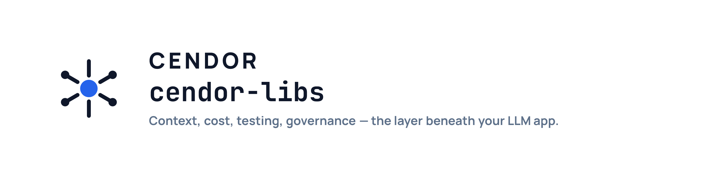
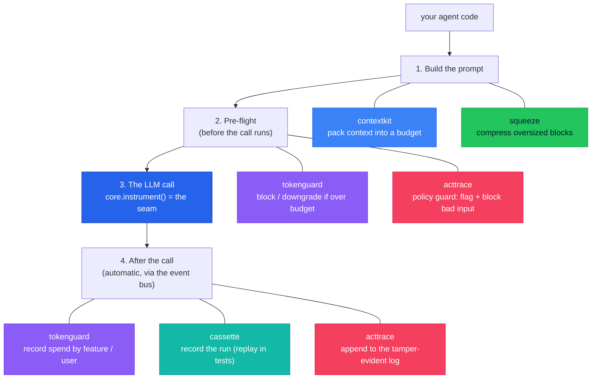

<p align="center">
  <picture>
    <source media="(prefers-color-scheme: dark)" srcset=".github/assets/cendor-libs-banner-dark.png">
    
  </picture>
</p>

**Production plumbing for LLM applications.**

Composable Python primitives for context, cost, testing, and governance — the layer beneath your LLM app.

 [](https://github.com/cendorhq/cendor-libs/actions/workflows/ci.yml)   [](https://github.com/astral-sh/ruff) 

[**Install**](#install) · [**The libraries**](#the-libraries-in-depth) · [**See it compose**](#see-it-all-compose) · [**Docs**](docs/) · [**Benchmarks**](docs/benchmarks.md)

*framework-agnostic · local-first · offline by default*

---

## The problem

You shipped an LLM agent. Then production happened:

- 🧠 **Prompts overflow the context window** — and naive truncation drops exactly the wrong things.
- 💸 **Cost is a black box** — a looping agent quietly burns real money, and you can't say which feature or user spent it.
- 🧪 **You can't test it** — every run hits a paid, non-deterministic API, so there are no fast, repeatable tests.
- 📋 **There's no audit trail** — when something goes wrong (or a regulator asks), you can't show what the agent saw, did, cost, or *refused to do*.

Agent frameworks (LangChain, LlamaIndex, the provider SDKs) decide *what* your agent does. They
don't handle these cross-cutting, *under-the-call* concerns. **Cendor does — and you keep your
framework.**

## The fix: wrap your client once, every tool plugs in

```python
from cendor.core import instrument
client = instrument(OpenAI())   # ← the one line you change
```

That single wrap publishes every LLM and tool call onto an in-process **event bus**. Each library
*subscribes* — none patches your client, none imports another — so you add budgeting, recording, or
auditing with **zero per-call wiring**.



Read it top to bottom — that's one request's lifecycle, with each library labelled **where it acts**.
Note that **tokenguard** and **acttrace** each appear twice: they run *before* the call (cap spend /
guard the input) **and** *after* it (record cost / append to the log).

## The six libraries — at a glance

Each solves one production problem, and each works **on its own**:

| Library | Solves | In one line |
|---|---|---|
| [**contextkit**](packages/cendor-contextkit) | prompts overflow | Pack prioritized blocks into a token budget, evict by rule, and get a receipt of what was kept, shrunk, or dropped. |
| [**squeeze**](packages/cendor-squeeze) | a blob is too big | Content-aware, deterministic compression (JSON/logs/code/prose) — fully reversible, byte-for-byte. |
| [**tokenguard**](packages/cendor-tokenguard) | runaway cost | Cap spend before a call runs (block/downgrade), and attribute cost per feature/user. |
| [**cassette**](packages/cendor-cassette) | can't test agents | Record a whole run once (LLM + tool calls), replay it forever — offline, deterministic. |
| [**acttrace**](packages/cendor-acttrace) | no audit trail | Tamper-evident, offline-verifiable decision log + policy flags, with compliance evidence packs. |
| [**core**](packages/cendor-core) | the shared glue | Types, token counting, offline prices, the `instrument()` seam, and the event bus every tool rides. |

```
contextkit  →  squeeze  →  tokenguard  →  cassette  →  acttrace
 assemble       compress      budget         test         audit
```

All six are **published on PyPI** and green in CI (offline tests · ruff · mypy).

## Proof

Reproducible, **offline** measurements — no network, no API keys. Regenerate with
`uv run python benchmarks/run_all.py`; full tables in [docs/benchmarks.md](docs/benchmarks.md).

Exact figures live in [docs/benchmarks.md](docs/benchmarks.md) (regenerated from one run); the table
below is directional — timing rows vary by machine.

| What | Measured |
|---|---|
| OpenAI token counting (with `tiktoken`) | **exact** — 0% error vs the real tokenizer |
| Log compression (squeeze) | **~99% on repetition-heavy logs, ~30% on high-entropy logs** — always **fully reversible** |
| Replayed run vs live (cassette) | **orders of magnitude faster**, no API key (modeled at 4 ms/call; real LLMs are far slower) |
| `instrument()` overhead per call | **~25 µs** — bus emit + usage extraction + Decimal pricing |
| Tamper detection (acttrace) | a **single edited byte** breaks the chain → `verify()` returns `False` |

## Install

```bash
pip install cendor-libs        # the whole stack  (`cendor` is a brand alias for it)
pip install cendor-tokenguard  # or just one piece (pulls core in transitively)
```

All packages share the `cendor.*` import namespace (PEP 420).

## Quickstart — offline, no API key

Token counting and pricing ship offline, so this runs with zero network:

```python
from cendor.core import tokens, prices

msgs = [{"role": "user", "content": "Summarize this quarterly report in 3 bullets."}]
n = tokens.count(msgs, model="gpt-4o")
print(n, "tokens →", prices.estimate("gpt-4o", input_tokens=n, output_tokens=200))   # exact Decimal cost
```

---

## The libraries in depth

### 🧠 contextkit — assemble context to a budget

> Treat the context window like a packed suitcase, not a string you concatenate.

- **Token-budgeted packing** — declare `Block`s with `priority` and `pin`; `assemble()` fits them into `budget_tokens` (minus `reserve_output`), deterministically. Pinned blocks are never evicted (raises `BudgetError` if they alone overflow).
- **Per-block eviction** — `drop_oldest` · `truncate` (keep head/tail, with a `…[truncated]` marker) · `summarize` (sync, or async via `aassemble()`) · `compress` (via squeeze — **reversible**: the receipt surfaces the squeeze handle, so `decision.handle.expand()` restores the original, and it compresses against *your* model) · or **any custom `EvictionStrategy`**.
- **Real chat-history** — `Block(messages=[…])` holds a conversation segment and peels the *oldest turns* to fit (a sliding window) — never mangling a turn.
- **An honest receipt** — `report()` returns an `AssemblyReport`: kept / shrunk / dropped per block, with token math. It's accurate at the **message level** (`used == core.tokens.count(assemble(), model)`), charging the per-message framing providers add.
- **Attention-aware ordering** — `order="default"` · `"attention"` (lost-in-the-middle: strongest context on the edges) · `"cache"` (stable prefix to maximize prompt-cache hits).
- **Provider adapters & multimodal** — `for_anthropic()` / `for_gemini()` / `for_bedrock()`; per-image budgeting via `image_tokens`; `whatif(budget)` previews a tighter budget without committing; `use_compressor()` swaps the compression backend.

```python
from cendor.contextkit import Context, Block

ctx = Context(budget_tokens=8000, model="gpt-4o", reserve_output=500, order="attention")
ctx.add(Block(SYSTEM_PROMPT, priority=10, pin=True, role="system"))
ctx.add(Block(messages=chat_history, priority=3, evict="drop_oldest"))   # peels oldest turns
messages = ctx.assemble()        # within budget, deterministic
print(ctx.report())              # receipt: kept / shrunk / dropped + token math
```

### 🗜️ squeeze — reversible, content-aware compression

> Shrink verbose context without throwing anything away.

- **Four purpose-built compressors** — **JSON** (minify + drop nulls), **logs** (normalize timestamps/UUIDs + dedup repeats into `(×N)`, chronological), **code** (strip comments — *string-aware*, so a `//` or `#` inside a literal survives; keeps preprocessor & shebang lines), **prose** (extractive sentence ranking). `detect()` auto-routes; `kind=` overrides.
- **Compress to a budget** — `target_tokens` is **never exceeded**; `fidelity="lossless" | "balanced" | "aggressive"` trades structure for size. No LLM, deterministic.
- **100% reversible** — every original is kept in a **content-addressed store** (deduped by hash), so `handle.expand()` restores it byte-for-byte no matter how hard you squeeze.
- **Survives restarts** — persist `handle.to_dict()` next to a durable `SQLiteStore` and `Handle.from_dict(...).expand()` in the next process; or a bounded `MemoryStore(max_items=…)`.
- **Plugs into contextkit** by satisfying core's `Compressor` protocol — by shape, no import.

```python
from cendor.squeeze import compress

small, handle = compress(huge_logs, kind="auto", target_tokens=400)   # up to ~99% on repetitive logs
original = handle.expand()                                            # byte-for-byte, anytime
```

### 💸 tokenguard — budget + cost attribution

> Stop runaway bills, and get per-feature / per-user cost for free.

- **Pre-flight circuit breaker** — `on_exceed="block"` raises **before** an over-budget call runs; `"downgrade"` reroutes to a cheaper model pre-flight; `"truncate"` degrades gracefully; `"raise"` stops a runaway loop; or pass a **callable**.
- **Decorator *and* context manager** — `@budget(usd=…, tokens=…)`; budgets **nest** and the tightest applicable cap wins (an inner downgrade never masks an outer hard cap).
- **Cost attribution, free** — `track(feature=…, user_id=…)` tags ambient spend via `contextvars` (works across nested + async calls); `report(group_by=[…])` aggregates per tag → `{usd, tokens, calls, …}`.
- **Cost as a test assertion** — `report().assert_under(usd=0.05, feature="search")`.
- **Pre-flight projection** — `estimate(model, messages)` prices a call *without making it*.
- **Durable + bounded** — `use_sink(SQLiteSink/OTelSink/…)` persists each row; the in-memory buffer is FIFO-bounded (`configure(max_records=…)`, `dropped()`). Config is validated eagerly (no silent no-op budgets).

```python
from cendor.tokenguard import budget, track, report

@budget(usd=0.50, on_exceed="block")           # raises BEFORE an over-budget call runs
def answer(q):
    with track(feature="support", user_id="alice"):
        return client.chat.completions.create(model="gpt-4o", messages=[...])

report(group_by=["feature", "user_id"])         # spend per tag — for free
```

### 🧪 cassette — record once, replay forever

> The `vcrpy` of the agent era — except it captures the *whole run*.

- **Whole-run capture** — every LLM **and** tool call, in order (not just HTTP). The fixture layer beneath your eval platform.
- **Four modes** — `auto` (record if missing, else replay) · `record` · `replay` (fail on an unrecorded call) · `rerecord` (run live, report `drift()`, never overwrite the committed cassette).
- **Decorator or context manager** — `@cassette.use("run.json")` or `with cassette.using(...)` (handy in pytest fixtures).
- **Meaning-based assertions** — `semantic_match(actual, expected)` (offline lexical default), with **real semantic backends**: local **model2vec** static embeddings (offline, `[embeddings]` extra) or bring-your-own provider embeddings / an LLM judge for negation-sensitive checks; `semantic_drift()` filters `rerecord` noise down to real regressions.
- **Pluggable matching + redaction** — a `normalizer` decides what makes two requests "the same" (ignore volatile fields); secrets/PII are redacted on write, but matching hashes the **un-redacted** request so redaction never collapses two distinct calls.
- **Parallel-safe** — recording is `ContextVar`-scoped (concurrent `using()` blocks don't cross-contaminate) and written atomically; `stream=True`/`stream=False` calls match their own recordings, and dict-response providers replay as dicts. Under pytest-xdist, use a per-worker cassette path.
- **`promote()`** turns a production JSONL trace (LLM **and** tool calls) into a replayable regression test.

```python
from cendor import cassette

@cassette.use("tests/triage.json")              # records once, replays forever — offline, no key
def test_triage():
    out = my_agent.run("My card was charged twice")
    assert cassette.semantic_match(out, "offers a refund")
```

### 📋 acttrace — tamper-evident audit & governance

> Evidence to *support* compliance — not a guarantee, not legal advice.

- **Auto-populating** — construct an `AuditLog` and it subscribes to the bus: every LLM/tool call, plus the cost (tokenguard) and context decisions (contextkit) riding the same stream, becomes an entry with no per-call wiring.
- **Tamper-evident hash chain** — `entry.hash = sha256(prev_hash + entry)`; `verify()` re-walks it offline and catches edits, reordering, **and tail-truncation** (via head-hash + entry count). CLI: `acttrace verify file.jsonl`.
- **Optional HMAC signing** — `signing_key=…` proves the log came from a key-holder, not just that it's internally consistent.
- **Decisions & human oversight** — `decision()` groups a unit of work; `d.record(model=…, prompt_id=…)` and `d.human_oversight(reviewer, action)` capture Art. 14-style sign-off.
- **Offline detection engine + policy** — a validator-gated `Detector` registry spanning **20 categories** (secrets, PII, financial, government IDs, free-text credentials, GDPR special-category), plus a `Policy` (`allow`/`flag`/`redact`/`block`; presets `default`/`gdpr`/`pci`/`strict`). Regex + local checksums (Luhn / IBAN mod-97 / Verhoeff / ABA) — no model, no network. `scan()` / `redact()` work standalone; `AuditLog(policy=…)` auto-scans and auto-flags every captured payload.
- **Policy flags (validation)** — `flag(reason, action="blocked"|"redacted"|"flagged", …)` records a tamper-evident `policy_flag` when your pre-flight guard refuses input that shouldn't be processed — so the **refusal** is auditable, not just the calls that ran. Detection **auto-records a `policy_flag`** too, tagged with the resolved action/severity/category — so "we removed / flagged / blocked this" lands in the hash chain, not silently.
- **Compliance evidence packs** — `export(framework=…)` annotates each entry with control IDs for **EU AI Act**, **ISO/IEC 42001**, **GDPR**, and **NIST AI RMF** (starting templates; category-tagged flags map to specific controls, e.g. special-category → GDPR Art.9), and writes a `_meta` summary (entry counts a reviewer scans first). Detection scrubs the *record*; **block** is the pre-send control.

```python
from cendor.acttrace import AuditLog, verify

audit = AuditLog(system="loan_triage", risk_tier="high", signing_key="k")   # auto-subscribes
with audit.decision(input=application) as d:
    resp = client.chat.completions.create(model="gpt-4o", messages=msgs)    # auto-logged
    d.human_oversight(reviewer="ops@bank", action="approved")
audit.export("evidence.jsonl", framework="eu_ai_act")
ok, detail = verify("evidence.jsonl", key="k")   # tamper-evident, verified offline
```

### ⚙️ core — the shared foundation

> Kept tiny on purpose — it's the blast radius for every other tool.

- **`instrument()`** — wrap any client once: **OpenAI** (Chat Completions **and** the Responses API) **· Anthropic · AWS Bedrock · Google Gemini** (the `google-genai` SDK **and** legacy `google-generativeai`) **· Ollama**, detected by *shape* (so new models work the day they ship). Sync, async, **and streaming** (the streamed value is both an iterator **and** a context manager, matching the SDK — so `with client…create(stream=True) as s:` works, e.g. under LangChain); idempotent and additive. `instrument_tool()` does the same for your tools (emits `ToolCall`s).
- **LangChain / LangGraph** — `cendor.core.langchain.CendorCallbackHandler` (optional `cendor-core[langchain]`) records usage + **reasoning** + tools + a **run-correlated `trace_id`** from the framework's callbacks — the SDK-aligned way to observe a framework, no client touch. Recording-only; enforcement stays on the `instrument()` seam. (`core.trace("run-id")` gives direct-SDK agents the same correlation.)
- **Event bus** — `subscribe` / `emit`; **thread-safe within a process**; one failing subscriber never starves another (the first exception re-raises after all run).
- **Interceptor seam** — `add_interceptor` + `Reroute` / `MISS` powers replay (cassette) and reroute/block (tokenguard) **without a second patch point**.
- **Token counting, three tiers** — exact (with `[tiktoken]`), BPE-estimate (o200k for Claude/Gemini), or an offline heuristic; `tokens.method(model)` reports which is active; `tokens.register()` plugs in a precise counter.
- **Offline-first *and* refreshable prices** — bundled dated snapshot; `estimate() -> Decimal Money` (never `float`); optional `refresh(source="litellm"|"openrouter"|"azure")` from live no-auth, no-deps sources, with an `age_days()`/`is_stale()` staleness signal. A provider/gateway-reported cost (e.g. OpenRouter's `usage.cost`) is preferred over the estimate and labeled `cost_reported` vs `cost_estimated`.
- **OpenTelemetry** — emit `gen_ai.*` spans, or `otel.ingest()` a managed runtime's spans onto the bus (so tokenguard/acttrace work even when you don't own the loop).
- **Structural protocols** — `Compressor`, `EvictionStrategy`, `Sink`, `Subscriber`, `Handle` — how the tools interlock without coupling.

```python
from cendor.core import instrument, tokens, prices

client = instrument(OpenAI())                # 6 providers · sync/async/streaming · idempotent
n = tokens.count(messages, model="gpt-4o")   # exact with [tiktoken], offline heuristic otherwise
cost = prices.estimate("gpt-4o", n, 200)     # exact Decimal, from the bundled snapshot
```

---

## See it all compose

Wrap the client **once**; validation, context assembly, compression, budgeting, and auditing all
cooperate — no per-call wiring:

```python
from cendor.core import instrument
from cendor.core.instrument import add_interceptor, MISS
from cendor.core.types import LLMCall
from cendor.contextkit import Context, Block
from cendor.squeeze import compress
from cendor.tokenguard import budget, track
from cendor.acttrace import AuditLog, PolicyViolation

client = instrument(OpenAI())                                  # core: the seam — one wrap, many subscribers
audit  = AuditLog(system="support_bot", risk_tier="limited")   # acttrace: auto-subscribes to the stream

# acttrace + YOUR policy: validate input, record the refusal, and block it before the call runs.
def guard(call):
    if isinstance(call, LLMCall) and contains_pii(call.messages):    # your rule
        audit.flag("PII in prompt", action="blocked")                # acttrace RECORDS the refusal
        raise PolicyViolation("blocked")                             # your guard ENFORCES it
    return MISS
add_interceptor(guard)

@budget(usd=0.30, on_exceed="downgrade", downgrade={"gpt-4o": "gpt-4o-mini"})   # tokenguard: pre-flight reroute
def handle(user_msg: str, docs: str, history: list[dict]) -> str:
    small, _ = compress(docs, target_tokens=1500)                    # squeeze: shrink a huge doc (restore via the handle)
    ctx = Context(budget_tokens=8000, model="gpt-4o", reserve_output=500)        # contextkit: pack to budget
    ctx.add(Block(SYSTEM_PROMPT, priority=10, pin=True, role="system"))
    ctx.add(Block(small, priority=5))                                # the squeezed docs
    ctx.add(Block(messages=history, priority=3, evict="drop_oldest"))            # peel oldest turns to fit
    ctx.add(Block(user_msg, priority=9, pin=True, role="user"))
    with track(feature="support_bot", user_id="alice"):              # tokenguard: attribute the spend
        return client.chat.completions.create(model="gpt-4o", messages=ctx.assemble())

audit.export("evidence_q3.jsonl", framework="eu_ai_act")   # acttrace: hash-chained pack — the calls AND the blocked refusals
```

**Testing?** Wrap the same function with `@cassette.use("run.json")` and it records once, then
replays offline forever — no API key, deterministic. (Full runnable guard/`flag()` example in
[`docs/acttrace.md`](docs/acttrace.md).)

## Why it composes (the one idea)

Every tool that needs to *see* a call traditionally monkey-patches the provider client; stack three
and they fight. Cendor makes interception a **single shared primitive** in `core`:
`instrument()` normalizes each call into a provider-agnostic `LLMCall` and emits it on the bus, and
every tool *subscribes*. **One seam, many listeners, never a tool→tool import.** That's the whole
trick — and why adding a library is free at the call site.

## Design principles

- **Composition without coupling.** Tools cooperate only through `core` (shared types + the event
  bus) or an optional extra — never a tool→tool import. The dependency graph is a star, not a web.
- **A deliberately tiny core.** `core` is the blast radius for the whole stack, so it stays small and
  stable — grown only as a tool needs it.
- **Local-first, offline by default.** No account, no server, no network call required. Cloud / OTel
  export is always *optional*.
- **Deterministic where it counts.** Context packing, compression, and offline token counts are
  reproducible; money is exact `Decimal`, never `float`.
- **Honest claims.** Token counts report *which* method produced them; benchmarks disclose their
  error; `acttrace` produces *evidence to support* compliance, never a guarantee. No marketing math.

## Engineering at a glance

- **Zero-dependency core** — provider SDKs, `tiktoken`, and OpenTelemetry are all *optional extras*.
- **430+ tests, all offline** — mocked provider clients, golden token counts, and property-based
  tests; no network and no API key anywhere in the suite. CI fails the build under 80% line coverage.
- **Reproducible benchmarks** — every headline number is regenerated by `benchmarks/run_all.py`
  ([`docs/benchmarks.md`](docs/benchmarks.md)).
- **Typed & linted** — full type hints on every public API, `ruff` + `mypy`, Google-style docstrings.
- **uv workspace**, six packages built with `hatchling`, published to PyPI via GitHub Actions trusted
  publishing (OIDC, no stored tokens). **Python ≥ 3.11 · Apache-2.0.**

## Scope, status & honest limits

Knowing exactly where the edges are is part of the design:

- **Stable public API under semantic versioning.** Minor releases are additive and
  backward-compatible; breaking changes land only in a new major. Consumers pin
  `cendor-core>=1.0,<2.0`.
- **In-process by design (thread-safe, bounded).** Lock-guarded across the stack: the bus +
  interceptor registry, the price-table load/`refresh()` + `instrument()` install, `tokenguard`'s
  FIFO-bounded spend buffer and its `SQLiteSink`, and `acttrace`'s hash-chain append (durable, no
  reopen-per-entry). One caveat: `tokenguard` budgets/tags are `ContextVar`-based — `asyncio` tasks
  inherit them, but a plain `threading.Thread` does not (use `contextvars.copy_context()`). State is
  module-global — ideal for scripts, tests, and a worker process; a multi-*process* deployment
  externalizes durable spend via a sink (a deliberate v2 boundary). For long runs, both in-memory
  buffers are boundable — `tokenguard`'s spend cap and `acttrace`'s `max_entries` (the file stays the
  full, verifiable chain) — and `tokenguard.sinks.QueueSink` moves durable sink I/O off the hot path.
- **`tokenguard` enforcement is projection-based.** Pre-flight `block` / `downgrade` use offline token
  estimates plus an output reserve, so they're approximate; post-flight `raise` is exact but stops the
  **next** call in a loop, not the one that breached — and for a **streamed** call it fires when the
  stream is *consumed*, not launched (a loop launching many streams before draining them can overspend;
  use a pre-flight mode to gate that). A call whose model has **no price** records `$0`, so a USD cap
  can't bite it — tokenguard warns once per model (`UnpricedModelWarning`), counts them in
  `unpriced_calls()`, and `configure(on_unpriced="raise")` makes `block` reject them; token caps enforce
  regardless of price.
- **`acttrace` is evidence, not a guarantee.** The hash chain detects edits/deletions on `verify()`;
  **HMAC signing** is what makes it tamper-evident against a rewrite. Control mappings are starting
  templates for a compliance team, not legal advice.
- **`squeeze` trades storage for tokens.** It cuts the tokens *sent to the model* while keeping the
  original in full for byte-exact restore — it does not reduce total storage.

## Docs

Full documentation lives in [`docs/`](docs/) — every page renders on GitHub, and is published as a
searchable site at [cendor.ai/docs](https://cendor.ai/docs):

- [Getting Started](docs/getting-started.md) — install + your first budgeted, audited call
- [Architecture](docs/architecture.md) — the layering, the `instrument()` seam, the event bus
- **Libraries** — [core](docs/core.md) · [contextkit](docs/contextkit.md) · [squeeze](docs/squeeze.md) · [tokenguard](docs/tokenguard.md) · [cassette](docs/cassette.md) · [acttrace](docs/acttrace.md)
- [Providers & Integration](docs/providers.md) · [Guides & Recipes](docs/guides.md) · [Benchmarks](docs/benchmarks.md) · [FAQ](docs/faq.md)

## Contributing / building

A `uv` workspace: `uv sync`, then `uv run pytest`. Lint/format with
`uv run ruff check . && uv run ruff format .`, type-check with `uv run mypy -p cendor.core` (and
per package). See [`CLAUDE.md`](CLAUDE.md) for conventions and the cardinal PEP 420 namespace rule
(never add `src/cendor/__init__.py`).

## License & disclaimer

Licensed under the **Apache License 2.0** — see [`LICENSE`](LICENSE) and [`NOTICE`](NOTICE).
Copyright 2026 Raghav Mishra (PowerAI Labs).

> **No warranty — use at your own risk.** This software is provided on an **"AS IS" BASIS, WITHOUT
> WARRANTIES OR CONDITIONS OF ANY KIND**, and the authors and contributors carry **no liability** for
> any damages, losses, or business impact arising from its use or inability to use it — see Apache-2.0
> **§7 (Disclaimer of Warranty)** and **§8 (Limitation of Liability)** in [`LICENSE`](LICENSE). You are
> solely responsible for determining suitability and assume all risk. (`acttrace` in particular
> produces *evidence to support* compliance — not a guarantee, and not legal advice.)

---
*An open-source project by [PowerAI Labs](https://powerailabs.dev). Apache-2.0 licensed.*
