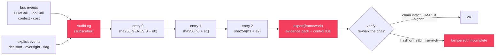
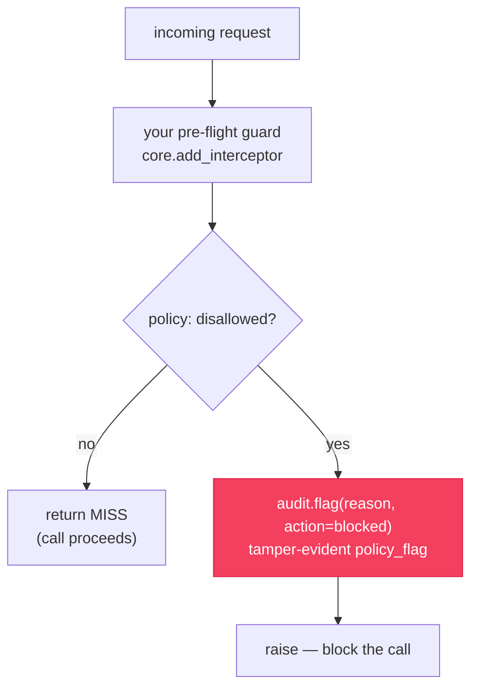

# `cendor-acttrace` — audit

A tamper-evident, append-only record of every AI decision — what model ran, on what
context, at what cost, with which tools, and who signed off. Integrity comes from a hash
chain you can verify offline, not from a server: no database, no infrastructure, no account.

> **Not legal advice.** `acttrace` produces *evidence to support* compliance (e.g. EU AI Act
> record-keeping and human-oversight obligations) — it is not a compliance guarantee, and the
> bundled control mappings are starting templates for your compliance team to adjust.

```bash
pip install cendor-acttrace
```

## Quickstart

```python
from cendor.core import instrument
from cendor.acttrace import AuditLog

client = instrument(OpenAI())
audit = AuditLog(system="loan_triage", risk_tier="high", signing_key="…")   # auto-subscribes

with audit.decision(input=application, actor="agent") as d:
    resp = client.chat.completions.create(model="gpt-4o", messages=msgs)    # auto-logged
    d.record(model="gpt-4o", prompt_id="triage@v3")          # cost/context captured for free
    d.human_oversight(reviewer="ops@bank", action="approved", note="manual check")

audit.export("evidence_q3.jsonl", framework="eu_ai_act")     # evidence pack
```

```bash
acttrace verify evidence_q3.jsonl --key "…"   # re-walks the chain + signatures; non-zero if broken
```

> **Try it end to end.** The full support-agent recipe — `acttrace` wired together with
> budgeting, context assembly, and record/replay — is in the [Cookbook](/cookbook).

## Core concepts

### Auto-population
Construct an `AuditLog` and it subscribes to `core`'s event bus. From then on every
instrumented LLM and tool call becomes an audit entry — along with the cost that
`tokenguard` prices and the context decisions `contextkit` makes on the same stream. You
add only the explicit, human-facing events (decisions and oversight); the calls log
themselves.

### The hash chain
Entries are chained: `entry.hash = sha256(prev_hash + canonical(entry))`, starting from a
fixed genesis. Editing any past entry changes its hash and breaks every entry after it, so
`verify()` re-walks the chain offline and catches edits and reordering. A plain chain can't
notice *trailing* entries being dropped, so `verify()` also checks the head hash and entry
count to catch tail-truncation.

### Signing and the trust boundary
The tail-truncation check rests on an exported pack's `_meta` header (head + count), which
is forgeable on its own — an attacker could drop the tail and rewrite `_meta`. Two things
close that gap:

- **`signing_key=…`** HMAC-signs every entry **and** the `_meta` header, so `verify(key=…)`
  proves the log came from a key-holder and rejects a forged or stripped header.
- For the definitive guarantee, capture `log.head` **out-of-band** at write time and pass it
  as `expected_head=` / `expect_entries=` to `verify()`.

Without a key, the `_meta` check is in-file only, and `verify()`'s `detail` says so.

### Redaction (on by default)
Emails and secrets in payloads are scrubbed **before** entries are chained and written,
since audit logs get exported. The built-in redactor covers six categories — `email`,
`api_key`, `bearer_token`, `aws_key`, `google_api_key`, and `jwt` — and never touches ids
or hashes. Turn it off with `redact=False`, or supply your own rules with `redactor=`
(compose the exported `default_redactor` to extend the built-ins).

### Auto-flag on redaction
Scrubbing used to be silent. With `flag_on_redact=True` (the default), whenever the
**built-in** redactor scrubs a content-bearing auto-captured entry, `acttrace` appends a
`policy_flag` recording *which categories* were removed — so "we removed PII" lands in the
same tamper-evident chain, not nowhere. The follow-up flag carries `action="redacted"`,
`severity="info"`, `auto=True`, and `data=[…]` (the sorted categories), and is tagged to the
open decision if there is one. A custom `redactor=` owns its own flagging, so this fires only
for the built-in one.

> `llm_call` entries record only metadata (provider / model / usage / cost), never the prompt
> messages — so in practice PII surfaces in a `decision`'s input or a `tool_call`'s arguments,
> and that's where the auto-flag most often fires.

### Compliance evidence packs
`export(framework=…)` writes the chain as a JSONL pack and annotates each entry with control
IDs for **EU AI Act**, **ISO/IEC 42001**, **GDPR**, and **NIST AI RMF**. The `_meta` header
lists every control covered plus a `summary` — entry counts by type and flags by action /
severity — for the at-a-glance read a reviewer does first. These are **starting templates**
referencing the public framework texts: evidence pointers, not certified mappings.

## Functions & classes

### `AuditLog()`
Construct it once; it auto-subscribes to the bus and every instrumented call thereafter
becomes an entry. Usable as a context manager (auto-`detach()` on exit); `log.head` is the
current chain head, `log.detach()` stops subscribing.

```python
AuditLog(system, risk_tier="limited", path=None, signing_key=None,
         redact=True, redactor=None, flag_on_redact=True)
```

| Param | Type | Default | What it does |
|---|---|---|---|
| `system` | `str` | — (required) | System name recorded on every entry. |
| `risk_tier` | `str` | `"limited"` | Risk classification (e.g. `"high"`), recorded for the pack. |
| `path` | `str \| None` | `None` | Also stream entries to this JSONL file as they're chained. |
| `signing_key` | `str \| None` | `None` | HMAC secret; signs each entry **and** the exported `_meta` header. |
| `redact` | `bool` | `True` | Scrub PII before entries are chained (see [Redaction](#redaction-on-by-default)). |
| `redactor` | `callable \| None` | `None` | Custom scrubber; compose `default_redactor` to extend the built-ins. |
| `flag_on_redact` | `bool` | `True` | Append a `policy_flag` when the built-in redactor scrubs (see [Auto-flag](#auto-flag-on-redaction)). |

### `audit.decision()`
A context manager that groups a unit of work; auto-captured calls inside it are tagged to
the decision. Yields a handle `d`.

```python
with audit.decision(input=application, actor="agent") as d:
    d.record(model="gpt-4o", prompt_id="triage@v3")            # decision metadata
    d.human_oversight(reviewer="ops@bank", action="approved", note="manual check")  # Art. 14
```

| Param | Type | Default | What it does |
|---|---|---|---|
| `input` | `Any` | `None` | The decision input (tagged to the group; redacted like any payload). |
| `actor` | `str` | `"agent"` | Who is acting for this decision. |

The handle adds `d.record(**fields)` (record metadata) and
`d.human_oversight(reviewer, action, note="")` (an oversight event). `d.flag(...)` mirrors
`audit.flag(...)` below, tagged to this decision.

### `audit.flag()` / `d.flag()`
Records a tamper-evident `policy_flag` — e.g. input a guard refused. `acttrace` *records*
the flag; your guard makes and enforces the decision (see
[Flagging input](#flagging-input-that-shouldnt-be-processed)). Both forms **return** the
chained `AuditEntry`.

```python
flag(reason, *, action="flagged", severity="warning", data=None, **fields)
```

| Param | Type | Default | What it does |
|---|---|---|---|
| `reason` | `str` | — (required) | Human-readable reason for the flag. |
| `action` | `str` | `"flagged"` | Recommended: `flagged` \| `redacted` \| `blocked` (others accepted). |
| `severity` | `str` | `"warning"` | Recommended: `info` \| `warning` \| `critical` (others accepted). |
| `data` | `Any` | `None` | A *category/summary* — never the raw sensitive value. |

`action`/`severity` are normalized to lowercase.

### `audit.export()`
Writes the chain as a JSONL evidence pack; with a `framework`, annotates each entry with
control IDs and writes the `_meta` summary a reviewer scans first.

```python
export(path, framework=None)   # framework: "eu_ai_act" | "iso_42001" | "gdpr" | "nist_rmf"
```

### `verify()`
Re-walks the chain offline and returns `(ok, detail)`; with `key`, also verifies HMAC
signatures. Never raises on a missing/corrupt file. See
[the trust boundary](#signing-and-the-trust-boundary) for when `_meta` is authoritative.

```python
verify(path, key=None, expected_head=None, expect_entries=None) -> tuple[bool, str]
```

| Param | Type | Default | What it does |
|---|---|---|---|
| `key` | `str \| None` | `None` | HMAC key; verifies signatures and authenticates the `_meta` header. |
| `expected_head` | `str \| None` | `None` | Out-of-band head hash for a definitive completeness check. |
| `expect_entries` | `int \| None` | `None` | Out-of-band entry count, paired with `expected_head`. |

CLI: `acttrace verify <file> [--key …] [--expect-head …] [--expect-entries N]`.

### Helpers

| Name | Signature | What it does |
|---|---|---|
| `frameworks` | `frameworks()` | The bundled control-mapping framework names. |
| `default_redactor` | `default_redactor(obj)` | The built-in six-category scrubber — compose it in a custom `redactor=`. |

## How it works



1. **Auto-populate.** The subscriber turns every bus event — calls, plus the cost and
   context decisions riding the same stream — into an entry, with no per-call wiring.
2. **Chain.** Each entry is canonicalized and hashed onto the previous head, so any edit
   cascades and is detectable.
3. **Export.** `export(framework=…)` annotates control IDs and writes the signed `_meta`
   completeness header.
4. **Verify.** `verify()` re-walks the chain (and signatures, with a key) offline, returning
   `(ok, detail)`.

## Flagging input that shouldn't be processed

`acttrace` is a *recorder*, not a gate — by the time it sees an event, the call already
happened. Deciding "this input must not be processed" and **enforcing** it is a pre-flight
guard on `core`'s interceptor seam (the same seam `tokenguard` uses to block). Wire the two
together: your guard enforces, `acttrace` records the refusal as tamper-evident evidence.
Because a raising interceptor short-circuits the call, the blocked call never reaches the bus
— so `flag()` is the *only* record that the refusal happened.



> Red = **acttrace** (records the refusal). Everything else is **your guard** — it decides
> and enforces. That split is the point: `acttrace` neither defines nor enforces policy.

A complete, runnable example — define a policy, wire the guard, watch a disallowed call get
blocked *and* recorded, then verify the evidence pack offline:

```python
import re
from openai import OpenAI
from cendor.core import instrument
from cendor.core.instrument import add_interceptor, MISS
from cendor.core.types import LLMCall
from cendor.acttrace import AuditLog, verify

client = instrument(OpenAI())
audit  = AuditLog(system="support_bot", risk_tier="high", path="audit.jsonl", signing_key="ops-key")

class PolicyViolation(Exception):
    pass

SSN = re.compile(r"\b\d{3}-\d{2}-\d{4}\b")   # YOUR policy: what must never reach the model

def block_pii(call):
    if isinstance(call, LLMCall):
        text = " ".join(m["content"] for m in call.messages if isinstance(m.get("content"), str))
        if SSN.search(text):
            audit.flag("SSN in prompt", action="blocked", severity="critical", data="us_ssn")  # record
            raise PolicyViolation("PII must not be sent to the model")                          # enforce
    return MISS                                    # anything else proceeds untouched

add_interceptor(block_pii)
```

The disallowed call is stopped *before* it runs, yet `audit.jsonl` carries a signed
`policy_flag` recording *why* it was refused — `verify("audit.jsonl", key="ops-key")` confirms
the chain (including the flag) offline. The detection rule is entirely yours; `acttrace` only
records it and lets you verify it later.

## Plugs into the stack

**Wrap-around, auto-subscribing.** Construct an `AuditLog` and it attaches to the stream —
every instrumented model and tool call is logged automatically; you add only the explicit
decisions and oversight. For a managed runtime you don't control, point it at the runtime's
`gen_ai.*` OpenTelemetry spans via [`core.otel.ingest`](providers.md#managed-runtimes-opentelemetry-ingestion).

## Honest limits

- **Evidence, not a guarantee.** `acttrace` supports compliance record-keeping; it does not
  certify it, and the control mappings are templates to review with your compliance team.
- **HMAC signing is symmetric** (a shared secret): it proves internal tamper-evidence plus
  key-holder provenance. Public-key (asymmetric) signing is not bundled — it needs a heavier
  crypto dependency.
- **Redaction is a best-effort safety net,** not a guarantee — keep real secrets out of
  prompts and inputs regardless.
