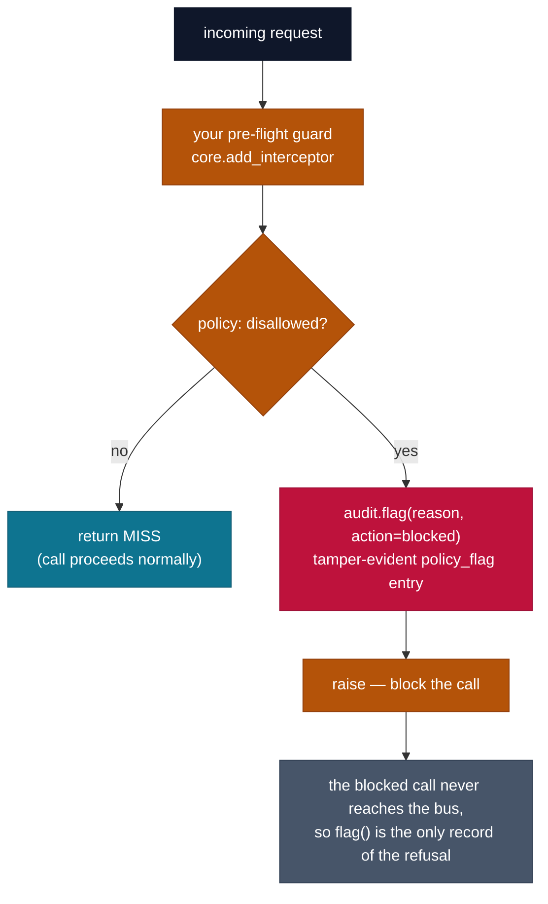

# `cendor-acttrace` — audit

A tamper-evident, append-only record of every AI decision — what model, what context, what it cost,
which tools, and who signed off — mapped to control templates and exportable as an evidence pack.
No database, no infra: integrity comes from a hash chain, not a server.

```bash
pip install cendor-acttrace
```

> **Not legal advice.** `acttrace` produces *evidence to support* compliance (e.g. EU AI Act
> record-keeping and human-oversight obligations) — it is not a compliance guarantee, and the
> bundled control mappings are starting templates for your compliance team to adjust.

## Highlights

- **Auto-populating** — construct an `AuditLog` and it subscribes to the bus: every LLM/tool call, plus the cost (`tokenguard`) and context decisions (`contextkit`) on the same stream, becomes an entry with no per-call wiring.
- **Tamper-evident hash chain** — `entry.hash = sha256(prev_hash + entry)`; `verify()` re-walks it offline and catches edits, reordering, **and tail-truncation** (head-hash + entry count). CLI: `acttrace verify file.jsonl`. The truncation check rests on the pack's `_meta`, which is authenticated only when signed + verified with `--key`; otherwise pass an out-of-band `expected_head=`.
- **Optional HMAC signing** — `signing_key=…` signs every entry **and** the exported `_meta` header, so `verify(key=…)` proves the log came from a key-holder (not just internal consistency) and rejects a forged/stripped completeness header.
- **Decisions & human oversight** — `decision()` groups a unit of work; `d.record(...)` and `d.human_oversight(reviewer, action)` capture Art. 14-style sign-off.
- **Policy flags (validation)** — `flag(reason, action="blocked"|"redacted"|"flagged", …)` records a tamper-evident `policy_flag` when your guard refuses input — so the **refusal** is auditable, not just the calls that ran. Both `flag()` calls **return** the chained `AuditEntry`.
- **Auto-flag on redaction** — when the built-in redactor scrubs PII (`email`, `api_key`, `bearer_token`) from an auto-captured entry, acttrace appends a `policy_flag` recording *what category* was removed — so "we removed PII" is in the hash chain, not silent. On by default (`flag_on_redact=True`); the recorder and the detector are now connected.
- **Compliance evidence packs** — `export(framework=…)` annotates control IDs for **EU AI Act**, **ISO/IEC 42001**, **GDPR**, and **NIST AI RMF** (starting templates), and writes a `_meta.summary` of entry counts a reviewer scans first. PII redaction on by default (custom `redactor=`).

## Quickstart

```python
from cendor.core import instrument
from cendor.acttrace import AuditLog

client = instrument(OpenAI())
audit = AuditLog(system="loan_triage", risk_tier="high", signing_key="…")   # auto-subscribes

with audit.decision(input=application, actor="agent") as d:
    resp = client.chat.completions.create(model="gpt-4o", messages=msgs)    # auto-logged
    d.record(model="gpt-4o", prompt_id="triage@v3")          # cost/context captured for free
    d.human_oversight(reviewer="ops@bank", action="approved", note="manual check")

audit.export("evidence_q3.jsonl", framework="eu_ai_act")     # evidence pack (also "nist_rmf")
```

```bash
acttrace verify evidence_q3.jsonl --key "…"   # re-walks the chain + checks signatures; non-zero if broken
```

## Functions & classes

- **`AuditLog(system, risk_tier="limited", path=None, signing_key=None, redact=True, redactor=None, flag_on_redact=True)`**
  — auto-subscribes to `core`'s bus on construction; pass `path` to also stream entries to a JSONL
  file. `detach()` to stop subscribing, or use it as a context manager (`with AuditLog(...) as log:`)
  to detach automatically on exit. `redactor=` swaps in a custom PII scrubber (compose the exported
  `default_redactor`); `redact=False` turns scrubbing off entirely. `flag_on_redact=True` (the
  default) appends a `policy_flag` whenever the *built-in* redactor scrubs a content-bearing entry,
  recording the removed categories (see [How it works](#how-it-works)); a custom `redactor=` owns its
  own flagging, so this only fires for the built-in one. `log.head` is the current chain head hash —
  capture it to later check completeness.
- **`audit.decision(input=None, actor="agent")`** — context manager grouping a unit of work;
  auto-captured calls inside it are tagged with the decision. Yields a handle with:
  - **`d.record(**fields)`** — record decision metadata (model, prompt_id, …).
  - **`d.human_oversight(reviewer, action, note="")`** — an Art. 14-style oversight event.
- **`audit.flag(reason, action="flagged", severity="warning", data=None, **fields)`** (also
  `d.flag(...)`) — record a tamper-evident `policy_flag`: input/usage a guard decided shouldn't be
  processed (e.g. `action="blocked"` / `"redacted"`). acttrace *records* the flag; your guard makes
  and enforces the decision. Pass a *summary/category* in `data`, never the raw sensitive value. Both
  forms **return** the chained `AuditEntry`. `action`/`severity` are normalized to lowercase;
  recommended vocabularies are action ∈ `{flagged, redacted, blocked}` and severity ∈
  `{info, warning, critical}` (other strings are accepted, not rejected).
- **`audit.export(path, framework=None)`** — write the chain as a JSONL evidence pack; with a
  framework (`"eu_ai_act"` / `"iso_42001"` / `"gdpr"` / `"nist_rmf"`) each entry is annotated with
  control IDs and the header lists every control covered. The `_meta` header also carries a
  `summary` object — entry counts (`decisions`, `llm_calls`, `tool_calls`, `context_assemblies`,
  `human_oversight`, `policy_flags`) plus `flags_by_action` and `flags_by_severity` — for the
  at-a-glance read a reviewer does first.
- **`verify(path, key=None, expected_head=None, expect_entries=None)`** → `(ok, detail)` — re-walk
  the hash chain; with `key`, also verify HMAC signatures. Catches **tail-truncation** via a head +
  count check, but mind the **trust boundary**: an exported pack's `_meta` (head + count) is
  *authenticated* only when the log was signed and you pass `key=…` — `export()` HMAC-signs the
  `_meta` header, so a rewritten header (drop the tail, fake head/count) fails `verify(key=…)`.
  Without a key the `_meta` check is in-file only and forgeable, so `verify()`'s `detail` says so
  and an **out-of-band** `expected_head`/`expect_entries` (from `log.head` at write time) is
  authoritative. Never raises on a missing/corrupt file — returns `(False, detail)` (the CLI then
  exits non-zero cleanly). Also a CLI: `acttrace verify <file> [--key …] [--expect-head …]
  [--expect-entries N]`.
- **`frameworks()`** — bundled control-mapping frameworks.

## How it works

```mermaid
graph LR
    EV["bus events<br/>LLMCall, ToolCall,<br/>context, cost"]
    EX["explicit events<br/>decision, oversight, flag"]
    LOG["AuditLog (subscriber)"]
    E0["entry 0<br/>hash = sha256(GENESIS + e0)"]
    E1["entry 1<br/>hash = sha256(h0 + e1)"]
    E2["entry 2<br/>hash = sha256(h1 + e2)"]
    PACK["export(framework)<br/>evidence pack + control IDs"]
    VER{"verify: re-walk the chain"}
    OKV["ok"]
    BAD["tampered / incomplete<br/>(edit or dropped entry)"]

    EV --> LOG
    EX --> LOG
    LOG --> E0
    E0 --> E1
    E1 --> E2
    E2 --> PACK
    PACK --> VER
    VER -->|"chain intact, HMAC if signed"| OKV
    VER -->|"hash or head mismatch"| BAD

    classDef in fill:#0f172a,stroke:#0f172a,color:#ffffff;
    classDef at fill:#be123c,stroke:#9f1239,color:#ffffff;
    classDef chain fill:#0e7490,stroke:#155e75,color:#ffffff;
    classDef dec fill:#b45309,stroke:#92400e,color:#ffffff;
    classDef bad fill:#7f1d1d,stroke:#7f1d1d,color:#ffffff;

    class EV,EX in;
    class LOG,PACK at;
    class E0,E1,E2,OKV chain;
    class VER dec;
    class BAD bad;
```



- **Auto-population:** subscribes to the shared bus, so every `LLMCall`/`ToolCall` — and the cost
  (`tokenguard`) and context decisions (`contextkit`) that ride the same stream — becomes an audit
  entry with no per-call wiring.
- **Hash chain:** entries are canonicalized and chained — `entry.hash = sha256(prev_hash +
  canonical(entry))`. Editing any past entry invalidates every entry after it; `verify` re-walks it
  offline. A chain alone can't detect *trailing* entries being dropped, so `verify` also checks the
  head hash + entry count to catch tail-truncation. **Trust boundary:** those come from an exported
  pack's `_meta`, which is unauthenticated on its own — an attacker who drops the tail and rewrites
  `_meta`'s head/count would pass an in-file-only check. So the `_meta` header is HMAC-signed when
  the log is signed (checked by `verify(key=...)`), and for the definitive guarantee capture the
  head **out-of-band** and pass `expected_head`/`expect_entries`.
- **Signing (optional):** `signing_key=...` HMAC-signs each entry **and** the exported `_meta`
  completeness header, so `verify(key=...)` proves the log was produced by a holder of the key — not
  just that it's internally consistent — and rejects a forged or stripped `_meta` header.
- **Redaction (on by default):** emails / API keys / bearer tokens in payloads are scrubbed before
  entries are chained and written; ids and hashes are never touched. Disable with `redact=False`, or
  supply your own rules with `redactor=` (compose `default_redactor` to extend the built-ins).
- **Auto-flag on redaction (`flag_on_redact=True`):** scrubbing used to be silent — the redactor
  removed PII and nothing recorded that it had, while `flag()` was purely manual narration. Now, when
  the **built-in** redactor scrubs a content-bearing auto-captured entry (a `decision`,
  `decision_record`, `llm_call`, `tool_call`, or `context_assembly`), acttrace appends a follow-up
  `policy_flag` carrying `action="redacted"`, `severity="info"`, `auto=True`, and
  `data=[<categories>]` (a sorted list of which built-in categories — `email`, `api_key`,
  `bearer_token` — were removed). The flag is tagged to the active decision when one is open. So the
  recorder and the detector are connected: "we removed PII" lands in the same tamper-evident chain as
  everything else. Note that `llm_call` entries record only metadata (provider/model/usage/cost) and
  never store the prompt messages, so in practice PII surfaces in a `decision`'s input or a
  `tool_call`'s arguments — that's where the auto-flag most often fires. It never recurses (a
  `policy_flag` never auto-flags itself), the chain still `verify()`s, and a *custom* `redactor=`
  owns its own flagging — auto-flagging only happens for the built-in redactor.
- **Control mapping:** event types map to framework control IDs — **EU AI Act** (Art. 12/13/14/19/26/72
  record-keeping, transparency, human oversight, automatically-generated logs, deployer obligations,
  post-market monitoring), **ISO/IEC 42001** (Annex A.6.2.8 event logs, A.6.2.6 operation &
  monitoring, A.9 responsible use, Cl. 9.1 monitoring), **GDPR** (Art. 22 automated decision-making,
  Art. 30 records of processing, Art. 5(2) accountability), and **NIST AI RMF** functions. `export()`
  annotates the log and summarizes the controls covered. These are **starting templates** referencing
  the public framework texts — evidence pointers, not certified mappings; adjust them with your
  compliance team.

## Flagging input that shouldn't be processed

acttrace is a *recorder*, not a gate — it can't stop the agent from processing data (by the time it
sees the event, the call happened). Deciding "this input must not be processed" and **enforcing** it
is a pre-flight guard on `core`'s interceptor seam (the same one `tokenguard` uses to block). Wire
the two together — your guard enforces, acttrace records the refusal as tamper-evident evidence:



> Color: amber = **your guard** (decides + enforces) · red = **acttrace** (records). The split is the point.

```python
from cendor.core.instrument import add_interceptor, MISS
from cendor.core.types import LLMCall

def block_special_category(call):
    if isinstance(call, LLMCall):
        text = " ".join(m["content"] for m in call.messages if isinstance(m.get("content"), str))
        if my_policy_detects_disallowed(text):           # YOUR rule
            audit.flag("special-category data", action="blocked", data="<category>")  # record it
            raise PolicyViolation("must not be sent to the model")                    # then block it
    return MISS                                          # or rewrite call.messages + return MISS to redact

add_interceptor(block_special_category)
```

Because a raising interceptor short-circuits the call, the blocked call never reaches the bus — so
without the explicit `flag()` the refusal would leave no trace. `flag()` is what makes "we detected
and refused it" auditable. The *policy rules are yours*; acttrace neither defines nor enforces them.

## Plugs in
**Wrap-around, auto-subscribing.** Construct an `AuditLog` and it attaches to the stream — every
instrumented model and tool call is logged automatically; you add only the explicit human-facing
events (decisions, oversight). For a managed runtime you don't control, point it at the runtime's
`gen_ai.*` OTel spans via `core.otel.ingest`.

## Notes
- HMAC signing is symmetric (shared secret) — it proves *internal* tamper-evidence plus
  key-holder provenance. Public-key (asymmetric) signing is not bundled (it needs a heavier crypto
  dependency).
- Control mappings are templates, not certified mappings — review them with your compliance team.

## Flagging: a full, runnable example

End to end — define a policy, wire the guard, watch a disallowed call get blocked *and* recorded, and
see the refusal in the verified evidence pack:

```python
import re
from openai import OpenAI
from cendor.core import instrument
from cendor.core.instrument import add_interceptor, MISS
from cendor.core.types import LLMCall
from cendor.acttrace import AuditLog, verify

client = instrument(OpenAI())
audit  = AuditLog(system="support_bot", risk_tier="high", path="audit.jsonl", signing_key="ops-key")

class PolicyViolation(Exception):
    pass

# 1) YOUR policy: what must never reach the model. Here, anything that looks like a US SSN.
SSN = re.compile(r"\b\d{3}-\d{2}-\d{4}\b")

def _prompt_text(call: LLMCall) -> str:
    return " ".join(m["content"] for m in call.messages if isinstance(m.get("content"), str))

# 2) A pre-flight guard on core's seam: detect -> flag (record) -> raise (enforce).
def block_pii(call):
    if isinstance(call, LLMCall) and SSN.search(_prompt_text(call)):
        audit.flag("SSN in prompt", action="blocked", severity="high", data="us_ssn")  # record
        raise PolicyViolation("PII must not be sent to the model")                      # enforce
    return MISS                                    # anything else proceeds untouched

add_interceptor(block_pii)

# 3) A disallowed call is stopped *before* it runs — caught here, and now on the audit trail.
try:
    client.chat.completions.create(
        model="gpt-4o",
        messages=[{"role": "user", "content": "My SSN is 123-45-6789 — help?"}],
    )
except PolicyViolation as e:
    print("blocked:", e)         # the call never reached the model or the bus

# 4) A clean call runs normally and is auto-logged like any other.
client.chat.completions.create(
    model="gpt-4o", messages=[{"role": "user", "content": "How do I reset my password?"}],
)

# 5) The refusal is in the evidence pack as a tamper-evident policy_flag.
audit.export("evidence.jsonl", framework="eu_ai_act")
ok, detail = verify("evidence.jsonl", key="ops-key")
print(ok, detail)                # True … — the chain (incl. the flag) verifies offline
```

The blocked prompt never reaches the model, yet `evidence.jsonl` carries a signed `policy_flag`
entry recording *why* it was refused — so "we detected and refused it" is auditable, not invisible.
The detection rule is entirely yours; acttrace only records it and lets you verify it later.
