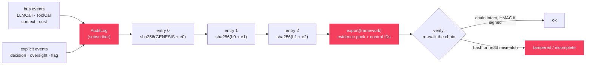
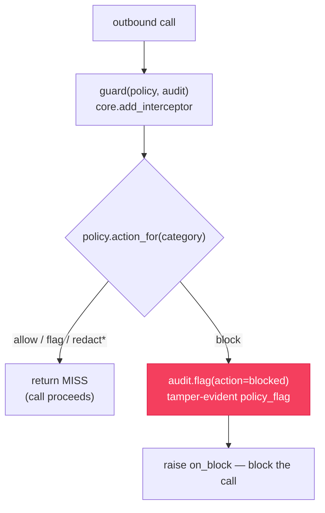

# `cendor-acttrace` — audit

A tamper-evident, append-only record of every AI decision — what model ran, on what
context, at what cost, with which tools, and who signed off. Integrity comes from a hash
chain you can verify offline, not from a server: no database, no infrastructure, no account.

> **Not legal advice.** `acttrace` produces *evidence to support* compliance (e.g. EU AI Act
> record-keeping and human-oversight obligations) — it is not a compliance guarantee, and the
> bundled control mappings are starting templates for your compliance team to adjust.

<!-- tabs: lang -->
<!-- tab: Python -->

```bash
pip install cendor-acttrace
```

<!-- tab: TypeScript -->

```bash
npm i @cendor/acttrace
```

<!-- /tabs -->

## Quickstart

<!-- tabs: lang -->
<!-- tab: Python -->

```python
from cendor.core import instrument
from cendor.acttrace import AuditLog

client = instrument(OpenAI())
audit = AuditLog(system="loan_triage", risk_tier="high", signing_key="…")   # auto-subscribes

with audit.decision(input=application, actor="agent") as d:
    resp = client.chat.completions.create(model="gpt-4o", messages=msgs)    # auto-logged
    d.record(model="gpt-4o", prompt_id="triage@v3")          # cost/context captured for free
    d.human_oversight(reviewer="ops@bank", action="approved", note="manual check")

audit.export("evidence_q3.jsonl", framework="eu_ai_act")     # evidence pack
```

<!-- tab: TypeScript -->

```ts
import { instrument } from '@cendor/core';
import { AuditLog } from '@cendor/acttrace';

const client = instrument(new OpenAI());
const audit = new AuditLog('loan_triage', { riskTier: 'high', signingKey: '…' });  // auto-subscribes

await audit.decision(async (d) => {
  const resp = await client.chat.completions.create({ model: 'gpt-4o', messages: msgs }); // auto-logged
  d.record({ model: 'gpt-4o', prompt_id: 'triage@v3' });     // cost/context captured for free
  d.humanOversight('ops@bank', 'approved', 'manual check');
}, { input: application, actor: 'agent' });

audit.export('evidence_q3.jsonl', 'eu_ai_act');              // evidence pack
```

<!-- /tabs -->

```bash
acttrace verify evidence_q3.jsonl --key "…"   # re-walks the chain + signatures; non-zero if broken
```

> **Try it end to end.** The full support-agent recipe — `acttrace` wired together with
> budgeting, context assembly, and record/replay — is in the [Cookbook](/cookbook).

## Core concepts

### Auto-population
Construct an `AuditLog` and it subscribes to `core`'s event bus. From then on every
instrumented LLM and tool call becomes an audit entry — along with the cost that
`tokenguard` prices and the context decisions `contextkit` makes on the same stream. You
add only the explicit, human-facing events (decisions and oversight); the calls log
themselves.

### The hash chain
Entries are chained: `entry.hash = sha256(prev_hash + canonical(entry))`, starting from a
fixed genesis. Editing any past entry changes its hash and breaks every entry after it, so
`verify()` re-walks the chain offline and catches edits and reordering. A plain chain can't
notice *trailing* entries being dropped, so `verify()` also checks the head hash and entry
count to catch tail-truncation.

### Signing and the trust boundary
The tail-truncation check rests on an exported pack's `_meta` header (head + count), which
is forgeable on its own — an attacker could drop the tail and rewrite `_meta`. Two things
close that gap:

- **`signing_key=…`** HMAC-signs every entry **and** the `_meta` header, so `verify(key=…)`
  proves the log came from a key-holder and rejects a forged or stripped header.
- For the definitive guarantee, capture `log.head` **out-of-band** at write time and pass it
  as `expected_head=` / `expect_entries=` to `verify()`.

Without a key, the `_meta` check is in-file only, and `verify()`'s `detail` says so.

### Detection & policy
`acttrace` ships an **offline, deterministic** detection engine: a registry of `Detector`s
(a labelled regex plus an optional checksum/format **validator**) and a `Policy` that maps
each detected category to an action — `allow` · `flag` · `redact` · `block`. Detection is
regex + local arithmetic only — no model, no network, no account. The registry is the single
source of truth, so `default_redactor` is rebuilt from it and the original categories scrub
byte-for-byte.

**Coverage (built-ins).** Every loose pattern (card, IBAN, routing, phone, SSN, BIC) is
**validator-gated** to hold false positives down; ids, UUIDs, git SHAs, and ISO timestamps are
left untouched.

| Group | Categories | Validator | Default action |
|---|---|---|---|
| `secret` | `api_key` (`sk-`/`sk-ant-`/`sk-proj-`), `aws_key`, `google_api_key`, `github_token`, `slack_token`, `private_key` (PEM), `jwt`, `bearer_token` | anchored regex | **redact** |
| `credential` | `password` (free-text "password is …") | regex | flag |
| `financial` | `credit_card`, `iban`, `us_routing`, `swift_bic` | Luhn · mod-97 · ABA · ISO-3166 | flag |
| `gov_id` | `us_ssn` | range check (Verhoeff/locale packs available) | flag |
| `pii` | `email`, `phone`, `ipv4`, `ipv6`, `mac_address` | format check | email **redact**, rest flag |
| `special_category` (GDPR Art.9) | `special_category` (health/biometric/religion — best-effort keyword) | — | flag |

**Policy presets** re-map those defaults for a given posture:

| Preset | Stance |
|---|---|
| `Policy.default()` | today's behaviour — secrets & `email` `redact`, everything else `flag` |
| `Policy.gdpr()` | special-category `block`; other personal/secret data `redact` |
| `Policy.pci()` | payment/financial data `block`; secrets & PII `redact` |
| `Policy.strict()` | high-severity groups (`secret`/`credential`/`financial`/`gov_id`) `block`, the rest `redact` |

**`scan` / `redact` — pure, no side effects.** Use them anywhere, independent of the chain:

<!-- tabs: lang -->
<!-- tab: Python -->

```python
from cendor.acttrace import scan, redact, Policy

scan("card 4111 1111 1111 1111 for alice@example.com")
# [Finding(category='credit_card', group='financial', severity='critical', action='flag', count=1),
#  Finding(category='email',       group='pii',       severity='warning',  action='redact', count=1)]

cleaned, findings = redact({"note": "ping alice@example.com"}, Policy.default())
# cleaned == {"note": "ping <redacted>"}   — findings report counts, never the raw value
```

<!-- tab: TypeScript -->

```ts
import { scan, redact, Policy } from '@cendor/acttrace';

scan('card 4111 1111 1111 1111 for alice@example.com');
// [Finding(credit_card · financial · critical · flag · 1),
//  Finding(email · pii · warning · redact · 1)]

const [cleaned, findings] = redact({ note: 'ping alice@example.com' }, Policy.default());
// cleaned == { note: 'ping <redacted>' }   — findings report counts, never the raw value
```

<!-- /tabs -->

`scan()` reports **counts only** — the raw offending value is never returned, so you can't
accidentally chain a secret. `redact()` scrubs only the `redact`/`block` categories and returns
the cleaned copy plus the findings. Add your own rule with
`register_detector(Detector(category, group, severity, pattern, validator=…))`.

### AuditLog & the policy engine
`AuditLog(policy=…)` scans every auto-captured payload against the full registry and, per the
policy, scrubs `redact`/`block` categories **before** entries are chained (audit logs get
exported) and appends a `policy_flag` for each detection. `AuditLog(redact=True)` — the default
— is exactly `policy=Policy.default()`, so existing behaviour is unchanged; `redact=False`
turns detection off; a custom `redactor=` bypasses the policy engine and owns its own flagging.

With `flag_on_redact=True` (the default), each auto-captured entry with detections gets one
`policy_flag` per resolved action — `action="redacted"` (`severity="info"`), `"flagged"`, or
`"blocked"` (carrying the strongest detector severity) — with `auto=True` and `data=[…]` (the
sorted categories), tagged to the open decision if there is one. So "we removed / flagged this"
lands in the same tamper-evident chain, not nowhere.

> `llm_call` entries record only metadata (provider / model / usage / cost), never the prompt
> messages — so in practice PII surfaces in a `decision`'s input or a `tool_call`'s arguments,
> and that's where the auto-flag most often fires.

> **`AuditLog` redaction scrubs the *record*, not the *request*.** By the time the subscriber
> sees a payload the call already ran, so this redaction protects the exported evidence — it is
> not a pre-send control. To scrub or stop sensitive data *before it reaches the model*, install a
> [`guard()`](#enforcing-a-policy-with-guard) on `core`'s interceptor seam (its `redact` scrubs the
> outbound messages; its `block` stops the call).

### Optional extras (all opt-in)
The default install is pure-regex and offline. Three extras add coverage **without changing the
defaults** — you turn each on explicitly:

- **Locale gov-ID packs** — `enable_locale_pack("uk", "in")` registers extra government-ID
  detectors (UK NINO, prefix-validated; India Aadhaar, Verhoeff-checked). Idempotent; unknown codes
  raise. More packs land here over time.
- **Entropy detector** — `enable_entropy_detector(min_length=24, min_entropy=3.5)` adds a
  `high_entropy_secret` detector for opaque generic secrets the anchored patterns miss. It is
  **noisy** by nature (hashes, base64, long random ids look high-entropy), which is why it ships
  off by default — enable it only where the recall is worth the false positives.
- **NER-backed redaction** — regex can't catch free-text **names/addresses**; `ner_redactor(...)`
  plugs a local NER engine in as a `redactor=` for `AuditLog`. `ner_available()` reports whether the
  optional backend is installed; `ner_redactor()` raises a clear error (with the install hint) when it
  isn't. The backend runs locally — still no network. **Different engine per language:** Python uses
  [Microsoft Presidio](https://microsoft.github.io/presidio/) (`pip install "cendor-acttrace[ner]"`);
  TypeScript uses the optional [`compromise`](https://compromise.cool) engine (`npm install compromise`).

<!-- tabs: lang -->
<!-- tab: Python -->

```python
from cendor.acttrace import AuditLog, enable_locale_pack, ner_redactor, default_redactor

enable_locale_pack("uk", "in")                         # + UK NINO, India Aadhaar
audit = AuditLog(system="intake",
                 redactor=ner_redactor(compose=default_redactor))   # regex + NER names/addresses
```

<!-- tab: TypeScript -->

```ts
import { AuditLog, defaultRedactor, enableLocalePack, nerRedactor } from '@cendor/acttrace';

enableLocalePack('uk', 'in');            // + UK NINO, India Aadhaar detectors (regex + validators)
const audit = new AuditLog('intake', {
  // regex scrub first (compose), then NER names/places — needs `npm install compromise`
  redactor: nerRedactor(['PERSON', 'LOCATION'], 'en', defaultRedactor),
});
```

> **Honest coverage — the NER backends differ.** Python's Presidio (spaCy transformer models) has
> higher recall/precision than TypeScript's `compromise` (a lightweight, synchronous, English-only
> rule-plus-lexicon engine, chosen because acttrace's tamper-evident append path is synchronous and a
> transformer NER would be async + heavy). Treat the TS NER as a **useful extra layer, not a sole PII
> control**. See the [parity matrix](/docs/languages).

<!-- /tabs -->

> Extras never become hard dependencies and never touch the defaults: a zero-extra install detects
> exactly the built-in categories, and `default_redactor` is unchanged.

### Compliance evidence packs
`export(framework=…)` writes the chain as a JSONL pack and annotates each entry with control
IDs for **EU AI Act**, **ISO/IEC 42001**, **GDPR**, and **NIST AI RMF**. The `_meta` header
lists every control covered plus a `summary` — entry counts by type and flags by action /
severity — for the at-a-glance read a reviewer does first. These are **starting templates**
referencing the public framework texts: evidence pointers, not certified mappings.

## Functions & classes

### `AuditLog()`
Construct it once; it auto-subscribes to the bus and every instrumented call thereafter
becomes an entry. Usable as a context manager (auto-`detach()` on exit); `log.head` is the
current chain head, `log.detach()` stops subscribing.

<!-- tabs: lang -->
<!-- tab: Python -->

```python
AuditLog(system, risk_tier="limited", path=None, signing_key=None,
         redact=True, redactor=None, flag_on_redact=True, policy=None, max_entries=None)
```

<!-- tab: TypeScript -->

<!-- ts-check: skip -->

```ts
new AuditLog(system, { riskTier = 'limited', path = null, signingKey = null,
                       redact = true, redactor = null, flagOnRedact = true,
                       policy = null, maxEntries = null })
```

<!-- /tabs -->

| Param | Type | Default | What it does |
|---|---|---|---|
| `system` | `str` | — (required) | System name recorded on every entry. |
| `risk_tier` | `str` | `"limited"` | Risk classification (e.g. `"high"`), recorded for the pack. |
| `path` | `str \| None` | `None` | Also stream entries to this JSONL file as they're chained. |
| `signing_key` | `str \| None` | `None` | HMAC secret; signs each entry **and** the exported `_meta` header. |
| `policy` | `Policy \| None` | `None` | Detection posture (see [Detection & policy](#detection--policy)); defaults to `Policy.default()`. |
| `redact` | `bool` | `True` | Scan/scrub payloads before chaining; `redact=True` ⇒ `Policy.default()`, `redact=False` off. |
| `redactor` | `callable \| None` | `None` | Custom scrubber; bypasses the policy engine. Compose `default_redactor` to extend the built-ins. |
| `flag_on_redact` | `bool` | `True` | Append a `policy_flag` per resolved action on the built-in path (see [AuditLog & the policy engine](#auditlog--the-policy-engine)). |
| `max_entries` | `int \| None` | `None` | Cap the **in-memory** entry ring for a long-running log (see [Long-running logs](#long-running-logs-max_entries)). `None` = unbounded (keep every entry in memory). |

<a id="long-running-logs-max_entries"></a>
#### Long-running logs (`max_entries`)

A multi-day agent can emit millions of events. `AuditLog` keeps every entry in memory by default,
so `entries` grows without bound. For a long-running process, pass `max_entries=N` to cap the
in-memory ring: once it's full, the **oldest in-memory entry is evicted** and memory stays flat.

**The file is the source of truth.** The hash chain lives in `log.head` + the on-disk log, not in
the retained window — so eviction never touches the chain. Every entry is still written to `path`,
and `verify(path, …)` re-walks the *full* chain from the file; `export()` likewise reads the file
when memory has been bounded, so the evidence pack stays complete.

<!-- tabs: lang -->
<!-- tab: Python -->

```python
log = AuditLog(system="agent", path="audit.jsonl", max_entries=10_000)   # bound + path
# … a long run: log.entries holds ≤ 10_000; the file holds all of them …
log.evicted_from_memory          # how many left memory (never silent; 0 when unbounded)
verify("audit.jsonl", expected_head=log.head)   # validates the complete on-disk chain
```

<!-- tab: TypeScript -->

```ts
import { AuditLog, verify } from '@cendor/acttrace';

const log = new AuditLog('agent', { path: 'audit.jsonl', maxEntries: 10_000 });   // bound + path
// … a long run: log.entries holds ≤ 10_000; the file holds all of them …
log.evictedFromMemory;            // how many left memory (never silent; 0 when unbounded)
verify('audit.jsonl', { expectedHead: log.head });   // validates the complete on-disk chain
```

<!-- /tabs -->

- **Always pair `max_entries` with `path=`.** Bounding without a file discards evicted entries
  entirely (there's nowhere to keep them) — acttrace raises a `BoundedMemoryWithoutPathWarning`.
- `log.evicted_from_memory` counts entries evicted from memory (a property; `0` when unbounded).
- `max_entries` must be a positive `int` or `None` (else `ValueError`).

> **Why the file write stays synchronous.** Unlike `tokenguard`'s spend logging — where you can
> put a durable sink behind a background [`QueueSink`](tokenguard.md#queuesink--low-latency-durable-logging)
> to keep I/O off the hot path — acttrace `fsync`s each entry as it's chained **by design**: the
> on-disk chain *is* the tamper-evidence, so an async write that lost the tail on a hard crash would
> lose audit history. `max_entries` bounds *memory*, not durability; the file write is the integrity
> guarantee and is intentionally not made async.

### `audit.decision()`
A context manager that groups a unit of work; auto-captured calls inside it are tagged to
the decision. Yields a handle `d`.

<!-- tabs: lang -->
<!-- tab: Python -->

```python
with audit.decision(input=application, actor="agent") as d:
    d.record(model="gpt-4o", prompt_id="triage@v3")            # decision metadata
    d.human_oversight(reviewer="ops@bank", action="approved", note="manual check")  # Art. 14
```

<!-- tab: TypeScript -->

<!-- ts-check: skip -->

```ts
await audit.decision(async (d) => {
  d.record({ model: 'gpt-4o', prompt_id: 'triage@v3' });         // decision metadata
  d.humanOversight('ops@bank', 'approved', 'manual check');      // Art. 14
}, { input: application, actor: 'agent' });
```

<!-- /tabs -->

| Param | Type | Default | What it does |
|---|---|---|---|
| `input` | `Any` | `None` | The decision input (tagged to the group; redacted like any payload). |
| `actor` | `str` | `"agent"` | Who is acting for this decision. |

The handle adds `d.record(**fields)` (record metadata) and
`d.human_oversight(reviewer, action, note="")` (an oversight event). `d.flag(...)` mirrors
`audit.flag(...)` below, tagged to this decision.

### `audit.flag()` / `d.flag()`
Records a tamper-evident `policy_flag` — e.g. input a guard refused. `acttrace` *records*
the flag; your guard makes and enforces the decision (see
[Enforcing a policy](#enforcing-a-policy-with-guard)). Both forms **return** the
chained `AuditEntry`.

<!-- tabs: lang -->
<!-- tab: Python -->

```python
flag(reason, *, action="flagged", severity="warning", data=None, **fields)
```

<!-- tab: TypeScript -->

<!-- ts-check: skip -->

```ts
flag(reason, { action = 'flagged', severity = 'warning', data = null })   // -> AuditEntry
```

<!-- /tabs -->

| Param | Type | Default | What it does |
|---|---|---|---|
| `reason` | `str` | — (required) | Human-readable reason for the flag. |
| `action` | `str` | `"flagged"` | Recommended: `flagged` \| `redacted` \| `blocked` (others accepted). |
| `severity` | `str` | `"warning"` | Recommended: `info` \| `warning` \| `critical` (others accepted). |
| `data` | `Any` | `None` | A *category/summary* — never the raw sensitive value. |

`action`/`severity` are normalized to lowercase.

### `audit.export()`
Writes the chain as a JSONL evidence pack; with a `framework`, annotates each entry with
control IDs and writes the `_meta` summary a reviewer scans first.

<!-- tabs: lang -->
<!-- tab: Python -->

```python
export(path, framework=None)   # framework: "eu_ai_act" | "iso_42001" | "gdpr" | "nist_rmf"
```

<!-- tab: TypeScript -->

<!-- ts-check: skip -->

```ts
audit.export(path, framework)   // framework: 'eu_ai_act' | 'iso_42001' | 'gdpr' | 'nist_rmf' | null
```

<!-- /tabs -->

### `verify()`
Re-walks the chain offline and returns `(ok, detail)`; with `key`, also verifies HMAC
signatures. Never raises on a missing/corrupt file. See
[the trust boundary](#signing-and-the-trust-boundary) for when `_meta` is authoritative.

<!-- tabs: lang -->
<!-- tab: Python -->

```python
verify(path, key=None, expected_head=None, expect_entries=None) -> tuple[bool, str]
```

<!-- tab: TypeScript -->

<!-- ts-check: skip -->

```ts
verify(path, { key, expectedHead, expectEntries })   // -> [ok, detail]
```

<!-- /tabs -->

| Param | Type | Default | What it does |
|---|---|---|---|
| `key` | `str \| None` | `None` | HMAC key; verifies signatures and authenticates the `_meta` header. |
| `expected_head` | `str \| None` | `None` | Out-of-band head hash for a definitive completeness check. |
| `expect_entries` | `int \| None` | `None` | Out-of-band entry count, paired with `expected_head`. |

CLI: `acttrace verify <file> [--key …] [--expect-head …] [--expect-entries N]`.

### Detection & policy API

| Name | Signature | What it does |
|---|---|---|
| `scan` | `scan(obj, policy=None) -> list[Finding]` | Detect sensitive data; returns findings (counts + resolved action), never raw values. |
| `redact` | `redact(obj, policy=None) -> tuple[obj, list[Finding]]` | Scrub `redact`/`block` categories; returns the cleaned copy + findings. |
| `Policy` | `Policy(actions, default="flag")` + `.default()`/`.gdpr()`/`.pci()`/`.strict()` | Map category/group → `allow`/`flag`/`redact`/`block`. |
| `Detector` | `Detector(category, group, severity, pattern, validator=None)` | One offline detector; a validator gates loose matches. |
| `register_detector` | `register_detector(Detector(...))` | Add a custom detector to the global registry. |
| `Finding` | `Finding(category, group, severity, action, count)` | A single detected category (frozen). |
| `enable_locale_pack` | `enable_locale_pack("uk", "in")` | Opt in to locale gov-ID detectors (see [Optional extras](#optional-extras-all-opt-in)). |
| `enable_entropy_detector` | `enable_entropy_detector(min_length=24, min_entropy=3.5)` | Opt in to the high-entropy generic-secret detector (noisy). |
| `ner_available` / `ner_redactor` | `ner_redactor(compose=default_redactor)` | NER-backed name/address redaction — requires the `[ner]` extra. |

### Helpers

| Name | Signature | What it does |
|---|---|---|
| `frameworks` | `frameworks()` | The bundled control-mapping framework names. |
| `default_redactor` | `default_redactor(obj)` | The built-in scrubber (all `Policy.default()` `redact` categories) — compose it in a custom `redactor=`. |
| `detectors` | `detectors()` | A copy of the active detector registry. |

## How it works



1. **Auto-populate.** The subscriber turns every bus event — calls, plus the cost and
   context decisions riding the same stream — into an entry, with no per-call wiring.
2. **Chain.** Each entry is canonicalized and hashed onto the previous head, so any edit
   cascades and is detectable.
3. **Export.** `export(framework=…)` annotates control IDs and writes the signed `_meta`
   completeness header.
4. **Verify.** `verify()` re-walks the chain (and signatures, with a key) offline, returning
   `(ok, detail)`.

## Enforcing a policy with guard()

`acttrace` is a *recorder*, not a gate — by the time it sees a bus event, the call already
happened. Deciding "this input must not be processed" and **enforcing** it is a pre-flight
guard on `core`'s interceptor seam (the same seam `tokenguard` uses to block). `guard()` gives
you that guard in one line: it reuses the same `scan()` engine, enforces the policy's action per
category, and records each decision on your `AuditLog`.

<!-- tabs: lang -->
<!-- tab: Python -->

```python
from cendor.core.instrument import add_interceptor
from cendor.acttrace import AuditLog, Policy, guard

log = AuditLog(system="support_bot", risk_tier="high", path="audit.jsonl", signing_key="ops-key")
add_interceptor(guard(Policy.gdpr(), audit=log))   # enforce + record — block / warn / redact
```

<!-- tab: TypeScript -->

```ts
import { addInterceptor } from '@cendor/core';
import { AuditLog, Policy, guard } from '@cendor/acttrace';

const log = new AuditLog('support_bot', { riskTier: 'high', path: 'audit.jsonl',
                                          signingKey: 'ops-key' });
addInterceptor(guard(Policy.gdpr(), log));   // enforce + record — block / warn / redact
```

<!-- /tabs -->

Per outbound call (inspecting `call.messages` for an LLM, `call.arguments` for a tool), the
policy resolves each detected category to an action:

| Action | What `guard()` does |
|---|---|
| **block** | record `policy_flag(action="blocked")` → **raise** `on_block` (the call never runs) |
| **redact** | scrub the outbound **messages** so the *provider* receives cleaned content (via `core`'s `Reroute(messages=…)`), record `action="redacted"` → proceed. Tools have no message-rewrite seam, so a redact on tool arguments is record-only there (**block** is the pre-send control for tools) |
| **flag** | record `policy_flag(action="flagged")` → proceed untouched |
| nothing | proceed untouched (`MISS`) |

So `guard()` redaction **is** a real pre-send control for model calls: the sensitive value never
leaves the process. (This is distinct from `AuditLog`'s redaction, which scrubs the *record* after
the fact — see [AuditLog & the policy engine](#auditlog--the-policy-engine).)

`guard(policy=None, audit=None, on_block=PolicyViolation)`. `audit` is optional (without it the
guard still enforces, silently); `on_block` is the exception to raise — an exception **class**
or a factory `list[Finding] -> Exception`. The raised `PolicyViolation` carries `.findings`
(categories/counts, never raw values). `Policy.default()` never blocks — use `gdpr()` / `pci()` /
`strict()` (or a custom policy) to make a category `block`.



> Red = **acttrace** (records the refusal). The seam that *stops* the call is `core`'s
> `add_interceptor` — `guard()` merely returns a callable you install there. `acttrace` still
> neither runs nor owns enforcement; the recorder/enforcer split is intact.

Because a raising interceptor short-circuits the call, the blocked call never reaches the bus —
so the guard's `policy_flag` is the *only* record that the refusal happened. `verify("audit.jsonl",
key="ops-key")` confirms the chain (including that flag) offline.

**Rolling your own.** `guard()` is a thin wrapper over the seam; you can write the interceptor
by hand for a bespoke rule — return `MISS` to proceed, `audit.flag(...)` then `raise` to block:

<!-- tabs: lang -->
<!-- tab: Python -->

```python
import re
from cendor.core.instrument import add_interceptor, MISS
from cendor.core.types import LLMCall
from cendor.acttrace import PolicyViolation

SSN = re.compile(r"\b\d{3}-\d{2}-\d{4}\b")   # YOUR bespoke rule

def block_pii(call):
    if isinstance(call, LLMCall):
        text = " ".join(m["content"] for m in call.messages if isinstance(m.get("content"), str))
        if SSN.search(text):
            log.flag("SSN in prompt", action="blocked", severity="critical", data="us_ssn")  # record
            raise PolicyViolation("PII must not be sent to the model")                        # enforce
    return MISS

add_interceptor(block_pii)
```

<!-- tab: TypeScript -->

```ts
import { addInterceptor, MISS, LLMCall } from '@cendor/core';
import { PolicyViolation } from '@cendor/acttrace';

const SSN = /\b\d{3}-\d{2}-\d{4}\b/;         // YOUR bespoke rule

addInterceptor((call) => {
  if (call instanceof LLMCall) {
    const text = call.messages.map((m) => (typeof m.content === 'string' ? m.content : '')).join(' ');
    if (SSN.test(text)) {
      log.flag('SSN in prompt', { action: 'blocked', severity: 'critical', data: 'us_ssn' }); // record
      throw new PolicyViolation('PII must not be sent to the model');                         // enforce
    }
  }
  return MISS;
});
```

<!-- /tabs -->

## Plugs into the stack

**Wrap-around, auto-subscribing.** Construct an `AuditLog` and it attaches to the stream —
every instrumented model and tool call is logged automatically; you add only the explicit
decisions and oversight. For a managed runtime you don't control, point it at the runtime's
`gen_ai.*` OpenTelemetry spans via [`core.otel.ingest`](providers.md#managed-runtimes-opentelemetry-ingestion).

## Honest limits

- **Evidence, not a guarantee.** `acttrace` supports compliance record-keeping; it does not
  certify it, and the control mappings are templates to review with your compliance team.
- **HMAC signing is symmetric** (a shared secret): it proves internal tamper-evidence plus
  key-holder provenance. Public-key (asymmetric) signing is not bundled — it needs a heavier
  crypto dependency.
- **Redaction is a best-effort safety net,** not a guarantee — keep real secrets out of
  prompts and inputs regardless.
