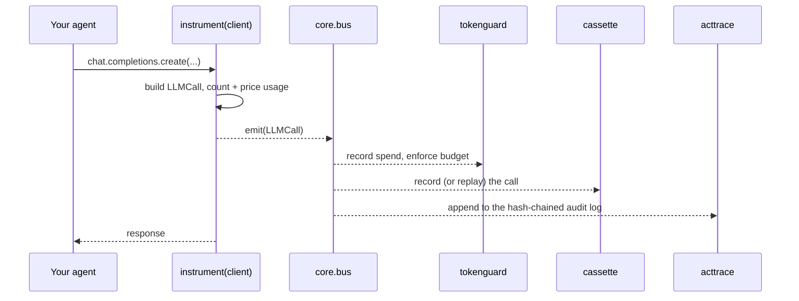
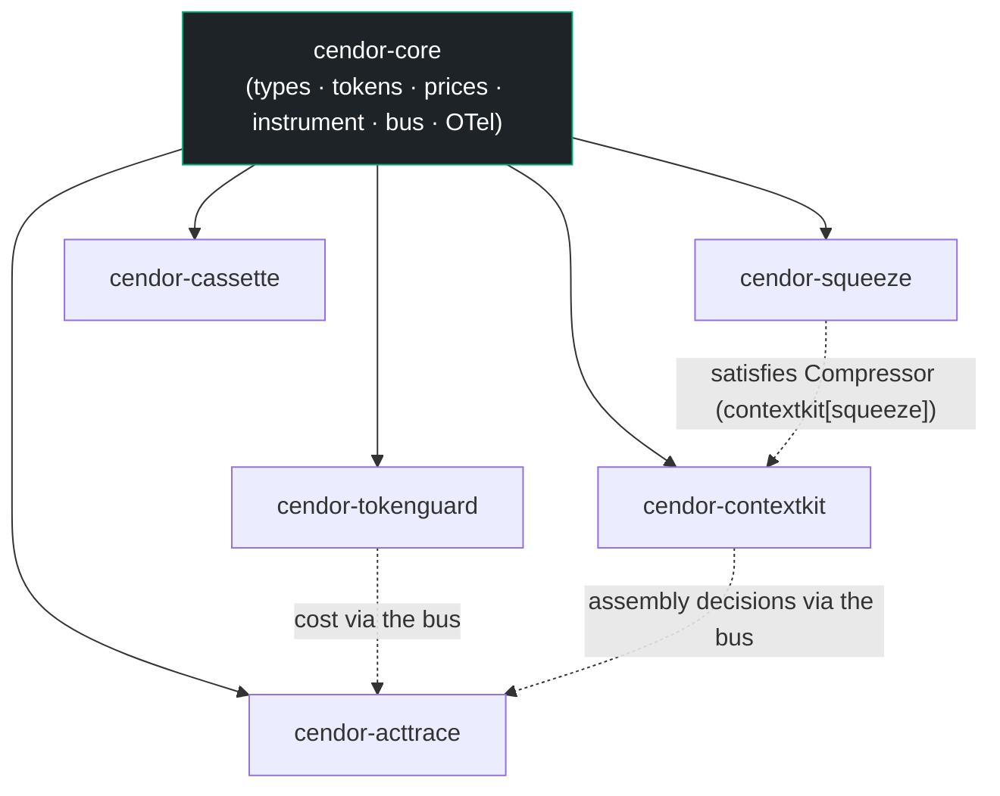

# Architecture

How the Cendor tools work, how they connect, and how they plug into your agent.

## The mental model

Five small libraries, one shared foundation, one brand. Each is useful alone; installed together
they cover the lifecycle of a production LLM call:

```
contextkit  →  squeeze  →  tokenguard  →  cassette  →  acttrace
 assemble       compress      budget         test         audit
```

Everything ships under the `cendor.*` import namespace. The foundation, `cendor-core`,
defines the common vocabulary (what an "LLM call" is, how tokens are counted and priced, how
events are emitted) that lets the tools interlock without coupling.

| Role | PyPI package | Import |
|---|---|---|
| Foundation | `cendor-core` | `cendor.core` |
| Assemble | `cendor-contextkit` | `cendor.contextkit` |
| Compress | `cendor-squeeze` | `cendor.squeeze` |
| Budget | `cendor-tokenguard` | `cendor.tokenguard` |
| Test | `cendor-cassette` | `cendor.cassette` |
| Audit | `cendor-acttrace` | `cendor.acttrace` |
| Umbrella (meta) | `cendor` | *(installs them all)* |

## How they connect (three layers)

The layering is what lets each tool stand alone *and* compose.

### Layer 1 — Shared types & protocols
`cendor.core` exports what everything agrees on:

- **Types:** `LLMCall`, `ToolCall`, `Usage`, `Money` (Decimal-backed).
- **Protocols** (structural / duck-typed): `Compressor`, `EvictionStrategy`, `Sink`, `Subscriber`,
  `Handle`. Because they're `Protocol`s, a library satisfies one by *shape* — `squeeze` is a
  `Compressor` without importing `contextkit`; `acttrace` is a `Subscriber` without importing the bus.
- **Primitives:** `tokens.count(...)`, a tokenizer registry, and a `prices` table (bundled
  snapshot + optional refresh).

### Layer 2 — One instrumentation point
`tokenguard`, `cassette`, and `acttrace` all need to *observe* LLM and tool calls. Rather than each
patching the provider client (and fighting each other), `core` owns a single interception point:

```python
from cendor.core import instrument
client = instrument(openai_client)   # also Anthropic, Bedrock, Gemini, Ollama
```

`instrument()` wraps the client once, publishes a normalized `LLMCall` onto an in-process **event
bus**, and (optionally) emits an OpenTelemetry GenAI span. Each sibling tool *subscribes* instead
of patching. One wrap, many listeners, no conflicts. It handles sync, async, and **streaming**
(`stream=True`) calls — a streamed response is passed through chunk-by-chunk and emitted once it
completes. Wrapping is idempotent and additive (it coexists with OpenLLMetry / OpenInference), and
the bus is thread-safe within a process.

### Layer 3 — Cooperation via the shared stream
Because every instrumented call flows through the same bus, downstream tools get each other's work
for free:

- `tokenguard` prices the call and records spend by tag.
- `contextkit` attaches its assembly decisions (kept / dropped) to the stream.
- `acttrace` subscribes and produces an audit log that **already knows** the context, the cost, and
  the tools — without importing `tokenguard` or `contextkit`.



> Install the umbrella, call `instrument()` once, and the `acttrace` audit log auto-populates with
> the budget, the context decisions, and the tool calls. That's what "they compose" means — a
> shared event schema, not marketing.

### Dependency graph



Solid arrows = package dependency. Dotted = runtime cooperation (no import required).

## How it plugs into your agent

The tools wrap *around and inside* your existing loop, at four points in a call's lifecycle:

- **Inbound** (you call them as you build the request): `contextkit` (assemble messages within a
  budget) and `squeeze` (compress oversized blocks — usually invoked *by* contextkit).
- **Wrap-around** (they ride the instrumented call): `tokenguard` (pre-flight cost check,
  post-flight record), `cassette` (record/replay, test-time), `acttrace` (append to the audit log).

```python
from openai import OpenAI
from cendor.core import instrument
from cendor.contextkit import Context, Block
from cendor.tokenguard import budget, track
from cendor.acttrace import AuditLog

client = instrument(OpenAI())                          # wrap once, at startup
audit  = AuditLog(system="support_bot", risk_tier="limited")   # auto-subscribes

@budget(usd=0.30, on_exceed="downgrade", downgrade={"gpt-4o": "gpt-4o-mini"})
def handle(user_msg: str) -> str:
    ctx = Context(budget_tokens=8000, model="gpt-4o", reserve_output=500)
    ctx.add(Block(SYSTEM_PROMPT, priority=10, pin=True, role="system"))
    ctx.add(Block(retrieved_docs, priority=5, evict="compress"))   # squeeze runs here
    ctx.add(Block(user_msg, priority=9, pin=True, role="user"))
    with track(feature="support_bot", user_id="alice"):
        resp = client.chat.completions.create(model="gpt-4o", messages=ctx.assemble())
    return resp.choices[0].message.content
```

The same `Context`/`tokenguard` code is identical across providers, because they operate on
messages and on the instrumented call, not on a vendor SDK.

### Two integration modes

- **You own the loop** (raw chat-completions + your own tool dispatch): `instrument()` sees every
  model and tool call directly. Wrap your tool dispatcher with `core.instrument_tool` so `ToolCall`
  events join the stream too.
- **A managed runtime owns the loop** (Foundry Agent Service, OpenAI Assistants/Agents): the
  provider runs the tool-calling loop server-side, so your client may not see each call. These
  runtimes emit `gen_ai.*` OpenTelemetry spans — feed those to `core.otel.ingest(...)` and the
  calls join the same bus, so `tokenguard`/`acttrace` work in this mode too.

> `contextkit` / `squeeze` apply only when *you* assemble the prompt. If a managed runtime owns
> context assembly internally, those two have nothing to shape; the other three still apply.

## Installing & versioning

Install only what you need (`pip install cendor-tokenguard`) or the whole stack
(`pip install cendor`). Each tool depends on `cendor-core` and is versioned
independently (SemVer). `core` is kept small and stable — consumers pin `cendor-core>=1.0,<2.0`,
so minor releases stay additive and never break the tools above it; breaking changes land only in
a new major.

### The namespace mechanism (PEP 420)
The umbrella works because of **implicit namespace packages**: every package ships code under
`src/cendor/<tool>/` with **no** `src/cendor/__init__.py`, so `cendor` is a namespace
many distributions contribute to. The `cendor` umbrella distribution ships no code — it only
declares the others as dependencies.
