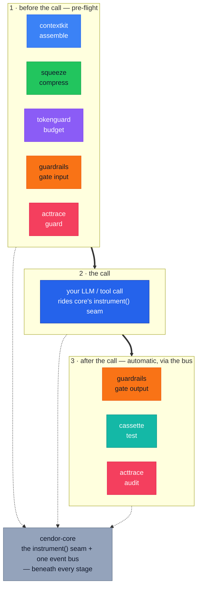
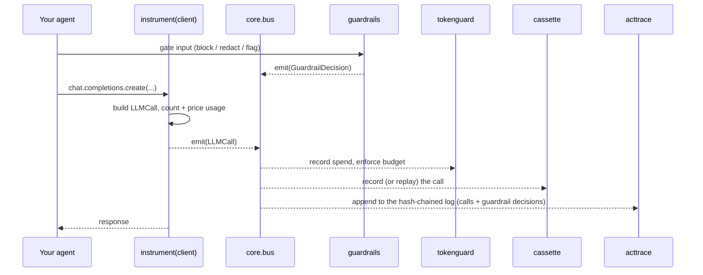
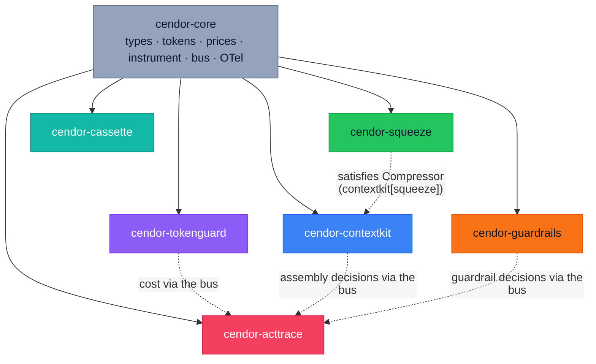

# Architecture

How the Cendor tools work, how they connect, and how they plug into your agent.

## The mental model

Seven small libraries, one shared foundation, one brand. Each is useful alone; installed together
they cover **the lifecycle of one governed LLM call** — cooperating through one event bus, never
through imports:



**A lifecycle, not a dependency chain.** Every library works alone; two act on *both* sides of the
call — **guardrails** gates the input and the output, **acttrace** guards before send and audits
after — and adding one changes nothing at your call site. Everything ships under the `cendor.*`
import namespace. The foundation, `cendor-core`, defines the common vocabulary — what an "LLM call"
is, how tokens are counted and priced, how events are emitted — that lets the tools interlock
without coupling.

| Role | When it acts | PyPI package | Import |
|---|---|---|---|
| Foundation | the seam + the bus | `cendor-core` | `cendor.core` |
| Assemble | before the call | `cendor-contextkit` | `cendor.contextkit` |
| Compress | before the call | `cendor-squeeze` | `cendor.squeeze` |
| Budget | before + after | `cendor-tokenguard` | `cendor.tokenguard` |
| Gate | before + after | `cendor-guardrails` | `cendor.guardrails` |
| Test | after (record / replay) | `cendor-cassette` | `cendor.cassette` |
| Guard + Audit | before + after | `cendor-acttrace` | `cendor.acttrace` |
| Umbrella (meta) | — | `cendor` | *(installs them all)* |

## How they connect (three layers)

The layering is what lets each tool stand alone *and* compose.

### Layer 1 — Shared types & protocols
`cendor.core` exports what everything agrees on:

- **Types:** `LLMCall`, `ToolCall`, `Usage`, `Money` (Decimal-backed).
- **Protocols** (structural / duck-typed): `Compressor`, `EvictionStrategy`, `Sink`, `Subscriber`,
  `Handle`. A library satisfies one by *shape* — `squeeze` is a `Compressor` without importing
  `contextkit`; `acttrace` is a `Subscriber` without importing the bus.
- **Primitives:** `tokens.count(...)`, a tokenizer registry, and a `prices` table.

### Layer 2 — One instrumentation point
`tokenguard`, `guardrails`, `cassette`, and `acttrace` all need to *see* LLM and tool calls — to
budget, gate, record, or audit them. Rather than each patching the provider client (and fighting
each other), `core` owns a single interception point:

<!-- tabs: lang -->
<!-- tab: Python -->
```python
from cendor.core import instrument
client = instrument(openai_client)   # also Anthropic, Hugging Face, Bedrock, Gemini, Ollama
```
<!-- tab: TypeScript -->
```ts
import OpenAI from 'openai';
import { instrument } from '@cendor/core';
const client = instrument(new OpenAI());   // also Anthropic, Hugging Face, Bedrock, Gemini, Ollama
```
<!-- /tabs -->

`instrument()` wraps the client once, publishes a normalized `LLMCall` onto the in-process **event
bus**, and optionally emits an OpenTelemetry span. Each sibling tool *subscribes* instead of
patching — one wrap, many listeners, no conflicts. It handles sync, async, and streaming calls;
wrapping is idempotent and additive (it coexists with OpenLLMetry / OpenInference), and the bus is
thread-safe within a process.

### Layer 3 — Cooperation via the shared stream
Because every instrumented call flows through the same bus, downstream tools get each other's work
for free:

- `tokenguard` prices the call and records spend by tag.
- `contextkit` attaches its assembly decisions (kept / dropped) to the stream.
- `guardrails` gates the input, tool calls, and output; each decision emits on the bus.
- `acttrace` subscribes and produces an audit log that **already knows** the context, the cost, the
  tools, and the guardrail decisions — without importing `tokenguard`, `contextkit`, or `guardrails`.



> Install the umbrella, call `instrument()` once, and the `acttrace` audit log auto-populates with
> the budget, the context decisions, and the tool calls. That's what "they compose" means — a shared
> event schema, not marketing.

### Dependency graph



Solid arrows = package dependency. Dotted = runtime cooperation (no import required).

## How it plugs into your agent

The tools wrap *around and inside* your existing loop, at four points in a call's lifecycle:

- **Inbound** (as you build the request): `contextkit` (assemble messages within a budget) and
  `squeeze` (compress oversized blocks — usually invoked *by* contextkit).
- **Wrap-around** (they ride the instrumented call): `tokenguard` (pre-flight cost check, post-flight
  record), `guardrails` (pre-flight gate on input / tool calls, post-flight on output), `cassette`
  (record/replay, test-time), `acttrace` (append to the audit log).

<!-- tabs: lang -->
<!-- tab: Python -->

```python
from openai import OpenAI
from cendor.core import instrument
from cendor.contextkit import Context, Block
from cendor.tokenguard import budget, track
from cendor.acttrace import AuditLog

client = instrument(OpenAI())                          # wrap once, at startup
audit  = AuditLog(system="support_bot", risk_tier="limited")   # auto-subscribes

@budget(usd=0.30, on_exceed="downgrade", downgrade={"gpt-4o": "gpt-4o-mini"})
def handle(user_msg: str) -> str:
    ctx = Context(budget_tokens=8000, model="gpt-4o", reserve_output=500)
    ctx.add(Block(SYSTEM_PROMPT, priority=10, pin=True, role="system"))
    ctx.add(Block(retrieved_docs, priority=5, evict="compress"))   # squeeze runs here
    ctx.add(Block(user_msg, priority=9, pin=True, role="user"))
    with track(feature="support_bot", user_id="alice"):
        resp = client.chat.completions.create(model="gpt-4o", messages=ctx.assemble())
    return resp.choices[0].message.content
```

<!-- tab: TypeScript -->

<!-- ts-check: skip -->

```ts
import OpenAI from 'openai';
import { instrument } from '@cendor/core';
import { Context, Block } from '@cendor/contextkit';
import { budget, track } from '@cendor/tokenguard';
import { AuditLog } from '@cendor/acttrace';

const client = instrument(new OpenAI());                       // wrap once, at startup
const audit  = new AuditLog('support_bot', { riskTier: 'limited' });   // auto-subscribes

const handle = budget({ usd: 0.30, onExceed: 'downgrade', downgrade: { 'gpt-4o': 'gpt-4o-mini' } })(
  async (userMsg: string) => {
    const ctx = new Context({ budgetTokens: 8000, model: 'gpt-4o', reserveOutput: 500 });
    ctx.add(new Block(SYSTEM_PROMPT, { priority: 10, pin: true, role: 'system' }));
    ctx.add(new Block(retrievedDocs, { priority: 5, evict: 'compress' }));   // squeeze runs here
    ctx.add(new Block(userMsg, { priority: 9, pin: true, role: 'user' }));
    return track({ feature: 'support_bot', userId: 'alice' }, async () => {
      const resp = await client.chat.completions.create({ model: 'gpt-4o', messages: await ctx.assemble() });
      return resp.choices[0].message.content;
    });
  });
```

<!-- /tabs -->

The same `Context`/`tokenguard` code is identical across providers, because they operate on messages
and on the instrumented call, not on a vendor SDK.

### Three integration modes

- **You own the loop** (raw chat-completions + your own tool dispatch): `instrument()` sees every
  model and tool call directly. Wrap your tool dispatcher with `core.instrument_tool` so `ToolCall`
  events join the stream too. Group a run with `core.trace("run-id")` for correlation.
- **A framework owns the loop** (LangChain / LangGraph): the SDK-aligned integration point is the
  framework's **callback system**, not the inner client (which LangChain reaches via
  `with_raw_response`, losing usage). Attach
  [`cendor.core.langchain.CendorCallbackHandler`](providers.md#frameworks-langchain--langgraph) — it
  records usage/reasoning/tools and a root-run `trace_id` onto the same bus.
- **A managed runtime owns the loop** (Foundry Agent Service, OpenAI Assistants/Agents): the provider
  runs the tool-calling loop server-side, so your client may not see each call. These runtimes emit
  `gen_ai.*` OpenTelemetry spans — feed those to
  [`core.otel.ingest(...)`](providers.md#managed-runtimes-opentelemetry-ingestion) and the calls join
  the same bus, so `tokenguard`/`acttrace` work in this mode too.

> `contextkit` / `squeeze` apply only when *you* assemble the prompt. If a framework/managed runtime
> owns context assembly internally, those two have nothing to shape; the other three still apply.

**Recording vs. enforcement — align to the SDK.** cendor's guiding rule is *align to the behaviour
of what it wraps*: add no failure mode the SDK lacks (no crashes, no leaks, no latency cliffs), and
claim no scope the SDK doesn't. **Enforcement** (pre-flight `tokenguard` caps, `guardrails`' input /
tool-call gate, `acttrace`'s `guard()` redact-before-send) lives on the `instrument()` seam — it can
refuse or rewrite a call *before it runs*. The framework **callback path is recording-only** (post-call): it observes
usage/cost/tools/correlation but cannot enforce, because it never touches the client. Choose the
direct-SDK seam when you need enforcement; use callbacks to observe a framework you don't want to
wrap.

**Scope & non-goals (deliberate — align by staying out).** cendor is process-local: it provides a
correlation *hook* (`trace_id`, sinks), **not** an orchestrator, and does **no** cross-process /
distributed aggregation, run-graph modelling, or checkpoint/resume of its own state. For a
long-running or multi-agent system, aggregate durably via a sink into your own store and correlate
by `trace_id`; resuming the agent is the orchestrator's job, not cendor's.

## Installing & versioning

Install only what you need (`pip install cendor-tokenguard`) or the whole stack
(`pip install cendor-libs`; the `cendor` alias also works). Each tool depends on `cendor-core` and is versioned independently (SemVer).
`core` is kept small and stable — consumers pin `cendor-core>=1.0,<2.0`, so minor releases stay
additive and never break the tools above it; breaking changes land only in a new major.

### The namespace mechanism (PEP 420)
The umbrella works because of **implicit namespace packages**: every package ships code under
`src/cendor/<tool>/` with **no** `src/cendor/__init__.py`, so `cendor` is a namespace many
distributions contribute to. The `cendor` umbrella distribution ships no code — it only declares the
others as dependencies.
