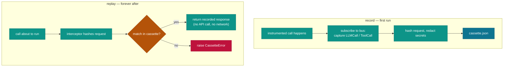

# `cendor-cassette` — test

Record an agent run once; replay it forever — deterministic, offline, and free. Unlike `vcrpy`
(HTTP-only), it captures the *whole* run: every LLM call and tool call, in order. The fixture layer
beneath your eval platform.

```bash
pip install cendor-cassette
```

## Highlights

- **Whole-run capture** — every LLM **and** tool call, in order (not just HTTP, like `vcrpy`). The fixture layer beneath your eval platform.
- **Four modes** — `auto` (record if missing, else replay) · `record` · `replay` (fail on an unrecorded call) · `rerecord` (run live, report `drift()`, never overwrite the committed cassette).
- **Decorator or context manager** — `@cassette.use("run.json")` or `with cassette.using(...)` (handy in pytest fixtures).
- **Meaning-based assertions** — `semantic_match(actual, expected)` (offline lexical default; opt into a free offline local-embedding `scorer`, a BYO-provider embedder, or an LLM judge for negation-sensitive checks). `semantic_drift()` filters `rerecord` noise to real regressions.
- **Pluggable matching + redaction** — a `normalizer` decides what makes two requests "the same"; secrets/PII are redacted on write, but matching hashes the **un-redacted** request so redaction never collapses two distinct calls.
- **`promote()`** turns a production JSONL trace into a replayable regression test.

## Quickstart

```python
from cendor.core import instrument
from cendor import cassette

client = instrument(OpenAI())          # the same instrumented seam you run in production

@cassette.use("triage_happy_path.json")   # record first run, replay forever after (auto mode)
def test_triage():
    result = my_agent.run("My card was charged twice")
    assert "refund" in result.tools_called
    assert cassette.semantic_match(result.answer, "offers a refund")
```

## Functions & classes

- **`@cassette.use(path, mode="auto", normalizer=None, redact=True)`** — decorator. Modes:
  - `auto` — record if the cassette file is missing, else replay.
  - `record` — always record (writes the cassette).
  - `replay` — always replay; an unrecorded call raises `CassetteError`.
  - `rerecord` — run live, diff each response against the cassette, and report `drift()` **without**
    overwriting the committed cassette.

  `normalizer` is a pluggable `event -> dict` deciding what makes two requests "the same" (default:
  provider/model/messages/**stream**, or name/arguments) — use it to ignore volatile fields. `redact`
  scrubs what gets *written*: `True` (default, built-in secret patterns), `False` (verbatim — for
  responses with long IDs the default would over-redact), or a custom `obj -> obj` scrubber.
  Recording is scoped to the active context (a `ContextVar`), so **concurrent** `use()`/`using()`
  blocks never capture each other's calls, and the file is written atomically (temp + `os.replace`).
- **`using(path, mode="auto", normalizer=None, redact=True)`** — the same thing as a **context
  manager** for a `with` block instead of a decorated function (handy in pytest fixtures): `with
  cassette.using("run.json"): agent.run(...)`.
- **`semantic_match(actual, expected, threshold=0.6, scorer=None)`** — assert *meaning*, not bytes.
  The default `lexical_score` is offline, deterministic, and **recall-oriented** (keyword
  containment): it tolerates extra surrounding text but is not meaning-aware — it will accept a
  negation or superset (`"we will not offer a refund"` matches `"offer a refund"`). Pass a
  `scorer(actual, expected) -> float` (an embedding scorer or an LLM judge — see **Semantic
  matching** below) for negation-sensitive checks.
- **`promote(trace_path, to, redact=True)`** — convert a JSONL call trace into a replayable cassette
  (the hashes match live calls, so it replays cleanly). Turns a production trace into a regression test.
- **`drift()`** — byte-exact divergences found by the most recent `rerecord` run.
- **`semantic_drift(threshold=0.8, scorer=None)`** — filter `drift()` down to *meaningful* divergences:
  re-scores each one's recorded-vs-live text and keeps only those scoring **below** `threshold`
  (genuinely different in meaning), attaching a `score` key. See **Drift that means something** below.
- **`cosine(a, b) -> float`**, **`embedding_scorer(embed_fn)`**, **`local_embedding_scorer(model=...)`**,
  **`openai_embedding_scorer(client, model=...)`** — building blocks for embedding-based scorers
  (see **Semantic matching** below).
- **`CassetteEntry`**, **`CassetteError`**.

## How it works



- **Record:** subscribes to `core`'s bus, captures each `LLMCall`/`ToolCall` keyed by a normalized
  request hash → response, and writes an ordered JSON cassette. Secrets/PII (emails; `sk-` keys
  including the hyphenated `sk-ant-`/`sk-proj-` forms; AWS + Google API keys; JWTs; bearer/long
  opaque tokens) are redacted on record, since cassettes get committed — but the matching hash is
  computed on the **un-redacted** request, so redaction can never collapse two distinct requests
  onto one entry.
- **Replay:** registers a `core` interceptor that returns the recorded response by hash *before* the
  real call runs — so there's no second patch and no network. Unknown call → clear failure in
  `replay` mode. A recorded response is rebuilt in the caller's original access style: dict-response
  providers (Ollama/Bedrock) replay as dicts, SDK-object providers as attribute-accessible objects
  (a `response_type` marker on each entry). `stream=True` and `stream=False` are part of the request
  hash, so a streamed call replays against its streamed recording and vice versa.
- **Format & compatibility:** cassettes are written at format **v2** (folds `stream` into the hash,
  records `response_type`); a committed **v1** cassette still replays (its default normalizer omits
  `stream`). An unsupported/newer version raises a clear `CassetteError` rather than a blind
  `KeyError`.
- **Parallelism (pytest-xdist):** recording is scoped to the active context via a `ContextVar`, so
  concurrent `using()`/`use()` blocks in the same process don't cross-contaminate, and writes are
  atomic. Across **xdist** worker *processes*, give each worker its own cassette path so they don't
  race on a single file — e.g. `f"run-{os.environ.get('PYTEST_XDIST_WORKER', 'gw0')}.json"`, or key
  the fixture on the `worker_id`.

## Semantic matching

`semantic_match` asserts *meaning* for output that won't be byte-identical. The default
`lexical_score` stays the default — offline, deterministic, zero-dependency, the right baseline for a
*test* tool. Everything below is **opt-in** and plugs into the existing `scorer` hook
(`semantic_match(actual, expected, threshold=0.6, scorer=None)`); cassette binds no model and adds no
dependency unless you ask for one.

There are four tiers, layering from hermetic-and-free toward meaning-aware-but-costly:

| Tier | Scorer | Hermetic? | Deterministic? | Cost | Use for |
|------|--------|-----------|----------------|------|---------|
| 1. Lexical (default) | `lexical_score` (built-in) | ✅ | ✅ | free, zero-dep | keyword/recall checks; the baseline |
| 2. Local embeddings | `local_embedding_scorer()` | ✅ | ✅ | free, `[embeddings]` extra | **recommended** meaning-aware checks in test runs |
| 3. BYO provider embeddings | `embedding_scorer(embed_fn)` | ❌ (network at score time) | depends on provider | per-embedding API cost | reuse your project's embedding model |
| 4. LLM-judge | a `scorer` calling a BYO client | ❌ | ❌ (temp > 0) | per-call API cost | nuanced/rubric judgements |

**Tier 2 — local model2vec (recommended).** `local_embedding_scorer(model="minishlab/potion-base-8M")`
returns a scorer backed by [model2vec](https://github.com/MinishLab/model2vec) **static** embeddings:
numpy-only, **no torch**, ~8–30 MB models, offline and deterministic once the model is cached. It is
behind an optional extra and raises a clear `ImportError` with the install hint if missing:

```bash
pip install 'cendor-cassette[embeddings]'
```

```python
from cendor import cassette

score = cassette.local_embedding_scorer()  # downloads/caches the model once, then offline
assert cassette.semantic_match(result.answer, "offers a refund", scorer=score)
assert not cassette.semantic_match("we will not offer a refund", "offers a refund", scorer=score)
```

**Tier 3 — bring your own provider (`embedding_scorer`).** `embedding_scorer(embed_fn)` turns any
embedder into a scorer. `embed_fn(texts: list[str]) -> list[list[float]]` can wrap *any* provider or
local model; the returned scorer embeds both strings and returns their `cosine` similarity clamped to
`[0, 1]`. A cloud embedder makes a network call at score time (non-hermetic) — prefer Tier 2 for
test runs.

```python
# OpenAI — text-embedding-3-small / -large (thin convenience wrapper over an already-built client)
from openai import OpenAI
score = cassette.openai_embedding_scorer(OpenAI(), model="text-embedding-3-small")

# Any other provider via embedding_scorer + your own embed_fn:
#   • Google  — gemini-embedding
#   • Cohere  — embed-v3
#   • Voyage  — voyage-3   ← Anthropic has NO embeddings API; on a Claude stack, use Voyage
def embed_fn(texts: list[str]) -> list[list[float]]:
    return voyage_client.embed(texts, model="voyage-3").embeddings
score = cassette.embedding_scorer(embed_fn)
```

`openai_embedding_scorer(client, model="text-embedding-3-small")` is a thin convenience over an
*already-constructed* OpenAI-shaped client (it calls `client.embeddings.create(...)`; cassette never
imports an SDK). It is non-hermetic (network + cost) — documented as such; for hermetic runs prefer
`local_embedding_scorer`.

**Tier 4 — LLM-judge (recipe, never a dependency).** For nuanced or rubric-style judgements, write a
`scorer` that calls your own instrumented client and maps the verdict to `[0, 1]`. This is a
documented **recipe**, not shipped code — it is non-hermetic, non-deterministic (temperature > 0), and
costs money, so reach for it only when Tiers 1–3 can't express the check:

```python
def judge(actual: str, expected: str) -> float:
    # your already-instrumented client; returns e.g. "0.9"
    verdict = my_client.messages.create(...)
    return float(parse_score(verdict))

assert cassette.semantic_match(result.answer, "politely declines and offers an alternative", scorer=judge)
```

## Drift that means something

`drift()` stays **byte-exact** for back-compat. But at any non-zero temperature a model never
reproduces its output byte-for-byte, so a `rerecord` run flags *every* response as drift — pure noise.
`semantic_drift(threshold=0.8, scorer=None)` filters that noise: it re-scores each divergence's
recorded-vs-live text and keeps only those scoring **below** `threshold` (i.e. genuinely different in
meaning), attaching a `score` key to each. It uses `lexical_score` by default; pass an embedding /
LLM-judge `scorer` for true semantics.

```python
@cassette.use("triage.json", mode="rerecord")
def test_triage_drift():
    my_agent.run("My card was charged twice")

test_triage_drift()
real = cassette.semantic_drift(threshold=0.8, scorer=cassette.local_embedding_scorer())
assert not real, f"meaningful regressions: {real}"   # cosmetic rewording is ignored
```

The alternative, if you want byte-stable drift: record and replay at `temperature=0` so the model's
output is reproducible and raw `drift()` is itself meaningful.

## Plugs in
**Wrap-around, test-time only.** In production you do nothing; in tests, the instrumented client's
calls (and `instrument_tool`-wrapped tools) are recorded once and replayed forever. The same agent
code runs in the test as in production. For server-side loops you don't control, `promote()` a
recorded OTel/`acttrace` trace into a cassette.

## Notes
- The default `semantic_match` is a lexical heuristic — offline and recall-oriented (it matches when
  the expected keywords are present, so it tolerates extra text but accepts negations/supersets). For
  meaning-aware or negation-sensitive checks, pass a `scorer` — the embedding and LLM-judge backends
  in **Semantic matching** above are available now (no longer roadmap): start with the free, offline
  `local_embedding_scorer` (model2vec, behind the `[embeddings]` extra).
- Tool calls with real side effects: cassette records the *result* and stubs the side effect on
  replay — wrap your dispatcher with `core.instrument_tool` so tool calls join the stream.
