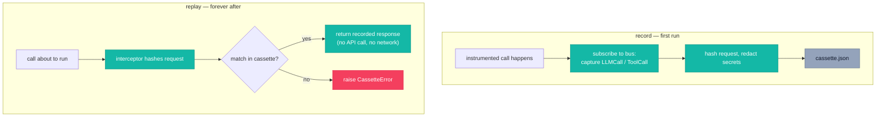

# `cendor-cassette` — test

Record an agent run once; replay it forever — deterministic, offline, and free. Unlike `vcrpy`
(HTTP-only), it captures the *whole* run: every LLM call **and** tool call, in order. The
fixture layer beneath your eval platform.

<!-- tabs: lang -->
<!-- tab: Python -->

```bash
pip install cendor-cassette
```

<!-- tab: TypeScript -->

```bash
npm i @cendor/cassette
```

<!-- /tabs -->

## Quickstart

<!-- tabs: lang -->
<!-- tab: Python -->

```python
from cendor.core import instrument
from cendor import cassette

client = instrument(OpenAI())          # the same instrumented seam you run in production

@cassette.use("triage_happy_path.json")   # record first run, replay forever after (auto mode)
def test_triage():
    result = my_agent.run("My card was charged twice")
    assert "refund" in result.tools_called
    assert cassette.semantic_match(result.answer, "offers a refund")
```

<!-- tab: TypeScript -->

```ts
import { instrument } from '@cendor/core';
import * as cassette from '@cendor/cassette';

const client = instrument(new OpenAI());   // the same instrumented seam you run in production

test('triage happy path', () =>
  cassette.using('triage_happy_path.json', async () => {  // record first run, replay after (auto)
    const result = await myAgent.run('My card was charged twice');
    expect(result.toolsCalled).toContain('refund');
    expect(cassette.semanticMatch(result.answer, 'offers a refund')).toBe(true);
  }));
```

<!-- /tabs -->

> **See it in the stack.** The full agent-under-test recipe is in the [Cookbook](/cookbook).

## Core concepts

### Whole-run capture, then replay
On the first run, `cassette` subscribes to `core`'s bus and captures each `LLMCall`/`ToolCall`
keyed by a normalized request hash → response, writing an ordered JSON cassette. On replay, it
registers a `core` interceptor that returns the recorded response by hash *before* the real call
runs — so there's no network and no second patch point. The same agent code runs in the test as
in production.

### Four modes
| Mode | Behavior |
|---|---|
| `auto` | Record if the cassette file is missing, else replay. (default) |
| `record` | Always record (writes the cassette). |
| `replay` | Always replay; an unrecorded call raises `CassetteError`. |
| `rerecord` | Run live, diff each response against the cassette, report `drift()` — **without** overwriting the committed cassette. |

### Matching & redaction
A `normalizer` (`event -> dict`) decides what makes two requests "the same" (default:
provider/model/messages/**stream**, or name/arguments) — use it to ignore volatile fields.
Redaction scrubs what gets **written** (secrets/PII), but the matching hash is computed on the
**un-redacted** request, so redaction can never collapse two distinct calls onto one entry.
`stream=True`/`False` is part of the hash, so a streamed call replays against its streamed
recording and vice versa.

### Format & parallelism
Cassettes are written at format **v2** (folds `stream` into the hash, records `response_type`);
a committed **v1** cassette still replays. Recording is scoped to the active context via a
`ContextVar`, so concurrent `use()`/`using()` blocks never cross-contaminate, and files are
written atomically. Across **pytest-xdist** worker *processes*, give each worker its own cassette
path (e.g. keyed on `PYTEST_XDIST_WORKER`).

## Functions & classes

### `@cassette.use()` / `cassette.using()`

<!-- tabs: lang -->
<!-- tab: Python -->

```python
@cassette.use(path, mode="auto", normalizer=None, redact=True)     # decorator
with cassette.using(path, mode="auto", normalizer=None, redact=True): ...   # context manager
```

<!-- tab: TypeScript -->

<!-- ts-check: skip -->

```ts
const wrapped = cassette.use(path, { mode: 'auto', normalizer, redact: true })(fn);  // wrapper form
await cassette.using(path, { mode: 'auto' }, async () => { /* ... */ });             // scoped form
```

<!-- /tabs -->

| Param | Type | Default | What it does |
|---|---|---|---|
| `path` | `str` | — (required) | Cassette file to record to / replay from. |
| `mode` | `str` | `"auto"` | `auto` \| `record` \| `replay` \| `rerecord` (see [Four modes](#four-modes)). |
| `normalizer` | `callable \| None` | `None` | `event -> dict` deciding request sameness; ignore volatile fields here. |
| `redact` | `bool \| callable` | `True` | `True` (built-in secret patterns) \| `False` (verbatim) \| a custom `obj -> obj` scrubber. |

### `semantic_match()`
Assert *meaning*, not bytes — for output that won't be byte-identical.

<!-- tabs: lang -->
<!-- tab: Python -->

```python
semantic_match(actual, expected, threshold=0.6, scorer=None)  # -> bool
```

<!-- tab: TypeScript -->

```ts
cassette.semanticMatch(actual, expected, 0.6, scorer)   // -> boolean
```

<!-- /tabs -->

The default `lexical_score` is offline, deterministic, and recall-oriented (it tolerates extra
text but accepts negations/supersets). Pass a `scorer` for negation-sensitive checks — see
[Semantic matching](#semantic-matching) below.

### Other functions
| Name | Signature | What it does |
|---|---|---|
| `promote` | `promote(trace_path, to, redact=True)` | Convert a JSONL call trace into a replayable cassette (a production trace → a regression test). |
| `drift` | `drift()` | Byte-exact divergences found by the most recent `rerecord` run. |
| `semantic_drift` | `semantic_drift(threshold=0.8, scorer=None)` | Filter `drift()` to *meaningful* divergences (re-scores, keeps those below `threshold`, attaches a `score`). |
| `cosine` / `embedding_scorer` / `local_embedding_scorer` / `openai_embedding_scorer` | — | Building blocks for embedding-based scorers (see below). |
| `CassetteEntry` / `CassetteError` | — | The entry record and the error raised on an unmatched replay / bad version. |

## How it works



A recorded response is rebuilt in the caller's original access style: dict-response providers
(Ollama/Bedrock) replay as dicts, SDK-object providers as attribute-accessible objects (a
`response_type` marker on each entry).

## Semantic matching

`semantic_match` asserts *meaning* for output that won't be byte-identical. The default stays
offline and zero-dependency; everything richer is **opt-in** through the same `scorer` hook —
cassette binds no model and adds no dependency unless you ask.

| Tier | Scorer | Hermetic? | Cost | Use for |
|---|---|---|---|---|
| 1. Lexical (default) | `lexical_score` (built-in) | ✅ | free, zero-dep | keyword/recall checks; the baseline |
| 2. Local embeddings | `local_embedding_scorer()` | ✅ | free, `[embeddings]` extra | **recommended** meaning-aware checks in tests |
| 3. BYO provider embeddings | `embedding_scorer(embed_fn)` | ❌ (network) | per-embedding | reuse your project's embedding model |
| 4. LLM-judge | a `scorer` calling your client | ❌ | per-call | nuanced/rubric judgements |

**Tier 2 (recommended).** `local_embedding_scorer(model="minishlab/potion-base-8M")` returns a
scorer backed by [model2vec](https://github.com/MinishLab/model2vec) static embeddings —
numpy-only, no torch, offline and deterministic once cached. Behind the `[embeddings]` extra:

```bash
pip install 'cendor-cassette[embeddings]'
```
<!-- tabs: lang -->
<!-- tab: Python -->
```python
score = cassette.local_embedding_scorer()   # downloads/caches the model once, then offline
assert cassette.semantic_match(result.answer, "offers a refund", scorer=score)
assert not cassette.semantic_match("we will not offer a refund", "offers a refund", scorer=score)
```
<!-- tab: TypeScript -->
> **Python only (for now).** `local_embedding_scorer` (model2vec static embeddings) ships in Python;
> `semanticMatch` in TypeScript takes a BYO scorer. See the [parity matrix](/docs/languages).
<!-- /tabs -->

**Tier 3 (BYO).** `embedding_scorer(embed_fn)` turns any embedder into a scorer;
`embed_fn(texts) -> list[list[float]]` can wrap any provider. `openai_embedding_scorer(client,
model="text-embedding-3-small")` is a thin convenience over an already-built OpenAI-shaped client.
Both make a network call at score time (non-hermetic) — prefer Tier 2 for test runs.

**Tier 4 (recipe, never a dependency).** For rubric-style judgements, write a `scorer` that calls
your own instrumented client and maps the verdict to `[0, 1]`. Non-hermetic and
non-deterministic — reach for it only when Tiers 1–3 can't express the check.

### Drift that means something
`drift()` stays byte-exact, but at any non-zero temperature a model never reproduces output
byte-for-byte, so a `rerecord` flags *everything* — noise. `semantic_drift(threshold=0.8,
scorer=None)` re-scores each divergence and keeps only those genuinely different in meaning:

```python
real = cassette.semantic_drift(threshold=0.8, scorer=cassette.local_embedding_scorer())
assert not real, f"meaningful regressions: {real}"   # cosmetic rewording is ignored
```

## Plugs into the stack

**Wrap-around, test-time only.** In production you do nothing; in tests, the instrumented
client's calls (and `instrument_tool`-wrapped tools) are recorded once and replayed forever. For
server-side loops you don't control, `promote()` a recorded OTel/`acttrace` trace into a cassette.

## Honest limits

- **The default `semantic_match` is a lexical heuristic** — recall-oriented, so it accepts
  negations/supersets. For meaning-aware or negation-sensitive checks, pass a `scorer` (start with
  the free, offline `local_embedding_scorer`).
- **Tool calls with real side effects:** cassette records the *result* and stubs the side effect
  on replay — wrap your dispatcher with `core.instrument_tool` so tool calls join the stream.
