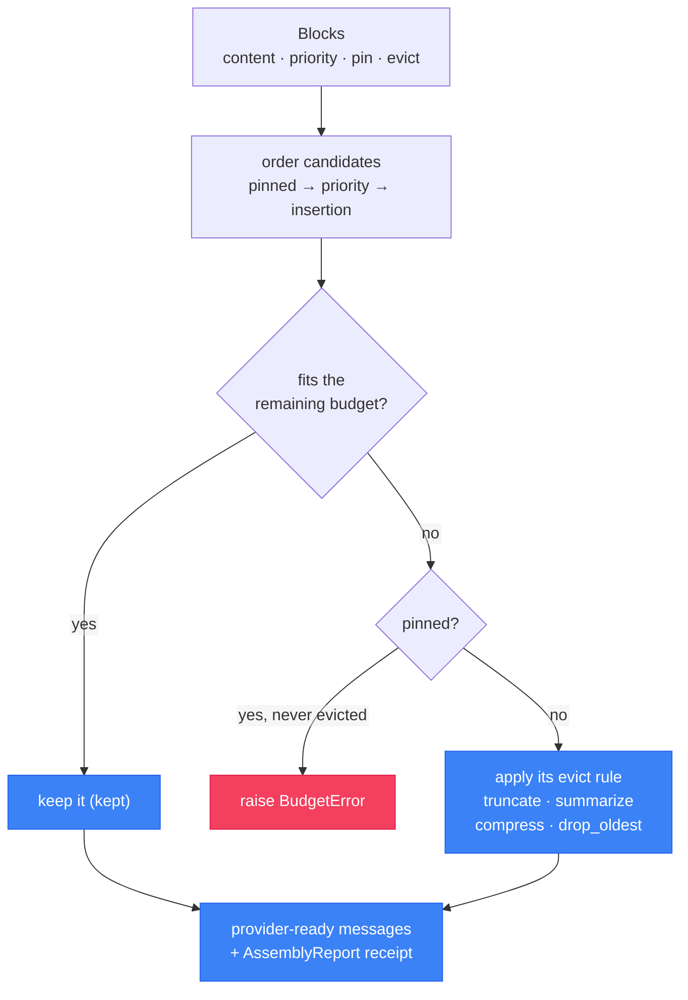

# `cendor-contextkit` — assemble

Treat the context window like a packed suitcase, not a string you concatenate. Declare
`Block`s with priorities and per-block eviction rules; `contextkit` fits them to a token
budget deterministically and hands back a **receipt** of exactly what it kept, shrank, and
dropped.

<!-- tabs: lang -->
<!-- tab: Python -->

```bash
pip install cendor-contextkit
pip install "cendor-contextkit[squeeze]"   # enable evict="compress"
```

<!-- tab: TypeScript -->

```bash
npm i @cendor/contextkit
npm i @cendor/squeeze                      # enable evict: "compress" (optional peer)
```

<!-- /tabs -->

## Quickstart

<!-- tabs: lang -->
<!-- tab: Python -->

```python
from cendor.contextkit import Context, Block

ctx = Context(budget_tokens=8000, model="claude-opus-4-8", reserve_output=1000, order="attention")
ctx.add(Block(system_prompt, priority=10, pin=True, role="system"))
ctx.add(Block(retrieved_docs, priority=5, evict="compress"))            # uses squeeze if installed
ctx.add(Block(messages=chat_history, priority=3, evict="drop_oldest"))  # peels OLDEST turns
ctx.add(Block(user_msg, priority=9, pin=True, role="user"))

messages = ctx.assemble()          # provider-ready messages, guaranteed within budget
print(ctx.report())                # the receipt: kept / truncated / dropped + token math
```

<!-- tab: TypeScript -->

```ts
import { Context, Block } from '@cendor/contextkit';

const ctx = new Context({ budgetTokens: 8000, model: 'claude-opus-4-8',
                          reserveOutput: 1000, order: 'attention' });
ctx.add(new Block(systemPrompt, { priority: 10, pin: true, role: 'system' }));
ctx.add(new Block(retrievedDocs, { priority: 5, evict: 'compress' }));            // @cendor/squeeze if installed
ctx.add(new Block({ messages: chatHistory, priority: 3, evict: 'drop_oldest' })); // peels OLDEST turns
ctx.add(new Block(userMsg, { priority: 9, pin: true, role: 'user' }));

const messages = await ctx.assemble();  // one async assemble() (sync + async collapsed)
console.log(ctx.report());              // the receipt: kept / truncated / dropped + token math
```

<!-- /tabs -->

> **See it in the stack.** The full support-agent recipe that assembles, compresses, budgets,
> and audits together is in the [Cookbook](/cookbook).

## Core concepts

### Blocks, priority, and pinning
A `Block` is a unit of context with a `priority` and a `pin` flag. `assemble()` fits blocks
into `budget_tokens` (minus `reserve_output`), admitting them by priority. **Pinned blocks are
never evicted** — if the pinned blocks alone overflow the budget, assembly raises `BudgetError`
rather than silently dropping something you marked essential.

### Per-block eviction
When an unpinned block doesn't fit, `contextkit` applies *that block's* `evict` rule rather
than dropping it wholesale:

| `evict` | Effect on overflow |
|---|---|
| `"drop_oldest"` | Single block → skip it (`dropped`). A `messages` block → peel oldest turns, keep the newest that fit (`truncated`, note `kept N of M turns`). |
| `"truncate"` | Cut to the remaining budget, keeping `keep="head"`/`"tail"`, leaving a `…[truncated]` marker. |
| `"summarize"` | Call the block's `summarizer` to target size (falls back to truncate if none; async via `aassemble()`). |
| `"compress"` | Shrink via `squeeze` (falls back to truncate if `squeeze` isn't installed). |
| an `EvictionStrategy` object | Call its `evict(content, remaining_tokens, model)`. |

### The receipt
`report()` returns an `AssemblyReport` — kept / shrunk / dropped per block, with token math.
Its `.used` is the **message-level** count of what you actually send (content *plus* the
per-message framing a provider adds), so `report().used == core.tokens.count(assemble(), model)`
for text content. "Within budget" is therefore true of the real payload, not just the
concatenated block text.

### Ordering
`order=` decides the layout of the kept blocks:

- **`"default"`** — role-grouped: system → context/history → the user turn.
- **`"attention"`** — *lost-in-the-middle*: highest-priority context rides the edges (just
  after system / just before the user turn), weakest in the dead center.
- **`"cache"`** — stable prefix first (pinned, high-priority blocks lead) to maximize provider
  prompt-cache / KV-cache hits across calls.

### Chat-history blocks
`Block(messages=[…])` holds a contiguous conversation segment. When it overflows, `drop_oldest`
keeps the newest turns and peels the oldest (a sliding window) — it never mangles a turn.
History renders in the middle: after `system`, before the final user turn.

### Multimodal & async
`Context(image_tokens=N)` charges `N` tokens per image part in multimodal (list) blocks; pass a
callable `(part) -> int` for a resolution-aware estimate. Multimodal blocks are kept whole or
dropped, never text-truncated. `await ctx.aassemble()` runs the same packing but awaits async
`summarize` callbacks (an LLM summarizer); the sync `assemble()` truncates for those.

### Pluggable compressor
`evict="compress"` goes through core's `Compressor` *protocol*, not a hard import — `squeeze` is
the default backend, but `use_compressor(backend)` swaps in any other process-wide, and a
per-`Context` `compressor=` argument overrides even that. The `Context`'s `model` is forwarded
to the compressor so it sizes against your model; a legacy `(text, target_tokens)` callable
still works, and the reversible `Handle` is surfaced on `BlockDecision.handle`.

## Functions & classes

### `Context()`

<!-- tabs: lang -->
<!-- tab: Python -->

```python
Context(budget_tokens, model, reserve_output=0, compressor=None, order="default", image_tokens=0)
```

<!-- tab: TypeScript -->

<!-- ts-check: skip -->

```ts
new Context({ budgetTokens, model, reserveOutput = 0, compressor = null,
              order = 'default', imageTokens = 0 })
```

<!-- /tabs -->

| Param | Type | Default | What it does |
|---|---|---|---|
| `budget_tokens` | `int` | — (required) | Total token budget for the assembled prompt. |
| `model` | `str` | — (required) | Model whose tokenizer/framing is used for counting. |
| `reserve_output` | `int` | `0` | Tokens held back for the response. |
| `compressor` | `Compressor \| None` | `None` | Override the compress backend for this context. |
| `order` | `str` | `"default"` | `"default"` \| `"attention"` \| `"cache"`. |
| `image_tokens` | `int \| callable` | `0` | Tokens charged per image part (or a `(part) -> int` estimator). |

Methods: `add(block)`, `assemble()` → provider-ready messages, `report()` → `AssemblyReport`,
`whatif(budget_tokens=…)` (preview a tighter budget, no commit), `await aassemble()`,
`for_anthropic()` / `for_gemini()` / `for_bedrock()` (provider-shaped conversions that coerce
roles to what each API accepts).

### `Block()`

<!-- tabs: lang -->
<!-- tab: Python -->

```python
Block(content=None, priority=0, pin=False, evict="drop_oldest",
      role="user", summarizer=None, keep="head", messages=None)
```

<!-- tab: TypeScript -->

<!-- ts-check: skip -->

```ts
new Block(content, { priority = 0, pin = false, evict = 'drop_oldest',
                     role = 'user', summarizer = null, keep = 'head' })
new Block({ messages, priority, evict })   // a chat-history block
```

<!-- /tabs -->

| Param | Type | Default | What it does |
|---|---|---|---|
| `content` | `str \| list \| None` | `None` | Text or multimodal parts. Exactly one of `content` / `messages`. |
| `messages` | `list[dict] \| None` | `None` | A conversation segment (chat history). |
| `priority` | `int` | `0` | Higher survives eviction longer. |
| `pin` | `bool` | `False` | Never evicted (overflow → `BudgetError`). |
| `evict` | `str \| EvictionStrategy` | `"drop_oldest"` | How to shrink on overflow (see table above). |
| `role` | `str` | `"user"` | `system` / `user` / `assistant` / `tool`. |
| `keep` | `str` | `"head"` | Which end `evict="truncate"` keeps. |
| `summarizer` | `callable \| None` | `None` | Used by `evict="summarize"`. |

### Report types & helpers
| Name | Shape | What it does |
|---|---|---|
| `AssemblyReport` | `(budget, used, reserved_output, model, decisions, order)` | The receipt returned by `report()`. |
| `BlockDecision` | `(role, action, tokens_before, tokens_after, note, handle)` | Per-block outcome; `action ∈ kept\|truncated\|summarized\|compressed\|dropped`. |
| `use_compressor(backend)` | — | Swap the compress backend process-wide. |

`BlockDecision.handle` is the reversible squeeze `Handle` for a `compressed` block (else `None`) —
`handle.expand()` restores the original.

## How it works



1. Token-count every block via `core.tokens` (model-aware), **plus** the per-message framing a
   provider adds around each turn (self-calibrated from `core.tokens`).
2. Subtract `reserve_output` from the budget.
3. Order candidates: pinned first, then priority desc, then insertion order (stable →
   deterministic).
4. Greedily admit each block; when one overflows, apply *its* `evict` rule (or raise
   `BudgetError` if it's pinned).
5. Render in the chosen `order` and emit the `AssemblyReport` on `core`'s bus — so `acttrace`
   records exactly what context the model saw.

## Plugs into the stack

**Inbound.** Call `contextkit` *before* the model call to build the messages you send — it
applies whenever *you* assemble the prompt. Its `report()` decisions ride `core`'s bus, so
downstream tools see what context was kept without importing `contextkit`. It pulls in `squeeze`
only through the `Compressor` protocol, never a hard dependency.

## Honest limits

- **Deterministic and offline** — token counts come from `core.tokens`; budgeting is best-effort
  to the tokenizer's accuracy, so `reserve_output` gives you headroom.
- **Image budget is charged into `used`** even though `core.tokens` can't see image parts, so
  once a block carries images `used` deliberately exceeds the text-only recount.
- **`evict="compress"` needs `cendor-contextkit[squeeze]`** (or an injected `compressor=`);
  otherwise it truncates with a note.
