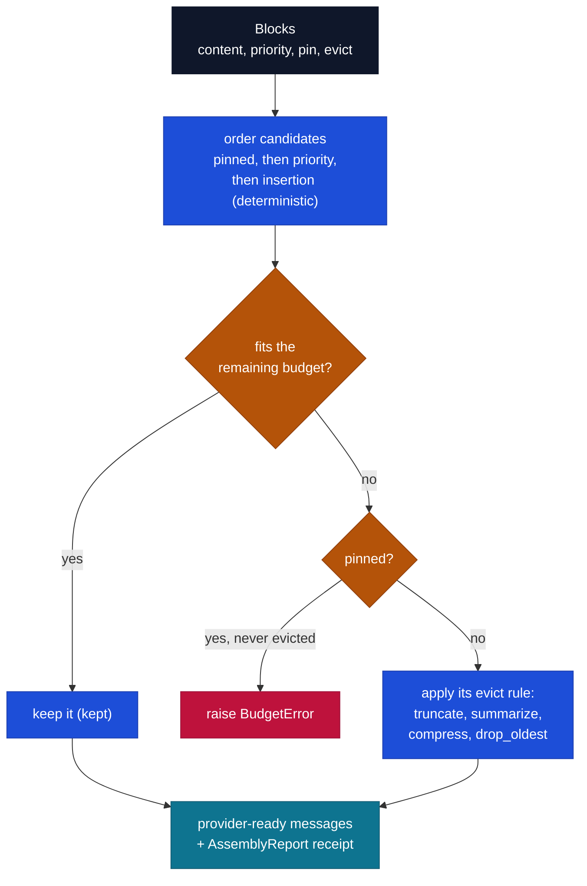

# `cendor-contextkit` — assemble

Treat the context window like a packed suitcase, not a string you concatenate. Declare `Block`s
with priorities and per-block eviction rules; `contextkit` fits them to a token budget,
deterministically, and gives you a **receipt** of exactly what it kept, shrank, and dropped.

```bash
pip install cendor-contextkit
pip install "cendor-contextkit[squeeze]"   # enable evict="compress"
```

## Highlights

- **Token-budgeted packing** — declare `Block`s with `priority` and `pin`; `assemble()` fits them into `budget_tokens` (minus `reserve_output`), deterministically. Pinned blocks are never evicted (raises `BudgetError` if they alone overflow).
- **Per-block eviction** — `drop_oldest` · `truncate` (keep head/tail, with a `…[truncated]` marker) · `summarize` (sync, or async via `aassemble()`) · `compress` (via squeeze) · or any custom `EvictionStrategy`.
- **Real chat-history** — `Block(messages=[…])` holds a conversation segment and peels the *oldest turns* to fit (a sliding window) — never mangling a turn.
- **An honest receipt** — `report()` returns kept / shrunk / dropped per block with token math, accurate at the **message level** (`used == core.tokens.count(assemble(), model)`).
- **Attention-aware ordering** — `order="default"` · `"attention"` (lost-in-the-middle) · `"cache"` (stable prefix for prompt-cache hits).
- **Provider adapters & multimodal** — `for_anthropic()` / `for_gemini()` / `for_bedrock()`; per-image budgeting via `image_tokens`; `whatif(budget)` previews a tighter budget; `use_compressor()` swaps the backend.

## Quickstart

```python
from cendor.contextkit import Context, Block

ctx = Context(budget_tokens=8000, model="claude-opus-4-8", reserve_output=1000, order="attention")
ctx.add(Block(system_prompt, priority=10, pin=True, role="system"))
ctx.add(Block(retrieved_docs, priority=5, evict="compress"))         # uses squeeze if installed
ctx.add(Block(messages=chat_history, priority=3, evict="drop_oldest"))  # peels OLDEST turns
ctx.add(Block(user_msg, priority=9, pin=True, role="user"))

messages = ctx.assemble()          # provider-ready messages, guaranteed within budget
print(ctx.report())                # the receipt: kept / truncated / dropped + token math
preview = ctx.whatif(budget_tokens=4000)   # same inputs, tighter budget, no commit
```

## Data types

```python
Block(content=None, priority=0, pin=False, evict="drop_oldest", role="user",
      summarizer=None, keep="head", messages=None)
#   content:  str | list of multimodal parts   (exactly one of content / messages)
#   messages: [{"role", "content"}, ...]        a conversation segment (chat history)
#   evict:    "drop_oldest" | "truncate" | "summarize" | "compress"
#             | any core.protocols.EvictionStrategy object
#   role:     "system" | "user" | "assistant" | "tool"   (per-turn for messages blocks)
#   keep:     "head" | "tail"   — which end evict="truncate" keeps

AssemblyReport(budget, used, reserved_output, model, decisions, order)
BlockDecision(role, action, tokens_before, tokens_after, note, handle)  # action: kept|truncated|summarized|compressed|dropped
# handle: the reversible squeeze Handle for a "compressed" block (else None) — handle.expand() restores the original
```

## The assembly algorithm



1. Token-count every block (via `core.tokens`, model-aware), **plus per-message framing** (the
   priming + per-message overhead a provider adds around each turn, self-calibrated from `core.tokens`).
2. Subtract `reserve_output` from the budget.
3. Order candidates: pinned first, then priority desc, then insertion order (stable → deterministic).
4. Greedily admit; when a block overflows, apply *its* `evict` strategy:
   - `drop_oldest` → for a single-message block, skip it (`dropped`); for a **`messages` block**, peel
     the oldest turns and keep the newest that fit (`truncated`, note `kept N of M turns`).
   - `truncate` → cut to the remaining budget, keeping `keep="head"`/`"tail"`, leaving a
     `…[truncated]` marker (`truncated`). For a `messages` block, peels oldest turns then tail-trims
     the surviving newest one.
   - `summarize` → call the block's `summarizer` to target size (`summarized`); falls back to
     truncate if none. Async summarizers run via `aassemble()`.
   - `compress` → shrink via `squeeze` (`compressed`); the reversible squeeze `Handle` is surfaced
     on the block's `BlockDecision.handle`, so `report()` callers can `handle.expand()` the original
     back, and compression is sized against the `Context`'s `model`. Falls back to truncate if
     `squeeze` isn't installed.
   - an `EvictionStrategy` **object** → call its `evict(content, remaining_tokens, model)`; `None`
     content drops the block, otherwise the returned text/action is recorded.
5. Pinned blocks are never evicted — assembly raises `BudgetError` if pinned blocks alone overflow.
6. Render in the chosen `order` and emit the `AssemblyReport` on `core`'s bus.

## Budget accuracy

`report().used` is the **message-level** token count of the assembled prompt — content *plus* the
per-message framing — so `report().used == core.tokens.count(assemble(), model)` for text content.
That makes "within budget" true of what you actually send, not just of the concatenated block text.
(Multimodal image budget is also charged into `used`, even though `core.tokens` can't see image
parts; budgeting is still best-effort to the tokenizer's accuracy — `reserve_output` gives headroom.)

## Chat history (`messages` blocks)

```python
ctx.add(Block(messages=[
    {"role": "user", "content": "..."},
    {"role": "assistant", "content": "..."},
    # ...most recent last...
], priority=3, evict="drop_oldest"))
```

A `messages` block is a contiguous conversation segment. When it overflows, `drop_oldest` keeps the
newest turns and peels the oldest (a sliding window of recent context) — it never mangles a turn.
History blocks render in the middle: after `system`, before the final user turn.

## Ordering

- `order="default"` — role-grouped: system → context/history → the user turn.
- `order="attention"` — *lost-in-the-middle*: highest-priority context rides the edges (just after
  system / just before the user turn), weakest in the dead center.
- `order="cache"` — stable prefix first (pinned, high-priority blocks lead) to maximize provider
  prompt-cache / KV-cache hits across calls.

## Provider adapters

`assemble()` returns OpenAI/Foundry-shaped messages. Convert for other providers:

```python
system, messages   = ctx.for_anthropic()   # Anthropic: system is separate
system, contents   = ctx.for_gemini()       # Gemini: contents w/ role user|model
system, messages   = ctx.for_bedrock()      # Bedrock Converse: system[] + content blocks
```

All three are multimodal-safe: text is extracted from multimodal `system` blocks, and Gemini/Bedrock
content is emitted as well-formed parts (`{"text": ...}` for text; other parts pass through). All
three also **coerce roles to what the target API accepts**: the Anthropic Messages API and Gemini
take only user/assistant(model), so a block with `role="tool"` (or any other role) is mapped to a
valid role rather than passed through — Anthropic would otherwise reject a raw `role="tool"`.

## Multimodal & async

- `Context(image_tokens=N)` charges `N` tokens per image part in multimodal (`list`) blocks;
  pass a callable `(part) -> int` instead for a resolution-aware estimate. Multimodal blocks are
  kept whole or dropped (not text-truncated).
- `await ctx.aassemble()` runs the same packing but awaits `async` `summarize` callbacks (e.g. an
  LLM summarizer). The sync `assemble()` truncates for async summarizers.

## Plugs in
**Inbound:** call `contextkit` *before* the model call to build the messages you send — it applies
whenever you assemble the prompt yourself. The `report()` decisions flow onto `core`'s stream, so
`acttrace` records what context the model actually saw.

## Notes
- Assembly is deterministic and offline (token counts use `core.tokens`); budgeting is best-effort
  to the tokenizer's accuracy — `reserve_output` gives you headroom.
- `evict="compress"` requires `cendor-contextkit[squeeze]`; otherwise it truncates with a note.
- **Pluggable compressor.** `evict="compress"` goes through core's `Compressor` *protocol*, not a
  hard import — squeeze is the default backend, but `use_compressor(backend)` swaps in any other
  (e.g. an adapter around an ML compressor) process-wide, and a per-`Context` `compressor=` argument
  overrides even that. contextkit never depends on a specific compressor. The `Context`'s `model` is
  forwarded to the compressor (so it sizes against your model, not a default); a legacy
  `(text, target_tokens)` callable that doesn't accept `model` still works, and the returned
  reversible `Handle` is exposed on `BlockDecision.handle`.
