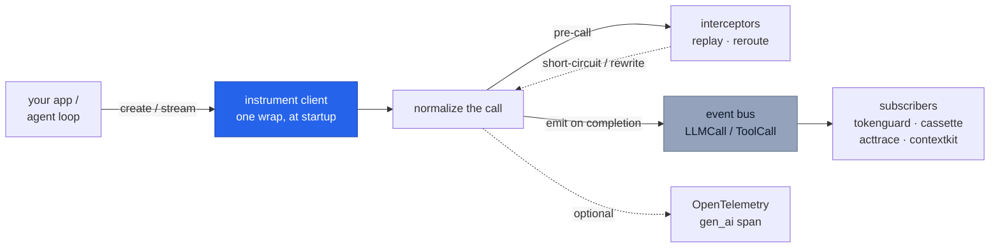

# `cendor-core` — the foundation

The shared vocabulary every other tool rides: one set of types, one tokenizer, one price
table, one instrumentation seam, one event bus. It's small and stable on purpose — it's the
dependency of the whole stack. You rarely install it directly; it arrives transitively.

```bash
pip install cendor-core                # or any tool that depends on it
pip install "cendor-core[tiktoken]"    # exact OpenAI token counts (optional)
```

## Quickstart

Everything below runs offline — token counting and pricing ship bundled, no key, no network:

```python
from cendor.core import tokens, prices

n = tokens.count([{"role": "user", "content": "Summarize this in 3 bullets."}], model="claude-opus-4-8")
cost = prices.estimate("claude-opus-4-8", input_tokens=n, output_tokens=200)
print(n, cost, tokens.method("claude-opus-4-8"))   # e.g. 13  0.005065 USD  bpe-estimate
```

> **See it in the stack.** The one-wrap-then-every-tool-subscribes flow is walked end to end
> in [Architecture](architecture.md) and the [Cookbook](/cookbook).

## Core concepts

### The `instrument()` seam
Wrap a provider client **once**, at startup. From then on `instrument()` intercepts each
call, normalizes it into an `LLMCall`, fills in usage/cost/latency, and publishes it on the
event bus — so every sibling tool observes the call by *subscribing*, never by patching the
client. It's idempotent (re-wrapping is a no-op) and additive (coexists with OpenLLMetry /
OpenInference).

### The event bus
`subscribe` / `emit`, synchronous and in-process. `emit` runs **every** subscriber even if
one raises — a logging subscriber's bug can't starve `tokenguard`'s enforcement. The first
`Exception` is re-raised after all have run (so intentional control flow like
`BudgetExceeded` still reaches the caller); `KeyboardInterrupt`/`SystemExit` propagate
immediately. It's thread-safe: the subscriber list is snapshotted under a lock, then the lock
is released *before* subscribers run, so a callback may safely (un)subscribe from any thread.

### Token counting, three tiers
`tokens.count()` is accurate-first and always offline-capable; `tokens.method(model)` tells
you which path is active:

| Tier | When | Accuracy |
|---|---|---|
| `exact` | `[tiktoken]` installed **and** a model-native OpenAI encoding exists | exact |
| `bpe-estimate` | `[tiktoken]` installed, non-native model (Claude/Gemini, or unknown OpenAI id) | close — real BPE (`o200k`), not native |
| `registered` | you plugged a counter in via `tokens.register(family, fn)` | as good as your counter |
| `heuristic` | no tokenizer installed | rough (~3–6 chars/token by content) |

Install `[tiktoken]` for accuracy, or `register()` a precise counter for a family.

### Prices: offline-first, refreshable
A dated `prices.json` ships in the wheel, so `estimate()` works with no network — the offline
default. Money is always `Decimal` (rates are parsed with `parse_float=Decimal`, so they never
round-trip through `float`). What a snapshot can't know is whether its rates are still current,
so `refresh()` pulls live rates and `age_days()`/`is_stale()` surface staleness.

Because `cached_tokens ⊆ input_tokens` (normalized across providers), `estimate()` bills the
cached portion **once** — `input_rate*(input − cached) + cached_rate*cached` — never at both
rates. A model with no published cached rate falls back to the input rate for cache reads (no
discount, no double charge).

### Cost provenance: reported vs estimated
When a response carries a real billed cost (e.g. a gateway's `usage.cost`), `instrument()`
prefers it and tags `metadata["cost_reported"] = True`; otherwise it prices from the snapshot
and tags `metadata["cost_estimated"] = True`. So a downstream tool or audit can always tell a
real figure from an estimate (an unknown model with no reported cost leaves `cost = None`).

### Interceptors (replay / reroute)
`add_interceptor(fn)` registers a pre-call hook that can return a response to short-circuit
the call (replay — used by `cassette`), a `Reroute(model=…)` to rewrite the request before it
runs (downgrade — used by `tokenguard`), or `MISS` to proceed untouched. One seam powers both,
so there's never a second patch point.

### OpenTelemetry (optional)
`otel.span(...)` emits a GenAI `gen_ai.*` span when OpenTelemetry is installed, else it's a
no-op. `otel.ingest(attrs)` turns a managed runtime's `gen_ai.*` span attributes into a bus
event — with **no** OpenTelemetry dependency required — so `tokenguard`/`acttrace` work even
when a runtime owns the call loop.

## Functions & classes

### `instrument()` / `instrument_tool()`
```python
client = instrument(openai_client)     # OpenAI · Anthropic · Bedrock · Gemini · Ollama

@instrument_tool("search")             # wrap a tool so ToolCall events join the stream
def search(q): ...
```
Detects the client by **shape** (not model name, so new models work the day they ship), wraps
its call entrypoint(s), runs the real call (sync, async, **and streaming**), fills
`usage`/`cost`/`latency`, and emits an `LLMCall`. Idempotent and additive; an unrecognized
client is returned untouched. See [Providers](providers.md) for the exact entrypoints wrapped
per provider and the [streaming](#streaming) note below.

### `tokens`
| Call | Returns | What it does |
|---|---|---|
| `tokens.count(text_or_messages, model)` | `int` | Count tokens for a string or a chat-message list. |
| `tokens.method(model)` | `str` | Which tier is active: `exact`/`bpe-estimate`/`registered`/`heuristic`. |
| `tokens.family(model)` | `str` | `"openai"` \| `"anthropic"` \| `"google"` \| `"default"`. |
| `tokens.register(family, fn)` | — | Plug a precise counter in for a family. |

### `prices`
```python
prices.estimate("gpt-4o", input_tokens=1000, output_tokens=300, cached_tokens=200)  # -> Money
prices.refresh(source="litellm")       # or "openrouter" | "azure" | a static-JSON URL
```

| Call | Returns | What it does |
|---|---|---|
| `estimate(model, input_tokens=, output_tokens=, cached_tokens=)` | `Money` | Price a call from the active table (Decimal, never float). |
| `refresh(source=… \| url \| url, mapper=)` | — | Pull live rates from a no-auth JSON source; falls back silently to the last-good table. |
| `models()` · `snapshot_date()` · `source()` | — | Introspect the active table. |
| `age_days()` · `is_stale(max_age_days=30)` | — | Freshness signals. |
| `source_name()` · `source_url()` | — | Provenance of the active rates. |

`refresh()` fetches a **static** resource over http(s) only (it rejects `file://` and other
schemes), maps it to our schema **in memory** (nothing persisted), and normalizes source ids
to bare keys (`openai/gpt-4o` → `gpt-4o`). See [Providers → Live pricing](providers.md#live-pricing)
for which sources expose rates.

### `bus`
```python
bus.subscribe(fn)     # idempotent; fn receives each emitted LLMCall / ToolCall
bus.unsubscribe(fn)   # no error if absent
bus.emit(event)       # synchronous dispatch to all subscribers
```

### `otel`
```python
with otel.span("gpt-4o", provider="openai"):   # gen_ai.* span if OTel installed, else no-op
    ...
otel.ingest({"gen_ai.system": "azure_ai_foundry", "gen_ai.request.model": "gpt-4o",
             "gen_ai.usage.input_tokens": 1000, "gen_ai.usage.output_tokens": 500})  # -> bus event
```

### Types
```python
from cendor.core.types import LLMCall, ToolCall, Usage, Money

Usage(input_tokens=1200, output_tokens=300, cached_tokens=0, reasoning_tokens=0, cache_write=0)  # frozen
Money(0.0135)   # Decimal-backed; +, -, *, comparisons; Money.zero()
```
- `LLMCall` (`id`, `provider`, `model`, `messages`, `usage`, `cost`, `latency_ms`, `trace_id`,
  `ts`, `metadata`) is the normalized record emitted for every call.
- In `Usage`, `cached_tokens ⊆ input_tokens` and `reasoning_tokens ⊆ output_tokens` (breakdowns,
  not added to the total). `cache_write` (Anthropic `cache_creation`) is a **separate** billed
  category (~1.25× input), not in the total.

### Modules & protocols
| Module | Responsibility |
|---|---|
| `types` | `LLMCall`, `ToolCall`, `Usage`, `Money` — the canonical schema |
| `tokens` | Provider-aware token counting + a tokenizer registry |
| `prices` | Bundled price snapshot + `estimate()` + optional `refresh()` |
| `instrument` | Wrap a client/tool once; emit normalized events (+ record/replay hooks) |
| `bus` | In-process, idempotent pub/sub |
| `otel` | GenAI span emitter + `ingest()` for managed-runtime spans |
| `protocols` | `Compressor`, `EvictionStrategy`, `Sink`, `Subscriber`, `Handle` (structural) |

The `protocols` are `typing.Protocol`s — a library satisfies one by *shape*, no import or base
class. That's how `squeeze` is a `Compressor` for `contextkit` without either importing the
other.

## How it works



<a id="streaming"></a>
**Streaming.** With `stream=True`, the chunk iterator is passed through to your caller
unchanged while `instrument()` accumulates usage in the background, emitting the `LLMCall`
**once, when the stream completes** (or is closed early) — with true end-to-end latency. Usage
is read from the provider's own stream reporting where present; when a provider streams no
usage, it falls back to an offline estimate flagged `metadata["usage_estimated"] = True`.
Streamed calls carry `metadata["streamed"] = True`, and the collected chunks are attached at
`metadata["response"]` so `cassette` can record them.

## Plugs into the stack

`core` *is* the seam. Every other tool cooperates through it and nothing else: tools subscribe
to the bus, satisfy a `protocols` type by shape, or register an interceptor — they never import
one another. That's what keeps `core` the whole stack's small, stable blast radius.

## Honest limits

- **Token counts are best-effort** across providers — install `[tiktoken]` for exact OpenAI
  counts or `register()` a precise counter. Money is always exact (`Decimal`).
- **Capture is best-effort, not a billing guarantee.** A call that *raises* before returning
  emits no `usage`/`cost`; a streamed response whose provider reports no usage is priced from
  an offline estimate (flagged `usage_estimated`). Bedrock's separate `converse_stream`
  entrypoint isn't wrapped — use `converse`.
- **`refresh()` never reaches a running service or needs an account** — it fetches static JSON
  over http(s), maps it in memory, and falls back to the bundled snapshot. AWS/GCP catalogs
  need credentials/SDKs and are intentionally out of core (bring your own `mapper=`).
- Provider SDKs and OpenTelemetry are **optional extras** (`[openai]`, `[anthropic]`, `[otel]`,
  `[tiktoken]`) — never hard dependencies.
