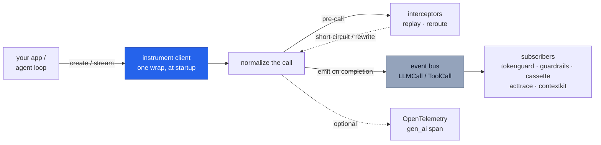

# `cendor-core` — the foundation

The shared vocabulary every other tool rides: one set of types, one tokenizer, one price
table, one instrumentation seam, one event bus. It's small and stable on purpose — it's the
dependency of the whole stack. You rarely install it directly; it arrives transitively.

<!-- tabs: lang -->
<!-- tab: Python -->

```bash
pip install cendor-core                # exact token counts by default — tiktoken ships with it
```

<!-- tab: TypeScript -->

```bash
npm i @cendor/core                     # or any tool that depends on it
# token counting via js-tiktoken is bundled — exact counts match Python
```

<!-- /tabs -->

## Quickstart

Everything below runs offline — token counting and pricing ship bundled, no key, no network:

<!-- tabs: lang -->
<!-- tab: Python -->

```python
from cendor.core import tokens, prices

n = tokens.count([{"role": "user", "content": "Summarize this in 3 bullets."}], model="claude-opus-4-8")
cost = prices.estimate("claude-opus-4-8", input_tokens=n, output_tokens=200)
print(n, cost, tokens.method("claude-opus-4-8"))   # e.g. 16  0.00508000 USD  bpe-estimate
```

<!-- tab: TypeScript -->

```ts
import { tokens, prices } from '@cendor/core';

const n = tokens.count([{ role: 'user', content: 'Summarize this in 3 bullets.' }], 'claude-opus-4-8');
const cost = prices.estimate('claude-opus-4-8', n, { outputTokens: 200 });
console.log(n, cost.toString(), tokens.method('claude-opus-4-8'));  // e.g. 16  0.00508000 USD  bpe-estimate
```

<!-- /tabs -->

> **See it in the stack.** The one-wrap-then-every-tool-subscribes flow is walked end to end
> in [Architecture](architecture.md) and the [Cookbook](https://cendor.ai/cookbook).

## Core concepts

### The `instrument()` seam
Wrap a provider client **once**, at startup. From then on `instrument()` intercepts each
call, normalizes it into an `LLMCall`, fills in usage/cost/latency, and publishes it on the
event bus — so every sibling tool observes the call by *subscribing*, never by patching the
client. It's idempotent (re-wrapping is a no-op) and additive (coexists with OpenLLMetry /
OpenInference).

### The event bus
`subscribe` / `emit`, synchronous and in-process. `emit` runs **every** subscriber even if
one raises — a logging subscriber's bug can't starve `tokenguard`'s enforcement. The first
`Exception` is re-raised after all have run (so intentional control flow like
`BudgetExceeded` still reaches the caller); `KeyboardInterrupt`/`SystemExit` propagate
immediately. It's thread-safe: the subscriber list is snapshotted under a lock, then the lock
is released *before* subscribers run, so a callback may safely (un)subscribe from any thread.

### Token counting, three tiers
`tokens.count()` is accurate-first and always offline-capable; `tokens.method(model)` tells
you which path is active:

| Tier | When | Accuracy |
|---|---|---|
| `exact` | a model-native OpenAI encoding exists in `tiktoken` (gpt-4o / gpt-4.1 / o-series / earlier — the default; `tiktoken` ships with `cendor-core`); OpenAI fine-tunes (`ft:gpt-4o:…`) map to their base model | exact |
| `bpe-estimate` | any non-native model — Claude/Gemini **and** open/hosted weights (llama, mistral, deepseek, qwen), **the gpt-5.x line** (no upstream `tiktoken` mapping yet — this tier upgrades to `exact` automatically when tiktoken ships one), new o-series ids, unknown OpenAI ids | close — real BPE (`o200k`), not native |
| `registered` | you plugged a counter in via `tokens.register(family, fn)` | as good as your counter |
| `heuristic` | `tiktoken` failed to import (a broken/partial install) — a defensive fallback, never the default | rough (~3–6 chars/token by content) |

Exact counting is the default (`tiktoken` is a required dependency), because truthful token counts
are the product. `register()` a precise counter to override a family.

### Prices: offline-first, refreshable
A dated `prices.json` ships in the wheel, so `estimate()` works with no network — the offline
default. Money is always `Decimal` (rates are parsed with `parse_float=Decimal`, so they never
round-trip through `float`). What a snapshot can't know is whether its rates are still current,
so `refresh()` pulls live rates and `age_days()`/`is_stale()` surface staleness.

Because `cached_tokens ⊆ input_tokens` (normalized across providers), `estimate()` bills the
cached portion **once** — `input_rate*(input − cached) + cached_rate*cached` — never at both
rates. A model with no published cached rate falls back to the input rate for cache reads (no
discount, no double charge).

### Cost provenance: reported vs estimated
When a response carries a real billed cost (e.g. a gateway's `usage.cost`), `instrument()`
prefers it and tags `metadata["cost_reported"] = True`; otherwise it prices from the snapshot
and tags `metadata["cost_estimated"] = True`. So a downstream tool or audit can always tell a
real figure from an estimate (an unknown model with no reported cost leaves `cost = None`).

### Interceptors (replay / reroute)
`add_interceptor(fn)` registers a pre-call hook that can return a response to short-circuit
the call (replay — used by `cassette`), a `Reroute(…)` to rewrite the request before it runs, or
`MISS` to proceed untouched. One seam powers all three, so there's never a second patch point.

`Reroute(**updates)` applies its keyword updates to the outgoing call's kwargs before it
executes. Two keys are special-cased so the emitted `LLMCall` stays consistent with what is
actually sent, and so a rewrite works across providers:

- `Reroute(model=…)` also updates `call.model` — the downgrade `tokenguard` uses for
  `on_exceed="downgrade"`.
- `Reroute(messages=…)` rewrites the outbound messages — mapped to the provider's own kwarg
  (`messages` for Chat Completions / Anthropic / Bedrock / Ollama, `input` for the OpenAI
  Responses API, `contents` for Gemini) — and updates `call.messages`. This is how `acttrace`'s
  `guard()` does **redact-before-send**: the scrubbed messages, not the originals, reach the
  provider. Applies uniformly to sync, async, and streaming calls (the rewrite happens before the
  real call runs).

### Ambient metadata providers
Run context — *which* agent, *which* conversation, *which* audit decision — has to be captured at the
one moment it is unconditionally correct: when the event is **constructed**, in the caller's own
synchronous frame, before interceptors run. Reading it later (at bus-delivery time) breaks whenever a
stream is finalized outside the scope that launched it, a context-losing layer sits in between,
subscriber order shuffles, or two runs interleave. `trace_id` has always been stamped there;
`add_ambient_provider(fn)` generalizes that seam to everything else.

A provider is a `(event) -> metadata | None` (TS `(event) => metadata | undefined`) callable, run
over every freshly built `LLMCall` / `ToolCall`. Its returned keys are merged onto `event.metadata`
in **registration order**, and it **never overwrites** a key already present. The contract is strict:
a provider **must never raise** (an exception is swallowed so a broken provider can't break capture),
and with nothing registered there is a **zero-provider fast path** (a single length check — the
standalone-libs byte-identity and the benchmark hold). The event is passed read-only, so a provider
that needs to attach a non-serializable value keys a `WeakKeyDictionary` / `WeakMap` off it instead of
returning it.

Core stays **generic**: it merges opaque metadata and learns no SDK vocabulary — what `agent` or
`conversation_id` *means* lives entirely in the library that registers the provider (the SDK, or the
[LangChain handler](#frameworks-langchain--langgraph)). This is how a libs-only app can surface
`gen_ai.agent.name` on its spans without the SDK: register a provider that returns `{"agent": …}` and
core's span emitter maps `metadata["agent"]` → `gen_ai.agent.name`. The reserved keys
(`agent` / `conversation_id` / `decision_id`, plus one private cassette session key) are pinned in the
[bus-events spec](https://github.com/cendorhq/cendor-libs/tree/main/docs/specs/bus-events.md).

### OpenTelemetry (optional)
`otel.span(...)` emits a GenAI `gen_ai.*` span when OpenTelemetry is installed, else it's a
no-op. `otel.ingest(attrs)` turns a managed runtime's `gen_ai.*` span attributes into a bus
event — with **no** OpenTelemetry dependency required — so `tokenguard`/`acttrace` work even
when a runtime owns the call loop.

## Functions & classes

### `instrument()` / `instrument_tool()`

<!-- tabs: lang -->
<!-- tab: Python -->

```python
client = instrument(openai_client)     # OpenAI · Anthropic · Hugging Face · Gemini · Bedrock · Ollama

@instrument_tool("search")             # wrap a tool so ToolCall events join the stream
def search(q): ...
```

<!-- tab: TypeScript -->

```ts
import { instrument, instrumentTool } from '@cendor/core';

const client = instrument(new OpenAI());       // OpenAI · Anthropic · Hugging Face · Gemini · Bedrock · Ollama

const search = instrumentTool('search')(       // wrap a tool so ToolCall events join the stream
  (q) => { /* ... */ });
```

<!-- /tabs -->
Detects the client by **shape** (not model name, so new models work the day they ship), wraps
its call entrypoint(s), runs the real call (sync, async, **and streaming**), fills
`usage`/`cost`/`latency`, and emits an `LLMCall`. Idempotent and additive; an unrecognized
client is returned untouched. See [Providers](providers.md) for the exact entrypoints wrapped
per provider and the [streaming](#streaming) note below.

### `tokens`
| Call | Returns | What it does |
|---|---|---|
| `tokens.count(text_or_messages, model)` | `int` | Count tokens for a string or a chat-message list. |
| `tokens.method(model)` | `str` | Which tier is active: `exact`/`bpe-estimate`/`registered`/`heuristic`. |
| `tokens.family(model)` | `str` | `"openai"` \| `"anthropic"` \| `"google"` \| `"default"`. |
| `tokens.register(family, fn)` | — | Plug a precise counter in for a family. |

### `prices`

<!-- tabs: lang -->
<!-- tab: Python -->

```python
prices.estimate("gpt-4o", input_tokens=1000, output_tokens=300, cached_tokens=200)  # -> Money
prices.refresh(source="litellm")       # or "openrouter" | "azure" | a static-JSON URL
```

<!-- tab: TypeScript -->

```ts
prices.estimate('gpt-4o', 1000, { outputTokens: 300, cachedTokens: 200 });  // -> Money
await prices.refresh(undefined, { source: 'litellm' });  // or 'openrouter' | 'azure' | a URL
```

<!-- /tabs -->

| Call | Returns | What it does |
|---|---|---|
| `estimate(model, input_tokens=, output_tokens=, cached_tokens=)` | `Money` | Price a call from the active table (Decimal, never float). |
| `refresh(source=… \| url \| url, mapper=)` | — | Pull live rates from a no-auth JSON source; falls back silently to the last-good table. |
| `models()` · `snapshot_date()` · `source()` | — | Introspect the active table. |
| `age_days()` · `is_stale(max_age_days=30)` | — | Freshness signals. |
| `source_name()` · `source_url()` | — | Provenance of the active rates. |

`refresh()` fetches a **static** resource over http(s) only (it rejects `file://` and other
schemes), maps it to our schema **in memory** (nothing persisted), and normalizes source ids
to bare keys (`openai/gpt-4o` → `gpt-4o`). See [Providers → Live pricing](providers.md#live-pricing)
for which sources expose rates. Programmatic price registrations (TS `prices.register`; in Python
the SDK's `register_model_price` writes through core's contractual hook) **survive `refresh()`**
since 1.6.0 / 0.6.0 — they are re-applied after every table swap.

### `bus`

<!-- tabs: lang -->
<!-- tab: Python -->

```python
bus.subscribe(fn)     # idempotent; fn receives each emitted LLMCall / ToolCall
bus.unsubscribe(fn)   # no error if absent
bus.emit(event)       # synchronous dispatch to all subscribers
```

<!-- tab: TypeScript -->

```ts
import { bus } from '@cendor/core';

bus.subscribe(fn);    // idempotent; fn receives each emitted LLMCall / ToolCall
bus.unsubscribe(fn);  // no error if absent
bus.emit(event);      // synchronous dispatch to all subscribers
```

<!-- /tabs -->

### `add_ambient_provider()` / `remove_ambient_provider()`

Register a callable that stamps run-scoped metadata onto every `LLMCall` / `ToolCall` **at event
construction** (before interceptors, in the caller's synchronous frame) — the seam described in
[Ambient metadata providers](#ambient-metadata-providers) above.

<!-- tabs: lang -->
<!-- tab: Python -->

```python
from cendor.core import add_ambient_provider, remove_ambient_provider

# stamp run context onto every event as it is constructed (never overwrites an existing key):
provider = add_ambient_provider(lambda event: {"agent": "reviewer", "tenant": "acme"})
remove_ambient_provider(provider)     # add_ambient_provider returns the fn, so you can unregister it
```

<!-- tab: TypeScript -->

```ts
import { addAmbientProvider, removeAmbientProvider } from '@cendor/core';

// stamp run context onto every event as it is constructed (never overwrites an existing key):
const provider = addAmbientProvider(() => ({ agent: 'reviewer', tenant: 'acme' }));
removeAmbientProvider(provider);      // addAmbientProvider returns the fn, so you can unregister it
```

<!-- /tabs -->

| Call | Returns | What it does |
|---|---|---|
| `add_ambient_provider(fn)` | the `fn` | Register a provider `(event) -> dict \| None` run at every event's construction (idempotent). |
| `remove_ambient_provider(fn)` | — | Unregister a provider (no error if absent). |

The provider **must never raise** (exceptions are swallowed) and merges in **registration order**
without overwriting existing keys; zero providers is a single-length-check fast path. Core stays
generic — it merges opaque metadata and defines no key meanings (the reserved names live in the
[bus-events spec](https://github.com/cendorhq/cendor-libs/tree/main/docs/specs/bus-events.md)).

### `otel`

<!-- tabs: lang -->
<!-- tab: Python -->

```python
with otel.span("gpt-4o", provider="openai"):   # gen_ai.* span if OTel installed, else no-op
    ...
otel.ingest({"gen_ai.system": "azure_ai_foundry", "gen_ai.request.model": "gpt-4o",
             "gen_ai.usage.input_tokens": 1000, "gen_ai.usage.output_tokens": 500})  # -> bus event
```

<!-- tab: TypeScript -->

```ts
import { otel } from '@cendor/core';

otel.span('gpt-4o', { provider: 'openai' }, (span) => {   // gen_ai.* span if OTel installed, else no-op
  // ... your model call; `span` is null when @opentelemetry/api isn't installed
});
otel.ingest({ 'gen_ai.system': 'azure_ai_foundry', 'gen_ai.request.model': 'gpt-4o',
              'gen_ai.usage.input_tokens': 1000, 'gen_ai.usage.output_tokens': 500 });  // -> bus event
```

<!-- /tabs -->

### Types

<!-- tabs: lang -->
<!-- tab: Python -->

```python
from cendor.core.types import LLMCall, ToolCall, Usage, Money

Usage(input_tokens=1200, output_tokens=300, cached_tokens=0, reasoning_tokens=0, cache_write=0)  # frozen
Money(0.0135)   # Decimal-backed; +, -, *, comparisons; Money.zero()
```

<!-- tab: TypeScript -->

```ts
import { LLMCall, ToolCall, Usage, Money } from '@cendor/core';

new Usage({ inputTokens: 1200, outputTokens: 300, cachedTokens: 0, reasoningTokens: 0, cacheWrite: 0 });
new Money(0.0135);   // decimal.js-backed; value-equal with Python's Decimal; Money.zero()
```

<!-- /tabs -->
- `LLMCall` (`id`, `provider`, `model`, `messages`, `usage`, `cost`, `latency_ms`, `trace_id`,
  `ts`, `metadata`) is the normalized record emitted for every call.
- In `Usage`, `cached_tokens ⊆ input_tokens` and `reasoning_tokens ⊆ output_tokens` (breakdowns,
  not added to the total). `cache_write` (Anthropic `cache_creation`) is a **separate** billed
  category (~1.25× input), not in the total.
- **Aggregate usage with core, not by hand** (since 1.6.0 / 0.6.0): `Usage` supports `+` /
  `sum(...)` and `sum_usage(iterable)` in Python, `sumUsage(usages)` in TS (next to `sumMoney`).
  The sum is **field-complete by construction** — it iterates the instance's own fields, so a
  future `Usage` field can never silently vanish from an aggregate.

### Modules & protocols
| Module | Responsibility |
|---|---|
| `types` | `LLMCall`, `ToolCall`, `Usage`, `Money` — the canonical schema |
| `tokens` | Provider-aware token counting + a tokenizer registry |
| `prices` | Bundled price snapshot + `estimate()` + optional `refresh()` |
| `instrument` | Wrap a client/tool once; emit normalized events (+ record/replay hooks) |
| `bus` | In-process, idempotent pub/sub |
| `ambient` | `add_ambient_provider()` / `remove_ambient_provider()` — stamp run-scoped metadata at event construction |
| `otel` | GenAI span emitter + `ingest()` for managed-runtime spans |
| `protocols` | `Compressor`, `EvictionStrategy`, `Sink`, `Subscriber`, `Handle` (structural) |

The `protocols` are `typing.Protocol`s — a library satisfies one by *shape*, no import or base
class. That's how `squeeze` is a `Compressor` for `contextkit` without either importing the
other.

**`Sink` lifecycle (optional).** `write(entry)` is the only required method — `isinstance(obj,
Sink)` matches any write-only sink. A sink **may** also implement two optional lifecycle methods,
which callers invoke via `hasattr`/`getattr` guards: `flush()` (block until buffered records are
durably written) and `close()` (flush, then release resources). These are additive — write-only
sinks stay valid. [`tokenguard.sinks.QueueSink`](tokenguard.md#queuesink--low-latency-durable-logging)
implements both to move durable I/O **off the model call's hot path**: the bus runs subscribers
inline, so wrapping a SQLite/OTel/file sink in a `QueueSink` keeps its I/O latency out of every
call. `QueueSink(SQLiteSink(path))` — enqueue-and-return, drain on a background thread in order,
`flush()`/`close()` for durability at shutdown.

## How it works



<a id="streaming"></a>
**Streaming.** With `stream=True`, the streamed value is passed through to your caller
unchanged while `instrument()` accumulates usage in the background, emitting the `LLMCall`
**once, when the stream completes** (or is closed early) — with true end-to-end latency. Usage
is read from the provider's own stream reporting where present; when a provider streams no
usage, it falls back to an offline estimate flagged `metadata["usage_estimated"] = True`.
Streamed calls carry `metadata["streamed"] = True`, and the collected chunks are attached at
`metadata["response"]` so `cassette` can record them.

The streamed value is **both an iterator and a context manager** — exactly like the provider
SDK's own stream object — so both usage forms work and finalize (emit) exactly once:

<!-- tabs: lang -->
<!-- tab: Python -->

```python
stream = client.chat.completions.create(model="gpt-4o", messages=msgs, stream=True)
for chunk in stream:            # iterate…
    ...

with client.chat.completions.create(model="gpt-4o", messages=msgs, stream=True) as stream:
    for chunk in stream:        # …or use it as a context manager (what LangChain does)
        ...
# async: `async for chunk in stream` and `async with … as stream:` likewise
```

<!-- tab: TypeScript -->

```ts
const stream = await client.chat.completions.create({ model: 'gpt-4o', messages: msgs, stream: true });
for await (const chunk of stream) {
  // ... usage accumulates in the background;
}    // the LLMCall is emitted once the stream completes (or is closed early)
```

<!-- /tabs -->

This context-manager surface is required by frameworks such as `langchain_openai`, which consume
a streamed completion via `with client…create(stream=True) as response:`. Unknown attributes
(`.response`, `.close()`, …) are forwarded to the underlying SDK stream, and closing early
(`stream.close()` / block exit) finalizes the `LLMCall` once. Replayed streams (via `cassette`)
carry the same iterator + context-manager surface.

<a id="trace-id-correlation"></a>
**Run correlation (`trace()`).** Every `LLMCall`/`ToolCall` carries a `trace_id` (default `""`).
Set an ambient one with `with core.trace("run-id"):` to group a unit of work — a direct-SDK agent
loop, a request — so its calls share an id downstream (`acttrace`, your own subscribers). It's a
`contextvars` binding (nests, works across sync/async); `core.current_trace_id()` reads it.

<!-- tabs: lang -->
<!-- tab: Python -->

```python
from cendor.core import trace
with trace("session-42"):
    client.chat.completions.create(...)      # emitted LLMCall.trace_id == "session-42"
```

<!-- tab: TypeScript -->

```ts
import { trace } from '@cendor/core';
await trace('session-42', () =>
  client.chat.completions.create({ /* ... */ }));  // emitted LLMCall.traceId === 'session-42'
```

<!-- /tabs -->

This is a **hook, not an orchestrator** (see [architecture.md](architecture.md)): cendor stamps the
id you set, it never invents a run graph. The LangChain/LangGraph callback path
([providers.md](providers.md#frameworks-langchain--langgraph)) derives the same `trace_id`
automatically from the framework's run tree.

**Frameworks (LangChain / LangGraph).** For frameworks, the SDK-aligned integration point is the
framework's **callback system**, not client wrapping. `cendor.core.langchain.CendorCallbackHandler`
(optional extra `cendor-core[langchain]`) records usage + reasoning + tools + run-correlated
`trace_id` with no client touch — **recording-only**. See
[providers.md → Frameworks](providers.md#frameworks-langchain--langgraph).

## Plugs into the stack

`core` *is* the seam. Every other tool cooperates through it and nothing else: tools subscribe
to the bus, satisfy a `protocols` type by shape, or register an interceptor — they never import
one another. That's what keeps `core` the whole stack's small, stable blast radius.

**See it live.** core's `otel` span emitter — and the libs-only `use_span_emitter()` bus→span bridge
— is exactly the standard wire [Cendor Monitor](monitor.md) reads. Cendor's optional self-hosted
monitor renders it directly; the same wire also flows to your own OTel backend (the production
default).

## Honest limits

- **Token counts are exact for the OpenAI families `tiktoken` maps** (gpt-4o, gpt-4.1, the
  o-series, and earlier) — `tiktoken` is a required dependency, so a normal install counts those
  exactly (no opt-in). **The gpt-5.x line has no upstream `tiktoken` mapping yet**, so gpt-5.x ids
  count via the `o200k` BPE proxy (`tokens.method()` reports `bpe-estimate`, and upgrades to
  `exact` automatically once tiktoken ships a mapping). Claude/Gemini use the same `o200k` proxy
  (not their native tokenizer) — note Anthropic states its newest models (Opus 4.7+, Fable 5,
  Mythos 5, Sonnet 5) use a new tokenizer producing **~30% more tokens** for the same text, so the
  proxy systematically under-counts for that family. `register()` a precise counter to override
  any family. Money is always exact (`Decimal`).
- **Capture is best-effort, not a billing guarantee.** A call that *raises* before returning
  emits no `usage`/`cost`; a streamed response whose provider reports no usage is priced from
  an offline estimate (flagged `usage_estimated`). Bedrock's separate `converse_stream`
  entrypoint isn't wrapped — use `converse`.
- **Some provider entrypoints bypass `instrument()` entirely (silent — no bus event):** OpenAI's
  structured-output helpers `chat.completions.parse` / `responses.parse`, Anthropic's
  `messages.stream()` helper and `tool_runner`, and the Batch APIs are **not wrapped** — calls
  through them never reach the bus, so budgets/audit/tests don't see them. Call the wrapped
  entrypoints (`chat.completions.create`, `responses.create`, `messages.create`, or Anthropic
  `messages.create(stream=True)`) when you need governed calls. (Since 1.6.0 / 0.6.0,
  openai-shaped `embeddings.create` **is** wrapped — embedding calls emit an `LLMCall` with
  `metadata["embedding"] = True`, pre-flight budgets/guards apply, and the snapshot prices the
  `text-embedding-*` ids; embeddings on non-openai-shaped clients remain uncaptured.)
- **`refresh()` never reaches a running service or needs an account** — it fetches static JSON
  over http(s), maps it in memory, and falls back to the bundled snapshot. AWS/GCP catalogs
  need credentials/SDKs and are intentionally out of core (bring your own `mapper=`).
- Provider SDKs and OpenTelemetry are **optional extras** (`[openai]`, `[anthropic]`, `[otel]`) —
  never hard dependencies. `tiktoken`, by contrast, **is** a required dependency: exact token
  counts are not optional. (It is fully offline — no network or account — so this keeps the
  local-first guarantee.)
