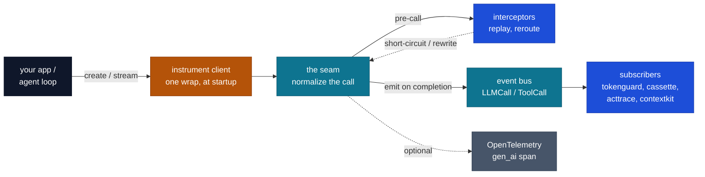

# `cendor-core` — the foundation

The shared vocabulary for the whole stack: one set of types, one tokenizer, one price table, one
instrumentation point, one event bus, one OpenTelemetry emitter. It's small and stable on purpose —
it's the dependency of every other tool. You rarely install it directly; it arrives transitively.

```bash
pip install cendor-core            # or any tool that depends on it
pip install "cendor-core[tiktoken]"  # exact OpenAI token counts (optional)
```

## Highlights

- **`instrument()`** — wrap any client once: **OpenAI · Anthropic · AWS Bedrock · Google Gemini · Ollama**, detected by *shape* (so new models work the day they ship); sync, async, **and streaming**; idempotent + additive. `instrument_tool()` does the same for tools.
- **Event bus** — `subscribe` / `emit`; **thread-safe within a process**; one failing subscriber never starves another (the first exception re-raises after all run).
- **Interceptor seam** — `add_interceptor` + `Reroute` / `MISS` powers replay (cassette) and reroute / block (tokenguard) **without a second patch point**.
- **Token counting, three tiers** — exact (`[tiktoken]`) / BPE-estimate (o200k for Claude/Gemini) / offline heuristic; `tokens.method(model)` reports which is active; `tokens.register()` plugs in a precise counter.
- **Offline-first, refreshable prices** — bundled dated snapshot; `estimate() -> Decimal Money` (never `float`); optional `refresh(source="litellm"|"openrouter"|"azure")` from live no-auth sources, with `age_days()`/`is_stale()` staleness signals. A provider-reported cost (e.g. a gateway's `usage.cost`) is preferred over the estimate and labeled `cost_reported` vs `cost_estimated`.
- **OpenTelemetry** — emit `gen_ai.*` spans, or `otel.ingest()` a managed runtime's spans onto the bus.
- **Structural protocols** — `Compressor`, `EvictionStrategy`, `Sink`, `Subscriber`, `Handle`.

## Modules

| Module | Responsibility |
|---|---|
| `types` | `LLMCall`, `ToolCall`, `Usage`, `Money` — the canonical schema |
| `tokens` | Provider-aware token counting + a tokenizer registry |
| `prices` | Bundled price snapshot + `estimate()` + optional `refresh()` |
| `instrument` | Wrap a client/tool once; emit normalized events (+ record/replay hooks) |
| `bus` | In-process, idempotent pub/sub: `subscribe()` / `emit()` |
| `otel` | GenAI `gen_ai.*` span emitter + `ingest()` for managed-runtime spans |
| `protocols` | `Compressor`, `EvictionStrategy`, `Sink`, `Subscriber`, `Handle` (structural) |

## How the pieces connect

Wrap the client once at the seam; every call is normalized and published on the bus, and each
sibling tool *subscribes* — it never patches the client and never imports another tool.



## Types

```python
from cendor.core.types import LLMCall, ToolCall, Usage, Money

Usage(input_tokens=1200, output_tokens=300, cached_tokens=0, reasoning_tokens=0, cache_write=0)  # frozen
# cached_tokens ⊆ input_tokens and reasoning_tokens ⊆ output_tokens (breakdowns, not added to total)
# cache_write (Anthropic cache_creation) is a SEPARATE billed category (~1.25× input), not in the total
Money(0.0135)                  # Decimal-backed; never float. +, -, *, comparisons; Money.zero()
```

`LLMCall` (`id`, `provider`, `model`, `messages`, `usage`, `cost`, `latency_ms`, `trace_id`, `ts`,
`metadata`) is the normalized record emitted on the bus for every call.

## Token counting

```python
from cendor.core import tokens

tokens.count("hello world", model="gpt-4o")                      # text
tokens.count([{"role": "user", "content": "hi"}], model="claude-opus-4-8")   # chat messages
tokens.family("gemini-1.5-pro")        # "openai" | "anthropic" | "google" | "default"
tokens.register("default", my_counter) # plug in a precise tokenizer for a family
```

Accurate-first, always offline-capable. With the `[tiktoken]` extra installed, **OpenAI is exact**
and **Claude/Gemini use tiktoken's `o200k` BPE as a close estimate** (a real tokenizer, far better
than a character count, though not the native one). With no tokenizer installed, a character/subword
heuristic is the fallback — rough by nature (modern tokenizers run ~3–6 chars/token by content), so
install `[tiktoken]` for accuracy or `register(...)` a precise counter. `tokens.method(model)`
reports which path is active (`exact` / `bpe-estimate` / `registered` / `heuristic`) — `exact` only
when tiktoken has a **model-native** encoding; an unknown OpenAI id silently falls back to `o200k`, so
it's honestly reported as `bpe-estimate`, not `exact`.

## Prices

```python
from cendor.core import prices

prices.estimate("claude-opus-4-8", input_tokens=1200, output_tokens=300)   # -> Money
prices.estimate("gpt-4o", input_tokens=1000, cached_tokens=200)            # cached ⊆ input, billed once
prices.models(); prices.snapshot_date(); prices.source()                    # introspection
prices.age_days(); prices.is_stale(max_age_days=30)                         # freshness signal

# Refresh live from a built-in source adapter (unauthenticated HTTPS GET → JSON, no new deps):
prices.refresh(source="litellm")       # broadest cross-provider coverage (community, ~daily)
prices.refresh(source="openrouter")    # gateway catalog, per-token pricing
prices.refresh(source="azure")         # Azure Retail Prices (Azure OpenAI meters)
prices.refresh("https://…/prices.json")           # or a custom static JSON in our schema
prices.refresh("https://…", mapper=my_map)        # …or map any other source onto our schema
prices.source_name(); prices.source_url()          # provenance of the active table
```

A dated `prices.json` ships in the wheel, so estimation works with no network — the offline default.
The cost math is exact: a reconciliation of `tokenguard`'s tracked spend against a real OpenAI
billing export tied out to the cent, because rates are parsed as `Decimal` and never touch `float`.
Because `cached_tokens ⊆ input_tokens` (the [Usage](#types) convention, normalized across providers
at extraction), `estimate()` bills the cached portion **once** — `input_rate*(input − cached) +
cached_rate*cached` — never at both the input and the cached rate. A model with no published
`cached` rate falls back to the input rate for cache reads (no discount, no double charge). What the
snapshot *can't* know is whether its rates are still current, so `refresh()` lets you pull live rates
and `age_days()`/`is_stale()` surface staleness.

**Live sources.** The direct model labs (OpenAI, Anthropic) expose **no** pricing API — their
model-list endpoints carry IDs only. The built-in adapters target the sources that *do* publish
machine-readable rates: a community aggregator (**LiteLLM**), a gateway (**OpenRouter**), and a
cloud catalog (**Azure Retail Prices**) — each an unauthenticated HTTPS GET, so no credentials, no
SDKs, no new dependencies (see [providers.md](providers.md) for the full landscape). `refresh()`
stays offline-safe: it fetches a *static* resource over http(s) only, validates and maps the payload
to our schema in memory (nothing is persisted), and **falls back silently** to the last-good table
on any failure. Source model ids are normalized to bare keys (`openai/gpt-4o` → `gpt-4o`) so
refreshed rates line up with the ids you pass to `estimate()`. A live refresh carries the source's
real "as-of" date when it exposes one (Azure's `effectiveStartDate`); the community/gateway sources
don't, so the refreshed table is left **undatable** (`snapshot_date()` → `None`, `is_stale()` →
`False`) rather than falsely stamped "today" — an honest "unknown", not fake freshness.

## Instrument (the interception point)

```python
from cendor.core import instrument, instrument_tool, bus

client = instrument(openai_client)     # OpenAI · Anthropic · Bedrock · Gemini · Ollama
@instrument_tool("search")             # wrap a tool so ToolCall events join the stream
def search(q): ...

@bus.subscribe
def on_event(event): ...               # receives normalized LLMCall / ToolCall
```

`instrument()` detects the client by shape, wraps its call entrypoint(s), and on each call captures
the request, runs the real call (sync, async, **and streaming**), fills `usage`/`cost`/`latency`,
and emits an `LLMCall`. It's idempotent (re-wrapping is a no-op) and additive. Providers and their
detected shapes: OpenAI — `chat.completions.create` (Chat Completions) **and** `responses.create`
(the Responses API; both wrapped when present); Anthropic (`messages.create`); AWS Bedrock
(`converse`); Google Gemini — the `google-genai` SDK (`client.models.generate_content` +
`client.aio.models.generate_content`) **and** the legacy `google-generativeai`
`GenerativeModel.generate_content`; Ollama (`chat`). The Responses API reports usage under
`input_tokens`/`output_tokens` with `input_tokens_details.cached_tokens` and
`output_tokens_details.reasoning_tokens`, all captured.

**Streaming** (`stream=True`): the chunk iterator is passed through to your caller unchanged, while
`instrument()` accumulates usage in the background and emits the `LLMCall` **once, when the stream
completes** (or is closed early) — with true end-to-end latency. For OpenAI streams, `instrument()`
auto-injects `stream_options={"include_usage": True}` (unless you set `stream_options` yourself), so
streamed usage is the provider's **real billed count**, not an estimate. Usage is read from the
provider's own stream reporting where present (OpenAI's final usage chunk, Anthropic's
`message_start`/`message_delta` events, Bedrock's `metadata` event, Gemini/Ollama final-chunk usage);
when a provider streams no usage, it falls back to an **offline token estimate** from the request
messages + accumulated output text, flagged `call.metadata["usage_estimated"] = True`. Streamed calls
carry `call.metadata["streamed"] = True`, and the collected chunks are attached at
`call.metadata["response"]` so `cassette` can record them.

**Cost provenance.** `instrument()` prefers a provider-/gateway-reported cost when the response
carries one (e.g. OpenRouter's `usage.cost`) and tags `call.metadata["cost_reported"] = True`;
otherwise it prices from the snapshot via `prices.estimate()` and tags
`call.metadata["cost_estimated"] = True`. So a downstream tool or audit can always tell a real billed
figure from an estimate (an unknown model with no reported cost leaves `cost = None`).

**Record/replay & reroute hooks** (used by `cassette` and `tokenguard`): register a pre-call
interceptor with `add_interceptor(fn)`; it returns a response to short-circuit the call (replay),
a `Reroute(model=...)` to rewrite the request before it runs (e.g. downgrade), or `MISS` to proceed.
The raw response is attached at `call.metadata["response"]` for recorders.

## Event bus

```python
from cendor.core import bus
bus.subscribe(fn)     # idempotent; fn receives each emitted event
bus.unsubscribe(fn)   # remove a temporary subscriber (no error if absent)
bus.emit(event)       # synchronous dispatch to all subscribers
```

`emit` runs **every** subscriber even if one raises — a logging subscriber's bug can't starve
`tokenguard`'s enforcement (or vice versa). The first `Exception` is re-raised after all have run,
so intentional control flow (e.g. `tokenguard`'s post-flight `BudgetExceeded`) still reaches the
caller; `KeyboardInterrupt`/`SystemExit` propagate immediately.

**Thread-safe within a process.** `subscribe`/`unsubscribe` (and the `add_interceptor` registry) are
lock-guarded, and `emit` fans out over a snapshot taken under the lock then **released before**
invoking subscribers — so a subscriber may safely (un)subscribe from another thread or from inside
its own callback without corrupting the list or deadlocking.

## OpenTelemetry

```python
from cendor.core import otel

with otel.span("gpt-4o", provider="openai"):   # emits a gen_ai.* span if OTel is installed; else no-op
    ...

# Managed runtimes: turn gen_ai.* span attributes into a bus event (no OTel dependency required)
otel.ingest({"gen_ai.system": "azure_ai_foundry", "gen_ai.request.model": "gpt-4o",
             "gen_ai.usage.input_tokens": 1000, "gen_ai.usage.output_tokens": 500,
             "gen_ai.usage.cached_tokens": 200, "gen_ai.usage.reasoning_tokens": 100})  # kept
```

## Protocols

`Compressor`, `EvictionStrategy`, `Sink`, `Subscriber`, `Handle` are `typing.Protocol`s — implement
one by shape, no import or base class. This is how `squeeze` plugs into `contextkit` and how sinks
plug into `tokenguard`.

## Notes
- Token counts are best-effort across providers; install `[tiktoken]` for exact OpenAI counts or
  `register()` a precise counter. Money is always exact (`Decimal`) — price tables are parsed with
  `parse_float=Decimal`, so rates never round-trip through `float`.
- `instrument()` accounts for a call when it **completes**: a non-streaming call on return, a
  **streamed** call when its iterator is exhausted or closed. A call that *raises* before returning
  emits no `usage`/`cost`, and a streamed response whose provider reports no usage is priced from an
  offline estimate (flagged `usage_estimated`) — so capture is best-effort, not a guarantee of exact
  billed coverage. (Bedrock's separate `converse_stream` entrypoint isn't wrapped; use `converse`.)
- `prices.refresh()` fetches a *static JSON over http(s) only* (it rejects `file://`/other schemes),
  maps it to our schema in memory (nothing persisted), and falls back silently to the bundled
  snapshot — it never reaches a running service or requires an account. Built-in `source=` adapters
  (`litellm`/`openrouter`/`azure`) add no dependencies; AWS/GCP catalogs need credentials/SDKs and so
  are intentionally out of core (bring your own `mapper=`).
- Provider SDKs and OpenTelemetry are optional extras (`[openai]`, `[anthropic]`, `[otel]`,
  `[tiktoken]`) — never hard dependencies.
