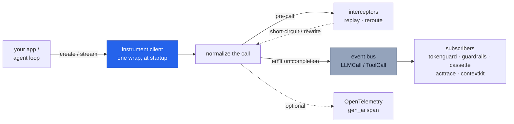

# `cendor-core` — the foundation

The shared vocabulary every other tool rides: one set of types, one tokenizer, one price
table, one instrumentation seam, one event bus. It's small and stable on purpose — it's the
dependency of the whole stack. You rarely install it directly; it arrives transitively.

<!-- tabs: lang -->
<!-- tab: Python -->

```bash
pip install cendor-core                # exact token counts by default — tiktoken ships with it
# Using uv? Same names, same extras: `uv add` instead of `pip install`.
```

<!-- tab: TypeScript -->

```bash
npm i @cendor/core                     # or any tool that depends on it
# token counting via js-tiktoken is bundled — exact counts match Python
```

<!-- /tabs -->

## Quickstart

Everything below runs offline — token counting and pricing ship bundled, no key, no network:

<!-- tabs: lang -->
<!-- tab: Python -->

```python
from cendor.core import tokens, prices

n = tokens.count([{"role": "user", "content": "Summarize this in 3 bullets."}], model="claude-opus-4-8")
cost = prices.estimate("claude-opus-4-8", input_tokens=n, output_tokens=200)
print(n, cost, tokens.method("claude-opus-4-8"))   # e.g. 16  0.00508000 USD  bpe-estimate
```

<!-- tab: TypeScript -->

```ts
import { tokens, prices } from '@cendor/core';

const n = tokens.count([{ role: 'user', content: 'Summarize this in 3 bullets.' }], 'claude-opus-4-8');
const cost = prices.estimate('claude-opus-4-8', n, { outputTokens: 200 });
console.log(n, cost.toString(), tokens.method('claude-opus-4-8'));  // e.g. 16  0.00508000 USD  bpe-estimate
```

<!-- /tabs -->

> **See it in the stack.** The one-wrap-then-every-tool-subscribes flow is walked end to end
> in [Architecture](architecture.md) and the [Cookbook](https://cendor.ai/cookbook).

## Core concepts

### The `instrument()` seam
Wrap a provider client **once**, at startup. From then on `instrument()` intercepts each
call, normalizes it into an `LLMCall`, fills in usage/cost/latency, and publishes it on the
event bus — so every sibling tool observes the call by *subscribing*, never by patching the
client. It's idempotent (re-wrapping is a no-op) and additive (coexists with OpenLLMetry /
OpenInference).

### The event bus
`subscribe` / `emit`, synchronous and in-process. `emit` runs **every** subscriber even if
one raises — a logging subscriber's bug can't starve `tokenguard`'s enforcement. The first
`Exception` is re-raised after all have run (so intentional control flow like
`BudgetExceeded` still reaches the caller); `KeyboardInterrupt`/`SystemExit` propagate
immediately. It's thread-safe: the subscriber list is snapshotted under a lock, then the lock
is released *before* subscribers run, so a callback may safely (un)subscribe from any thread.

### Token counting, three tiers
`tokens.count()` is accurate-first and always offline-capable; `tokens.method(model)` tells
you which path is active:

| Tier | When | Accuracy |
|---|---|---|
| `exact` | a model-native OpenAI encoding exists in `tiktoken` (gpt-4o / gpt-4.1 / o-series / earlier — the default; `tiktoken` ships with `cendor-core`); OpenAI fine-tunes (`ft:gpt-4o:…`) map to their base model | exact |
| `bpe-estimate` | any non-native model — Claude/Gemini **and** open/hosted weights (llama, mistral, deepseek, qwen), **the gpt-5.x line** (no upstream `tiktoken` mapping yet — this tier upgrades to `exact` automatically when tiktoken ships one), new o-series ids, unknown OpenAI ids | close — real BPE (`o200k`), not native |
| `registered` | you plugged a counter in via `tokens.register(family, fn)` | as good as your counter |
| `heuristic` | `tiktoken` failed to import (a broken/partial install) — a defensive fallback, never the default | rough (~3–6 chars/token by content) |

Exact counting is the default (`tiktoken` is a required dependency), because truthful token counts
are the product. `register()` a precise counter to override a family.

### Prices: offline-first, refreshable
A dated `prices.json` ships in the wheel, so `estimate()` works with no network — the offline
default. Money is always `Decimal` (rates are parsed with `parse_float=Decimal`, so they never
round-trip through `float`). What a snapshot can't know is whether its rates are still current,
so `refresh()` pulls live rates and `age_days()`/`is_stale()` surface staleness.

Because `cached_tokens ⊆ input_tokens` (normalized across providers), `estimate()` bills the
cached portion **once** — `input_rate*(input − cached) + cached_rate*cached` — never at both
rates. A model with no published cached rate falls back to the input rate for cache reads (no
discount, no double charge).

**Register a price for a model the snapshot doesn't know.** An Azure/Foundry *deployment* name, a
fine-tune, a Bedrock marketplace id or a local model is unpriced — cost comes back `None`/`null`
and a **USD** cap silently never binds (a token cap still does). Two ways in, and the common one
first: **name the model the deployment serves**, or supply the rates yourself. Both survive
`refresh()`.

**Deployment name → the base model's rates.** On Microsoft Foundry (formerly Azure AI Foundry) the
id a call reports is
the *deployment* name you chose, not a model id, so it is in no price table on earth. You always know
which model sits behind it; `register_deployment` says so once, instead of making you find and
re-type a rate card:

<!-- tabs: lang -->
<!-- tab: Python -->

```python
from cendor.core import prices

prices.register_deployment("prod-chat", like="gpt-4o")             # since core 1.16.0
prices.estimate("prod-chat", 1_000, output_tokens=500)             # → Decimal('0.007500000')
```

<!-- tab: TypeScript -->

```ts
import { prices } from '@cendor/core';

prices.registerDeployment('prod-chat', { like: 'gpt-4o' });        // since @cendor/core 3.2.0
prices.estimate('prod-chat', 1_000, { outputTokens: 500 });        // → 0.0075
```

<!-- /tabs -->

It is an **explicit** mapping you supply — deliberately not `-preview`/`-latest` alias guessing,
which was considered and rejected (a confidently wrong price is worse than an honest `None`), and
nothing is inferred from the deployment's name. `like` goes through the same lookup reduction a real
call does, so a dated or Bedrock-decorated base id works (`like="gpt-4o-2024-08-06"`). **Every** rate
key is copied, cached and cache-write rates included. Three properties worth knowing, all
deliberate:

- **An unknown `like` raises `UnknownModelError`.** Registering nothing and leaving the deployment
  quietly unpriced would reproduce the exact silence this function exists to remove.
- **Copy-at-registration, not a live alias.** The base's rates are read *now*. A later `refresh()`
  that reprices `gpt-4o` does **not** reprice `prod-chat` — call it again. The alternative would make
  a deployment's cost depend on whether its base still exists in whatever table was last fetched.
- Like every registration, it overrides a snapshot entry with the same id and survives `refresh()`.

**Or supply the rates directly**, when you have the exact numbers and no base model to copy — a
fine-tune, a negotiated rate, a local model:

<!-- tabs: lang -->
<!-- tab: Python -->

```python
from cendor.core import prices

prices.register_model_price("my-finetune", input=2.50, output=10.00)   # USD per 1M tokens
prices.register("my-finetune", {"input": "0.0000025", "output": "0.00001"})  # or per-token
```

<!-- tab: TypeScript -->

```ts
import { prices } from '@cendor/core';

prices.register('my-finetune', { input: '0.0000025', output: '0.00001' }); // per-token Decimal
// per-1M convenience: `registerModelPrice` from @cendor/sdk
```

<!-- /tabs -->

Since **core 1.15.0** the per-1M form lives in `cendor-core` on the Python side too — a
libraries-door user no longer needs the SDK distribution to price a model.
`cendor.sdk.register_model_price` is now a thin re-export of `prices.register_model_price`, so
existing code is unaffected. In TypeScript the per-1M convenience is still `@cendor/sdk`'s;
`prices.register` (per-token `Decimal`) and `prices.registerDeployment` are both on the libraries
door.

### Cost provenance: reported vs estimated
When a response carries a real billed cost (e.g. a gateway's `usage.cost`), `instrument()`
prefers it and tags `metadata["cost_reported"] = True`; otherwise it prices from the snapshot
and tags `metadata["cost_estimated"] = True`. So a downstream tool or audit can always tell a
real figure from an estimate (an unknown model with no reported cost leaves `cost = None`).

### Interceptors (replay / reroute)
`add_interceptor(fn)` registers a pre-call hook that can return a response to short-circuit
the call (replay — used by `cassette`), a `Reroute(…)` to rewrite the request before it runs, or
`MISS` to proceed untouched. One seam powers all three, so there's never a second patch point.

`Reroute(**updates)` applies its keyword updates to the outgoing call's kwargs before it
executes. Two keys are special-cased so the emitted `LLMCall` stays consistent with what is
actually sent, and so a rewrite works across providers:

- `Reroute(model=…)` also updates `call.model` — the downgrade `tokenguard` uses for
  `on_exceed="downgrade"`.
- `Reroute(model=…)` also updates `call.model`, and is mapped to the provider's own **model** kwarg —
  `modelId` on Bedrock's Converse API, `model` everywhere else. Without that map the rewrite landed
  on a `model` member Converse does not have, so (measured 2026-07-31) a lenient client sent the
  ORIGINAL expensive model while the `LLMCall`, the budget ledger and the audit chain all recorded the
  cheap one, and real boto3 raised `Unknown parameter in input: {'model'}` instead of downgrading.
  Fixed in 1.17.0 / `@cendor/core` 3.3.0.
- `Reroute(messages=…)` rewrites the outbound messages — mapped to the provider's own kwarg
  (`messages` for Chat Completions / Anthropic / Bedrock / Ollama, `input` for the OpenAI
  Responses API, `contents` for Gemini) — and updates `call.messages`. This is how `acttrace`'s
  `guard()` does **redact-before-send**: the scrubbed messages, not the originals, reach the
  provider. Applies uniformly to sync, async, and streaming calls (the rewrite happens before the
  real call runs).

**Ordering contract — a `Reroute` does not end the chain; a returned response does.** (Since 1.17.0
/ `@cendor/core` 3.3.0.) The two return values mean different things, so they compose differently:

| an interceptor returns | the remaining interceptors | the provider |
|---|---|---|
| `MISS` | run | is called |
| `Reroute(…)` | **run, against the rerouted call** | is called with every rewrite applied |
| a response (cassette replay) | are skipped | is **not** called |
| raises | are skipped | is not called |

Reroutes compose in registration order and are applied as they arrive, so a later interceptor sees
`call.messages` / `call.model` as they will actually be sent; when two rewrite the same field, the
later one wins.

⚠️ **Before 1.17.0 a `Reroute` also ended the chain, and what you lost was silent.** With a
`tokenguard` clamp registered before an `acttrace.guard()`, the clamp fired and the PII went to the
provider **unredacted**; registered the other way round, the guard fired and the token cap **silently
never bound**. Which one you lost depended on registration order — something a user has no way to
observe. If you have code that relied on one library shadowing another, the fix is to stop
registering the one you did not want.

### Ambient metadata providers
Run context — *which* agent, *which* conversation, *which* audit decision — has to be captured at the
one moment it is unconditionally correct: when the event is **constructed**, in the caller's own
synchronous frame, before interceptors run. Reading it later (at bus-delivery time) breaks whenever a
stream is finalized outside the scope that launched it, a context-losing layer sits in between,
subscriber order shuffles, or two runs interleave. `trace_id` has always been stamped there;
`add_ambient_provider(fn)` generalizes that seam to everything else.

A provider is a `(event) -> metadata | None` (TS `(event) => metadata | undefined`) callable, run
over every freshly built `LLMCall` / `ToolCall`. Its returned keys are merged onto `event.metadata`
in **registration order**, and it **never overwrites** a key already present. The contract is strict:
a provider **must never raise** (an exception is swallowed so a broken provider can't break capture),
and with nothing registered there is a **zero-provider fast path** (a single length check — the
standalone-libs byte-identity and the benchmark hold). The event is passed read-only, so a provider
that needs to attach a non-serializable value keys a `WeakKeyDictionary` / `WeakMap` off it instead of
returning it.

Core stays **generic**: it merges opaque metadata and learns no SDK vocabulary — what `agent` or
`conversation_id` *means* lives entirely in the library that registers the provider (the SDK, or the
[LangChain handler](#frameworks-langchain--langgraph)). This is how a libs-only app can surface
`gen_ai.agent.name` on its spans without the SDK: register a provider that returns `{"agent": …}` and
core's span emitter maps `metadata["agent"]` → `gen_ai.agent.name`. The reserved keys
(`agent` / `conversation_id` / `decision_id`, plus one private cassette session key) are pinned in the
[bus-events spec](https://github.com/cendorhq/cendor-libs/tree/main/docs/specs/bus-events.md).

### Stream observers (per-chunk seam)
`add_stream_observer(fn)` (`addStreamObserver` in TS; since core 1.10 / 0.11) registers a per-chunk
observer called `fn(call, delta_text, delta_thinking)` on **every** instrumented stream, right as each
chunk passes through. Core does the provider parsing and hands the observer only the extracted visible
text + visible thinking of that chunk — the observer never touches a provider shape. It's the same
**interceptor discipline** as the pre-call seam: **raising aborts the stream** — core closes the
underlying provider stream, finalizes the `LLMCall` **once** (partial usage, flagged
`usage_estimated`; the crossing chunk is withheld from the consumer but kept for the settle), and
re-raises to the consumer's iteration. With nothing registered there is a **zero-observer fast path**
(one truthiness / length check per chunk — the streaming benchmark and byte-identity hold).

This is the seam `tokenguard`'s mid-stream budget breaker (`budget(on_exceed="break")`) rides — core
learns no budget vocabulary, mirroring the ambient-provider discipline. Registration is idempotent;
`remove_stream_observer(fn)` unregisters.

### Framework adapters
When your app runs **under a third-party agent framework**, that framework — not your code — owns the
agent identity, and it often makes its model calls through a path `instrument()` can't see or names its
agents dynamically. A small **adapter** bridges the gap: it observes the framework's own lifecycle and
carries the *framework's* agent name onto cendor's bus via the [ambient seam](#ambient-metadata-providers).
Core itself never carries an identity — the framework owns the name; the adapter merely relays it,
never-overwriting an explicit stamp. Each adapter is an optional extra; **importing one registers
nothing** (core's zero-provider fast path holds until you attach).

- **LangChain / LangGraph** — `cendor.core.langchain.CendorCallbackHandler` (extra `[langchain]`).
  Records usage + reasoning + tool calls + a run-correlated `trace_id` from the callback tree. See
  [providers.md → Frameworks](providers.md#frameworks-langchain--langgraph).
- **OpenAI Agents SDK** — `cendor.core.openai_agents.CendorAgentHooks` / `@cendor/core/openai-agents`'s
  `observeOpenAIAgents` (extra `[openai-agents]`). The agent's model calls ride the standard OpenAI
  client, so `instrument()` still captures **tokens, cost, and streaming** — the adapter supplies only
  the agent name, scoped per turn (set at start / handoff, cleared at end).
- **Microsoft Foundry Agent Service** — `cendor.core.foundry` / `@cendor/core/foundry` (extra `[foundry]`).
  Observes thread-run creation and stamps `agent` + `conversation_id`. **Attribution only** — the model
  runs server-side, so there is no per-step token/cost here (an honest limit).

<!-- tabs: lang -->
<!-- tab: Python -->
```python
# OpenAI Agents SDK — the agent's calls ride the instrumented OpenAI client (tokens/cost/streaming)
from agents import Agent, Runner
from cendor.core import instrument
from cendor.core.openai_agents import CendorAgentHooks
from openai import AsyncOpenAI

instrument(AsyncOpenAI())
await Runner.run(Agent(name="Billing"), "refund my order", hooks=CendorAgentHooks())

# Microsoft Foundry Agent Service — attribution only (model runs server-side)
from cendor.core.foundry import observe_foundry_agents
observe_foundry_agents(client)                      # wraps client.runs.{create,create_and_process,stream}
client.runs.create_and_process(thread.id, agent_id=agent.id)  # events carry agent + conversation_id
```
<!-- tab: TypeScript -->
<!-- ts-check: skip -->
```ts
// OpenAI Agents SDK — the agent's calls ride the instrumented OpenAI client (tokens/cost/streaming)
import { Agent, Runner } from '@openai/agents';
import { instrument } from '@cendor/core';
import { observeOpenAIAgents } from '@cendor/core/openai-agents';
import OpenAI from 'openai';

instrument(new OpenAI());
const runner = new Runner();
observeOpenAIAgents(runner);
await runner.run(new Agent({ name: 'Billing' }), 'refund my order');

// Microsoft Foundry Agent Service — attribution only (model runs server-side)
import { observeFoundryAgents } from '@cendor/core/foundry';
observeFoundryAgents(client);                        // wraps client.runs.{create,createAndPoll,createThreadAndRun}
await client.runs.createAndPoll(thread.id, agent.id); // events carry agent + conversation_id
```
<!-- /tabs -->

### OpenTelemetry (optional)
`otel.span(...)` emits a GenAI `gen_ai.*` span when OpenTelemetry is installed, else it's a
no-op. `otel.ingest(attrs)` turns a managed runtime's `gen_ai.*` span attributes into a bus
event — with **no** OpenTelemetry dependency required — so `tokenguard`/`acttrace` work even
when a runtime owns the call loop.

## Functions & classes

### `instrument()` / `instrument_tool()`

<!-- tabs: lang -->
<!-- tab: Python -->

```python
client = instrument(openai_client)     # OpenAI · Anthropic · Hugging Face · Gemini · Bedrock · Ollama

@instrument_tool("search")             # wrap a tool so ToolCall events join the stream
def search(q): ...
```

<!-- tab: TypeScript -->

```ts
import { instrument, instrumentTool } from '@cendor/core';

const client = instrument(new OpenAI());       // OpenAI · Anthropic · Hugging Face · Gemini · Bedrock · Ollama

const search = instrumentTool('search')(       // wrap a tool so ToolCall events join the stream
  (q) => { /* ... */ });
```

<!-- /tabs -->
Detects the client by **shape** (not model name, so new models work the day they ship), wraps
its call entrypoint(s), runs the real call (sync, async, **and streaming**), fills
`usage`/`cost`/`latency`, and emits an `LLMCall`. Idempotent and additive; an unrecognized
client is returned untouched. See [Providers](providers.md) for the exact entrypoints wrapped
per provider and the [streaming](#streaming) note below.

### `tokens`
| Call | Returns | What it does |
|---|---|---|
| `tokens.count(text_or_messages, model)` | `int` | Count tokens for a string or a chat-message list. |
| `tokens.method(model)` | `str` | Which tier is active: `exact`/`bpe-estimate`/`registered`/`heuristic`. |
| `tokens.family(model)` | `str` | `"openai"` \| `"anthropic"` \| `"google"` \| `"default"`. |
| `tokens.register(family, fn)` | — | Plug a precise counter in for a family. |

### `prices`

<!-- tabs: lang -->
<!-- tab: Python -->

```python
prices.estimate("gpt-4o", input_tokens=1000, output_tokens=300, cached_tokens=200)  # -> Money
prices.refresh(source="litellm")       # or "openrouter" | "azure" | a static-JSON URL
prices.register_deployment("prod-chat", like="gpt-4o")                  # a deployment name
prices.register_model_price("my-finetune", input=2.50, output=10.00)     # USD per 1M tokens
```

<!-- tab: TypeScript -->

```ts
prices.estimate('gpt-4o', 1000, { outputTokens: 300, cachedTokens: 200 });  // -> Money
await prices.refresh(undefined, { source: 'litellm' });  // or 'openrouter' | 'azure' | a URL
prices.registerDeployment('prod-chat', { like: 'gpt-4o' });              // a deployment name
```

<!-- /tabs -->

| Call | Returns | What it does |
|---|---|---|
| `estimate(model, input_tokens=, output_tokens=, cached_tokens=)` | `Money` | Price a call from the active table (Decimal, never float). |
| `refresh(source=… \| url \| url, mapper=)` | — | Pull live rates from a no-auth JSON source; falls back silently to the last-good table. |
| `register(model, rates)` | — | Register **per-token** rates for a model the snapshot doesn't know. Survives `refresh()`. (TS: `prices.register`.) |
| `register_deployment(deployment, like=)` | `dict` | Price an Azure/Foundry **deployment name** by copying the rates of the base model it serves. Raises `UnknownModelError` if `like` isn't in the table. Copy-at-registration, not a live alias. Since core 1.16.0 / `@cendor/core` 3.2.0. (TS: `registerDeployment(deployment, { like })`.) |
| `register_model_price(model, input=, output=, cached=, cache_write=, per="1M")` | `dict` | The per-1M/1K convenience over `register`. Python only; TS's twin is `registerModelPrice` in `@cendor/sdk`. |
| `models()` · `snapshot_date()` · `source()` | — | Introspect the active table. |
| `age_days()` · `is_stale(max_age_days=30)` | — | Freshness signals. |
| `source_name()` · `source_url()` | — | Provenance of the active rates. |

`refresh()` fetches a **static** resource over http(s) only (it rejects `file://` and other
schemes), maps it to our schema **in memory** (nothing persisted), and normalizes source ids
to bare keys (`openai/gpt-4o` → `gpt-4o`). See [Providers → Live pricing](providers.md#live-pricing)
for which sources expose rates. Programmatic price registrations (`prices.register` in **both**
languages since core 1.15.0 / 0.6.0) **survive `refresh()`** — they are re-applied after every
table swap.

### `bus`

<!-- tabs: lang -->
<!-- tab: Python -->

```python
bus.subscribe(fn)       # idempotent; fn receives each emitted LLMCall / ToolCall
bus.unsubscribe(fn)     # no error if absent
bus.emit(event)         # synchronous dispatch to all subscribers
bus.has_subscribers()   # True when anything is registered (core ≥ 1.18)
```

<!-- tab: TypeScript -->

```ts
import { bus } from '@cendor/core';

bus.subscribe(fn);      // idempotent; fn receives each emitted LLMCall / ToolCall
bus.unsubscribe(fn);    // no error if absent
bus.emit(event);        // synchronous dispatch to all subscribers
bus.hasSubscribers();   // true when anything is registered (core ≥ 3.5)
```

<!-- /tabs -->

`has_subscribers()` / `hasSubscribers()` lets an emitter skip *building* an expensive event nobody
would receive — squeeze gates its `CompressionEvent` token counts on it. It answers "is anyone on
the bus", not "is anyone listening for this event type", and it is advisory: a subscriber registered
concurrently between the check and the `emit` misses that one event.

### `add_ambient_provider()` / `remove_ambient_provider()`

Register a callable that stamps run-scoped metadata onto every `LLMCall` / `ToolCall` **at event
construction** (before interceptors, in the caller's synchronous frame) — the seam described in
[Ambient metadata providers](#ambient-metadata-providers) above.

<!-- tabs: lang -->
<!-- tab: Python -->

```python
from cendor.core import add_ambient_provider, remove_ambient_provider

# stamp run context onto every event as it is constructed (never overwrites an existing key):
provider = add_ambient_provider(lambda event: {"agent": "reviewer", "tenant": "acme"})
remove_ambient_provider(provider)     # add_ambient_provider returns the fn, so you can unregister it
```

<!-- tab: TypeScript -->

```ts
import { addAmbientProvider, removeAmbientProvider } from '@cendor/core';

// stamp run context onto every event as it is constructed (never overwrites an existing key):
const provider = addAmbientProvider(() => ({ agent: 'reviewer', tenant: 'acme' }));
removeAmbientProvider(provider);      // addAmbientProvider returns the fn, so you can unregister it
```

<!-- /tabs -->

| Call | Returns | What it does |
|---|---|---|
| `add_ambient_provider(fn)` | the `fn` | Register a provider `(event) -> dict \| None` run at every event's construction (idempotent). |
| `remove_ambient_provider(fn)` | — | Unregister a provider (no error if absent). |

### `add_stream_observer()` / `remove_stream_observer()`

Register a per-chunk observer `fn(call, delta_text, delta_thinking)` on every instrumented stream —
the seam described in [Stream observers](#stream-observers-per-chunk-seam) above. **Raising aborts the
stream** (closes the provider stream, finalizes the call once, re-raises); nothing registered ⇒ a
one-check-per-chunk fast path. Since core 1.10 / 0.11.

| Call | Returns | What it does |
|---|---|---|
| `add_stream_observer(fn)` | the `fn` | Register a per-chunk stream observer (idempotent). Raising aborts + finalizes the stream. |
| `remove_stream_observer(fn)` | — | Unregister a stream observer (no error if absent). |

The provider **must never raise** (exceptions are swallowed) and merges in **registration order**
without overwriting existing keys; zero providers is a single-length-check fast path. Core stays
generic — it merges opaque metadata and defines no key meanings (the reserved names live in the
[bus-events spec](https://github.com/cendorhq/cendor-libs/tree/main/docs/specs/bus-events.md)).

### `otel`

<!-- tabs: lang -->
<!-- tab: Python -->

```python
with otel.span("gpt-4o", provider="openai"):   # gen_ai.* span if OTel installed, else no-op
    ...
with otel.span("gpt-4o", tracer=my_tracer):    # or: a tracer YOU own, not the global provider
    ...
otel.ingest({"gen_ai.system": "azure_ai_foundry", "gen_ai.request.model": "gpt-4o",
             "gen_ai.usage.input_tokens": 1000, "gen_ai.usage.output_tokens": 500})  # -> bus event
```

<!-- tab: TypeScript -->

```ts
import { otel } from '@cendor/core';
import { trace } from '@opentelemetry/api';

otel.span('gpt-4o', { provider: 'openai' }, (span) => {   // gen_ai.* span if OTel installed, else no-op
  // ... your model call; `span` is null when @opentelemetry/api isn't installed
});
// …or emit on a tracer YOU own, instead of the global provider:
otel.span('gpt-4o', { tracer: trace.getTracer('my-app') }, (span) => { void span; });
otel.ingest({ 'gen_ai.system': 'azure_ai_foundry', 'gen_ai.request.model': 'gpt-4o',
              'gen_ai.usage.input_tokens': 1000, 'gen_ai.usage.output_tokens': 500 });  // -> bus event
```

<!-- /tabs -->

**`tracer=` — a trace pipeline that isn't the global one.** Omit it and the span goes to the global
provider, which is right for an application. Pass a `Tracer` for the three cases where the global one
is wrong: a **test** asserting spans without installing a process-global provider, a **multi-tenant
host** with a provider per tenant, and a **second pipeline** beside the app's own. The span name and
attributes are identical either way, and without OpenTelemetry it is still a no-op. (An attribute
literally named `tracer` or `provider` is consumed as the parameter, not recorded.)

### Types

<!-- tabs: lang -->
<!-- tab: Python -->

```python
from cendor.core.types import LLMCall, ToolCall, Usage, Money

Usage(input_tokens=1200, output_tokens=300, cached_tokens=0, reasoning_tokens=0, cache_write=0)  # frozen
Money(0.0135)   # Decimal-backed; +, -, *, comparisons; Money.zero()
```

<!-- tab: TypeScript -->

```ts
import { LLMCall, ToolCall, Usage, Money } from '@cendor/core';

new Usage({ inputTokens: 1200, outputTokens: 300, cachedTokens: 0, reasoningTokens: 0, cacheWrite: 0 });
new Money(0.0135);   // decimal.js-backed; value-equal with Python's Decimal; Money.zero()
```

<!-- /tabs -->
- `LLMCall` (`id`, `provider`, `model`, `messages`, `usage`, `cost`, `latency_ms`, `trace_id`,
  `ts`, `metadata`) is the normalized record emitted for every call.
- In `Usage`, `cached_tokens ⊆ input_tokens` and `reasoning_tokens ⊆ output_tokens` (breakdowns,
  not added to the total). `cache_write` (Anthropic `cache_creation`) is a **separate** billed
  category (~1.25× input), not in the total.
- **Aggregate usage with core, not by hand** (since 1.6.0 / 0.6.0): `Usage` supports `+` /
  `sum(...)` and `sum_usage(iterable)` in Python, `sumUsage(usages)` in TS (next to `sumMoney`).
  The sum is **field-complete by construction** — it iterates the instance's own fields, so a
  future `Usage` field can never silently vanish from an aggregate.

### Modules & protocols
| Module | Responsibility |
|---|---|
| `types` | `LLMCall`, `ToolCall`, `Usage`, `Money` — the canonical schema |
| `tokens` | Provider-aware token counting + a tokenizer registry |
| `prices` | Bundled price snapshot + `estimate()` + optional `refresh()` |
| `instrument` | Wrap a client/tool once; emit normalized events (+ record/replay hooks) |
| `bus` | In-process, idempotent pub/sub |
| `ambient` | `add_ambient_provider()` / `remove_ambient_provider()` — stamp run-scoped metadata at event construction |
| `otel` | GenAI span emitter + `ingest()` for managed-runtime spans |
| `protocols` | `Compressor`, `EvictionStrategy`, `Sink`, `Subscriber`, `Handle` (structural) |

The `protocols` are `typing.Protocol`s — a library satisfies one by *shape*, no import or base
class. That's how `squeeze` is a `Compressor` for `contextkit` without either importing the
other.

**`Sink` lifecycle (optional).** `write(entry)` is the only required method — `isinstance(obj,
Sink)` matches any write-only sink. A sink **may** also implement two optional lifecycle methods,
which callers invoke via `hasattr`/`getattr` guards: `flush()` (block until buffered records are
durably written) and `close()` (flush, then release resources). These are additive — write-only
sinks stay valid. [`tokenguard.sinks.QueueSink`](tokenguard.md#queuesink--low-latency-durable-logging)
implements both to move durable I/O **off the model call's hot path**: the bus runs subscribers
inline, so wrapping a SQLite/OTel/file sink in a `QueueSink` keeps its I/O latency out of every
call. `QueueSink(SQLiteSink(path))` — enqueue-and-return, drain on a background thread in order,
`flush()`/`close()` for durability at shutdown.

## How it works



<a id="streaming"></a>
**Streaming.** With `stream=True`, the streamed value is passed through to your caller
unchanged while `instrument()` accumulates usage in the background, emitting the `LLMCall`
**once, when the stream completes** (or is closed early) — with true end-to-end latency. Usage
is read from the provider's own stream reporting where present; when a provider streams no
usage, it falls back to an offline estimate flagged `metadata["usage_estimated"] = True`.
Streamed calls carry `metadata["streamed"] = True`, and the collected chunks are attached at
`metadata["response"]` so `cassette` can record them.

The streamed value is **both an iterator and a context manager** — exactly like the provider
SDK's own stream object — so both usage forms work and finalize (emit) exactly once:

<!-- tabs: lang -->
<!-- tab: Python -->

```python
stream = client.chat.completions.create(model="gpt-4o", messages=msgs, stream=True)
for chunk in stream:            # iterate…
    ...

with client.chat.completions.create(model="gpt-4o", messages=msgs, stream=True) as stream:
    for chunk in stream:        # …or use it as a context manager (what LangChain does)
        ...
# async: `async for chunk in stream` and `async with … as stream:` likewise
```

<!-- tab: TypeScript -->

```ts
const stream = await client.chat.completions.create({ model: 'gpt-4o', messages: msgs, stream: true });
for await (const chunk of stream) {
  // ... usage accumulates in the background;
}    // the LLMCall is emitted once the stream completes (or is closed early)
```

<!-- /tabs -->

This context-manager surface is required by frameworks such as `langchain_openai`, which consume
a streamed completion via `with client…create(stream=True) as response:`. Unknown attributes
(`.response`, `.close()`, …) are forwarded to the underlying SDK stream, and closing early
(`stream.close()` / block exit) finalizes the `LLMCall` once. Replayed streams (via `cassette`)
carry the same iterator + context-manager surface.

<a id="trace-id-correlation"></a>
**Run correlation (`trace()`).** Every `LLMCall`/`ToolCall` carries a `trace_id` (default `""`).
Set an ambient one with `with core.trace("run-id"):` to group a unit of work — a direct-SDK agent
loop, a request — so its calls share an id downstream (`acttrace`, your own subscribers). It's a
`contextvars` binding (nests, works across sync/async); `core.current_trace_id()` reads it.

<!-- tabs: lang -->
<!-- tab: Python -->

```python
from cendor.core import trace
with trace("session-42"):
    client.chat.completions.create(...)      # emitted LLMCall.trace_id == "session-42"
```

<!-- tab: TypeScript -->

```ts
import { trace } from '@cendor/core';
await trace('session-42', () =>
  client.chat.completions.create({ /* ... */ }));  // emitted LLMCall.traceId === 'session-42'
```

<!-- /tabs -->

This is a **hook, not an orchestrator** (see [architecture.md](architecture.md)): cendor stamps the
id you set, it never invents a run graph. The LangChain/LangGraph callback path
([providers.md](providers.md#frameworks-langchain--langgraph)) derives the same `trace_id`
automatically from the framework's run tree.

**Frameworks (LangChain / openai-agents / Foundry).** When your app runs under a framework, the
SDK-aligned integration point is the framework's own lifecycle — its **callback / hooks system** — not
client wrapping. A small [framework adapter](#framework-adapters) carries the *framework's* agent name
(and, for Foundry, the conversation id) onto the bus via the ambient seam. `langchain` is
recording-only; `openai-agents` still gets tokens/cost/streaming for free (the calls ride the standard
OpenAI client); `foundry` is attribution-only (the model runs server-side). See
[Framework adapters](#framework-adapters) and
[providers.md → Frameworks](providers.md#frameworks-langchain--langgraph).

## Plugs into the stack

`core` *is* the seam. Every other tool cooperates through it and nothing else: tools subscribe
to the bus, satisfy a `protocols` type by shape, or register an interceptor — they never import
one another. That's what keeps `core` the whole stack's small, stable blast radius.

**See it live.** core's `otel` span emitter — and the libs-only `use_span_emitter()` bus→span bridge
— is exactly the standard wire [Cendor Monitor](monitor.md) reads. Cendor's optional self-hosted
monitor renders it directly; the same wire also flows to your own OTel backend (the production
default).

## Honest limits

- **Token counts are exact for the OpenAI families `tiktoken` maps** (gpt-4o, gpt-4.1, the
  o-series, and earlier) — `tiktoken` is a required dependency, so a normal install counts those
  exactly (no opt-in). **The gpt-5.x line has no upstream `tiktoken` mapping yet**, so gpt-5.x ids
  count via the `o200k` BPE proxy (`tokens.method()` reports `bpe-estimate`, and upgrades to
  `exact` automatically once tiktoken ships a mapping). Money is always exact (`Decimal`).
- **For Claude, the `o200k` proxy under-counts — and by more than Anthropic's own figure suggests.**
  Claude and Gemini count through the same `o200k` proxy, not their native tokenizer. Anthropic
  states its newest models (Opus 4.7+, Fable 5, Mythos 5, Sonnet 5) use a new tokenizer producing
  "~30% more tokens" for the same text. **Measured** against Anthropic's own
  `messages.count_tokens` endpoint — 27 samples, prose/code/JSON at three sizes each, message-level
  on both sides so the comparison is like-for-like (2026-07-31, `anthropic` 0.120.2):

  | ids | mean official ÷ proxy | range | so a cap of N binds at |
  |---|---|---|---|
  | Opus 4.7 / Sonnet 5 / Fable 5 | **1.49** | 1.32 – 1.66 | ≈ N ÷ 1.49 of Anthropic's tokens |
  | Sonnet 4.5 / Haiku 4.5 | **1.14** | 1.03 – 1.22 | ≈ N ÷ 1.14 |

  Three things follow, and all three are corrections to what this page said before. The undercount
  for the new family is **~49%, not ~30%**. The older ids are **not** exempt — they under-count by
  ~14%, so this is not only a new-tokenizer story. And **no single scaling factor is honest**,
  because the ratio tracks the *content*: JSON lands at ~1.32–1.35, prose at ~1.49–1.66. A 1.49
  factor would over-count JSON by ~12% and under-count prose by ~11%, which is why one is
  deliberately not applied — a confidently wrong count is worse than a documented estimate.
  `tokens.method()` keeps reporting `bpe-estimate` for these ids rather than pretending otherwise.

  **What to do about it.** Set token caps with the ratio above in mind, or make the count exact for
  your own workload with `tokens.register()` — including by delegating to Anthropic's endpoint,
  which is authoritative because it is what the API bills against (it is a network call per count,
  so it is a deliberate opt-in, not a default core could adopt without breaking local-first):

  ```python
  import anthropic
  from cendor.core import tokens

  client = anthropic.Anthropic()

  def claude_exact(text_or_messages, model):
      msgs = (
          text_or_messages
          if isinstance(text_or_messages, list)
          else [{"role": "user", "content": text_or_messages}]
      )
      # The counter receives the id as it was CALLED. On Bedrock that is prefixed
      # (`anthropic.claude-sonnet-5`), which Anthropic's own API rejects with a 404 — strip it.
      return client.messages.count_tokens(
          model=model.split(".", 1)[-1], messages=msgs
      ).input_tokens

  # register() takes the tokenizer FAMILY, not a model id, so one call covers every Claude id.
  tokens.register("anthropic", claude_exact)
  ```

  Verified live: `tokens.method("claude-sonnet-5")` goes from `bpe-estimate` to `registered`, and a
  short prose sample the proxy counted as 79 goes to 145. Registering the `anthropic` family leaves
  every other family alone — `tokens.method("gpt-4o")` stays `exact`.

  One caveat when you compare numbers yourself: `count_tokens` prices a whole **request**, so it
  includes the per-message framing, while `tokens.count("…")` on a bare string does not. Compare
  like for like — `tokens.count([{"role": "user", "content": text}], model)` — or short samples will
  look worse than the tokenizer difference alone (that 79 → 145 is 1.84×; message-level it is
  1.69×). The table above is message-level on both sides.
- **Capture is best-effort, not a billing guarantee.** A call that *raises* before returning
  emits no `usage`/`cost`; a streamed response whose provider reports no usage is priced from
  an offline estimate (flagged `usage_estimated`). Bedrock's `converse_stream` entrypoint **is**
  captured — it is detected as an always-stream target and its usage rides the trailing `metadata`
  event (Python since core 1.10; TypeScript since `@cendor/core` 0.12.2).
- **Anthropic's `messages.stream()` and `messages.parse()` are captured now — since 1.17.0 in
  Python, and always in TypeScript.** They were both silent bypasses in Python: measured on
  `anthropic` 0.120.2, `messages.stream()` emitted **zero** bus events through every one of its three
  consumption paths (iteration, `.text_stream`, `.get_final_message()`) and `messages.parse()`
  emitted zero too, while the HTTP POST plainly happened. Reachability was never theoretical —
  Semantic Kernel's Anthropic connector streams through `messages.stream()`.

  The cause is a **codegen difference, and it runs the opposite way in the two languages.** In
  Python both helpers build their own `self._post("/v1/messages", …)`, so wrapping
  `messages.create` saw nothing and each needs its own target. In **TypeScript** the same two are
  helpers built *on* `create` (`create({…, stream: true}).withResponse()` and
  `create(...).then(parseMessage)`), so the wrapped `create` already captures them exactly once and
  adding targets there would **double-count** — which is why they are deliberately not targets in
  `@cendor/core`. Same asymmetry, same reason, as openai's `parse`.

  A `messages.stream()` call now fires pre-flight interceptors before the request (a budget blocks
  with zero HTTP requests issued; a `guard()` redaction reaches the wire), emits exactly one
  `LLMCall` on drain with the provider's own usage, and joins `trace()`/cassette like the other
  always-stream targets. You still get the SDK's genuine `MessageStream` back, so `.text_stream`,
  `.get_final_message()` and the event callbacks are unchanged.

- **`tool_runner` no longer exists to bypass.** Earlier versions of this page listed it beside
  `messages.stream()`; `anthropic` 0.120.2 exposes no `tool_runner` on `client.messages` at all
  (`['batches', 'count_tokens', 'create', 'parse', 'stream', 'with_raw_response',
  'with_streaming_response']`), so there is nothing there to wrap or to warn about. **The Batch APIs
  are still post-hoc only** and by design: a batch is submitted now and settled later, so there is no
  call to gate — reconcile it from the batch results.
  (Since 1.6.0 / 0.6.0, openai-shaped `embeddings.create` **is** wrapped — embedding calls emit an
  `LLMCall` with `metadata["embedding"] = True`, pre-flight budgets/guards apply, and the snapshot
  prices the `text-embedding-*` ids; embeddings on non-openai-shaped clients remain uncaptured.)
- **Structured output is captured in both languages — by different mechanisms.** In **Python**,
  `responses.parse` (since 1.14.1) and `chat.completions.parse` (since 1.14.2) POST their own
  requests, so each is its own instrumented target; before that a structured-output call emitted
  nothing at all, which is how `langchain-openai`'s `with_structured_output()` went unseen. In
  **TypeScript** those same names are *helpers built on* `create`
  (`create(...)._thenUnwrap(...)`), so the wrapped `create` already captures them exactly once and
  making them targets would double-count — they are deliberately not targets there.
- **A raw-response call is captured and priced.**
  `client.responses.with_raw_response.create(...)` — the documented way to read response headers, and
  what Microsoft Agent Framework drives OpenAI through — hands back an envelope carrying the headers
  and the un-parsed body rather than a model. Usage and cost are recovered from that body since 1.14.1
  (the entry is marked `metadata["raw_response_envelope"]`), and since 1.14.2 the decoded payload is
  published as `metadata["response_body"]` so recorders persist the payload rather than the envelope's
  object graph. A **streamed** raw-response call (`with_raw_response.create(..., stream=True)`) hands
  the envelope back untouched and counts the stream behind its `parse()`. One limit remains: a
  `with_streaming_response` envelope has never read its body, so it stays **uncosted**.
- **Wrap the client at construction, before anything reaches into it.** Resolving
  `with_raw_response` / `with_streaming_response` *before* `instrument()` froze a wrapper around the
  un-instrumented method and the call was never captured — silently. Since 1.14.2 `instrument()`
  evicts those cached accessors so the next access rebuilds them correctly; a reference the caller
  already stored in a local is still beyond reach, which is why the ordering advice stands.
- **In TypeScript, `asResponse()` / `withResponse()` work on any live call, streamed included.** An
  instrumented client preserves the SDK's own promise accessors (since `@cendor/core` 0.16.1), so
  response headers stay reachable. On a **streamed** call (since 0.16.2) `withResponse()` returns the
  SDK's `response` with cendor's counting stream as `data` — the SDK's raw stream would iterate
  uncounted. That is not cosmetic: `anthropic`'s own `messages.stream()` helper is built on
  `create({…, stream: true}).withResponse()`, so below 0.16.2 instrumenting an Anthropic client made
  the SDK's streaming helper **throw** `withResponse is not a function`. A **replayed** call has no
  HTTP response, so neither accessor is available there.
- **`refresh()` never reaches a running service or needs an account** — it fetches static JSON
  over http(s), maps it in memory, and falls back to the bundled snapshot. AWS/GCP catalogs
  need credentials/SDKs and are intentionally out of core (bring your own `mapper=`).
- Provider SDKs and OpenTelemetry are **optional extras** (`[openai]`, `[anthropic]`, `[otel]`) —
  never hard dependencies. `tiktoken`, by contrast, **is** a required dependency: exact token
  counts are not optional. (It is fully offline — no network or account — so this keeps the
  local-first guarantee.)
- **The openai-agents adapter is single-flight per process.** The OpenAI Agents SDK runs each model
  call in an async context isolated from its lifecycle hooks, so the adapter tracks the active agent
  in a process-wide holder (not a contextvar/AsyncLocalStorage — those can't reach the call). This is
  exact for sequential runs and handoffs (the common case), but **concurrent `Runner.run()` in the
  same process can cross-attribute** agent names during overlap — run concurrent multi-agent workloads
  in separate processes. The LangChain handler (`run_id` on every callback) and the Foundry adapter
  (a synchronous scope wrap) have no such limit. The Foundry adapter is also **attribution-only** — the
  Foundry model runs server-side, so it records agent + conversation id but no per-step token/cost.
