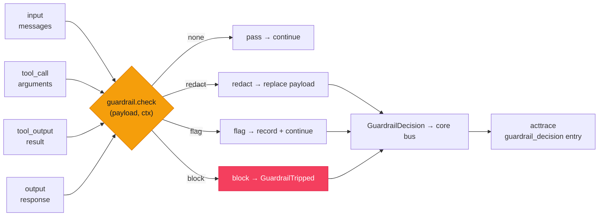

# `cendor-guardrails` — gate

A local-first gate for LLM apps. Define a check — a denied keyword, a regex, a URL allowlist, a
length bound, a JSON-schema — attach it to a stage, and **block, redact, or flag** before the model
or a tool ever runs. Deterministic checks run in microseconds for $0, offline, with no account and
no model call — and every decision lands in the same tamper-evident audit chain the rest of the
stack writes to.

> **Deterministic ≠ adversarial protection.** The built-ins catch what you tell them to catch —
> exact keywords, patterns, hosts, sizes, shapes. They do **not** stop a *novel* jailbreak they were
> never told about. Treat them as the fast, free floor and pair them with a bring-your-own model
> judge for open-ended risk (see [Honest limits](#honest-limits)). There are no jailbreak-detection
> or PII-catch-rate claims here.

<!-- tabs: lang -->
<!-- tab: Python -->

```bash
pip install cendor-guardrails
```

<!-- tab: TypeScript -->

```bash
npm i @cendor/guardrails
```

<!-- /tabs -->

## Quickstart

Attach a few rules to the interceptor seam and every instrumented call is gated — no framework
required:

<!-- tabs: lang -->
<!-- tab: Python -->

```python
from cendor.core import instrument
from cendor.guardrails import install, rules

client = instrument(OpenAI())
install([
    rules.keyword_deny(["ignore previous instructions"], action="block"),  # prompt-injection floor
    rules.regex_rule(r"\bsk-[A-Za-z0-9]{20,}\b", action="redact", stage="input"),  # scrub leaked keys
    rules.url_allowlist(["docs.cendor.ai"], stage="input"),                # only sanctioned links
])

client.chat.completions.create(model="gpt-4o", messages=msgs)
# a blocked prompt -> raises GuardrailTripped BEFORE the request is sent ($0 spent)
# a leaked key    -> the provider receives "[redacted]" instead of the secret
```

<!-- tab: TypeScript -->

```ts
import { instrument } from '@cendor/core';
import { install, rules } from '@cendor/guardrails';

const client = instrument(new OpenAI());
install([
  rules.keywordDeny(['ignore previous instructions'], { action: 'block' }), // prompt-injection floor
  rules.regexRule(/\bsk-[A-Za-z0-9]{20,}\b/, { action: 'redact', stage: 'input' }), // scrub leaked keys
  rules.urlAllowlist(['docs.cendor.ai'], { stage: 'input' }), // only sanctioned links
]);

await client.chat.completions.create({ model: 'gpt-4o', messages: msgs });
// a blocked prompt -> throws GuardrailTripped BEFORE the request is sent ($0 spent)
// a leaked key    -> the provider receives "[redacted]" instead of the secret
```

<!-- /tabs -->

Or gate a payload directly, without touching a client:

<!-- tabs: lang -->
<!-- tab: Python -->

```python
from cendor.guardrails import apply, guardrail, Verdict, GuardrailTripped

@guardrail(stage="output")
def must_be_json(payload, ctx):
    if not payload.strip().startswith("{"):
        return Verdict("block", reason="expected a JSON object")

try:
    apply([must_be_json], "output", model_text)     # raises GuardrailTripped on a block
except GuardrailTripped as e:
    print(e.decisions)                                # the recorded decisions, block last
```

<!-- tab: TypeScript -->

```ts
import { apply, defineGuardrail, GuardrailTripped, Verdict } from '@cendor/guardrails';

const mustBeJson = defineGuardrail(
  (payload) =>
    typeof payload === 'string' && !payload.trim().startsWith('{')
      ? new Verdict('block', 'expected a JSON object')
      : null,
  { stage: 'output' },
);

const modelText = '{"ok": true}';
try {
  apply([mustBeJson], 'output', modelText); // throws GuardrailTripped on a block
} catch (e) {
  if (e instanceof GuardrailTripped) console.log(e.decisions); // recorded decisions, block last
}
```

<!-- /tabs -->

> **Try it end to end.** The guardrails recipe — a blocked call proving `$0.00` spent, plus a redact
> round-trip and the `guardrail_decision` audit entry — is in the [Cookbook](/cookbook).

## Core concepts

### The four stages
A guardrail is attached to one or more **intervention points**, matching Azure Foundry's
intervention points and OpenAI's four decorator types:

| Stage | Gates | Payload the check sees |
|---|---|---|
| `input` | the user turn, before the model call | the outgoing `messages` |
| `tool_call` | the model's request to call a tool | the tool's arguments |
| `tool_output` | a tool's result, before the model sees it | the tool's return value |
| `output` | the model's final answer | the response text |

Output-only guardrails can't stop a tool's side effects — that's why the tool stages exist. Gate the
`tool_call` to stop a dangerous action *before* it runs.

### Verdicts & actions
A check returns a `Verdict` to trip, or `None` to pass. The action mirrors `acttrace`'s vocabulary
so a guardrail decision and a policy flag read the same in an audit chain:

| Action | Semantics |
|---|---|
| `block` | **fail-closed** — raise `GuardrailTripped`. In the SDK `tool_call` stage, returns `"[blocked by <name>] <reason>"` to the model instead (configurable), so the loop continues without the side effect. |
| `redact` | replace the payload with `Verdict.replacement` and continue (input/output stages; the provider receives the cleaned content). |
| `flag` | record the decision and continue untouched. |

Evaluation is **blocking** (v0): the built-ins are microsecond-scale, so OpenAI-style
run-in-parallel-with-the-model buys nothing here. (An LLM-judge adapter is the case where a parallel
mode would pay off; it's revisited when that adapter is popular.)

### Evidence, not just enforcement
Every trip or flag emits a `GuardrailDecision` on `cendor.core`'s bus. If an `AuditLog` is attached,
it chains that decision as a tamper-evident `guardrail_decision` entry — recording the guardrail
name, stage, action, and a short reason, **never the raw payload**. "We blocked it" is in the hash
chain, not a log line. This works with **no import** between the two libraries: `acttrace`
duck-types the decision, exactly as it does contextkit's assembly report. See the
[bus-events spec](https://github.com/cendorhq/cendor-libs/blob/main/docs/specs/bus-events.md).

### Three ways to use it
- **Pure** — `apply(guardrails, stage, payload)` / `evaluate(...)` gate a payload directly (sync;
  `apply_async` / `evaluate_async` for async checks). `apply` raises on a block and returns the
  recorded decisions; `evaluate` also returns the (possibly redacted) payload.
- **Framework-independent** — `install(guardrails)` registers **one** `cendor.core` interceptor so
  every instrumented client call is gated, under any framework or a bare SDK. `uninstall()` removes
  it.
- **In an agent loop** — `cendor-sdk`'s `Agent(guardrails=[…])` wires all four stages, with a
  per-run override. See the [SDK guardrails page](/docs/sdk/guardrails).

### Built-in rules — deterministic only
This is the local-first claim: regex and arithmetic, no ML, no network.

| Rule | Trips when… |
|---|---|
| `keyword_deny(words)` | any denied word appears (substring, case-insensitive by default) |
| `regex_rule(pattern)` | the pattern matches; `action="redact"` substitutes each match |
| `url_allowlist(domains)` / `url_deny(domains)` | a URL's host is not allowlisted / is denied (subdomains match) |
| `length_bounds(max_chars=, max_tokens=)` | the payload exceeds a char and/or **exact token** bound (tokens via `cendor.core.tokens`) |
| `json_schema(schema)` | the output isn't valid JSON, or violates a minimal `type`/`required`/`properties`/`items` schema |
| `custom(fn)` | your `fn(payload, ctx)` returns a `Verdict` (sync or async) |

**Deliberately not built in.** PII/secret detection lives in `acttrace`'s validator-gated detector
catalogue — reach for [`guard(Policy…)`](acttrace.md#enforcing-a-policy-with-guard) so there's one
detection engine, not two. ML classifiers, jailbreak detection, and dialog rails are out of scope
for v0. `llm_judge(judge)` is an **adapter contract**, not a bundled classifier — you supply the
model call; cendor ships no model.

## Functions & classes

### The rules

<!-- tabs: lang -->
<!-- tab: Python -->

```python
from cendor.guardrails import rules

rules.keyword_deny(words, *, stage="input", action="block", name=None, ignore_case=True)
rules.regex_rule(pattern, *, action="flag", stage="input", name=None, replacement="[redacted]", flags=0)
rules.url_allowlist(domains, *, stage="input", action="block", name=None)
rules.url_deny(domains, *, stage="input", action="block", name=None)
rules.length_bounds(*, max_chars=None, max_tokens=None, model="gpt-4o", stage="input", action="block", name=None)
rules.json_schema(schema, *, stage="output", action="block", name=None)
rules.custom(fn, *, stage="input", name=None)
rules.llm_judge(judge, *, stage="output", action="block", name="llm_judge")   # adapter contract — BYO model
```

<!-- tab: TypeScript -->

<!-- ts-check: skip -->

```ts
import { rules } from '@cendor/guardrails';

rules.keywordDeny(words, { stage: 'input', action: 'block', name, ignoreCase: true });
rules.regexRule(pattern, { action: 'flag', stage: 'input', name, replacement: '[redacted]' });
rules.urlAllowlist(domains, { stage: 'input', action: 'block', name });
rules.urlDeny(domains, { stage: 'input', action: 'block', name });
rules.lengthBounds({ maxChars, maxTokens, model: 'gpt-4o', stage: 'input', action: 'block', name });
rules.jsonSchema(schema, { stage: 'output', action: 'block', name });
rules.custom(fn, { stage: 'input', name });
rules.llmJudge(judge, { stage: 'output', action: 'block', name: 'llm_judge' }); // adapter — BYO model
```

<!-- /tabs -->

Every factory returns a `Guardrail(name, stages, check)`. `stage` accepts a single stage or an array
of stages (`defineGuardrail(check, { stage })` in TypeScript — JS has no function decorators).

### `Guardrail` & the `@guardrail` decorator
Build a guardrail directly, or decorate a `check(payload, ctx) -> Verdict | None` function:

<!-- tabs: lang -->
<!-- tab: Python -->

```python
from cendor.guardrails import guardrail, Verdict

@guardrail(stage=("input", "output"))          # one or more of the four stages
def no_ssn(payload, ctx):
    if "ssn" in str(payload).lower():
        return Verdict("block", reason="SSN mentioned")
    # return None (or nothing) to pass
```

<!-- tab: TypeScript -->

```ts
import { defineGuardrail, Verdict } from '@cendor/guardrails';

const noSsn = defineGuardrail(
  (payload) =>
    String(payload).toLowerCase().includes('ssn')
      ? new Verdict('block', 'SSN mentioned')
      : null, // return null to pass
  { stage: ['input', 'output'] }, // one or more of the four stages
);
```

<!-- /tabs -->

The `check` receives a `Context` (`stage`, `agent`, `tool`, `toolArgs`, `traceId`, `metadata`) — all
optional, so a standalone check can ignore it.

### `apply` / `evaluate` (+ async)

| Name | Signature | What it does |
|---|---|---|
| `apply` | `apply(guardrails, stage, payload, ctx=None) -> list[GuardrailDecision]` | Gate `payload`; raise `GuardrailTripped` on a block; return the decisions. |
| `evaluate` | `evaluate(guardrails, stage, payload, ctx=None) -> tuple[payload, list[GuardrailDecision]]` | Like `apply`, but also returns the (possibly redacted) payload. |
| `apply_async` / `evaluate_async` | same, `async` | Await `async` checks; call sync ones directly. |

Sync `apply`/`evaluate` raise `TypeError` on an `async` check — use the async pair for those.

### `install` / `uninstall`
`install(guardrails)` registers one `cendor.core` interceptor plus an output-stage bus subscriber;
`uninstall()` removes them. The interceptor runs **sync checks only** (the seam is synchronous). The
standalone `output` stage is **post-flight** — it inspects the completed call and raises after it
ran (the same overshoot semantics as `tokenguard`'s `on_exceed="raise"`); the SDK's in-loop output
stage pre-empts instead.

### Exceptions
`GuardrailTripped` carries `.decisions` (the list recorded up to and including the block).

## How it works



1. **Check.** For each guardrail attached to the stage, the check sees the payload + context and
   returns a `Verdict` or `None`.
2. **Act.** `block` raises (fail-closed); `redact` swaps the payload and carries on; `flag` records
   and continues.
3. **Emit.** Every trip/flag emits a `GuardrailDecision` on the bus — *before* a block raises, so the
   decision is on the audit chain first.
4. **Chain.** An attached `AuditLog` records it as a tamper-evident `guardrail_decision` entry, by
   duck typing — no import between the libraries.

## Plugs into the stack

**Inbound, at the seam.** `guardrails` is the **Gate** in the pipeline — `contextkit → squeeze →
tokenguard → guardrails → cassette → acttrace`. It imports **only** `cendor-core`: checks ride the
same `instrument()` interceptor and event bus every other library uses, so the same guardrail
applies under the `cendor-sdk` loop, a bare instrumented OpenAI/Anthropic/Gemini/Bedrock/Ollama
client, or beneath another framework — in Python and TypeScript alike. Decisions flow to `acttrace`
over the bus; nothing is imported in either direction.

## Honest limits

- **Deterministic checks do not stop novel adversarial attacks.** The built-ins match exactly what
  you configure — keywords, patterns, hosts, sizes, shapes. A jailbreak phrased in a way they were
  never told about will pass. For open-ended risk, add a `llm_judge` adapter (your model call) and
  treat the deterministic rules as the free floor, not a ceiling.
- **An LLM judge costs real tokens and real latency.** Where the deterministic rules are microseconds
  and $0, an extra model call is typically **seconds** and billed. `llm_judge` is an adapter contract
  precisely so that cost is yours to see and own — measure it; don't assume it.
- **The standalone `output` stage is post-flight.** Via `install()`, output guardrails inspect the
  *completed* call and raise after it ran (and was billed). Streamed deltas already shown can't be
  unshown. The SDK's in-loop output stage evaluates before the terminal event, but the same
  already-streamed caveat applies.
- **PII/secret detection isn't here.** Use `acttrace`'s `guard(Policy…)` for validator-gated
  detectors — one detection engine, kept in one place.
