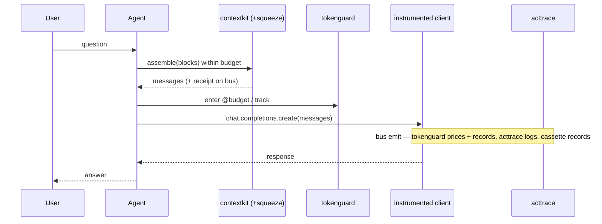

# Guides & Recipes

Practical, copy-paste recipes. The headline is the **full-stack support agent** — one
`instrument()` call, and budgeting, context assembly, compression, record/replay, and auditing all
cooperate.

## Lifecycle of one turn



## Recipe: the full-stack support agent

<!-- tabs: lang -->
<!-- tab: Python -->

```python
from cendor.core import instrument
from cendor.contextkit import Context, Block
from cendor.tokenguard import budget, track, report
from cendor.acttrace import AuditLog

client = instrument(OpenAI())
audit  = AuditLog(system="support_bot", risk_tier="limited", signing_key="ops-key")

@budget(usd=0.30, on_exceed="downgrade", downgrade={"gpt-4o": "gpt-4o-mini"})
def handle(user_msg: str, docs: str) -> str:
    ctx = Context(budget_tokens=8000, model="gpt-4o", reserve_output=500, order="attention")
    ctx.add(Block(SYSTEM_PROMPT, priority=10, pin=True, role="system"))
    ctx.add(Block(docs, priority=5, evict="compress"))          # squeeze shrinks if oversized
    ctx.add(Block(user_msg, priority=9, pin=True, role="user"))
    with audit.decision(input=user_msg, actor="agent") as d:
        with track(feature="support_bot", user_id="alice"):
            resp = client.chat.completions.create(model="gpt-4o", messages=ctx.assemble())
        d.record(model="gpt-4o", prompt_id="support@v2")
        return resp.choices[0].message.content

answer = handle("I was charged twice", retrieved_docs)
print(report(group_by=["feature"]))          # spend per feature
audit.export("evidence.jsonl", framework="eu_ai_act")
```

<!-- tab: TypeScript -->

```ts
import OpenAI from 'openai';
import { instrument } from '@cendor/core';
import { Context, Block } from '@cendor/contextkit';
import { budget, track, report } from '@cendor/tokenguard';
import { AuditLog } from '@cendor/acttrace';

const client = instrument(new OpenAI());
const audit  = new AuditLog('support_bot', { riskTier: 'limited', signingKey: 'ops-key' });

const handle = budget({ usd: 0.30, onExceed: 'downgrade', downgrade: { 'gpt-4o': 'gpt-4o-mini' } })(
  async (userMsg: string, docs: string) => {
    const ctx = new Context({ budgetTokens: 8000, model: 'gpt-4o',
                              reserveOutput: 500, order: 'attention' });
    ctx.add(new Block(SYSTEM_PROMPT, { priority: 10, pin: true, role: 'system' }));
    ctx.add(new Block(docs, { priority: 5, evict: 'compress' }));  // @cendor/squeeze shrinks if oversized
    ctx.add(new Block(userMsg, { priority: 9, pin: true, role: 'user' }));
    return audit.decision(async (d) => {
      const messages = await ctx.assemble();
      const resp = await track({ feature: 'support_bot', userId: 'alice' }, () =>
        client.chat.completions.create({ model: 'gpt-4o', messages }));
      d.record({ model: 'gpt-4o', prompt_id: 'support@v2' });
      return resp.choices[0].message.content;
    }, { input: userMsg, actor: 'agent' });
  });

const answer = await handle('I was charged twice', retrievedDocs);
console.log(report(['feature']));            // spend per feature
audit.export('evidence.jsonl', 'eu_ai_act');
```

<!-- /tabs -->

## Recipe: cap a runaway loop

<!-- tabs: lang -->
<!-- tab: Python -->

```python
@budget(usd=0.50, on_exceed="raise")   # raises BudgetExceeded once the cap is breached
def agent_loop(task): ...
```

<!-- tab: TypeScript -->

```ts
const agentLoop = budget({ usd: 0.50, onExceed: 'raise' })(  // throws BudgetExceeded at the cap
  async (task) => { /* ... */ });
```

<!-- /tabs -->

## Recipe: a deterministic, offline agent test

<!-- tabs: lang -->
<!-- tab: Python -->

```python
from cendor import cassette

@cassette.use("tests/fixtures/triage.json")   # records once, replays forever
def test_triage():
    out = my_agent.run("refund please")
    assert cassette.semantic_match(out, "offers a refund")
```

<!-- tab: TypeScript -->

```ts
import * as cassette from '@cendor/cassette';

test('triage', () =>
  cassette.using('tests/fixtures/triage.json', async () => {  // records once, replays forever
    const out = await myAgent.run('refund please');
    expect(cassette.semanticMatch(out, 'offers a refund')).toBe(true);
  }));
```

<!-- /tabs -->

## Recipe: shrink a huge tool response before it enters context

<!-- tabs: lang -->
<!-- tab: Python -->

```python
from cendor.squeeze import compress
small, handle = compress(api_response, kind="auto", target_tokens=800)
ctx.add(Block(small, priority=5))
full = handle.expand()   # restore later if the model needs the original
```

<!-- tab: TypeScript -->

```ts
import { compress } from '@cendor/squeeze';
const [small, handle] = compress(apiResponse, { kind: 'auto', targetTokens: 800 });
ctx.add(new Block(small, { priority: 5 }));
const full = handle.expand();  // restore later if the model needs the original
```

<!-- /tabs -->

## Recipe: audit + verify offline

<!-- tabs: lang -->
<!-- tab: Python -->

```python
from cendor.acttrace import AuditLog, verify
audit = AuditLog(system="loan", risk_tier="high", path="audit.jsonl", signing_key="k")
# ... decisions ...
ok, detail = verify("audit.jsonl", key="k")   # True unless the chain was tampered
```

<!-- tab: TypeScript -->

```ts
import { AuditLog, verify } from '@cendor/acttrace';
const audit = new AuditLog('loan', { riskTier: 'high', path: 'audit.jsonl', signingKey: 'k' });
// ... decisions ...
const [ok, detail] = verify('audit.jsonl', { key: 'k' });  // true unless the chain was tampered
```

<!-- /tabs -->

## Recipe: block disallowed input, audited
`acttrace.guard()` enforces a policy on `core`'s interceptor seam and records every decision;
the blocked call never reaches the model, so the `policy_flag` is its only record. The full
walkthrough (actions, presets, custom `on_block`, offline verification) is in
[acttrace → Enforcing a policy](acttrace.md#enforcing-a-policy-with-guard).

<!-- tabs: lang -->
<!-- tab: Python -->

```python
from cendor.core.instrument import add_interceptor
from cendor.acttrace import AuditLog, Policy, guard

audit = AuditLog(system="support_bot", risk_tier="high")
add_interceptor(guard(Policy.gdpr(), audit=audit))   # block special-category, redact PII — audited
```

<!-- tab: TypeScript -->

```ts
import { addInterceptor } from '@cendor/core';
import { AuditLog, Policy, guard } from '@cendor/acttrace';

const audit = new AuditLog('support_bot', { riskTier: 'high' });
addInterceptor(guard(Policy.gdpr(), audit));   // block special-category, redact PII — audited
```

<!-- /tabs -->

For a bespoke rule, write the interceptor by hand — return `MISS` to proceed, `flag()` then
`raise` to block:

<!-- tabs: lang -->
<!-- tab: Python -->

```python
from cendor.core.instrument import add_interceptor, MISS
from cendor.core.types import LLMCall
from cendor.acttrace import PolicyViolation

def block_pii(call):                                     # a pre-flight guard on the seam
    if isinstance(call, LLMCall) and contains_pii(call.messages):   # YOUR rule
        audit.flag("PII in prompt", action="blocked")               # acttrace records the refusal
        raise PolicyViolation("blocked")                            # your guard enforces it
    return MISS

add_interceptor(block_pii)   # the blocked call never reaches the model — flag() is its only record
```

<!-- tab: TypeScript -->

```ts
import { addInterceptor, MISS, LLMCall } from '@cendor/core';
import { PolicyViolation } from '@cendor/acttrace';

addInterceptor((call) => {                               // a pre-flight guard on the seam
  if (call instanceof LLMCall && containsPii(call.messages)) {      // YOUR rule
    audit.flag('PII in prompt', { action: 'blocked' });             // acttrace records the refusal
    throw new PolicyViolation('blocked');                           // your guard enforces it
  }
  return MISS;
});  // the blocked call never reaches the model — flag() is its only record
```

<!-- /tabs -->
