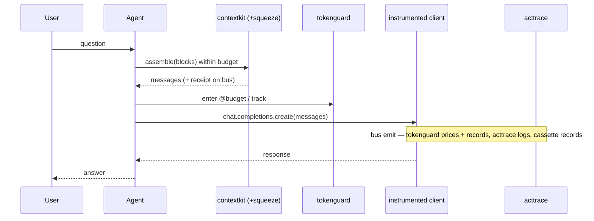

# Guides & Recipes

Practical, copy-paste recipes. The headline is the **full-stack support agent** — one
`instrument()` call, and budgeting, context assembly, compression, record/replay, and auditing all
cooperate.

## Lifecycle of one turn



## Recipe: the full-stack support agent

```python
from cendor.core import instrument
from cendor.contextkit import Context, Block
from cendor.tokenguard import budget, track, report
from cendor.acttrace import AuditLog

client = instrument(OpenAI())
audit  = AuditLog(system="support_bot", risk_tier="limited", signing_key="ops-key")

@budget(usd=0.30, on_exceed="downgrade", downgrade={"gpt-4o": "gpt-4o-mini"})
def handle(user_msg: str, docs: str) -> str:
    ctx = Context(budget_tokens=8000, model="gpt-4o", reserve_output=500, order="attention")
    ctx.add(Block(SYSTEM_PROMPT, priority=10, pin=True, role="system"))
    ctx.add(Block(docs, priority=5, evict="compress"))          # squeeze shrinks if oversized
    ctx.add(Block(user_msg, priority=9, pin=True, role="user"))
    with audit.decision(input=user_msg, actor="agent") as d:
        with track(feature="support_bot", user_id="alice"):
            resp = client.chat.completions.create(model="gpt-4o", messages=ctx.assemble())
        d.record(model="gpt-4o", prompt_id="support@v2")
        return resp.choices[0].message.content

answer = handle("I was charged twice", retrieved_docs)
print(report(group_by=["feature"]))          # spend per feature
audit.export("evidence.jsonl", framework="eu_ai_act")
```

## Recipe: cap a runaway loop
```python
@budget(usd=0.50, on_exceed="raise")   # raises BudgetExceeded once the cap is breached
def agent_loop(task): ...
```

## Recipe: a deterministic, offline agent test
```python
from cendor import cassette

@cassette.use("tests/fixtures/triage.json")   # records once, replays forever
def test_triage():
    out = my_agent.run("refund please")
    assert cassette.semantic_match(out, "offers a refund")
```

## Recipe: shrink a huge tool response before it enters context
```python
from cendor.squeeze import compress
small, handle = compress(api_response, kind="auto", target_tokens=800)
ctx.add(Block(small, priority=5))
full = handle.expand()   # restore later if the model needs the original
```

## Recipe: audit + verify offline
```python
from cendor.acttrace import AuditLog, verify
audit = AuditLog(system="loan", risk_tier="high", path="audit.jsonl", signing_key="k")
# ... decisions ...
ok, detail = verify("audit.jsonl", key="k")   # True unless the chain was tampered
```

## Recipe: block disallowed input, audited
Your guard enforces on `core`'s interceptor seam; `acttrace` records the refusal. The full,
runnable version (with a real SSN policy and offline verification) is in
[acttrace → Flagging input](acttrace.md#flagging-input-that-shouldnt-be-processed).

```python
from cendor.core.instrument import add_interceptor, MISS
from cendor.core.types import LLMCall

def guard(call):                                          # a pre-flight guard on the seam
    if isinstance(call, LLMCall) and contains_pii(call.messages):   # YOUR rule
        audit.flag("PII in prompt", action="blocked")               # acttrace records the refusal
        raise PolicyViolation("blocked")                            # your guard enforces it
    return MISS

add_interceptor(guard)   # the blocked call never reaches the model — flag() is its only record
```
