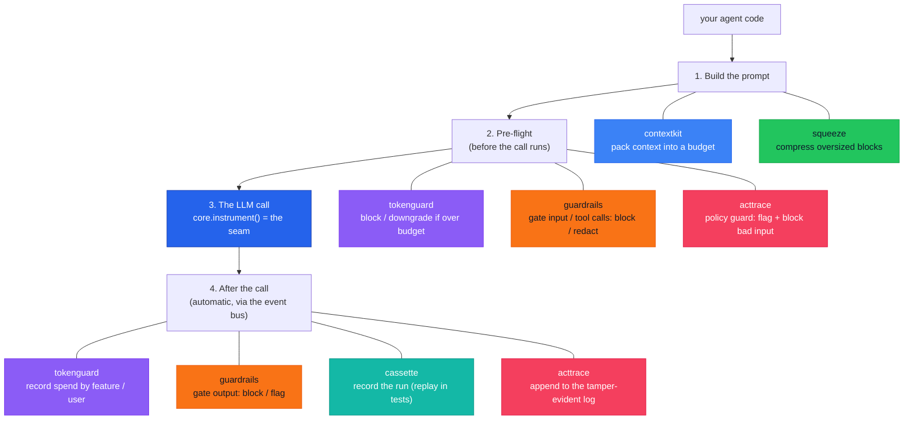

# Cendor

**Production plumbing for LLM applications.**

Composable primitives for context, cost, guardrails, testing, and governance — the layer beneath
your LLM app. Framework-agnostic · local-first · offline by default · Apache-2.0. Available for
**Python** (`cendor.*` on PyPI) and **TypeScript/JavaScript** (`@cendor/*` on npm) — see
[Languages & parity](languages.md).

## The problem

You shipped an LLM agent. Then production happened:

- 🧠 **Prompts overflow the context window** — and naive truncation drops exactly the wrong things.
- 💸 **Cost is a black box** — a looping agent quietly burns money, and you can't say which feature or user spent it.
- 🧪 **You can't test it** — every run hits a paid, non-deterministic API, so there are no fast, repeatable tests.
- 📋 **There's no audit trail** — you can't show what the agent saw, did, cost, or *refused to do*.

Agent frameworks (LangChain, LlamaIndex, the provider SDKs) decide *what* your agent does. They
don't handle these cross-cutting, *under-the-call* concerns. **Cendor does — and you keep your
framework.**

Using **LangChain or LangGraph**? Cendor plugs into the framework's own callback system —
`CendorCallbackHandler` records usage, cost, reasoning, tool calls, and run-correlation with no
client change. Calling a provider SDK directly? One `instrument()` wrap adds the same recording
*plus* full enforcement (budgets, redact-before-send, replay). See
[Providers → Frameworks](providers.md#frameworks-langchain--langgraph).

## The fix: wrap your client once, every tool plugs in

<!-- tabs: lang -->
<!-- tab: Python -->

```python
from cendor.core import instrument
client = instrument(OpenAI())   # ← the one line you change
```

<!-- tab: TypeScript -->

```ts
import { instrument } from '@cendor/core';
const client = instrument(new OpenAI());   // ← the one line you change
```

<!-- /tabs -->

That single wrap publishes every LLM and tool call onto an in-process **event bus**. Each library
*subscribes* — none patches your client, none imports another — so you add budgeting, recording, or
auditing with **zero per-call wiring**. Read the diagram top to bottom: it's one request's lifecycle,
with each library labelled **where it acts**.



**tokenguard**, **guardrails**, and **acttrace** each appear twice: they run *before* the call (cap
spend / gate the input / guard bad input) **and** *after* it (record cost / gate the output / append
to the log).

## The seven libraries

Each solves one of those problems, and each works on its own:

| Library | Solves | In one line |
|---|---|---|
| [contextkit](contextkit.md) | prompts overflow | Pack prioritized blocks into a token budget; get a receipt of what was kept / shrunk / dropped. |
| [squeeze](squeeze.md) | a blob is too big | Content-aware, deterministic compression (JSON / logs / code / prose) — fully reversible. |
| [tokenguard](tokenguard.md) | runaway cost | Cap spend before a call runs (block / downgrade), and attribute cost per feature / user. |
| [guardrails](guardrails.md) | unsafe input / output | A deterministic gate at four stages (input / tool call / tool output / output) — block / redact / flag, offline, audit-evidenced. |
| [cassette](cassette.md) | can't test agents | Record a whole run once (LLM + tool calls), replay it forever — offline, deterministic. |
| [acttrace](acttrace.md) | no audit trail | Pre-send guard for secrets & PII (block / redact) **and** a tamper-evident, offline-verifiable decision log with compliance evidence packs. |
| [core](core.md) | the shared glue | Types, token counting, offline-first prices, the `instrument()` seam, and the event bus every tool rides. |

Read the table as **one call's lifecycle, not a dependency chain**: contextkit and squeeze shape the
prompt; tokenguard and guardrails act before send; then cassette records, guardrails re-gates the
output, and acttrace guards and audits — every library works standalone, all cooperating on
`cendor-core`'s event bus. The [architecture](architecture.md#the-mental-model) diagram shows exactly
where each one acts.

All seven are **published on PyPI** (Python) and as **`@cendor/*` on npm** (TypeScript/JS), green
in CI in both languages. Cross-language artifacts interoperate byte-for-byte — a cassette
recorded in Python replays in TypeScript, an audit chain written in TypeScript verifies in
Python. The full feature split is in [Languages & parity](languages.md).

## Install

<!-- tabs: lang -->
<!-- tab: Python -->

```bash
pip install cendor-libs       # the whole stack (`cendor` is an alias)
pip install cendor-tokenguard # or any single tool (pulls cendor-core transitively)
```

Every package imports under the `cendor.*` namespace.

<!-- tab: TypeScript -->

```bash
npm i @cendor/libs            # the whole stack (umbrella)
npm i @cendor/tokenguard      # or any single tool (pulls @cendor/core transitively)
```

Every package lives under the `@cendor/*` npm scope. ESM-only; Node LTS first, edge runtimes
supported.

<!-- /tabs -->

## Libraries or the SDK?

These docs cover the seven libraries — the door for teams that already have a loop (LangChain,
LlamaIndex, or direct provider-SDK calls) and want governance **beneath** it. Cendor's second
door is [**cendor-sdk**](/docs/sdk): a governed agent loop (`Agent`, `tool`, `run`) built *on*
these libraries, for teams starting fresh. Both doors expose the same primitives — `budget`,
`guard`, `Policy`, `AuditLog`, `trace` are the same objects — so you can mix them in one process
and move between them without a migration. Unsure which fits?
[FAQ → libraries or SDK](/docs/sdk/faq).

> **Prefer to read code?** The [Cookbook](/cookbook) has the full-stack support agent — one
> `instrument()` call, the whole stack cooperating — as one copy-paste block.

## Where to go next

- **[Getting Started](getting-started.md)** — install, the one idea (`instrument` once), and a first budgeted, audited call.
- **[Architecture](architecture.md)** — the layers, the `instrument()` seam, the event bus, and the dependency graph.
- **[Providers & Integration](providers.md)** — OpenAI / Anthropic / Bedrock / Gemini / Ollama, managed runtimes via OpenTelemetry, and LangChain / LangGraph via a callback handler.
- **[Guides & Recipes](guides.md)** — copy-paste recipes, including the full-stack support agent.
- **[Languages & parity](languages.md)** — Python ↔ TypeScript: what's ported, what's Python-only.
- **[Benchmarks](benchmarks.md)** — reproducible, offline numbers for every package.
- **[FAQ](faq.md)** — common questions.
- **[The SDK docs](/docs/sdk)** — the second door: a governed agent loop built on these libraries.
