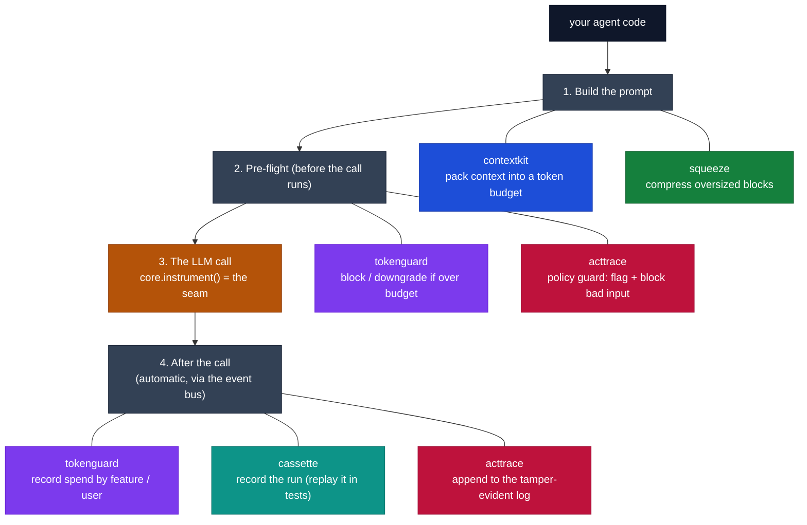

# Cendor

**Production plumbing for LLM applications.**

Composable Python primitives for context, cost, testing, and governance — the layer beneath your
LLM app. Framework-agnostic · local-first · offline by default · Apache-2.0.

## The problem

You shipped an LLM agent. Then production happened:

- 🧠 **Prompts overflow the context window** — and naive truncation drops exactly the wrong things.
- 💸 **Cost is a black box** — a looping agent quietly burns money, and you can't say which feature or user spent it.
- 🧪 **You can't test it** — every run hits a paid, non-deterministic API, so there are no fast, repeatable tests.
- 📋 **There's no audit trail** — you can't show what the agent saw, did, cost, or *refused to do*.

Agent frameworks (LangChain, LlamaIndex, the provider SDKs) decide *what* your agent does. They
don't handle these cross-cutting, *under-the-call* concerns. **Cendor does — and you keep your
framework.**

## The fix: wrap your client once, every tool plugs in

```python
from cendor.core import instrument
client = instrument(OpenAI())   # ← the one line you change
```

That single wrap publishes every LLM and tool call onto an in-process **event bus**. Each library
*subscribes* — none patches your client, none imports another — so you add budgeting, recording, or
auditing with **zero per-call wiring**.



Read it top to bottom — that's one request's lifecycle, with each library labelled **where it acts**.
**tokenguard** and **acttrace** each appear twice: they run *before* the call (cap spend / guard the
input) **and** *after* it (record cost / append to the log).

## The six libraries

Each solves one of those problems, and each works on its own:

| Library | Solves | In one line |
|---|---|---|
| [contextkit](contextkit.md) | prompts overflow | Pack prioritized blocks into a token budget, evict by rule, and get a receipt of what was kept / shrunk / dropped. |
| [squeeze](squeeze.md) | a blob is too big | Content-aware, deterministic compression (JSON / logs / code / prose) — fully reversible, byte-for-byte. |
| [tokenguard](tokenguard.md) | runaway cost | Cap spend before a call runs (block / downgrade), and attribute cost per feature / user. |
| [cassette](cassette.md) | can't test agents | Record a whole run once (LLM + tool calls), replay it forever — offline, deterministic. |
| [acttrace](acttrace.md) | no audit trail | Tamper-evident, offline-verifiable decision log + policy flags, with compliance evidence packs. |
| [core](core.md) | the shared glue | Types, token counting, offline-first prices (refreshable from live no-auth sources, with estimate-vs-billed labeling), the `instrument()` seam, and the event bus every tool rides. |

```
contextkit  →  squeeze  →  tokenguard  →  cassette  →  acttrace
 assemble       compress      budget         test         audit
```

All six are **published on PyPI** and green in CI (offline tests · ruff · mypy).

## Install

```bash
pip install cendor            # the whole stack
pip install cendor-tokenguard # or any single tool (pulls cendor-core transitively)
```

Every package imports under the `cendor.*` namespace.

## Where to go next

- **[Getting Started](getting-started.md)** — install, the one idea (`instrument` once), and a first budgeted, audited call.
- **[Architecture](architecture.md)** — the layers, the `instrument()` seam, the event bus, and the dependency graph.
- **[Providers & Integration](providers.md)** — OpenAI / Anthropic / Bedrock / Gemini / Ollama, plus managed runtimes via OpenTelemetry.
- **[Guides & Recipes](guides.md)** — copy-paste recipes, including the full-stack support agent.
- **[Benchmarks](benchmarks.md)** — reproducible, offline numbers for every package.
- **[FAQ](faq.md)** — common questions.
