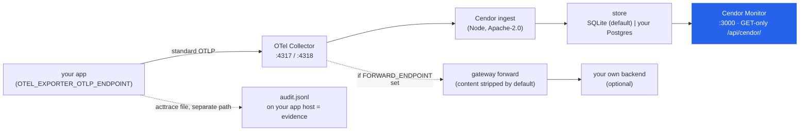

# Cendor Monitor — watch your governed agents on your own machine

Cendor emits **standard OpenTelemetry** — one wire, no Cendor-specific exporter, never a Cendor
endpoint. Where it goes is your choice: **your own backend** (Azure Monitor, CloudWatch, Datadog,
Langfuse, any OTLP) for production fleets — or **Cendor Monitor**, a free, open-source, self-hosted
**journey view**, when you want to *see what your agents did and what each run cost* in one screen:
every prompt, token, dollar, and the exact step where a budget or guardrail acted. Same wire either
way; switch or run both without touching code.

Two doors, and a window: the libraries and the SDK are how you *build*; Cendor Monitor is how you
*watch*. It is **optional dev tooling** (like [`cendor-mcp`](https://cendor.ai/docs/assistant-mcp)) —
no library depends on it, and your own OTel backend stays the documented production default. It runs
on **your** infrastructure; Cendor never operates a telemetry endpoint.

## Run it in 60 seconds

One image — the OTel Collector, a small Cendor ingest service, a dual-backend store (SQLite by
default), and the monitor. Run it, point your app's OpenTelemetry at it, and open the monitor:

```bash
# 1. run the monitor (one image; SQLite by default — nothing else to install)
docker run --rm --name cendor-monitor -p 3000:3000 -p 4317:4317 -p 4318:4318 ghcr.io/cendorhq/cendor-monitor:0.12.1

# 2. point your app's OpenTelemetry pipeline at it
export OTEL_EXPORTER_OTLP_ENDPOINT=http://localhost:4318
export OTEL_SERVICE_NAME=my-app          # optional — names your app on the Apps page

# 3. open the monitor
#    http://localhost:3000
```

**That is the whole integration** — a **standard OTLP env var**, no Cendor API, key, or endpoint, and
**no Cendor telemetry code**: with an OpenTelemetry provider configured in your app (which the env var
above plus your usual SDK setup gives you), calls, run trees, spend and enforcement decisions all flow
on their own. Sessions group runs automatically when you pass `run(session=…)`, so there is no trace id
to paste anywhere. Requires cendor-core ≥ 1.13 / @cendor/core ≥ 0.15 (+ cendor-sdk ≥ 1.19 /
@cendor/sdk ≥ 0.22); on older versions attach the emitters explicitly, as
[Observability](observability.md) describes. Nothing arriving? `CENDOR_DEBUG_TELEMETRY=1` prints one
line telling you whether a provider was detected — and `CENDOR_TELEMETRY=off` is the way to stop
sending, with no code change.

## The monitor tour

The monitor is a self-contained view over the same standard wire — no query language, no dashboard to
assemble. Screenshots are of the real monitor rendering a seeded workload (synthetic runs, content
capture opted in for the capture) — the image itself **ships no sample app and fabricates nothing**:
every screen you see is fed by your own runs, and an empty store just means nothing has been sent
yet. _(The shots below are from v0.4.0; the `docker run` above pulls the
current v0.12.0 — the two-doors-split UX (two stores, path-routed Libraries | SDK modes, the SDK
structure pages, the status footer, and the SSE live channel) and the earlier operate-wave (v0.5) are
described in the text and land beyond these panels.)_

### Overview

Land on the Overview: the **Cendor value strip** — *blocked projected spend* (the projection a budget
refused pre-flight — never spent), *tokens saved by compression* (Σ before − after, +%), *replayed
calls ($0)* (a count, not an invented dollar-saving), and *guardrail blocks* — above the fleet tiles
(runs, spend, blocks, errors, p50/p95, TTFT), **dependency-free trend charts**, and cost attribution:
top models, top agents, top users by spend, and spend by feature. A time-range row (1h/24h/7d/30d/all)
and a **Go live** toggle sit up top; every tile clicks through to its rows.


### Agents → Sessions → Runs

Drill from an agent to its sessions to the runs inside them — the drill-down is built from the auto
`gen_ai.conversation.id` your SDK stamps from `run(session=…)`. A session's rollup header + stitched
conversation thread across its runs:


### The run journey — with governance inline

The differentiator: the whole conversation for a run — system / user / assistant / thinking / tool
arguments and results — with **tokens, cost, latency, and time-to-first-token per step**, and the
exact step where a **budget block, guardrail verdict, or compression** fired, shown **inline** in the
conversation (not in a separate log). Prompt/response content appears only if you opted in (below);
without it, the journey shows the same structure metadata-only.

Governance events link back to the run that produced them — a governed run correlates its whole trail
to the run's trace (the run root is the active span; automatic since cendor-sdk 1.19 / @cendor/sdk
0.22, or inside an explicit `live_spans()` / `liveSpans` with sdk ≥ 1.12 / 0.17), and a run built
post-hoc from `span_tree` still links by run id. So a run's governance count is never a dead end: open
the run and every verdict sits on the step it governed.

**You get governance without writing any governance code.** A budget block or guardrail verdict arrives
as a `governance.*` span (`cendor.gov.*` attributes) and renders in the same Governance board and the
same inline run verdicts. If you *do* keep an `AuditLog`, its mirrored `audit.*` entries take over
(richer: chained, hashed, sequenced) and the ops spans stand down, so nothing is shown twice. Either
way the board is an **operational copy** — the hash-chained file on your host is the only thing
`verify()` checks.


### Two doors: SDK runs and libs-only calls (v0.9 — two stores, two modes)

The monitor renders **two doors**, because the two ways to use Cendor put different amounts of
*identity* on the wire — the truth is identical, the shape isn't. A run under **cendor-sdk**
(`live_spans()` / `span_tree()`, scope `cendor.sdk`) carries an `agent.run` root, so it gets the full
**run ▸ session ▸ agent** hierarchy. A **libs-only** app (you called `instrument()` and
`use_span_emitter()` yourself, scope `cendor.core`) emits flat governed calls with no run root —
tokens, cost, and governance are all there (the row rolls them up from its own steps), but there is no
session/agent hierarchy, *by design*. The split adds **no wire attribute** — it reads the OTel
instrumentation-scope name already on every span. Same wire, richer identity: an `sdk` run is never
"more governed" than a `libs` call.

**v0.9 makes the split first-class.** Each door is its **own store** (`/data/libs.db` + `/data/sdk.db`,
or point either at Postgres — mixed mode is supported), and the console has **two full UX modes** with
the door in the URL (`/libs/…`, `/sdk/…` — real routes, so two browser tabs can watch two doors at
once). A persistent **Libraries | SDK** switcher swaps the whole surface; single-door installs never
see it. The **Libraries** mode is Overview · Calls · Governance · Models + the seven proof pages (no
agent/session vocabulary). The **SDK** mode adds Apps · Agents · Sessions · Runs and a **Structure**
group — **Orchestration** (a per-run agent-handoff graph + a fleet flow map), **Tools** (per-tool
invocations, error/block rate, `local` vs `mcp`), **MCP** (servers seen + per-server attribution),
**RAG**, **Memory**, and **Checkpoints** — all rendered from the structural `cendor.sdk` spans the SDK
emits (cendor-sdk ≥ 1.16 / @cendor/sdk ≥ 0.21). A slim **status footer** shows the honest ingest truth
("listening :4318 · last span 12s ago", never "app connected"), each door's store backend + size, and
the image version. **Go Live** streams updates over Server-Sent Events (live *steps*, not live tokens);
it falls back to polling automatically. Fresh v0.9 stores start empty — there is **no migration** from
a pre-v0.9 single store (a dev-phase breaking change; the old volume is left untouched).

### Apps — the libs door's top level (v0.8)

The libs door gets a top-level entity of its own, symmetric with the SDK door's **Agents** page: the
**Apps** page groups every run by its OTel resource **`service.name`**. Each app card rolls up runs,
tokens, spend, governance, errors, and a **distinct-instance count** (from `service.instance.id`, the
standard OTel per-process id) — click through to that app's runs. This answers the "what contains all
of a libs-only app's runs?" question **in-standard**: an app's identity is its own OTel resource, not
anything Cendor invents. Set it with one env var and zero code:

```bash
OTEL_SERVICE_NAME=billing-bot   # (and optionally OTEL_RESOURCE_ATTRIBUTES=service.instance.id=…)
```

Runs with no `service.name` group under an **unnamed** app card that teaches exactly this fix. Nothing
new on the wire — `service.name` was already stored on every run row; v0.8 makes it an entity and adds
the nullable `instance_id` column (an additive, zero-loss schema upgrade).

### Proof pages + the governance stream

A per-library proof page for each of the seven libraries turns the monitor into *proof of the
libraries* — each with a trend chart, a value tile, and the raw event table. tokenguard's page shows
spend attributed **by feature and by user** plus a blocked-projected-spend tile and the budget-events
table (which budget blocked what — projected vs cap); squeeze's shows compression events with
before/after tokens. The Governance page is a typed, filterable stream of every decision, budget
event, and guardrail action.


### Filter, search, and go live

The Runs, Sessions, and Governance lists share a **filter bar** — facet dropdowns (agent / model /
service / label or type), a free-text box, a time-range preset, sort, and paging, all deep-linked in
the URL. The free-text box has a **scope toggle**: *meta* filters the metadata, *content* runs a real
indexed full-text search — but only over what you opted to store (nothing when content capture is
off). A **live** toggle (off by default) polls every few seconds and pauses on a hidden tab.

(The screenshots above follow your theme — dark or light. Cendor Monitor ships both.)

## Turn on content capture (opt-in)

By default the monitor shows **structure** — models, tokens, cost, latency, governance verdicts — but
**not** message content. Prompts, responses, thinking, and tool values are captured **only if you turn
them on**, in your app, with one call (or the standard env var). The monitor never enables it for you.

<!-- tabs: lang -->
<!-- tab: Python -->
```python
from cendor.core import otel

# Opt in. A mask scrubs each message list before export (fail-closed if it raises);
# max_bytes caps each attribute (a truncation marker is appended when hit).
otel.capture_content(mask=lambda msgs: msgs, max_bytes=8192)

# Or set the standard env var instead of code config:
#   OTEL_INSTRUMENTATION_GENAI_CAPTURE_MESSAGE_CONTENT=true
```
<!-- tab: TypeScript -->
```ts
import { otel } from '@cendor/core';

// Opt in. `mask` scrubs each message list before export (fail-closed if it throws);
// `maxBytes` caps each attribute (a truncation marker is appended when hit).
otel.captureContent({ mask: (msgs) => msgs, maxBytes: 8192 });

// Or set the standard env var instead of code:
//   OTEL_INSTRUMENTATION_GENAI_CAPTURE_MESSAGE_CONTENT=true
```
<!-- /tabs -->

Where content lands: your store volume only (or your Postgres). In **gateway mode** (below), the
container **strips content attributes by default** when forwarding upstream — you opt in again with
`CENDOR_MONITOR_FORWARD_CONTENT=true`. Content **never** enters the acttrace evidence chain or its
`OTelMirror` — `audit.*` stays content-free, and you delete captured content on your own retention
schedule. See [content capture](observability.md#content-capture--opt-in-off-by-default).

## Configuration

The container is configured entirely through environment variables — no config files to mount. The
monitor reads a safe subset at boot (default theme, retention, storage backend *type*, whether forward
/ auth are on) — **never** the Postgres DSN, the auth password, or the forward URL. The Settings page
shows the effective config and builds the exact `docker run` / compose command to change it:


| Variable | Default | What it does |
|---|---|---|
Since **v0.10.0** the two doors are configured independently: anything that governs a door's data or
its view exists once **per door** (`…_LIBS` / `…_SDK`, no container-wide fallback) and appears only on
that door's Settings page; the handful of settings that govern the container itself live on the
door-less Container page. Pre-v0.10.0 container-wide names were removed — the container maps a legacy
value forward onto both doors and logs a deprecation warning, so nothing changes silently on upgrade.

| Variable | Default | What it does |
|---|---|---|
| `OTEL_EXPORTER_OTLP_ENDPOINT` | — | *Set in your **app**, not the container* — `http://localhost:4318`. The whole integration. |
| `CENDOR_MONITOR_DB_LIBS` / `_DB_SDK` | *(unset → embedded SQLite)* | **Per door.** External **Postgres** DSN (`postgres://…`, ≥ 14) for that door; unset ⇒ embedded SQLite (WAL) on `/data`. Mixed mode (one door Postgres, one SQLite) is first-class. One image; Postgres is never bundled. Read from env only, never logged. |
| `CENDOR_MONITOR_RETENTION_LIBS` / `_SDK` | `7d` each | **Per door.** An ingest-side sweeper deletes that door's runs/steps/governance/metrics older than its own window (both backends). |
| `CENDOR_MONITOR_RETENTION_CONTENT_LIBS` / `_SDK` | *(unset)* | **Per door.** Optional **shorter** window for the opt-in content columns only — drops that door's prompts/responses sooner than its metadata, which lives its full term. |
| `CENDOR_MONITOR_MAX_SIZE_LIBS` / `_SDK` | *(unset)* | **Per door.** Size cap (e.g. `500m`, `2g`); the sweeper evicts that door's oldest runs first when its store exceeds it. |
| `CENDOR_MONITOR_ALLOW_DELETE_LIBS` / `_SDK` | `false` each | **Per door.** Opt-in in-UI delete buttons for that door, backed by env-gated POST endpoints. Off ⇒ the read API stays GET-only. Opting one door in never opens the other. |
| `CENDOR_MONITOR_THEME_LIBS` / `_SDK` | `dark` each | **Per door.** That door's default theme (`dark`\|`light`); a `?theme=` query or the viewer's saved toggle always overrides. |
| `CENDOR_MONITOR_FORWARD_ENDPOINT` | *(unset)* | *Container-level.* **Gateway mode:** the collector *additionally* relays all OTLP onward — the same image doubles as a prod gateway in front of your own backend. It runs before the ingest assigns a door, so it is not a per-door setting. |
| `CENDOR_MONITOR_FORWARD_CONTENT` | `false` | *Container-level.* When forwarding, whether to include content attributes. **Default strips them** — content stays in your store only. |
| `CENDOR_MONITOR_BASIC_AUTH` | *(unset)* | *Container-level.* Optional `user:password` — HTTP basic auth over the whole UI + API. One credential per container. **No auth by default** (localhost dev tool — do not expose publicly). |
| `CENDOR_MONITOR_THEME` | `dark` | *Container-level.* Theme of the door-less pages (the landing and the Container page). |

**Ports:** `3000` = the monitor + `/api/cendor/` (same origin via nginx); `4317` = OTLP/gRPC ingest;
`4318` = OTLP/HTTP ingest. The monitor always listens on `3000` inside the container — remap the host
port with `-p 8080:3000`. The read API is **GET-only**; delete-by-run/session runs ingest-side (plus
the retention sweeper).

## How it works



Everything runs where you run the container. The tamper-evident audit **file** is a separate,
offline-verifiable path — it does not flow through the monitor (see Honest limits).

## Plugs into the stack

Cendor Monitor consumes the exact wire the libraries and SDK already emit — the same
[Observability](observability.md) emitters (`live_spans`/`span_tree`, `OTelSink`, `OTelMirror`) and
the same `gen_ai.*` GenAI semantic conventions. Because it is standards-native, the *same* opted-in
wire renders in Langfuse or Braintrust too — nothing here is Cendor-proprietary. Each library's data
shows up on its proof page: tokenguard budgets and spend, guardrails decisions, acttrace's mirrored
governance, squeeze's compression events, cassette's replayed steps, contextkit's assemblies, and
core's call spans. See each library's page for what it emits — e.g.
[tokenguard](tokenguard.md#the-budget-events-counter) and
[acttrace](acttrace.md#mirror-to-an-observability-backend).

## Operate it

Cendor Monitor is production-quality engineering in one self-hosted container — but it is dev/team
tooling on **your** infrastructure, not a hosted service. The essentials (full runbook:
[`docs/operations.md`](https://github.com/cendorhq/cendor-monitor/blob/main/docs/operations.md) in the
image repo):

- **Backup/restore** — SQLite: stop → `tar` the `/data` volume (WAL is checkpointed on a clean stop);
  Postgres: `pg_dump` / `pg_restore` on the database you own.
- **Upgrade** — `docker pull` the new tag and re-run **reusing the same volume**; the schema upgrades
  in place (a `schema_version` row; additive migrations; zero data loss, tested on both backends).
- **Exposing it beyond localhost** — do all three: set `CENDOR_MONITOR_BASIC_AUTH`, front it with TLS
  (a reverse proxy — Caddy/nginx/Traefik), and add SSO via **forward-auth** (oauth2-proxy / Cloudflare
  Access / Authelia — no monitor-side code). **The OTLP ports (`4317`/`4318`) have no auth, ever** —
  keep them on a private network your apps share; never publish them to the internet.
- **Retention** — per door: `CENDOR_MONITOR_RETENTION_{LIBS,SDK}` (metadata) + the optional shorter
  `CENDOR_MONITOR_RETENTION_CONTENT_{LIBS,SDK}` (that door's content dropped sooner). Each door's
  Settings page previews its own next sweep.
- **Scale envelope** — designed for dev/team scale and **measured to 100k runs / 500k steps**
  (~125–162 MiB): the paginated runs list + content search stay interactive (single-digit-to-~20 ms);
  whole-fleet all-time aggregates land ~0.5–1.5 s (windowed queries are far faster; a live store under
  retention is much smaller). Full numbers in the repo's `review/perf-v05.md`.
- **Supply chain** — each tagged build runs a Trivy scan (fails on fixable CRITICAL) and ships an SBOM
  (syft, SPDX JSON); a weekly rebuild refreshes `:latest` against upstream CVE fixes.

## Honest limits

- **Optional dev tooling, not the product.** No Cendor library depends on it; the libraries and SDK
  run fully offline without it. Your own OTel backend (Azure Monitor / CloudWatch / Datadog / any
  OTLP) stays the documented **production default**.
- **Never a hosted service.** Cendor never operates a telemetry endpoint. The container runs on your
  infrastructure; data lives on your volume or in your Postgres, and you delete it on your own
  retention schedule.
- **The monitor is an operational copy — not the evidence.** `verify()` runs on the hash-chained
  audit **file** on your app host, never on what the monitor shows. The monitor has no "verified ✓"
  claim and makes no compliance guarantee; treat it as monitoring, treat the file (or a signed
  `export()` pack) as the record. See [acttrace Honest limits](acttrace.md#honest-limits).
- **Content is opt-in and off by default.** The monitor never enables content capture; without it,
  runs render metadata-only. When on, content lands only where your OTLP goes.
- **Dev-tool scale.** SQLite by default suits a single builder's dev loop; point
  `CENDOR_MONITOR_DB_{LIBS,SDK}` at your own Postgres for a shared team deploy. No auth by default — set
  `CENDOR_MONITOR_BASIC_AUTH` and don't expose it publicly.
- **Licensing** — a permissive aggregate, **no AGPL/GPL**. See [Licensing](#licensing) below.

## Licensing

The image is a **permissive aggregate: Apache-2.0 (code) with OFL-1.1 fonts.** Every part is under a
permissive license — **no AGPL/GPL anywhere**, so running the container triggers no copyleft or
source-disclosure obligation (the kind a legal/security review usually screens for).

| Component | License | Notes |
|---|---|---|
| Cendor's monitor UI, ingest service, and collector configs (the parts Cendor wrote) | **Apache-2.0** | Use / modify / redistribute / commercial; keep the `NOTICE`, state changes; includes a patent grant. |
| OpenTelemetry Collector (bundled binary — the OTLP front door) | **Apache-2.0** | Same permissive terms; keep its notice. |
| Node.js (runs the ingest service) | **MIT** | Permissive, minimal — keep the copyright line. |
| nginx (the `:3000` front door) | **BSD-2-Clause** | Permissive, minimal — keep the copyright line. |
| Manrope + JetBrains Mono (vendored fonts) | **SIL OFL-1.1** | Permissive for bundling. Two caveats: the fonts may **not be sold on their own**, and a **modified** font must be **renamed** (Reserved Font Name). This is why the aggregate isn't "pure Apache-2.0". |

**Obligations are light** — keep the bundled notices, shipped in the image at `/licenses` (with the
OFL font texts under `/licenses/fonts`). Nothing here forces you to disclose your own source.
**Trademarks belong to their owners:** bundling OpenTelemetry / Node.js / nginx / JetBrains software
under their OSS *copyright* licenses grants no *trademark* rights (names, logos), and implies no
endorsement.

> The **license** of the image (Apache-2.0 + OFL) is independent of where the source is hosted —
> "Apache-2.0 (code)" describes the code's terms, not its public availability.
