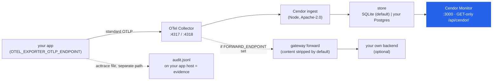

# Cendor Monitor — watch your governed agents on your own machine

Cendor emits **standard OpenTelemetry** — one wire, no Cendor-specific exporter, never a Cendor
endpoint. Where it goes is your choice: **your own backend** (Azure Monitor, CloudWatch, Datadog,
Langfuse, any OTLP) for production fleets — or **Cendor Monitor**, a free, open-source, self-hosted
**journey view**, when you want to *see what your agents did and what each run cost* in one screen:
every prompt, token, dollar, and the exact step where a budget or guardrail acted. Same wire either
way; switch or run both without touching code.

Two doors, and a window: the libraries and the SDK are how you *build*; Cendor Monitor is how you
*watch*. It is **optional dev tooling** (like [`cendor-mcp`](https://cendor.ai/docs/assistant-mcp)) —
no library depends on it, and your own OTel backend stays the documented production default. It runs
on **your** infrastructure; Cendor never operates a telemetry endpoint.

> Source-available at launch. Until then the image is published to a private registry; the
> `docker run` line below goes live when the repo flips public.

## Run it in 60 seconds

One image — the OTel Collector, a small Cendor ingest service, a dual-backend store (SQLite by
default), and the monitor. Run it, point your app's OpenTelemetry at it, and open the monitor:

```bash
# 1. run the monitor (one image; SQLite by default — nothing else to install)
docker run --rm -p 3000:3000 -p 4317:4317 -p 4318:4318 ghcr.io/cendorhq/cendor-monitor:0.4.0

# 2. point your app's OpenTelemetry pipeline at it
export OTEL_EXPORTER_OTLP_ENDPOINT=http://localhost:4318

# 3. open the monitor
#    http://localhost:3000
```

That is the whole integration — a **standard OTLP env var**, no Cendor API, key, or endpoint. Attach
the emitters you already use for any backend (`live_spans()` / `OTelSink()` / `OTelMirror()` — see
[Observability](observability.md)) and your runs appear as you build. Sessions group runs
automatically when you pass `run(session=…)`, so there is no trace id to paste anywhere.

## The monitor tour

The monitor is a self-contained view over the same standard wire — no query language, no dashboard to
assemble. Screenshots are of the real monitor rendering a seeded demo (synthetic data, content
capture opted in for the demo).

### Overview

Land on the Overview: the **Cendor value strip** — *blocked projected spend* (the projection a budget
refused pre-flight — never spent), *tokens saved by compression* (Σ before − after, +%), *replayed
calls ($0)* (a count, not an invented dollar-saving), and *guardrail blocks* — above the fleet tiles
(runs, spend, blocks, errors, p50/p95, TTFT), **dependency-free trend charts**, and cost attribution:
top models, top agents, top users by spend, and spend by feature. A time-range row (1h/24h/7d/30d/all)
and a **Go live** toggle sit up top; every tile clicks through to its rows.


### Agents → Sessions → Runs

Drill from an agent to its sessions to the runs inside them — the drill-down is built from the auto
`gen_ai.conversation.id` your SDK stamps from `run(session=…)`. The global Runs list, the per-session
runs, and the proof/governance views are in the full visual tour on
[cendor.ai/monitor](https://cendor.ai/monitor).

### The run journey — with governance inline

The differentiator: the whole conversation for a run — system / user / assistant / thinking / tool
arguments and results — with **tokens, cost, latency, and time-to-first-token per step**, and the
exact step where a **budget block, guardrail verdict, or compression** fired, shown **inline** in the
conversation (not in a separate log). Prompt/response content appears only if you opted in (below);
without it, the journey shows the same structure metadata-only.


### Proof pages + the governance stream

A per-library proof page for each of the seven libraries turns the monitor into *proof of the
libraries* — each with a trend chart, a value tile, and the raw event table. tokenguard's page shows
spend attributed **by feature and by user** plus a blocked-projected-spend tile and the budget-events
table (which budget blocked what — projected vs cap); squeeze's shows compression events with
before/after tokens. The Governance page is a typed, filterable stream of every decision, budget
event, and guardrail action. (See these — the proof pages and the governance stream — in the full
visual tour on [cendor.ai/monitor](https://cendor.ai/monitor).)

### Filter, search, and go live

The Runs, Sessions, and Governance lists share a **filter bar** — facet dropdowns (agent / model /
service / label or type), a free-text box, a time-range preset, sort, and paging, all deep-linked in
the URL. The free-text box has a **scope toggle**: *meta* filters the metadata, *content* runs a real
indexed full-text search — but only over what you opted to store (nothing when content capture is
off). A **live** toggle (off by default) polls every few seconds and pauses on a hidden tab.

(The screenshots above follow your theme — dark or light. Cendor Monitor ships both.)

## Turn on content capture (opt-in)

By default the monitor shows **structure** — models, tokens, cost, latency, governance verdicts — but
**not** message content. Prompts, responses, thinking, and tool values are captured **only if you turn
them on**, in your app, with one call (or the standard env var). The monitor never enables it for you.

<!-- tabs: lang -->
<!-- tab: Python -->
```python
from cendor.core import otel

# Opt in. A mask scrubs each message list before export (fail-closed if it raises);
# max_bytes caps each attribute (a truncation marker is appended when hit).
otel.capture_content(mask=lambda msgs: msgs, max_bytes=8192)

# Or set the standard env var instead of code config:
#   OTEL_INSTRUMENTATION_GENAI_CAPTURE_MESSAGE_CONTENT=true
```
<!-- tab: TypeScript -->
```ts
import { otel } from '@cendor/core';

// Opt in. `mask` scrubs each message list before export (fail-closed if it throws);
// `maxBytes` caps each attribute (a truncation marker is appended when hit).
otel.captureContent({ mask: (msgs) => msgs, maxBytes: 8192 });

// Or set the standard env var instead of code:
//   OTEL_INSTRUMENTATION_GENAI_CAPTURE_MESSAGE_CONTENT=true
```
<!-- /tabs -->

Where content lands: your store volume only (or your Postgres). In **gateway mode** (below), the
container **strips content attributes by default** when forwarding upstream — you opt in again with
`CENDOR_MONITOR_FORWARD_CONTENT=true`. Content **never** enters the acttrace evidence chain or its
`OTelMirror` — `audit.*` stays content-free, and you delete captured content on your own retention
schedule. See [content capture](observability.md#content-capture--opt-in-off-by-default).

## Configuration

The container is configured entirely through environment variables — no config files to mount. The
monitor reads a safe subset at boot (default theme, retention, storage backend *type*, whether forward
/ auth are on) — **never** the Postgres DSN, the auth password, or the forward URL.

| Variable | Default | What it does |
|---|---|---|
| `OTEL_EXPORTER_OTLP_ENDPOINT` | — | *Set in your **app**, not the container* — `http://localhost:4318`. The whole integration. |
| `CENDOR_MONITOR_DB` | *(unset → embedded SQLite)* | External **Postgres** DSN (`postgres://…`, ≥ 14) for team/private-network deploys. Unset ⇒ embedded SQLite (WAL) on `/data`. One image; Postgres is never bundled. Read from env only, never logged. |
| `CENDOR_MONITOR_RETENTION` | `7d` | Store retention. An ingest-side sweeper deletes runs/steps/governance/metrics older than this (both backends). |
| `CENDOR_MONITOR_FORWARD_ENDPOINT` | *(unset)* | **Gateway mode.** When set, the collector *additionally* forwards all OTLP onward — the same image doubles as a prod gateway in front of your own backend. |
| `CENDOR_MONITOR_FORWARD_CONTENT` | `false` | When forwarding, whether to include content attributes. **Default strips them** — content stays in your store only. |
| `CENDOR_MONITOR_THEME` | `dark` | Default theme (`dark`\|`light`); a `?theme=` query or the viewer's saved toggle always overrides. |
| `CENDOR_MONITOR_BASIC_AUTH` | *(unset)* | Optional `user:password` — HTTP basic auth over the whole UI + API. **No auth by default** (localhost dev tool — do not expose publicly). |

**Ports:** `3000` = the monitor + `/api/cendor/` (same origin via nginx); `4317` = OTLP/gRPC ingest;
`4318` = OTLP/HTTP ingest. The monitor always listens on `3000` inside the container — remap the host
port with `-p 8080:3000`. The read API is **GET-only**; delete-by-run/session runs ingest-side (plus
the retention sweeper).

## How it works



Everything runs where you run the container. The tamper-evident audit **file** is a separate,
offline-verifiable path — it does not flow through the monitor (see Honest limits).

## Plugs into the stack

Cendor Monitor consumes the exact wire the libraries and SDK already emit — the same
[Observability](observability.md) emitters (`live_spans`/`span_tree`, `OTelSink`, `OTelMirror`) and
the same `gen_ai.*` GenAI semantic conventions. Because it is standards-native, the *same* opted-in
wire renders in Langfuse or Braintrust too — nothing here is Cendor-proprietary. Each library's data
shows up on its proof page: tokenguard budgets and spend, guardrails decisions, acttrace's mirrored
governance, squeeze's compression events, cassette's replayed steps, contextkit's assemblies, and
core's call spans. See each library's page for what it emits — e.g.
[tokenguard](tokenguard.md#the-budget-events-counter) and
[acttrace](acttrace.md#mirror-to-an-observability-backend).

## Honest limits

- **Optional dev tooling, not the product.** No Cendor library depends on it; the libraries and SDK
  run fully offline without it. Your own OTel backend (Azure Monitor / CloudWatch / Datadog / any
  OTLP) stays the documented **production default**.
- **Never a hosted service.** Cendor never operates a telemetry endpoint. The container runs on your
  infrastructure; data lives on your volume or in your Postgres, and you delete it on your own
  retention schedule.
- **The monitor is an operational copy — not the evidence.** `verify()` runs on the hash-chained
  audit **file** on your app host, never on what the monitor shows. The monitor has no "verified ✓"
  claim and makes no compliance guarantee; treat it as monitoring, treat the file (or a signed
  `export()` pack) as the record. See [acttrace Honest limits](acttrace.md#honest-limits).
- **Content is opt-in and off by default.** The monitor never enables content capture; without it,
  runs render metadata-only. When on, content lands only where your OTLP goes.
- **Dev-tool scale.** SQLite by default suits a single builder's dev loop; point
  `CENDOR_MONITOR_DB` at your own Postgres for a shared team deploy. No auth by default — set
  `CENDOR_MONITOR_BASIC_AUTH` and don't expose it publicly.
- **Licensing.** The image is **Apache-2.0 (code) with OFL-1.1 fonts** (Manrope + JetBrains Mono):
  Cendor's monitor, ingest service, and configs are Apache-2.0; it bundles the Apache-2.0
  OpenTelemetry Collector and runs on Node.js (MIT) + nginx (BSD-2-Clause). No AGPL/GPL.
