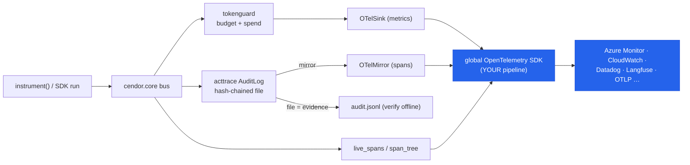

# Observability — export to Azure Monitor, CloudWatch, Datadog, and any OTel backend

Cendor speaks **OpenTelemetry**, the standard everyone is converging on — nothing proprietary. Every
signal it emits uses the OpenTelemetry **GenAI semantic conventions** (`gen_ai.*`), so once you
configure an OpenTelemetry pipeline **in your app**, Cendor's spans, spend metrics, and governance
events flow into whatever backend that pipeline points at — Azure Monitor / Application Insights, AWS
CloudWatch, Datadog, Grafana, New Relic, Honeycomb, an OTLP collector, or an LLM-observability tool
like Langfuse — **with no Cendor-specific exporter to install or maintain.**

Cendor is **local-first**: it never configures a telemetry backend for you and never opens a network
connection on its own. Export is opt-in — you install the OpenTelemetry extra, configure a provider
once, and attach the emitters you want. Without that, everything below is a silent no-op.

> **The short version.** `pip install "cendor-core[otel]"` (or add `@opentelemetry/api`), point an
> OTel pipeline at your backend, and: `live_spans()` streams the agent trajectory, `OTelSink()`
> streams spend as metrics, and `AuditLog(mirror=OTelMirror())` streams the governance/audit trail.
> The tamper-evident audit **file** stays your system of record; the mirror is an operational copy.

> **Want a local backend to watch all this while you build?** [**Cendor Monitor**](https://cendor.ai/monitor)
> — an optional, self-hosted container — gives you Cendor-branded **Runs / Cost / Governance** boards
> over the same standard OTLP wire, in one `docker run`. See [Run a local backend](#run-a-local-backend-dev)
> below. (Your production default stays your own backend, such as **Azure Monitor** — same wire, zero
> code change.)

## Install

<!-- tabs: lang -->
<!-- tab: Python -->

```bash
pip install "cendor-core[otel]"        # opentelemetry-api + opentelemetry-sdk
# + your backend's distro/exporter, e.g.:
pip install azure-monitor-opentelemetry
```

<!-- tab: TypeScript -->

```bash
npm i @opentelemetry/api               # optional peer — enables the emitters
# + your backend's distro/exporter, e.g.:
npm i @azure/monitor-opentelemetry
```

<!-- /tabs -->

## Quickstart — any OTLP backend

The most portable path: set the standard `OTEL_EXPORTER_OTLP_ENDPOINT` environment variable and start
an OTel SDK. Everything Cendor emits is exported to that endpoint (a collector, or a vendor's OTLP
intake).

<!-- tabs: lang -->
<!-- tab: Python -->

```python
# export OTEL_EXPORTER_OTLP_ENDPOINT=https://your-collector:4317
from opentelemetry.sdk.trace import TracerProvider
from opentelemetry.sdk.trace.export import BatchSpanProcessor
from opentelemetry.exporter.otlp.proto.grpc.trace_exporter import OTLPSpanExporter
from opentelemetry import trace

provider = TracerProvider()
provider.add_span_processor(BatchSpanProcessor(OTLPSpanExporter()))
trace.set_tracer_provider(provider)               # the ONE global setup — your app owns it

from cendor.sdk import Agent, run
from cendor.sdk.otel import live_spans
with live_spans():                                # agent trajectory -> your backend
    result = run(agent, "What's the weather in Paris?")
```

<!-- tab: TypeScript -->

<!-- ts-check: skip -->

```ts
// OTEL_EXPORTER_OTLP_ENDPOINT=https://your-collector:4318
import { NodeSDK } from '@opentelemetry/sdk-node';
import { OTLPTraceExporter } from '@opentelemetry/exporter-trace-otlp-http';

new NodeSDK({ traceExporter: new OTLPTraceExporter() }).start(); // the ONE global setup

import { run } from '@cendor/sdk';
import { liveSpans } from '@cendor/sdk';
const span = liveSpans();                          // agent trajectory -> your backend
try {
  const result = await run(agent, "What's the weather in Paris?");
} finally {
  span.close();
}
```

<!-- /tabs -->

## What Cendor emits (and ingests)

| Direction | API | Signal | What lands in your backend |
|---|---|---|---|
| Agent trajectory | `cendor.sdk.otel.span_tree(result)` / `live_spans()` (TS `spanTree`/`liveSpans`) | Traces | A root `agent.run` span → per-agent → per model call (`chat {model}`) / tool (`execute_tool {name}`), with `gen_ai.usage.*`/`gen_ai.usage.cost` |
| Per-call span | `core.otel.span(model, provider=…)` | Traces | A single `chat {model}` span you wrap a call in |
| Spend | `tokenguard.use_sink(sinks.OTelSink())` | Metrics | Counters `gen_ai.client.token.usage` / `.cost.usd` / `.reasoning.token.usage`, dimensioned by `model` + your `track(...)` tags |
| **Governance & audit** | `AuditLog(mirror=OTelMirror())` | Traces | An `audit.<type>` span per chained entry — decisions, guardrail actions, **budget breaches**, policy flags, human oversight |
| Ingest (inbound) | `core.otel.ingest(attrs)` | — | A managed runtime's `gen_ai.*` spans → the Cendor bus, so budgets/audit apply to calls your process never made |

The first four are **outbound** (Cendor → your backend). The last is **inbound** — see
[Managed runtimes](providers.md#managed-runtimes-opentelemetry-ingestion) for the Foundry/Assistants
capture path.

## Connect a specific backend

Every backend below works because Cendor emits into the **global** OpenTelemetry provider. You do the
one-time provider setup; the three Cendor attachments (`live_spans`, `OTelSink`, `OTelMirror`) are
identical across all of them.

### Azure Monitor / Application Insights

<!-- tabs: lang -->
<!-- tab: Python -->

```python
# pip install azure-monitor-opentelemetry cendor-core[otel]
from azure.monitor.opentelemetry import configure_azure_monitor
configure_azure_monitor(connection_string="InstrumentationKey=…")   # sets the global providers

from cendor.sdk import run
from cendor.sdk.otel import live_spans
from cendor.tokenguard import use_sink, sinks
from cendor.acttrace import AuditLog, OTelMirror

use_sink(sinks.OTelSink())                          # spend -> Azure Monitor customMetrics
audit = AuditLog(system="support", path="audit.jsonl", mirror=OTelMirror())  # audit -> traces
with live_spans():                                  # agent trajectory -> Application Insights
    result = run(agent, "Refund order 42", audit=audit)
```

<!-- tab: TypeScript -->

<!-- ts-check: skip -->

```ts
// npm i @azure/monitor-opentelemetry @opentelemetry/api
import { useAzureMonitor } from '@azure/monitor-opentelemetry';
useAzureMonitor({ azureMonitorExporterOptions: { connectionString: 'InstrumentationKey=…' } });

import { run, liveSpans } from '@cendor/sdk';
import { useSink } from '@cendor/tokenguard';
import { OTelSink } from '@cendor/tokenguard/sinks';
import { AuditLog, OTelMirror } from '@cendor/acttrace';

useSink(new OTelSink());                            // spend -> Azure Monitor customMetrics
const audit = new AuditLog('support', { path: 'audit.jsonl', mirror: new OTelMirror() });
const span = liveSpans();
try {
  await run(agent, 'Refund order 42', { audit });
} finally {
  span.close();
}
```

<!-- /tabs -->

Cendor's `gen_ai.*` spans land in Application Insights **traces**/**dependencies**; the `OTelSink`
counters land in **customMetrics**; the audit mirror's `audit.<type>` spans land alongside your other
traces, filterable by `cendor.audit.type`, `cendor.audit.system`, and `cendor.audit.action`.

### AWS CloudWatch (generative-AI observability)

CloudWatch's generative-AI observability consumes OpenTelemetry GenAI telemetry directly. Point an
OTLP exporter at the CloudWatch endpoint (or run the ADOT collector) and Cendor's agent span tree
shows up in the CloudWatch agent/tool views.

<!-- tabs: lang -->
<!-- tab: Python -->

```python
# pip install opentelemetry-exporter-otlp cendor-core[otel]
# OTEL_EXPORTER_OTLP_ENDPOINT + AWS auth headers per the CloudWatch GenAI observability setup
from opentelemetry.sdk.trace import TracerProvider
from opentelemetry.sdk.trace.export import BatchSpanProcessor
from opentelemetry.exporter.otlp.proto.http.trace_exporter import OTLPSpanExporter
from opentelemetry import trace

provider = TracerProvider()
provider.add_span_processor(BatchSpanProcessor(OTLPSpanExporter()))
trace.set_tracer_provider(provider)

from cendor.sdk import run
from cendor.sdk.otel import live_spans
with live_spans():
    result = run(agent, "…")
```

<!-- tab: TypeScript -->

> **Python only (for now).** The wiring is identical in TypeScript — use `@opentelemetry/sdk-node`
> with the OTLP HTTP exporter (or `@aws/otel` distro), then `liveSpans()`. See the
> [parity matrix](languages.md).

<!-- /tabs -->

### Datadog

Datadog **natively maps** the `gen_ai.*` GenAI semantic conventions into its LLM Observability
schema, so Cendor spans light up Datadog's LLM views without Datadog's own SDK. Send OTLP to the
Datadog Agent's OTLP intake (or use the Datadog exporter in a collector), then attach `live_spans()`
and `OTelSink()` exactly as above.

### Langfuse (and other LLM-observability tools)

Langfuse, Arize Phoenix, MLflow, and similar tools accept OTLP with `gen_ai.*` attributes. For
Langfuse, set the OTLP endpoint + Basic-auth header and the agent span tree appears as an LLM trace:

```bash
export OTEL_EXPORTER_OTLP_ENDPOINT="https://cloud.langfuse.com/api/public/otel"
export OTEL_EXPORTER_OTLP_HEADERS="Authorization=Basic $(echo -n 'pk-…:sk-…' | base64)"
```

Then the same `live_spans()` / `span_tree(result)` you use everywhere.

### Vercel (Next.js / edge)

Use `@vercel/otel` in `instrumentation.ts` (required for Vercel's Trace Drains / Session Tracing), then
call `liveSpans()`/`spanTree()` inside your route handlers.

<!-- ts-check: skip -->

```ts
// instrumentation.ts
import { registerOTel } from '@vercel/otel';
export function register() {
  registerOTel({ serviceName: 'my-agent' });
}
```

> **Two Vercel caveats.** (1) On the **Edge runtime**, Cendor's Node-only pieces don't run — the
> SQLite spend sink (`@cendor/tokenguard/sinks` `SqliteSink`) and the file-backed `AuditLog(path)`
> need the Node runtime; the OTel emitters (`liveSpans`, `OTelSink`, `OTelMirror`) work wherever
> `@opentelemetry/api` does. (2) Serverless disks are **ephemeral**, so a local audit **file** does
> not persist between invocations — this is exactly where the audit **mirror** (`OTelMirror`) earns
> its keep: the operational copy lands in your backend even though the file is transient. For a
> verifiable evidence file on serverless, write `path=` to durable storage you control (e.g. sync to
> object storage), or capture `log.head` out-of-band per the [acttrace trust boundary](acttrace.md#signing-and-the-trust-boundary).

### Anything else

Grafana (Tempo/Loki/Mimir), New Relic, Honeycomb, Dynatrace, SigNoz, Jaeger, Zipkin — all accept
OTLP. Set `OTEL_EXPORTER_OTLP_ENDPOINT` (or the vendor's exporter/collector) and attach the same three
emitters. There is nothing Cendor-specific to configure per vendor.

### Run a local backend (dev)

Don't want to wire a hosted backend just to watch a run while you code? Run one **locally** and point
your app at `http://localhost:4318`. Your documented default in production stays your own backend —
such as **Azure Monitor** — but for the dev loop:

- **Cendor Monitor** — the *optional*, self-hosted Cendor container (the counterpart to your own
  backend such as Azure Monitor). One `docker run` gives you Cendor-branded **Runs**, **Cost**, and
  **Governance** boards over the same standard OTLP wire — the governance board renders the
  `audit.<type>` mirror stream inline with the run it governed. It runs on *your* infra; Cendor never
  operates a telemetry endpoint. The board is an operational copy — the hash-chained audit file stays
  your only verifiable evidence (`verify()` runs on the file). Strictly optional dev tooling, like
  `cendor-mcp`.

  ```bash
  docker run --rm -p 3000:3000 -p 4317:4317 -p 4318:4318 ghcr.io/cendorhq/cendor-monitor:latest
  # then: OTEL_EXPORTER_OTLP_ENDPOINT=http://localhost:4318   → open http://localhost:3000
  ```

- **Generic all-in-one** — `docker run -p 3000:3000 -p 4318:4318 grafana/otel-lgtm` (Collector +
  Tempo/Loki/Prometheus + Grafana) or **Arize Phoenix** for an LLM-native trace UI. Same env var; the
  agent span tree + spend counters appear immediately. (These show traces + cost, not Cendor's
  governance boards.)

Either way the app side is unchanged — swapping the local container for your production backend is a
zero-code change.

## Governance events — the part unique to Cendor

An observability backend usually sees *cost and latency*. Cendor also lets it see **governance**: a
budget breaker firing, a guardrail blocking an injection, a human approving a refund, a policy flag on
PII. Two mechanisms carry these.

### Budget breaches on the bus (`BudgetEvent`)

When a pre-flight budget action fires — **blocked**, **downgraded**, or **clamped** — `tokenguard`
emits a `BudgetEvent` on the core bus. A *blocked* call never reaches the bus as an `LLMCall` (it's
refused before it runs), so this event is the **only** signal the breaker fired — precisely what you
want to alert on. `acttrace` chains it as a `budget_event` entry, and an attached `OTelMirror` turns
it into an `audit.budget_event` span carrying `cendor.audit.action` (`blocked`/…),
`cendor.audit.model`, the budget's name as `cendor.audit.budget` (from `budget(name=…)`), and the
projected-vs-cap figures as dedicated numeric attributes — `cendor.audit.projected_usd` /
`cendor.audit.cap_usd` (money as strings, per the `Decimal` rule) and `cendor.audit.projected_tokens`
/ `cendor.audit.cap_tokens` (ints) — so a monitor shows *which* budget blocked *what*, not just a
free-text reason. (Requires `acttrace ≥ 1.7` / `@cendor/acttrace ≥ 0.8` and `tokenguard ≥ 1.3` /
`@cendor/tokenguard ≥ 0.4` for the budget name.)

Every pre-flight budget action also increments the `cendor.tokenguard.budget.events` **counter**
(`cendor_tokenguard_budget_events_total` in Prometheus), so you can chart block *rates* — see
[tokenguard](tokenguard.md#the-budget-events-counter).

### The audit mirror (`OTelMirror`)

`AuditLog(mirror=OTelMirror())` sends **every** chained entry — decisions, `llm_call`/`tool_call`,
`guardrail_decision`, `budget_event`, `policy_flag`, `human_oversight`, `context_assembly` — to
OpenTelemetry as an `audit.<type>` span, in addition to the file. So "the guardrail blocked an
injection" or "ops@bank approved this refund" becomes queryable and alertable in Azure Monitor /
Datadog / CloudWatch, not just a line in a local file. Each span carries structured
`cendor.audit.*` labels — guardrail `severity`/`policy_version`, `llm_call` token usage/latency,
context-assembly block counts, budget names + caps — never raw content; the full per-type surface is
in the [acttrace span-attributes table](acttrace.md#mirror-to-an-observability-backend).

```python
from cendor.acttrace import AuditLog, OTelMirror

audit = AuditLog(system="support", path="audit.jsonl", mirror=OTelMirror())
# every decision, guardrail action, budget breach, and oversight event now also lands in your backend
```

> **The mirror is an operational copy, never the evidence.** The hash-chained **file** written by
> `path=` remains the only artifact `verify()` checks — a mirror can lag, drop, or be reconfigured
> without weakening the chain, exactly because it is a copy. A failing mirror is swallowed and never
> breaks the chain. Treat the mirror as monitoring/alerting/SIEM feed; treat the file (or a signed
> export pack) as the compliance record. See [acttrace Honest limits](acttrace.md#honest-limits).

## Correlate audit entries with your traces

When OpenTelemetry is installed and a span is active (e.g. inside `live_spans()` or an `otel.span`),
auto-captured and explicit audit entries carry the active span's `otel_trace_id` / `otel_span_id` in
their payload. So from an Application Insights / Datadog trace you can jump to the exact tamper-evident
audit entry that proves what happened — and back. The span attributes carry `cendor.audit.*`; the
audit payload carries `otel_trace_id`; both sides join on the same trace id. (A no-op when OTel is
absent or no span is active — the default chain is byte-identical.)

## How it works



Cendor emits into the global OTel SDK; the SDK (which you configure once) exports to your backend. The
audit **file** is a separate, offline-verifiable path — not dependent on any backend.

## Honest limits

- **Cendor exports; it does not collect.** You still configure an OpenTelemetry pipeline (a collector
  or a vendor distro) in your process — Cendor never runs one for you (local-first).
- **The mirror is not the evidence.** `verify()` runs on the hash-chained file, never on the mirror.
  If your compliance record must be centralized, mirror to a backend *and* retain the signed file/
  export pack.
- **Metric cardinality.** `OTelSink` dimensions spend by your `track(...)` tags. Keep tag *values*
  low-cardinality (`feature`, `tenant`, `env` — not a raw per-user id) or pass `OTelSink(tags=False)`
  for model-only counters, so your metrics backend's time-series count doesn't explode.
- **Semantic-convention drift.** The GenAI semconv is still maturing. Cendor targets it faithfully;
  a few names are Cendor extensions in the `gen_ai.*` namespace (a cost counter, a reasoning-token
  counter — semconv defines no cost metric yet) and the token-usage metric is a Counter where the
  latest semconv leans toward a Histogram. These are additive and won't break your pipeline.
- **The audit mirror uses spans, not the OTel Logs signal.** Logs are still experimental across
  languages; spans are stable everywhere and match the rest of the stack. Governance events therefore
  appear in your **traces** view (Application Insights `traces`/`dependencies`, Datadog spans), which
  is where alerting rules already live.

## Plugs into the stack

Observability rides the same **event bus** every tool cooperates on — `tokenguard` prices spend,
`acttrace` chains the audit trail, and these emitters forward the same normalized events to your
backend. Nothing here is required: the libraries and the SDK run fully offline without it. To capture
calls a managed runtime owns, feed its `gen_ai.*` spans to
[`core.otel.ingest`](providers.md#managed-runtimes-opentelemetry-ingestion) and they join the same bus
— governed and exported like any local call.
