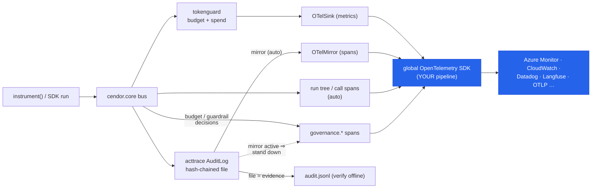

# Observability — export to any OTel backend (or watch locally with Cendor Monitor)

Cendor speaks **OpenTelemetry**, the standard everyone is converging on — nothing proprietary. Every
signal it emits uses the OpenTelemetry **GenAI semantic conventions** (`gen_ai.*`), so once you
configure an OpenTelemetry pipeline **in your app**, Cendor's spans, spend metrics, and governance
events flow into whatever backend that pipeline points at — Azure Monitor / Application Insights, AWS
CloudWatch, Datadog, Grafana, New Relic, Honeycomb, an OTLP collector, or an LLM-observability tool
like Langfuse — **with no Cendor-specific exporter to install or maintain.**

> ### It flows. You write no telemetry code.
>
> Install the OpenTelemetry extra, configure a provider once **the way you already would**, and use
> Cendor normally. That's it:
>
> * every governed call becomes a `gen_ai.*` **span** — the moment you call `instrument()`;
> * spend becomes **counters** (`gen_ai.client.token.usage` / `.cost.usd`), dimensioned by model and
>   your `track(...)` tags;
> * an SDK `run()` becomes a **run tree** — root, steps, usage/cost rollups — with your `session` id as
>   the conversation key;
> * **enforcement decisions** — a budget that blocked a call, a guardrail that tripped — become
>   `governance.*` spans, correlated to the call or run they governed;
> * and if you keep an `AuditLog`, its **operational copy** rides along as `audit.*` spans too.
>
> **The off switch is one env var: `CENDOR_TELEMETRY=off`** — process-wide, no code change. With
> OpenTelemetry absent, or with no provider configured, nothing is emitted and nothing is even
> subscribed. Prompt/response **content stays opt-in** either way.
>
> Requires cendor-core ≥ 1.13 / @cendor/core ≥ 0.15 (+ cendor-sdk ≥ 1.19 / @cendor/sdk ≥ 0.22 for the
> automatic run scope). Older versions need the explicit attachments — still supported, see
> [Attach it yourself](#attach-it-yourself-explicit-control).

Cendor is **local-first**: it never configures a telemetry backend for you, never opens a network
connection of its own, and has no endpoint. It emits into **your** provider — which is why "on by
default when a provider exists" is a safe default rather than a surprise: the data goes only where you
already pointed a pipeline.

> **Want to *see* all this in one screen while you build?** [**Cendor Monitor**](monitor.md) — an
> optional, self-hosted **journey view** — renders the same standard OTLP wire as an Agents →
> Sessions → run-journey view (every prompt, token, dollar, and the exact step where a budget or
> guardrail acted, inline), in one `docker run`. See [Cendor Monitor](#cendor-monitor-self-hosted)
> below. (Your production default stays your own backend, such as **Azure Monitor** — same wire, zero
> code change.)

## Install

<!-- tabs: lang -->
<!-- tab: Python -->

```bash
pip install "cendor-core[otel]"        # opentelemetry-api + opentelemetry-sdk
# + your backend's distro/exporter, e.g.:
pip install azure-monitor-opentelemetry
```

<!-- tab: TypeScript -->

```bash
npm i @opentelemetry/api               # optional peer — enables the emitters
# + your backend's distro/exporter, e.g.:
npm i @azure/monitor-opentelemetry
```

<!-- /tabs -->

## Quickstart — any OTLP backend

The most portable path: set the standard `OTEL_EXPORTER_OTLP_ENDPOINT` environment variable and start
an OTel SDK. Everything Cendor emits is exported to that endpoint (a collector, or a vendor's OTLP
intake). **There is no Cendor telemetry code in either sample.**

<!-- tabs: lang -->
<!-- tab: Python -->

```python
# export OTEL_EXPORTER_OTLP_ENDPOINT=https://your-collector:4317
from opentelemetry.sdk.trace import TracerProvider
from opentelemetry.sdk.trace.export import BatchSpanProcessor
from opentelemetry.exporter.otlp.proto.grpc.trace_exporter import OTLPSpanExporter
from opentelemetry import trace

provider = TracerProvider()
provider.add_span_processor(BatchSpanProcessor(OTLPSpanExporter()))
trace.set_tracer_provider(provider)               # the ONE global setup — your app owns it

from cendor.sdk import Agent, run
result = run(agent, "What's the weather in Paris?")   # trajectory + spend + governance: exported
```

<!-- tab: TypeScript -->

<!-- ts-check: skip -->

```ts
// OTEL_EXPORTER_OTLP_ENDPOINT=https://your-collector:4318
import { NodeSDK } from '@opentelemetry/sdk-node';
import { OTLPTraceExporter } from '@opentelemetry/exporter-trace-otlp-http';

new NodeSDK({ traceExporter: new OTLPTraceExporter() }).start(); // the ONE global setup

import { run } from '@cendor/sdk';
const result = await run(agent, "What's the weather in Paris?"); // trajectory + spend + governance
```

<!-- /tabs -->

A **libs-only** app (no SDK) is the same story with `instrument()` as the trigger:

<!-- tabs: lang -->
<!-- tab: Python -->

```python
from cendor.core import instrument
from cendor.tokenguard import budget

client = instrument(OpenAI())                      # arms the span emitter + the spend tap
with budget(usd=5, name="per-run cap"):            # a block becomes a governance.* span
    client.chat.completions.create(model="gpt-4o", messages=[{"role": "user", "content": "hi"}])
```

<!-- tab: TypeScript -->

<!-- ts-check: skip -->

```ts
import { instrument } from '@cendor/core';
import { withBudget } from '@cendor/tokenguard';

const client = instrument(new OpenAI());           // arms the span emitter + the spend tap
await withBudget({ usd: 5, name: 'per-run cap' }, async () => {
  await client.chat.completions.create({ model: 'gpt-4o', messages: [{ role: 'user', content: 'hi' }] });
});
```

<!-- /tabs -->

### The switch — `CENDOR_TELEMETRY`

| Value | Meaning |
|---|---|
| *(unset)* or `auto` | **Emit when OpenTelemetry is installed and your app has configured a global provider.** Nothing before that — the check is re-run per event, so a provider configured later is still picked up. |
| `off` | **Nothing is emitted, at all**: no span emitter, no spend tap, no audit-mirror auto-attach, no `governance.*` spans. Read per event, so exporting it later takes effect immediately. |

`OTEL_SDK_DISABLED=true` (the standard OTel switch) composes for free: your SDK then registers no real
provider, so Cendor finds none and stays silent.

**Nothing appearing?** Set `CENDOR_DEBUG_TELEMETRY=1` for a one-line answer on stderr —
`cendor telemetry: mode=auto, provider=detected, emitter=attached` — or run
`uvx cendor-init doctor` / `npx @cendor/init doctor`, which static-checks the wiring. Cendor never
warns on its own: an offline app is a supported posture, not a mistake.

### Attach it yourself (explicit control)

The explicit attachments still exist and **always win** over the automatic path — use them to pass your
own tracer, to name a run, or to emit regardless of the switch. A manual `use_span_emitter()` detaches
the automatic one, so an event is never rendered twice; an explicit `live_spans()` means `run()` opens
no second scope.

<!-- tabs: lang -->
<!-- tab: Python -->

```python
from cendor.core import otel
from cendor.sdk.otel import live_spans

otel.use_span_emitter()                            # explicit; supersedes the automatic emitter
with live_spans(label="nightly sweep"):            # a human-authored run label
    result = run(agent, "…")
```

<!-- tab: TypeScript -->

<!-- ts-check: skip -->

```ts
import { otel } from '@cendor/core';
import { liveSpans } from '@cendor/sdk';

otel.useSpanEmitter();                             // explicit; supersedes the automatic emitter
const scope = liveSpans({ label: 'nightly sweep' });
try {
  await run(agent, '…');
} finally {
  scope.close();                                   // the explicit API needs this; the automatic one owns its own finally
}
```

<!-- /tabs -->

> **Fastest way to see it.** Don't want to wire a hosted backend just to watch a run? One
> `docker run` gives you [**Cendor Monitor**](monitor.md) — a free, self-hosted journey view — on
> `http://localhost:3000`; point the same `OTEL_EXPORTER_OTLP_ENDPOINT` at `http://localhost:4318`
> and your runs appear as you build. Optional dev tooling; your production default stays your own
> backend. → [**Cendor Monitor**](monitor.md)

## What Cendor emits (and ingests)

| Direction | Trigger | Signal | What lands in your backend |
|---|---|---|---|
| Agent trajectory | `run()` — automatic; or `live_spans()` / `span_tree(result)` explicitly | Traces | A root `agent.run` span (with `cendor.run.agents` + usage/cost rollups) → per-agent → per model call (`chat {model}`, carrying `gen_ai.usage.*`/`gen_ai.usage.cost`, `cendor.ttft_ms` on streamed calls, and `cendor.usage_estimated="true"` when the streamed count was estimated offline) / tool (`execute_tool {name}`) |
| Flat governed calls (libs apps) | `instrument()` — automatic; or `otel.use_span_emitter()` explicitly | Traces | One `chat {model}` / `execute_tool {name}` span per call, scope `cendor.core` |
| Per-call span (by hand) | `core.otel.span(model, provider=…)` | Traces | A single `chat {model}` span you wrap a call in |
| Spend | `instrument()` + a priced call — automatic; or `use_sink(sinks.OTelSink())` explicitly | Metrics | Counters `gen_ai.client.token.usage` / `.cost.usd` / `.reasoning.token.usage`, dimensioned by `model` + your `track(...)` tags |
| **Enforcement decisions** | automatic (tokenguard / guardrails) | Traces | `governance.budget_event` / `governance.guardrail_decision` with `cendor.gov.*` attributes — action, budget name, projected vs cap, guardrail, stage — correlated by `cendor.trace_id` |
| **Governance & audit** | `AuditLog(system=…)` — the mirror auto-attaches | Traces | An `audit.<type>` span per chained entry — decisions, guardrail actions, **budget breaches**, policy flags, human oversight |
| Ingest (inbound) | `core.otel.ingest(attrs)` | — | A managed runtime's `gen_ai.*` spans → the Cendor bus, so budgets/audit apply to calls your process never made |

Everything except the last row is **outbound** (Cendor → your backend). The last is **inbound** — see
[Managed runtimes](providers.md#managed-runtimes-opentelemetry-ingestion) for the Foundry/Assistants
capture path.

**Agent name on streamed children.** `gen_ai.agent.name` is now reliable on **streamed** live
children: `live_spans`/`liveSpans` read it from the event's stamped metadata (captured at
construction) rather than re-reading run scope at delivery time, so it survives a stream finalized
after its originating scope. A libs-only app (no SDK) surfaces the same attribute by registering an
[ambient provider](core.md#ambient-metadata-providers) that returns `{"agent": …}` — or via a
[framework adapter](core.md#framework-adapters) — and core's span emitter maps `metadata["agent"]` →
`gen_ai.agent.name`.

**Agent names from a third-party framework.** When your app runs under LangChain, the OpenAI Agents
SDK, or Azure AI Foundry Agents, attach the matching [framework adapter](core.md#framework-adapters) —
it relays the *framework's* agent name (openai-agents / langchain) or agent + conversation id (Foundry)
onto the same `gen_ai.agent.name` / `gen_ai.conversation.id` attributes, with no extra wiring.

**App-level identity — `OTEL_SERVICE_NAME`.** The app itself is named by the standard OTel resource:
set `OTEL_SERVICE_NAME=your-app` (and optionally `service.instance.id` via
`OTEL_RESOURCE_ATTRIBUTES`). It rides `service.name` on every span — Cendor Monitor's **Apps** page
groups a libs-only app's runs by it (per-process instances counted from `service.instance.id`), and any
OTLP backend filters on it. Cendor invents no app identity of its own.

## Content capture — opt-in, OFF by default

By default Cendor puts **structure** on the wire — models, tokens, cost, latency, governance
verdicts — but **not the message content** (prompts, responses, thinking, tool arg/result values).
That is a deliberate privacy posture, and it matches the OpenTelemetry GenAI semantic convention,
whose content attributes are opt-in too.

Turn content capture on with one call (or the standard env var). Then prompts/responses/thinking
ride the semconv's own content span attributes — `gen_ai.input.messages`, `gen_ai.output.messages`,
`gen_ai.system_instructions` (JSON strings) on `chat` spans, plus `cendor.tool.arguments` /
`cendor.tool.result` on `execute_tool` spans. Because it's the standard, the same content renders in
Langfuse or Braintrust too — the "swap to any backend, zero code change" claim gets *stronger*.

<!-- tabs: lang -->
<!-- tab: Python -->
```python
from cendor.core import otel

# Opt in. A mask scrubs each message list before export (fail-closed if it raises);
# max_bytes caps each attribute (a truncation marker is appended when hit).
otel.capture_content(mask=lambda msgs: msgs, max_bytes=8192)

# Or set the standard env var instead of code config:
#   OTEL_INSTRUMENTATION_GENAI_CAPTURE_MESSAGE_CONTENT=true
```
<!-- tab: TypeScript -->
```ts
import { otel } from '@cendor/core';

// Opt in. `mask` scrubs each message list before export (fail-closed if it throws);
// `maxBytes` caps each attribute (a truncation marker is appended when hit).
otel.captureContent({ mask: (msgs) => msgs, maxBytes: 8192 });

// Or set the standard env var instead of code:
//   OTEL_INSTRUMENTATION_GENAI_CAPTURE_MESSAGE_CONTENT=true
```
<!-- /tabs -->

Once it's on, `span_tree` / `live_spans` stamp the content automatically (including provider
**thinking**/reasoning text, parsed out of the raw response); a libs-only app (no SDK) gets the
same via the opt-in `otel.use_span_emitter()` bus→span emitter. **Where content lands:** exactly one
place — your OTLP destination (your own store or backend). Cendor never operates a telemetry
endpoint. If you run [Cendor Monitor](monitor.md), content lives on your
volume; its gateway-forward **strips content attributes** unless you explicitly opt in.

**What content never touches:** the acttrace evidence chain and its `OTelMirror`. `audit.*` spans
stay content-free (rule 6); `verify()` runs on the hash-chained file, never on telemetry. Content is
an *operational* signal on `chat`/`execute_tool` spans only, and you delete it on your own retention
schedule.

> **Precedence:** if you use the SDK's `live_spans`/`span_tree`, don't also wire
> `use_span_emitter()` for the same run — the emitter stands down while a `live_spans` context is
> active, and is meant for libs-only apps that never build the SDK span tree.

## Connect a specific backend

Every backend below works because Cendor emits into the **global** OpenTelemetry provider. You do the
one-time provider setup; the three Cendor attachments (`live_spans`, `OTelSink`, `OTelMirror`) are
identical across all of them.

### Cendor Monitor (self-hosted)

The first-party way to *see* the wire: [**Cendor Monitor**](monitor.md) is an optional, self-hosted
container that renders the same standard OTLP as an Agents → Sessions → **run-journey** view — the
whole conversation with tokens, cost, latency, and TTFT per step, and the exact step where a **budget
block, guardrail verdict, or compression** fired, shown inline. One image (SQLite by default, external
Postgres when you want it), Apache-2.0 (code) with OFL-1.1 fonts. It runs on **your** infrastructure;
Cendor never operates a telemetry endpoint. The monitor is an **operational copy** — `verify()` still runs on the audit
**file**, never on what the monitor shows.

```bash
docker run --rm --name cendor-monitor -p 3000:3000 -p 4317:4317 -p 4318:4318 ghcr.io/cendorhq/cendor-monitor:0.12.0
# then, in your app:  OTEL_EXPORTER_OTLP_ENDPOINT=http://localhost:4318   → open http://localhost:3000
```

Attach the same `live_spans()` / `OTelSink()` / `OTelMirror()` you use for any backend below.
Content (prompts/responses) appears **only if you opt in** — off by default, and the monitor never
enables it. Full page: [**Cendor Monitor**](monitor.md). Prefer a hosted backend for production? Pick
one below — same wire, zero code change.

### Azure Monitor / Application Insights

<!-- tabs: lang -->
<!-- tab: Python -->

```python
# pip install azure-monitor-opentelemetry cendor-core[otel]
from azure.monitor.opentelemetry import configure_azure_monitor
configure_azure_monitor(connection_string="InstrumentationKey=…")   # sets the global providers

from cendor.sdk import run
from cendor.sdk.otel import live_spans
from cendor.tokenguard import use_sink, sinks
from cendor.acttrace import AuditLog, OTelMirror

use_sink(sinks.OTelSink())                          # spend -> Azure Monitor customMetrics
audit = AuditLog(system="support", path="audit.jsonl", mirror=OTelMirror())  # audit -> traces
with live_spans():                                  # agent trajectory -> Application Insights
    result = run(agent, "Refund order 42", audit=audit)
```

<!-- tab: TypeScript -->

<!-- ts-check: skip -->

```ts
// npm i @azure/monitor-opentelemetry @opentelemetry/api
import { useAzureMonitor } from '@azure/monitor-opentelemetry';
useAzureMonitor({ azureMonitorExporterOptions: { connectionString: 'InstrumentationKey=…' } });

import { run, liveSpans } from '@cendor/sdk';
import { useSink } from '@cendor/tokenguard';
import { OTelSink } from '@cendor/tokenguard/sinks';
import { AuditLog, OTelMirror } from '@cendor/acttrace';

useSink(new OTelSink());                            // spend -> Azure Monitor customMetrics
const audit = new AuditLog('support', { path: 'audit.jsonl', mirror: new OTelMirror() });
const span = liveSpans();
try {
  await run(agent, 'Refund order 42', { audit });
} finally {
  span.close();
}
```

<!-- /tabs -->

Cendor's `gen_ai.*` spans land in Application Insights **traces**/**dependencies**; the `OTelSink`
counters land in **customMetrics**; the audit mirror's `audit.<type>` spans land alongside your other
traces, filterable by `cendor.audit.type`, `cendor.audit.system`, and `cendor.audit.action`.

### AWS CloudWatch (generative-AI observability)

CloudWatch's generative-AI observability consumes OpenTelemetry GenAI telemetry directly. Point an
OTLP exporter at the CloudWatch endpoint (or run the ADOT collector) and Cendor's agent span tree
shows up in the CloudWatch agent/tool views.

<!-- tabs: lang -->
<!-- tab: Python -->

```python
# pip install opentelemetry-exporter-otlp cendor-core[otel]
# OTEL_EXPORTER_OTLP_ENDPOINT + AWS auth headers per the CloudWatch GenAI observability setup
from opentelemetry.sdk.trace import TracerProvider
from opentelemetry.sdk.trace.export import BatchSpanProcessor
from opentelemetry.exporter.otlp.proto.http.trace_exporter import OTLPSpanExporter
from opentelemetry import trace

provider = TracerProvider()
provider.add_span_processor(BatchSpanProcessor(OTLPSpanExporter()))
trace.set_tracer_provider(provider)

from cendor.sdk import run
from cendor.sdk.otel import live_spans
with live_spans():
    result = run(agent, "…")
```

<!-- tab: TypeScript -->

<!-- ts-check: skip -->

```ts
// npm i @opentelemetry/sdk-node @opentelemetry/exporter-trace-otlp-http @opentelemetry/api
// OTEL_EXPORTER_OTLP_ENDPOINT + AWS auth headers per the CloudWatch GenAI observability setup
import { NodeSDK } from '@opentelemetry/sdk-node';
import { OTLPTraceExporter } from '@opentelemetry/exporter-trace-otlp-http';

new NodeSDK({ traceExporter: new OTLPTraceExporter() }).start(); // the ONE global setup (or the ADOT distro)

import { run, liveSpans } from '@cendor/sdk';
const span = liveSpans();
try {
  await run(agent, '…');                             // agent span tree -> CloudWatch GenAI views
} finally {
  span.close();
}
```

<!-- /tabs -->

### Datadog

Datadog **natively maps** the `gen_ai.*` GenAI semantic conventions into its LLM Observability
schema, so Cendor spans light up Datadog's LLM views without Datadog's own SDK. Send OTLP to the
Datadog Agent's OTLP intake (or use the Datadog exporter in a collector), then attach `live_spans()`
and `OTelSink()` exactly as above.

### Langfuse (and other LLM-observability tools)

Langfuse, Arize Phoenix, MLflow, and similar tools accept OTLP with `gen_ai.*` attributes. For
Langfuse, set the OTLP endpoint + Basic-auth header and the agent span tree appears as an LLM trace:

```bash
export OTEL_EXPORTER_OTLP_ENDPOINT="https://cloud.langfuse.com/api/public/otel"
export OTEL_EXPORTER_OTLP_HEADERS="Authorization=Basic $(echo -n 'pk-…:sk-…' | base64)"
```

Then the same `live_spans()` / `span_tree(result)` you use everywhere.

### Vercel (Next.js / edge)

Use `@vercel/otel` in `instrumentation.ts` (required for Vercel's Trace Drains / Session Tracing), then
call `liveSpans()`/`spanTree()` inside your route handlers.

<!-- ts-check: skip -->

```ts
// instrumentation.ts
import { registerOTel } from '@vercel/otel';
export function register() {
  registerOTel({ serviceName: 'my-agent' });
}
```

> **Two Vercel caveats.** (1) On the **Edge runtime**, Cendor's Node-only pieces don't run — the
> SQLite spend sink (`@cendor/tokenguard/sinks` `SqliteSink`) and the file-backed `AuditLog(path)`
> need the Node runtime; the OTel emitters (`liveSpans`, `OTelSink`, `OTelMirror`) work wherever
> `@opentelemetry/api` does. (2) Serverless disks are **ephemeral**, so a local audit **file** does
> not persist between invocations — this is exactly where the audit **mirror** (`OTelMirror`) earns
> its keep: the operational copy lands in your backend even though the file is transient. For a
> verifiable evidence file on serverless, write `path=` to durable storage you control (e.g. sync to
> object storage), or capture `log.head` out-of-band per the [acttrace trust boundary](acttrace.md#signing-and-the-trust-boundary).

### Anything else

Grafana (Tempo/Loki/Mimir), New Relic, Honeycomb, Dynatrace, SigNoz, Jaeger, Zipkin — all accept
OTLP. Set `OTEL_EXPORTER_OTLP_ENDPOINT` (or the vendor's exporter/collector) and attach the same three
emitters. There is nothing Cendor-specific to configure per vendor.

### Other local backends (dev)

Cendor's own local option is [**Cendor Monitor**](#cendor-monitor-self-hosted) above — the
journey view that renders governance inline. If you'd rather run a generic stack locally instead,
the same standard wire lands there too:

- **Generic all-in-one** — `docker run -p 3000:3000 -p 4318:4318 grafana/otel-lgtm` (Collector +
  Tempo/Loki/Prometheus + Grafana) or **Arize Phoenix** for an LLM-native trace UI. Same env var; the
  agent span tree + spend counters appear immediately. (These show traces + cost, not Cendor's
  inline-governance journey view.)

Either way the app side is unchanged — swapping the local container for your production backend is a
zero-code change.

## Governance events — the part unique to Cendor

An observability backend usually sees *cost and latency*. Cendor also lets it see **governance**: a
budget breaker firing, a guardrail blocking an injection, a human approving a refund, a policy flag on
PII. Two paths carry these, and **you only ever get one of them for a given decision.**

| Path | You wrote | On the wire | Use it for |
|---|---|---|---|
| **Enforcement telemetry** (default) | nothing | `governance.budget_event` / `governance.guardrail_decision` with `cendor.gov.*` | *monitoring*: what did my stack decide, and why did that run stop? |
| **The audit mirror** | `AuditLog(system=…)` | `audit.<type>` per **chained** entry with `cendor.audit.*` | *the record*: the hash-chained trail, mirrored for SIEM/alerting |

**Precedence: the mirror wins.** While an `AuditLog` with a span-emitting mirror is attached, the
enforcement spans stand down — the mirrored entries are richer (chained, hashed, sequenced) and one
decision must never render twice. Detach the log and the ops spans resume. A *custom* mirror that
writes somewhere else (your own SIEM sink) deliberately does **not** suppress them: nothing
audit-shaped is on the OTel wire in that case, so the ops spans are still the only thing you'd see.

### Enforcement as telemetry — `governance.*` spans

The libraries that **make** the decision emit it, with no audit object involved:

| Span | Attributes (all `cendor.gov.*` unless noted) |
|---|---|
| `governance.budget_event` | `type`, `action` (`blocked` / `downgraded` / `clamped` / `broken`), `budget` (the `budget(name=…)`), `scope`, `model`, `to_model`, `projected_usd`, `cap_usd` (money as strings — the `Decimal` rule), `projected_tokens`, `cap_tokens`, plus `cendor.trace_id` |
| `governance.guardrail_decision` | `type`, `guardrail`, `stage` (`input`/`tool_call`/`tool_output`/`output`), `action` (`block`/`redact`/`flag`), `agent`, `tool`, plus `cendor.trace_id` |

Scope is `cendor.core` for a libs app. Inside an SDK `run()` the same decision is emitted as a **child
of the `agent.run` root** (scope `cendor.sdk`), so a backend shows it inline, next to the step it
governed — which is how you see *why* a run stopped.

> **These are operational signals, not evidence — and they are not "audit".** There is no `audit.*`
> span name and no `cendor.audit.*` attribute on them, deliberately: "audit" keeps meaning the
> hash-chained file that `verify()` checks. A populated governance view built from these spans says
> *"here is what my stack enforced"*, never *"here is my audit trail"*.
>
> **No `reason` string rides these spans.** A guardrail's reason is written by the rule — and for
> `rules.llm_judge` by a *judge model*, i.e. free text that can paraphrase the payload; the URL rules
> embed the matched host. So the field is not emitted at all: the numbers and the rule's identity are,
> and the human-readable reason lives in the audit chain, an artifact you explicitly declared. (Content
> capture stays a separate, opt-in decision — see above.)

### Budget breaches on the bus (`BudgetEvent`)

When a pre-flight budget action fires — **blocked**, **downgraded**, or **clamped** — `tokenguard`
emits a `BudgetEvent` on the core bus. A *blocked* call never reaches the bus as an `LLMCall` (it's
refused before it runs), so this event is the **only** signal the breaker fired — precisely what you
want to alert on. It becomes a `governance.budget_event` span by default; with an `AuditLog` attached
`acttrace` chains it as a `budget_event` entry and the mirror turns it into an `audit.budget_event`
span carrying `cendor.audit.action` (`blocked`/…), `cendor.audit.model`, the budget's name as
`cendor.audit.budget` (from `budget(name=…)`), and the projected-vs-cap figures as dedicated numeric
attributes — `cendor.audit.projected_usd` / `cendor.audit.cap_usd` (money as strings, per the
`Decimal` rule) and `cendor.audit.projected_tokens` / `cendor.audit.cap_tokens` (ints) — so a monitor
shows *which* budget blocked *what*, not just a free-text reason. (Requires `acttrace ≥ 1.7` /
`@cendor/acttrace ≥ 0.8` and `tokenguard ≥ 1.3` / `@cendor/tokenguard ≥ 0.4` for the budget name.)

Every pre-flight budget action also increments the `cendor.tokenguard.budget.events` **counter**
(`cendor_tokenguard_budget_events_total` in Prometheus), so you can chart block *rates* — see
[tokenguard](tokenguard.md#the-budget-events-counter).

### The audit mirror (`OTelMirror`)

`AuditLog(system=…)` **attaches the mirror for you** (when OpenTelemetry is installed and
`CENDOR_TELEMETRY` isn't `off`) — you declared governance, so its operational copy flows to the backend
you already configured. Pass `mirror=OTelMirror()` explicitly to control it, your own sink to replace
it, or **`mirror=False` to never mirror this log**. Either way the mirror sends **every** chained entry
— decisions, `llm_call`/`tool_call`,
`guardrail_decision`, `budget_event`, `policy_flag`, `human_oversight`, `context_assembly` — to
OpenTelemetry as an `audit.<type>` span, in addition to the file. So "the guardrail blocked an
injection" or "ops@bank approved this refund" becomes queryable and alertable in Azure Monitor /
Datadog / CloudWatch, not just a line in a local file. Each span carries structured
`cendor.audit.*` labels — guardrail `severity`/`policy_version`, `llm_call` token usage/latency,
context-assembly block counts, budget names + caps — never raw content; the full per-type surface is
in the [acttrace span-attributes table](acttrace.md#mirror-to-an-observability-backend).

```python
from cendor.acttrace import AuditLog

audit = AuditLog(system="support", path="audit.jsonl")
# the mirror auto-attaches: every decision, guardrail action, budget breach and oversight event lands
# in your backend as an audit.* span — and the hash-chained file is still the only evidence.

AuditLog(system="support", path="audit.jsonl", mirror=False)   # …or never mirror this log
```

> **The mirror is an operational copy, never the evidence.** The hash-chained **file** written by
> `path=` remains the only artifact `verify()` checks — a mirror can lag, drop, or be reconfigured
> without weakening the chain, exactly because it is a copy. A failing mirror is swallowed and never
> breaks the chain. Treat the mirror as monitoring/alerting/SIEM feed; treat the file (or a signed
> export pack) as the compliance record. See [acttrace Honest limits](acttrace.md#honest-limits).

## Correlate audit entries with your traces

When OpenTelemetry is installed and a span is active, auto-captured and explicit audit entries carry
the active span's `otel_trace_id` / `otel_span_id` in their payload. So from an Application Insights /
Datadog trace you can jump to the exact tamper-evident audit entry that proves what happened — and
back. The span attributes carry `cendor.audit.*`; the audit payload carries `otel_trace_id`; both
sides join on the same trace id. (A no-op when OTel is absent or no span is active — the default chain
is byte-identical.)

A span is active for audit entries emitted **inside `live_spans()`** (Python; TypeScript
`liveSpans` from `@cendor/sdk` ≥ 0.17 — it makes the run's root span the active context span for the
run body, matching Python) and **inside `core.otel.span(...)`** (Python; TypeScript `otel.span` from
`@cendor/core` ≥ 0.9). Each SDK run inside a `live_spans` scope correlates its whole governance
trail — budget blocks, guardrail decisions, tool calls — to that run's trace.

**Run-id fallback.** Even when no OTel span was active at append time — a post-hoc `span_tree`
(the trace is built after the run) or an app with no OTel context manager installed — an audit entry
also carries `run_id` (Cendor's own ambient run id, from the SDK's `run()` scope), surfaced on the
mirror span as `cendor.audit.run_id`. A trace-aware tool such as Cendor Monitor joins a governance
event to its run by `otel_trace_id` when present and `run_id` otherwise, so linkage holds either way.
(Standards-native backends group by the OTel trace; `run_id` is a Cendor attribute for tools that
understand it.)

## How it works



Cendor emits into the global OTel SDK; the SDK (which you configure once) exports to your backend. The
audit **file** is a separate, offline-verifiable path — not dependent on any backend.

Everything on the left of the SDK is armed automatically the first time you use Cendor (under
`CENDOR_TELEMETRY`, and only once a real provider exists); everything on the right is yours. Cendor has
no exporter, no endpoint and no collector of its own.

## Honest limits

- **Cendor exports; it does not collect.** You still configure an OpenTelemetry pipeline (a collector
  or a vendor distro) in your process — Cendor never runs one for you (local-first).
- **"It flows" needs a provider, and says so silently.** Emission starts only when a real global
  provider exists; before that (and with OpenTelemetry not installed) every emitter is an inert no-op
  that **does not warn** — an offline app is a supported posture, so warning would punish the majority.
  `CENDOR_DEBUG_TELEMETRY=1` and `cendor-init doctor` are the diagnosis path.
- **The switch is process-wide, not per call.** `CENDOR_TELEMETRY=off` turns everything off; there is
  no per-signal env var. Per-signal control is code: an explicit emitter/sink/mirror, or
  `AuditLog(mirror=False)`.
- **Governance telemetry ≠ the audit trail.** `governance.*` spans are operational signals with no
  chain, no hashes and no sequence numbers; they carry no `reason` (see above) and are suppressed while
  a real audit mirror is attached. If you need a *record*, keep an `AuditLog` with `path=`.
- **The mirror is not the evidence.** `verify()` runs on the hash-chained file, never on the mirror.
  If your compliance record must be centralized, mirror to a backend *and* retain the signed file/
  export pack.
- **Metric cardinality.** `OTelSink` dimensions spend by your `track(...)` tags. Keep tag *values*
  low-cardinality (`feature`, `tenant`, `env` — not a raw per-user id) or pass `OTelSink(tags=False)`
  for model-only counters, so your metrics backend's time-series count doesn't explode.
- **Streamed usage estimation can't see *hidden* thinking.** When a provider streams no usage and
  Cendor falls back to a text-based offline estimate (flagged `cendor.usage_estimated="true"` on the
  span / `usage_estimated` on the event), it counts the streamed **visible** text — including any
  **visible** thinking the wire carries (Anthropic `thinking_delta`, Ollama `message.thinking`,
  OpenAI-compat `reasoning_content`, Bedrock `reasoningContent`, folded into output + surfaced as
  reasoning since core 1.10 / 0.11). **Hidden** reasoning (OpenAI-native, Gemini) never appears on the
  wire, so a text-estimated streamed count still **undercounts** those models' reasoning spend.
  Providers that report real streamed usage are unaffected; the flag is exactly the signal that tells a
  backend which figures are estimates.
- **Semantic-convention drift.** The GenAI semconv is still maturing. Cendor targets it faithfully;
  a few names are Cendor extensions in the `gen_ai.*` namespace (a cost counter, a reasoning-token
  counter — semconv defines no cost metric yet) and the token-usage metric is a Counter where the
  latest semconv leans toward a Histogram. These are additive and won't break your pipeline.
- **The audit mirror uses spans, not the OTel Logs signal.** Logs are still experimental across
  languages; spans are stable everywhere and match the rest of the stack. Governance events therefore
  appear in your **traces** view (Application Insights `traces`/`dependencies`, Datadog spans), which
  is where alerting rules already live.

## Plugs into the stack

Observability rides the same **event bus** every tool cooperates on — `tokenguard` prices spend,
`acttrace` chains the audit trail, and these emitters forward the same normalized events to your
backend. Nothing here is required: the libraries and the SDK run fully offline without it. To capture
calls a managed runtime owns, feed its `gen_ai.*` spans to
[`core.otel.ingest`](providers.md#managed-runtimes-opentelemetry-ingestion) and they join the same bus
— governed and exported like any local call.
