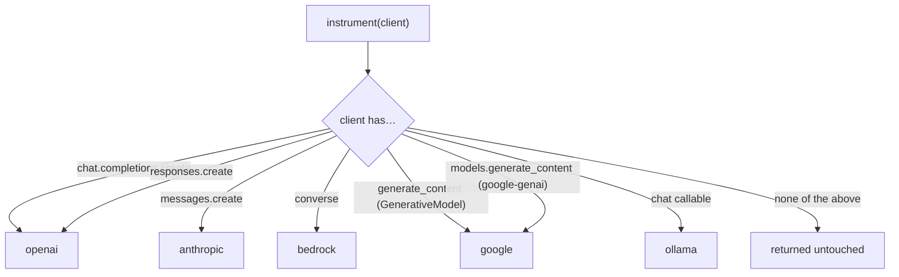

# Providers & Integration

`instrument()` identifies a client by its **shape**, not by model name — so new models from a
provider work the day they ship. It supports five providers directly, plus an OpenTelemetry
ingestion path for managed runtimes.

## How detection works



An OpenAI client exposes both `chat.completions.create` and `responses.create`; a `google-genai`
`Client` exposes both `models.generate_content` and `aio.models.generate_content`. `instrument()`
wraps **every** entrypoint it finds, so whichever API your code calls is captured.

## Per-provider setup

### OpenAI (Chat Completions + Responses API)
```python
from openai import OpenAI
from cendor.core import instrument
client = instrument(OpenAI())                       # env: OPENAI_API_KEY
client.chat.completions.create(model="gpt-4o", messages=[...])   # Chat Completions
client.responses.create(model="gpt-4o", input="…")               # Responses API (also captured)
```
`instrument()` wraps both entrypoints. The Responses API (the default for new OpenAI apps and the
Agents SDK) reports usage differently — `input_tokens`/`output_tokens`, with cached tokens under
`input_tokens_details.cached_tokens` and reasoning under `output_tokens_details.reasoning_tokens` —
all normalized into the same `Usage`.

### Anthropic
```python
from anthropic import Anthropic
client = instrument(Anthropic())                    # env: ANTHROPIC_API_KEY
client.messages.create(model="claude-sonnet-4-6", max_tokens=256, messages=[...])
```

### Azure AI Foundry (models via the OpenAI SDK)
```python
from openai import AzureOpenAI
client = instrument(AzureOpenAI(
    azure_endpoint=os.environ["AZURE_OPENAI_ENDPOINT"],
    api_key=os.environ["AZURE_OPENAI_API_KEY"],
    api_version="2024-10-21"))
client.chat.completions.create(model="<your-deployment-name>", messages=[...])  # detected as openai
```
For the Foundry **Agent Service** (server-side loop), don't `instrument()` — ingest its telemetry
(see *Managed runtimes* below).

### Google Gemini
```python
# Current SDK (google-genai) — the recommended shape:
from google import genai
client = instrument(genai.Client())                 # env: GOOGLE_API_KEY / GEMINI_API_KEY
client.models.generate_content(model="gemini-1.5-pro", contents="…")   # model from the kwarg
await client.aio.models.generate_content(model="gemini-1.5-pro", contents="…")  # async also wrapped
```
```python
# Legacy SDK (google-generativeai) — still detected, model read from the GenerativeModel object:
import google.generativeai as genai
genai.configure(api_key=os.environ["GOOGLE_API_KEY"])
model = instrument(genai.GenerativeModel("gemini-1.5-pro"))
model.generate_content("…")     # model id read from the GenerativeModel, so the call is priced
```

### AWS Bedrock (Converse API)
```python
import boto3
client = instrument(boto3.client("bedrock-runtime", region_name="us-east-1"))
client.converse(modelId="anthropic.claude-…",
                messages=[{"role": "user", "content": [{"text": "…"}]}])   # AWS credentials
```

### Ollama (local, free)
```python
import ollama
client = instrument(ollama.Client())
client.chat(model="llama3", messages=[...])   # no key
```

## Managed runtimes (OpenTelemetry ingestion)

When a runtime owns the agent loop server-side and only emits `gen_ai.*` spans, feed the span
attributes to `core.otel.ingest(...)` so the call still lands on the bus:

```python
from cendor.core import otel
otel.ingest({
    "gen_ai.system": "azure_ai_foundry",
    "gen_ai.request.model": "gpt-4o",
    "gen_ai.usage.input_tokens": 1000,
    "gen_ai.usage.output_tokens": 500,
})   # -> emits a normalized LLMCall; tokenguard / acttrace consume it as usual
```

## Live pricing — which providers expose rates

Cost in `cendor` is computed from a price table. The bundled snapshot works offline; to keep
rates current, `prices.refresh(source=...)` pulls them live. But not every provider lets you: the
**direct model labs publish no pricing API** — their model-list endpoints return ids only — so
"ask the provider for today's price" only works for gateways, cloud catalogs, and aggregators.

| Source | Live pricing API? | Auth | Built-in adapter |
|---|---|---|---|
| OpenAI / Anthropic (direct) | ❌ — `/v1/models` lists ids, no rates | — | use LiteLLM instead |
| **LiteLLM** `model_prices_and_context_window.json` | ✅ static JSON, ~daily, all providers | none | `refresh(source="litellm")` |
| **OpenRouter** `/api/v1/models` | ✅ per-token JSON | none | `refresh(source="openrouter")` |
| **Azure Retail Prices** | ✅ `retailPrice`/`unitOfMeasure` | none | `refresh(source="azure")` |
| AWS Bedrock / GCP Vertex | ✅ Price List / Billing Catalog | creds/SDK | bring your own `mapper=` |

The three built-in adapters are all **unauthenticated HTTPS GETs** → no credentials, no SDKs, no new
dependencies. AWS/GCP need credentials and SKU/region mapping, so they're intentionally left out of
core (pass a custom `mapper=` if you need them). All refreshes are offline-safe and fall back to the
last-good table silently. See [core.md → Prices](core.md#prices).

```python
from cendor.core import prices
prices.refresh(source="litellm")            # broadest coverage
prices.is_stale(max_age_days=30)            # was the active table updated recently?
prices.source_name(), prices.source_url()   # where the active rates came from
```

A gateway that returns the **actual billed cost** on the response (e.g. OpenRouter's `usage.cost`)
is even better than any table: `instrument()` uses that figure directly and labels the call
`cost_reported` (vs `cost_estimated` for a table estimate).

## Notes
- **Streaming is supported** for these providers: pass `stream=True` and the chunk iterator flows through your code unchanged while usage is accumulated, so the call is still priced and recorded once the stream completes. For OpenAI **Chat Completions** streams `instrument()` auto-requests a final usage chunk (`stream_options={"include_usage": True}`) so streamed usage is real, not estimated; the **Responses API** stream carries usage on its `response.completed` event, so nothing is injected there. (AWS Bedrock's separate `converse_stream` entrypoint isn't wrapped — use `converse`.)
- `contextkit` / `squeeze` apply only when **you** assemble the prompt. If a managed runtime owns
  context internally, those two have nothing to shape; `tokenguard`/`cassette`/`acttrace` still do.
- Pricing for a model is looked up in the bundled snapshot; an unpriced model yields `cost = None`
  (the call still works). Add rates with `prices.refresh()`.
