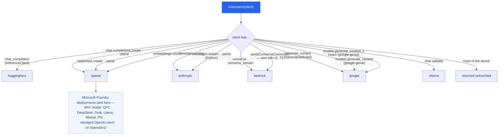

# Providers & Integration

`instrument()` identifies a client by its **shape**, not by model name — so new models from a
provider work the day they ship. It supports six providers directly — **OpenAI, Anthropic, Hugging
Face, Google Gemini, AWS Bedrock, and Ollama** — an OpenTelemetry ingestion path for managed
runtimes, and a callback handler for **LangChain / LangGraph** (see
[Frameworks](#frameworks-langchain--langgraph)). **Microsoft Foundry (formerly Azure AI Foundry)
needs no seventh provider** — *every* model in it, OpenAI-made or not, is called through the OpenAI
client shape, so all of them are detected as `openai`. Per-provider setup ends with the case where
your agent runs inside somebody else's **host process** — a
[Microsoft 365 Agents SDK custom engine agent](#microsoft-365-agents-sdk-custom-engine-agent).

## How detection works



**Microsoft Foundry is not a separate branch, and that is the point of shape-based detection.** Every
Foundry deployment — an OpenAI model or a non-OpenAI one (DeepSeek, Grok, Llama, Mistral, Phi, MAI) —
is consumed with the standard `openai` client pointed at the v1 GA endpoint, so every one of them
lands on the `openai` node. The model's maker never changes the client's shape, so capture is
identical for all of them and nothing is special-cased. See
[Microsoft Foundry](#microsoft-foundry-models-via-the-openai-sdk).

An OpenAI client exposes both `chat.completions.create` and `responses.create` (plus their `parse`
twins and `embeddings.create`); a `google-genai` `Client` exposes `models.generate_content`,
`aio.models.generate_content` and both `generate_content_stream` twins. `instrument()` wraps **every**
entrypoint it finds, so whichever API your code calls is captured.

**Two entrypoints are wrapped in one language only, and that is deliberate rather than a gap.**
Anthropic's `messages.stream` / `messages.parse` are their own targets in **Python** (since
`cendor-core` 1.17.0) because each POSTs its own request; in TypeScript those same helpers are built
*on* `create`, so the wrapped `create` already captures them exactly once and a second target would
**double-count**. Bedrock's aws-sdk-v3 `send(ConverseCommand)` is detected in **TypeScript** (since
`@cendor/core` 3.3.0) because that is the only shape that SDK offers; Python's boto3 client exposes
`converse()` directly, so it needs nothing extra. Parity of *behaviour*, not of mechanism — the
[parity matrix](languages.md) is the contract.

**What is NOT on this diagram, because it is not detection.** Two Microsoft integrations govern calls
without `instrument()` ever inspecting a client, and they are easy to confuse for each other:

| | what it is | how governance attaches |
|---|---|---|
| [**M365 Agents SDK**](#microsoft-365-agents-sdk-custom-engine-agent) (pro-code custom engine agent) | your agent runs inside **Microsoft's** host process | you still own the model call — `instrument()` the provider client **inside** your agent, exactly as anywhere else. There is no "M365 client" to duck-type |
| **Foundry Agent Service** + `FoundryAdapter` | the agent loop runs **server-side**, at Microsoft | attribution-only: ingest its OpenTelemetry (see [Managed runtimes](#managed-runtimes-opentelemetry-ingestion)). No per-step token/cost, because no call passes through your process |

⚠️ These are **two separate Microsoft integrations**, and picking the wrong one fails quietly:
`FoundryAdapter` is not the M365 path, and driving the M365 path through it returns a valid-looking
Activity and raises nothing. Microsoft Foundry *models* (the row above, via the OpenAI SDK) are a third
thing again, and those **are** detected.

## Per-provider setup

> **TypeScript.** `instrument()` detects all six providers in both languages — **OpenAI (Chat +
> Responses), Anthropic, Hugging Face, google-genai, Bedrock, and Ollama** — plus the OpenTelemetry
> ingestion path. The **LangChain / LangGraph** callback handler ships in both languages
> (`@cendor/core/langchain`). Since `@cendor/core` 3.3.0 TypeScript also detects the **aws-sdk-v3**
> Bedrock client's `send(new ConverseCommand(…))`, which used to be the one detection asymmetry — so a
> libs-only TypeScript Bedrock app no longer needs the SDK or a hand-written `converse()` shim. What
> differs now is *mechanism*, not coverage: Anthropic's `messages.stream` / `messages.parse` are their
> own targets in Python and deliberately not in TypeScript (there they are helpers on `create`, so a
> target would double-count). See the [parity matrix](languages.md).

### OpenAI (Chat Completions + Responses API + Embeddings)
`instrument()` wraps all three entrypoints; the Responses API reports usage differently, and it's
all normalized into the same `Usage`.

<!-- tabs: lang -->
<!-- tab: Python -->

```python
from openai import OpenAI
from cendor.core import instrument
client = instrument(OpenAI())                       # env: OPENAI_API_KEY
client.chat.completions.create(model="gpt-4o", messages=[...])   # Chat Completions
client.responses.create(model="gpt-4o", input="…")               # Responses API (also captured)
client.embeddings.create(model="text-embedding-3-small", input="…")  # Embeddings (also captured)
```

<!-- tab: TypeScript -->

```ts
import OpenAI from 'openai';
import { instrument } from '@cendor/core';
const client = instrument(new OpenAI());            // env: OPENAI_API_KEY
await client.chat.completions.create({ model: 'gpt-4o', messages: [/* ... */] });  // Chat Completions
await client.responses.create({ model: 'gpt-4o', input: '…' });                    // Responses API (also captured)
await client.embeddings.create({ model: 'text-embedding-3-small', input: '…' });   // Embeddings (also captured)
```

<!-- /tabs -->

Embedding calls (since core 1.6.0 / 0.6.0) emit an `LLMCall` with `metadata["embedding"] = True`,
ride the same pre-flight interceptor pass (budgets can block, guards can redact-before-send), and
are priced from the snapshot's `text-embedding-*` rows. Microsoft Foundry shares the client shape, so
its embeddings are captured the same way.
The Responses API (default for new OpenAI apps and the Agents SDK) reports `input_tokens`/
`output_tokens`, with cached tokens under `input_tokens_details.cached_tokens` and reasoning under
`output_tokens_details.reasoning_tokens` — all normalized.

### Anthropic

<!-- tabs: lang -->
<!-- tab: Python -->

```python
from anthropic import Anthropic
client = instrument(Anthropic())                    # env: ANTHROPIC_API_KEY
client.messages.create(model="claude-sonnet-4-6", max_tokens=256, messages=[...])
```

<!-- tab: TypeScript -->

```ts
import Anthropic from '@anthropic-ai/sdk';
import { instrument } from '@cendor/core';
const client = instrument(new Anthropic());         // env: ANTHROPIC_API_KEY
await client.messages.create({ model: 'claude-sonnet-4-6', max_tokens: 256, messages: [/* ... */] });
```

<!-- /tabs -->

### Microsoft Foundry (models via the OpenAI SDK)
**Microsoft Foundry** (formerly Azure AI Foundry) deployments are consumed with the **standard
`openai` client** pointed at the **v1 GA endpoint** — `base_url = <endpoint>/openai/v1/`, no
`api-version`. That is Microsoft's current guidance, and it is also `instrument()`'s native detection
target, so nothing about capture is special-cased. Call your **deployment name** as the model (Foundry
keys on deployment, not model).

**This includes the non-OpenAI models.** DeepSeek, Grok, Llama, Mistral, Phi and MAI deployments go
through the *same* OpenAI-shaped client and the same endpoint — Microsoft's own samples call
`DeepSeek-V3.1` that way — so they are captured as `provider="openai"` with exact usage, exactly like
a `gpt-4o` deployment. There is no per-model-family setup, and no such thing as a "DeepSeek provider"
to look for. What *does* differ for them is **price**, not capture — see
[Pricing a deployment name](#pricing-a-deployment-name).

Three endpoint forms all work: `https://<res>.openai.azure.com` (Azure OpenAI models),
`https://<res>.services.ai.azure.com` (Foundry Models — DeepSeek, Grok, Llama, …), and the
**project endpoint** the portal shows, `https://<res>.services.ai.azure.com/api/projects/<project>`.

For the Foundry **Agent Service** (server-side loop) don't `instrument()` — ingest its telemetry
(see [Managed runtimes](#managed-runtimes-opentelemetry-ingestion)).

<!-- tabs: lang -->
<!-- tab: Python -->

```python
from openai import OpenAI
endpoint = os.environ["AZURE_OPENAI_ENDPOINT"].rstrip("/")
client = instrument(OpenAI(
    base_url=f"{endpoint}/openai/v1/",              # no api-version: the v1 GA API infers it
    api_key=os.environ["AZURE_OPENAI_API_KEY"]))
client.chat.completions.create(model="<your-deployment-name>", messages=[...])  # detected as openai
```
```python
# Microsoft Entra ID (keyless) — the v1 client re-reads the token provider per request:
from azure.identity import DefaultAzureCredential, get_bearer_token_provider
token = get_bearer_token_provider(DefaultAzureCredential(), "https://ai.azure.com/.default")
client = instrument(OpenAI(base_url=f"{endpoint}/openai/v1/", api_key=token))
```

<!-- tab: TypeScript -->

```ts
import OpenAI from 'openai';
import { instrument } from '@cendor/core';
const endpoint = (process.env.AZURE_OPENAI_ENDPOINT ?? '').replace(/\/+$/, '');
const client = instrument(new OpenAI({
  baseURL: `${endpoint}/openai/v1/`,               // no apiVersion: the v1 GA API infers it
  apiKey: process.env.AZURE_OPENAI_API_KEY }));
await client.chat.completions.create({ model: '<your-deployment-name>', messages: [/* ... */] });
```

<!-- /tabs -->

#### With the Foundry SDK (`azure-ai-projects` / `@azure/ai-projects`)

If your app already builds an `AIProjectClient`, hand its OpenAI client straight to `instrument()`.
`get_openai_client()` / `getOpenAIClient()` returns a **plain `OpenAI` client** on
`<endpoint>/openai/v1`, so there is nothing Foundry-specific for cendor to know — and **zero cendor
code was needed** to support this path, which is why it works for `responses.create` and every model
in the project, not a blessed subset. Verified live in both languages.

`azure-ai-projects` / `@azure/ai-projects` is **your** dependency; cendor never pulls it. The project
endpoint is the one the portal shows,
`https://<res>.services.ai.azure.com/api/projects/<project>`, and the client authenticates with
Microsoft Entra ID (`DefaultAzureCredential` — `az login`, a managed identity, or a service
principal). Do **not** reach for the `[foundry]` extra here: that is the *attribution adapter* for the
Agent Service, a different integration.

<!-- tabs: lang -->
<!-- tab: Python -->

```python
from azure.ai.projects import AIProjectClient
from azure.identity import DefaultAzureCredential
from cendor.core import instrument

project = AIProjectClient(endpoint=os.environ["AZURE_PROJECT_ENDPOINT"],
                          credential=DefaultAzureCredential())
client = instrument(project.get_openai_client())
client.responses.create(model="<your-deployment-name>", input="…")   # detected as openai
```

<!-- tab: TypeScript -->

```ts
import { AIProjectClient } from '@azure/ai-projects';
import { DefaultAzureCredential } from '@azure/identity';
import { instrument } from '@cendor/core';

const project = new AIProjectClient(process.env.AZURE_PROJECT_ENDPOINT ?? '', new DefaultAzureCredential());
const client = instrument(project.getOpenAIClient());
await client.responses.create({ model: '<your-deployment-name>', input: '…' });
```

<!-- /tabs -->

One cross-language difference: the Python package documents an `api_key=` override on
`get_openai_client(...)`, while the JS one always overwrites `apiKey` with its Entra token provider —
so in TypeScript authentication goes through the constructor's credential.

> **Legacy note — `AzureOpenAI` still works.** An older app builds `openai.AzureOpenAI` /
> `new AzureOpenAI({...})` with an `api_version`. Detection is **structural**, so those clients are
> still captured exactly as before, and a regression test pins that in both languages on purpose.
> There is nothing to migrate for capture's sake; the v1 form above is simply what Microsoft
> documents for new code.
>
> Two traps worth knowing, both measured against a live deployment: a **bare project endpoint**
> (no `/openai/v1/`) answers `400 Missing required query parameter: api-version`, which reads like
> "go back to the legacy client" and is not; and a **reasoning-family** deployment (`gpt-5*`, `o*`)
> rejects `max_tokens` and names `max_completion_tokens` instead — a deployment name cannot tell you
> which family it is, so read the error rather than guessing. (On the SDK door, `cendor-sdk` ≥ 1.21.0
> / `@cendor/sdk` ≥ 3.1.0 does that for you.)

> ⚠️ **`azure-ai-inference` is a different client, and it is captured by nothing.** The Azure AI
> Inference beta SDK (`ChatCompletionsClient`, the `/models` route) is **not** an `instrument()`
> detection target: hand one to `instrument()` and it is returned untouched, emitting **zero** events
> — so budgets never bind, gates never fire, and the audit chain stays empty while your app looks
> like it is working. Microsoft **deprecated it and retires it on 26 August 2026**, with the GA
> `/openai/v1` API above as the replacement. If you are on it, that migration is the fix; there is no
> cendor-side option.

#### Pricing a deployment name

The same fact that makes the family unknowable makes the **price** unknowable: the id a call reports is
the deployment name *you* chose, so it is in no price table, `cost` is `None`, and a USD
[`budget(...)`](/docs/tokenguard) never binds on it. Say which model it serves, once:

<!-- tabs: lang -->
<!-- tab: Python -->

```python
from cendor.core import prices

prices.register_deployment("prod-gpt4o-eastus", like="gpt-4o")
# cost + USD budgets now work on calls that report "prod-gpt4o-eastus"
```

<!-- tab: TypeScript -->

```ts
import { prices } from '@cendor/core';

prices.registerDeployment('prod-gpt4o-eastus', { like: 'gpt-4o' });
// cost + USD budgets now work on calls that report 'prod-gpt4o-eastus'
```

<!-- /tabs -->

It copies `like`'s rates **at registration** and survives `prices.refresh()`; a later refresh that
reprices `gpt-4o` does not reprice the deployment (call it again to pick that up), and an unknown
`like` raises rather than leaving the deployment quietly unpriced. Cendor never guesses a price from an
id's shape — see [tokenguard → Unpriced models](tokenguard.md#unpriced-models--a-usd-blind-spot).

**When there is no base model to copy, give the rate card itself.** This is the normal case for the
**non-OpenAI** Foundry models: the bundled snapshot has no DeepSeek, Mistral or Phi rows, so
`register_deployment(..., like="DeepSeek-V3.1")` correctly **raises** instead of inventing a number.
Type the two prices from your Foundry pricing page — they are quoted in **USD per 1M tokens**, which is
exactly what this takes:

<!-- tabs: lang -->
<!-- tab: Python -->

```python
from cendor.core import prices

prices.register_model_price("prod-deepseek", input=1.25, output=5.00)   # USD per 1M tokens
prices.estimate("prod-deepseek", 1_000, output_tokens=500)              # → Decimal('0.00375')
```

<!-- tab: TypeScript -->

```ts
import { prices } from '@cendor/core';

prices.registerModelPrice('prod-deepseek', { input: 1.25, output: 5.0 });  // USD per 1M tokens
prices.estimate('prod-deepseek', 1_000, { outputTokens: 500 });            // → 0.00375
```

<!-- /tabs -->

$1.25 per 1M input × 1,000 tokens = $0.00125, plus $5.00 per 1M output × 500 = $0.0025 — so
`$0.00375`, stored as exact per-token `Decimal`, never a float. `per="1K"` / `per: '1K'` (or
`"token"`) if your card is quoted differently, and `cached=` / `cacheWrite=` when you have those
rates too. `register_model_price` is in `cendor-core` since 1.15.0 and in `@cendor/core` since
**3.4.0** (`@cendor/sdk`'s twin still works); `cendor.sdk.register_model_price` is a thin re-export.

> **Honest limit — a `model-router` deployment cannot be priced this way.** With Foundry's model
> router the id your call *reports* is `model-router`, while Foundry picks a different underlying model
> per request and bills you at **that** model's rates. Tokens stay exact, but no single registration
> can be right for every routed call, so USD attribution under model router is not something cendor
> supports today. If a USD cap has to bind, restrict the router to a subset and register the **most
> expensive** member — that over-estimates rather than under-estimates, which is the safe direction.
> (Microsoft returns the model that actually served the call on the response, so per-call attribution
> is possible in principle; making cendor read it is recorded as future work, not a shipped feature.
> This page will say so when that changes.)

### Google Gemini
Both SDKs are detected — the current `google-genai` (model from the kwarg) and the legacy
`google-generativeai` (model read from the `GenerativeModel` object).

<!-- tabs: lang -->
<!-- tab: Python -->

```python
# Current SDK (google-genai) — the recommended shape:
from google import genai
client = instrument(genai.Client())                 # env: GOOGLE_API_KEY / GEMINI_API_KEY
client.models.generate_content(model="gemini-1.5-pro", contents="…")
await client.aio.models.generate_content(model="gemini-1.5-pro", contents="…")  # async also wrapped
```
```python
# Legacy SDK (google-generativeai) — still detected:
import google.generativeai as genai
genai.configure(api_key=os.environ["GOOGLE_API_KEY"])
model = instrument(genai.GenerativeModel("gemini-1.5-pro"))
model.generate_content("…")     # model id read from the GenerativeModel, so the call is priced
```

<!-- tab: TypeScript -->

```ts
// Current SDK (@google/genai) — the model rides the `model` kwarg:
import { GoogleGenAI } from '@google/genai';
import { instrument } from '@cendor/core';
const client = instrument(new GoogleGenAI({ apiKey: process.env.GOOGLE_API_KEY }));
await client.models.generateContent({ model: 'gemini-1.5-pro', contents: '…' });  // detected as google
```

<!-- /tabs -->

**Streaming is captured too** (core ≥ 1.15.0 / `@cendor/core` ≥ 3.1.0). Gemini streams through a
*separate method* rather than a `stream=True` flag, so it needs its own detection target — before
those versions a streamed Gemini call emitted **nothing at all**. One `LLMCall` lands when the
stream completes, with real usage read from the final chunk's `usage_metadata`/`usageMetadata`
(Gemini reports running totals on every chunk, so the last one is the total); when a stream reports
no usage, cendor estimates it offline and flags `metadata["usage_estimated"]`. Mid-stream governance
works: a `budget(..., on_exceed="break")` cuts the stream and closes it.

<!-- tabs: lang -->
<!-- tab: Python -->

```python
for chunk in client.models.generate_content_stream(model="gemini-2.5-flash", contents="…"):
    print(chunk.text, end="")
# async: `async for c in await client.aio.models.generate_content_stream(...)` — also wrapped
```

<!-- tab: TypeScript -->

```ts
const stream = await client.models.generateContentStream({ model: 'gemini-2.5-flash', contents: '…' });
for await (const chunk of stream) process.stdout.write(chunk.text ?? '');
```

<!-- /tabs -->

### AWS Bedrock (Converse API)

<!-- tabs: lang -->
<!-- tab: Python -->

```python
import boto3
client = instrument(boto3.client("bedrock-runtime", region_name="us-east-1"))
client.converse(modelId="anthropic.claude-…",
                messages=[{"role": "user", "content": [{"text": "…"}]}])   # AWS credentials
```

<!-- tab: TypeScript -->

> **Bedrock in TypeScript — the official aws-sdk-v3 client is detected** (since `@cendor/core` 3.3.0).
> `instrument()` matches both shapes: a **boto-shaped `converse()`** wrapper, and the official
> `@aws-sdk/client-bedrock-runtime` v3 client, which issues everything as
> `client.send(new ConverseCommand(…))`. Because `send` is shared by every AWS command, the *client* is
> identified once (`config.serviceId === "Bedrock Runtime"`) and the *command* per call — so
> `ConverseCommand` and `ConverseStreamCommand` are captured while **every other AWS command passes
> through untouched, emitting nothing**. `InvokeModelCommand` is deliberately not captured: its request
> and response bodies are opaque, provider-specific JSON, so any usage reading would be a guess.
> `@cendor/sdk`'s Bedrock provider still wraps the client in a synthetic `converse()` and cannot
> double-count. Before 3.3.0 this was the JS port's one zero-capture gap. See the
> [parity matrix](languages.md).

<!-- ts-check: skip -->

```ts
import { BedrockRuntimeClient, ConverseCommand } from '@aws-sdk/client-bedrock-runtime';
import { instrument } from '@cendor/core';

const client = instrument(new BedrockRuntimeClient({ region: 'us-east-1' }));
await client.send(new ConverseCommand({          // captured — no shim needed
  modelId: 'anthropic.claude-…',
  messages: [{ role: 'user', content: [{ text: '…' }] }],
}));
```

<!-- /tabs -->

### Ollama (local, free)

<!-- tabs: lang -->
<!-- tab: Python -->

```python
import ollama
client = instrument(ollama.Client())
client.chat(model="llama3", messages=[...])   # no key
```

<!-- tab: TypeScript -->

```ts
import { Ollama } from 'ollama';
import { instrument } from '@cendor/core';
const client = instrument(new Ollama());
await client.chat({ model: 'llama3.2', messages: [{ role: 'user', content: '…' }] });   // no key
```

<!-- /tabs -->

### Hugging Face
`huggingface_hub`'s `InferenceClient` exposes `chat_completion(...)`, whose response is
OpenAI-shaped. `instrument()` binds to it **before** the client's OpenAI-compatible
`chat.completions.create`, so the call is attributed to `huggingface` rather than `openai`. The
model is a Hub id or an Inference Endpoint URL.

<!-- tabs: lang -->
<!-- tab: Python -->

```python
from huggingface_hub import InferenceClient
client = instrument(InferenceClient())          # env: HF_TOKEN / HUGGINGFACEHUB_API_TOKEN
client.chat_completion(
    model="meta-llama/Llama-3.1-8B-Instruct",
    messages=[{"role": "user", "content": "…"}])   # OpenAI-shaped; attributed to huggingface
```

<!-- tab: TypeScript -->

<!-- ts-check: skip -->

```ts
import { InferenceClient } from '@huggingface/inference';
import { instrument } from '@cendor/core';
const client = instrument(new InferenceClient(process.env.HF_TOKEN));   // env: HF_TOKEN
await client.chatCompletion({
  model: 'meta-llama/Llama-3.1-8B-Instruct',
  messages: [{ role: 'user', content: '…' }] });   // OpenAI-shaped; attributed to huggingface
```

<!-- /tabs -->

### Microsoft 365 Agents SDK (custom engine agent)

Your agent runs inside **somebody else's host process** — and in this topology *you* still hold the
model client, so it is ordinary library use. The toolkit tile says so itself: *"you manage
orchestration and provide your own LLM."* That is exactly the boundary. Your process hosts
`AgentApplication` behind `POST /api/messages`, and the model call inside your message handler is an
ordinary provider-SDK call. Your call, your tokens, your bill, so `instrument()` and the six libraries
govern it like any other call. There is nothing extra to install, and no `cendor-sdk` involved — the
agent connects to Copilot, Teams and M365 Copilot as usual.

> **Not to be confused with `FoundryAdapter`.** If you want cendor to *be* the endpoint — to own the
> Activity request/reply shape — that is the SDK's `FoundryAdapter` integration
> ([`/docs/sdk/interop`](/docs/sdk/interop#microsoft-365--foundry--publish-as-a-custom-engine-agent)). Here
> the host already owns that plumbing, so you attach the governance envelope in your own handler and
> `FoundryAdapter` is not used at all. Two separate integrations; pick by who owns the HTTP surface.

Pick **Custom Engine Agent** in the toolkit's *New Project* menu (the **Teams Agents and Apps**
bot/agent flavour is equivalent). A **Declarative Agent** is the opposite topology — Microsoft holds
the model and bills you in Copilot Credits — so there is nothing for a token library to govern there.

| Where | Library | What it does in the handler |
|---|---|---|
| on the client, once at startup | [core](core.md) `instrument()` | exact tokens, `Decimal` cost, provider + model, TTFT |
| around the whole handler body | [tokenguard](tokenguard.md) budget scope | one fuse per turn, so a tool loop's N calls share it |
| across turns, in the host's `TurnState` | tokenguard + your state | a cumulative session cap that survives turns |
| before any spend | tokenguard `prices.estimate` | refuse a turn the remaining budget can't cover — zero provider calls |
| mid-stream | budget `on_exceed="break"` | stop a streamed answer at the chunk where the allowance dies |
| on `activity.text`, and on the reply | [guardrails](guardrails.md) | injection block + PII redaction in, disclosure gate out |
| per turn | [acttrace](acttrace.md) `guard()` + `AuditLog` | hash-chained, `verify()`-able evidence + a data-policy gate |
| the prompt | [contextkit](contextkit.md) + [squeeze](squeeze.md) | Teams history assembled *inside* a token budget |
| the reply | your handler, ~3 lines | `channelData.cendor` = `trace_id` · `cost_usd` · usage · decisions |

#### The handler

One `activity("message")` handler, the governance inline. `client` is the instrumented provider
client you built once at startup (`instrument(AsyncOpenAI())` / `instrument(new OpenAI())`).

<!-- tabs: lang -->
<!-- tab: Python -->

```python
from decimal import Decimal
from cendor.core import trace
from cendor.guardrails import GuardrailTripped, evaluate_async
from cendor.tokenguard import BudgetExceeded, budget, track

SPEND = "ConversationState.cendor_spent_usd"   # scoped by the state CLASS name, not "conversation."
CAP = Decimal("5.00")

@AGENT_APP.activity("message")
async def on_message(context, state):
    conversation = context.activity.conversation.id
    spent = Decimal(str(state.get_value(SPEND, lambda: None) or "0"))
    if spent >= CAP:                                     # zero-spend refusal: no model call at all
        await context.send_activity("This conversation has used its budget.")
        return

    # `evaluate_async` RAISES on a block — catching it is what turns a policy hit into YOUR wording
    try:
        text, decisions = await evaluate_async(INPUT_GATE, "input", context.activity.text)
    except GuardrailTripped as tripped:
        await context.send_activity("I can't process that message.")
        return

    # one trace id for the whole turn + one fuse around the whole body (tool loops share it)
    with trace(f"{conversation}:{context.activity.id}"), track(conversation=conversation):
        try:
            with budget(usd=min(Decimal("0.05"), CAP - spent), on_exceed="block"):
                resp = await client.chat.completions.create(model=MODEL, messages=messages)
        except BudgetExceeded:
            await context.send_activity("That would exceed what's left of this conversation's budget.")
            return

    state.set_value(SPEND, str(spent + turn_cost))        # Decimal as a string, never a float
    await context.send_activity(resp.choices[0].message.content)
```

<!-- tab: TypeScript -->

<!-- ts-check: skip -->

```ts
// Not typechecked by `check:docs`: it imports the Microsoft host SDK, which is deliberately not a
// dependency of any cendor package. The cendor call shapes below are executed instead — the
// TypeScript cookbook's `m365-custom-engine-js` recipe runs this handler end-to-end in CI on Node
// 20 and 22.
import { Decimal, trace } from '@cendor/core';   // core re-exports decimal.js's Decimal
import { GuardrailTripped, evaluateAsync } from '@cendor/guardrails';
import { BudgetExceeded, track, withBudget } from '@cendor/tokenguard';
import { ActivityTypes } from '@microsoft/agents-activity';

const CAP = new Decimal('5.00');

app.onActivity(ActivityTypes.Message, async (context, state) => {
  const conversation = context.activity.conversation.id;
  const spent = new Decimal(String(state.conversation.cendorSpentUsd ?? '0'));
  if (spent.gte(CAP)) {                             // zero-spend refusal: no model call at all
    await context.sendActivity('This conversation has used its budget.');
    return;
  }

  // `evaluateAsync` THROWS on a block — catching it is what turns a policy hit into YOUR wording
  let text: unknown;
  try {
    ({ payload: text } = await evaluateAsync(INPUT_GATE, 'input', context.activity.text));
  } catch (err) {
    if (!(err instanceof GuardrailTripped)) throw err;
    await context.sendActivity("I can't process that message.");
    return;
  }

  // one trace id for the whole turn + one fuse around the whole body (tool loops share it)
  await trace(`${conversation}:${context.activity.id}`, () =>
    track({ conversation }, async () => {
      try {
        const resp = await withBudget(
          { usd: Decimal.min(new Decimal('0.05'), CAP.minus(spent)).toString(), onExceed: 'block' },
          () => client.chat.completions.create({ model: MODEL, messages }),
        );
        state.conversation.cendorSpentUsd = spent.plus(turnCost).toString();  // string, never a number
        await context.sendActivity(resp.choices[0].message.content);
      } catch (err) {
        if (!(err instanceof BudgetExceeded)) throw err;
        await context.sendActivity("That would exceed what's left of this conversation's budget.");
      }
    }),
  );
});

// ⚠️ REQUIRED on this port, and its absence looks exactly like working code:
app.onTurn('afterTurn', async () => true);
```

<!-- /tabs -->

#### The five call shapes that bite

Every one of these was measured against a real agent, and every one of them *looks* like working code.

1. **`evaluate_async` / `evaluateAsync` RAISE on a block** — in **both** languages. They do not return
   a decision list with `action="block"` in it. A handler that only reads the return value never sees
   the block: it escapes as an unhandled turn error and the channel shows *"the agent hit an error"*
   instead of your policy's refusal, which is indistinguishable from a broken agent.
2. **A third exception type.** An `acttrace` `guard()` installed at startup raises `PolicyViolation`
   from *inside* the provider call, at core's interceptor seam. With `BudgetExceeded` and
   `GuardrailTripped` that makes three things a governed handler must expect. Report the finding's
   **categories**, never the matched value.
3. **`TurnState` paths differ between the ports.** Python scopes by the state **class name** —
   `state.get_value("ConversationState.cendor_spent_usd")`; a lowercase `"conversation."` raises
   `ValueError: Scope 'conversation' not found`. TypeScript is a property proxy:
   `state.conversation.cendorSpentUsd`.
4. **On TypeScript, `app.onTurn('afterTurn', async () => true)` is required.**
   `AgentApplication.run()` calls `state.save()` only when an after-turn handler is registered and the
   official nodejs quickstart registers none — so `TurnState` is never persisted, every turn reads a
   `$0` ledger, and the cumulative cap silently never binds. Python's `run()` saves unconditionally, so
   the Python handler needs nothing.
5. **Pre-flight and mid-stream break are mutually exclusive on a streamed turn.** The estimate reserves
   the *full* `max_output_tokens`, so any allowance small enough for the breaker to fire is already
   smaller than the estimate — the turn would be refused before a chunk existed. A streamed turn's fuse
   **is** the breaker; skip the pre-flight check there on purpose.

The pure-cendor half of the ledger, with no host SDK in sight — this is the shape the estimate and the
derived per-turn allowance take:

<!-- tabs: lang -->
<!-- tab: Python -->

```python
from decimal import Decimal
from cendor.core import prices, tokens

CAP, TURN_CAP = Decimal("5.00"), Decimal("0.05")
spent = Decimal("4.97")                                  # read out of TurnState

allowance = min(TURN_CAP, CAP - spent)                   # the derived remainder: $0.03 left
estimate = prices.estimate("gpt-4o-mini", tokens.count("…the assembled prompt…", "gpt-4o-mini"), 48)
affordable = estimate is None or estimate.amount <= allowance
```

<!-- tab: TypeScript -->

```ts
import { Decimal, prices, tokens } from '@cendor/core';   // core re-exports decimal.js's Decimal

const CAP = new Decimal('5.00');
const TURN_CAP = new Decimal('0.05');
const spent = new Decimal('4.97');                       // read out of TurnState

const allowance = Decimal.min(TURN_CAP, CAP.minus(spent));   // the derived remainder: $0.03 left
const estimate = prices.estimate('gpt-4o-mini', tokens.count('…the assembled prompt…', 'gpt-4o-mini'), {
  outputTokens: 48,
});
const affordable = !estimate || new Decimal(estimate.amount.toString()).lte(allowance);
```

<!-- /tabs -->

#### `$0` whole-agent CI

Record the handler's model calls once, then replay **the entire agent** — HTTP → middleware → adapter
→ your handler → the channel — with no key and no network. The scope goes around the **listener
start**, not around whatever drives the turns: replay matches calls by a session id stamped from
context-local storage, and a request-handler task inherits the context that was active when the server
began listening. A scope around your driver never reaches the handler, and every call goes to the
network instead.

<!-- tabs: lang -->
<!-- tab: Python -->

```python
from cendor import cassette

async def replay_the_whole_agent(start_listening, drive_turn, turns):
    with cassette.using("agent.json", mode="replay"):     # around the LISTENER, not the driver
        await start_listening()                           # aiohttp TCPSite.start() / your server's
        for turn in turns:
            await drive_turn(turn)
```

<!-- tab: TypeScript -->

```ts
import { using } from '@cendor/cassette';

export async function replayTheWholeAgent(
  startListening: () => Promise<void>,
  driveTurn: (text: string) => Promise<void>,
  turns: string[],
) {
  await using('agent.json', { mode: 'replay' }, async () => {  // around the LISTENER, not the driver
    await startListening();
    for (const turn of turns) await driveTurn(turn);
  });
}
```

<!-- /tabs -->

One scope per server lifetime also matters because the recorder writes the file on scope **exit** — a
per-turn scope would leave only the last turn in it. Copy-paste versions of all of this, runnable
offline: `agents/m365-custom-engine-py` in the [Python cookbook](https://github.com/cendorhq/cendor-cookbook)
and `agents/m365-custom-engine-js` in the [TypeScript cookbook](https://github.com/cendorhq/cendor-cookbook-js)
(one repo per toolchain; the recipe folder names are unchanged).

#### Honest limits for this topology

- **The meter cendor governs is the model meter** — which in this topology is the agent's entire AI
  bill. Azure Bot Service messages, Copilot Credits and your hosting bill are Microsoft's or your
  cloud's meters, and out of scope for any token library. (A self-hosted-RAG custom engine agent never
  triggers the Copilot Credits meter.)
- **Break stops spend at the chunk boundary; the channel keeps whatever it was already sent.** Queued
  chunks cannot be unsent. Whether anything was visible depends on the channel and on how long the
  answer ran — on a non-streaming channel the user simply sees the truncated answer plus the notice.
  Never claim the visible text is cut at the exact budget token.
- **The two ports disagree about which channels stream.** TypeScript's `StreamingResponse` treats
  `emulator` as a streaming channel; Python's lists only `msteams`, webchat/directline and
  `deliveryMode='stream'`. So validate a streamed break with `agentsplayground -c msteams` on Python.
  Python's `end_stream()` and `wait_for_queue()` are also **coroutines** — un-awaited, the last chunk
  never reaches the channel; on TypeScript `endStream()` drains the queue itself.
- **A pre-flight refusal is not "you reached your cap."** The estimate over-reserves (measured 3.04×
  on one real turn), so it can refuse while the ledger still shows headroom. Both refusals are correct
  and zero-spend; word them differently.
- **`channelData.cendor` is for the channel or your back end.** Whether a *client* surfaces it is
  client-specific. The M365 Agents Playground's **chat pane** projects `channelData` away — but its
  **Log Panel does not**: clicking the outbound activity (`message 201`) shows the whole Activity
  JSON, envelope included (measured on Playground 0.2.28). So it *is* inspectable there; just don't
  build on any particular client rendering it. Assert it in a test, or log it.
- **Evidence in a long-lived server.** Reopening one chain file after a restart **resumes** the chain
  and `verify()` stays green. What acttrace refuses is two *live* `AuditLog`s on one file at once — the
  second raises at construction. Rotate per process only if you have concurrent writers.
- **Orchestration layers:** plain provider SDK ✅ · Semantic Kernel ✅ · LangChain ✅ (shipped adapter) ·
  **Microsoft Agent Framework ✅ from `cendor-core` 1.14.1** — MAF 1.12.1 drives OpenAI through a
  raw-response envelope, which 1.14.1 taught core to read, on both the plain and structured-output
  branches; below that version usage and cost are `None`, so pin both versions in any claim. The Teams
  SDK's **own** AI libraries are **deprecated by Microsoft** — use the provider-SDK pattern above.
- **.NET / C# is an explicit non-goal.** There is no cendor .NET port, so the Visual Studio flavour of
  the toolkit is not covered. Never assume otherwise.
- **A governed agent emits two OpenTelemetry span families** — the hosting SDK's own `microsoft_agents`
  spans alongside cendor's — and three with MAF. That is additive, not a conflict.
- **A second, un-instrumented client is invisible.** Budgets, gates and evidence only see calls through
  the client you wrapped; `cendor-init doctor` static-checks that. And the local posture the Playground
  relies on — `/api/messages` with no configured credentials — is an **open relay** in production:
  configure a real service connection before you deploy.
- **Publishing through the Agents Toolkit is not supported in Microsoft 365 *Government* tenants.**
  GCC / sovereign customers use the manual Azure Bot Service deploy path.

## Managed runtimes (OpenTelemetry ingestion)

When a runtime owns the agent loop server-side and only emits `gen_ai.*` spans, feed the span
attributes to `core.otel.ingest(...)` so the call still lands on the bus — and `tokenguard` /
`acttrace` consume it as usual:

<!-- tabs: lang -->
<!-- tab: Python -->

```python
from cendor.core import otel
otel.ingest({
    "gen_ai.system": "azure_ai_foundry",
    "gen_ai.request.model": "gpt-4o",
    "gen_ai.usage.input_tokens": 1000,
    "gen_ai.usage.output_tokens": 500,
})   # -> emits a normalized LLMCall
```

<!-- tab: TypeScript -->

```ts
import { otel } from '@cendor/core';
otel.ingest({
  'gen_ai.system': 'azure_ai_foundry',
  'gen_ai.request.model': 'gpt-4o',
  'gen_ai.usage.input_tokens': 1000,
  'gen_ai.usage.output_tokens': 500,
});   // -> emits a normalized LLMCall
```

<!-- /tabs -->

`contextkit` / `squeeze` apply only when **you** assemble the prompt; if a managed runtime owns
context internally, those two have nothing to shape while the other three still work.

## Frameworks (LangChain / LangGraph)

For a framework, the SDK-aligned integration point is its **callback system**, not client wrapping —
and that recommendation is unchanged, though the reason has narrowed. `langchain_openai` reaches the
client through `with_raw_response`: a plain call
(`client.chat.completions.with_raw_response.create(...).parse()`) **is** captured and priced from
`cendor-core` 1.14.1, and its structured-output branch
(`chat.completions.with_raw_response.parse(...)`, taken whenever `response_format` is set) from
1.14.2. What inner-client wrapping still does **not** see is the **streaming** branch, which reads
the body through the envelope's own context manager. So use the callback handler: it is the only
integration that covers every branch, and it carries the framework's `run_id` for correlation.

<!-- tabs: lang -->
<!-- tab: Python -->

```python
pip install "cendor-core[langchain]"
```

```python
from cendor.core.langchain import CendorCallbackHandler
from langchain_openai import ChatOpenAI

handler = CendorCallbackHandler()
llm = ChatOpenAI(model="gpt-4o", callbacks=[handler])     # every call recorded onto the bus
llm.invoke("hi")

# LangGraph: attach once via config — it propagates to every node + tool, correlated by run:
agent.invoke({"messages": [...]}, config={"callbacks": [handler]})
```

<!-- tab: TypeScript -->

```bash
npm install @langchain/core
```

<!-- ts-check: skip -->

```ts
import { CendorCallbackHandler } from '@cendor/core/langchain';
import { ChatOpenAI } from '@langchain/openai';

const handler = new CendorCallbackHandler();
const llm = new ChatOpenAI({ model: 'gpt-4o', callbacks: [handler] });  // every call recorded onto the bus
await llm.invoke('hi');

// LangGraph: attach once via config — it propagates to every node + tool, correlated by run:
await agent.invoke({ messages: [...] }, { callbacks: [handler] });
```

> **Recording-only in TypeScript too**, exactly as in Python: it observes, it never enforces.

<!-- /tabs -->

The handler reads LangChain's own `usage_metadata` (which carries **reasoning** and **cached**
tokens), prices each call offline, emits normalized `LLMCall`/`ToolCall`, and stamps a
**root-run `trace_id`** so every model/tool call of one `agent.invoke` shares an id (separate
invocations get distinct ones). `tokenguard` and `acttrace` then consume these like any other bus
event — with no client touch.

**It is recording-only.** The callback path is post-call, so *enforcement* — `tokenguard`'s
`on_exceed="block"`, `acttrace`'s `guard()` redact-before-send — is a **no-op** here (those act on
the `instrument()` seam, which this path never touches). For enforcement, call the **provider SDK
directly** and `instrument()` it.

| Capability | Callback handler (LangChain/LangGraph) | Direct provider SDK + `instrument()` |
|---|---|---|
| Usage + cost | ✅ (from `usage_metadata`) | ✅ |
| Reasoning tokens | ✅ | ✅ |
| Tool calls (`ToolCall`) | ✅ | ✅ (`@instrument_tool`) |
| Multi-node / multi-agent `trace_id` | ✅ (root-run id, automatic) | ✅ via `core.trace("run-id")` |
| Pre-flight **enforcement** (block / downgrade / clamp / redact-before-send) | ❌ recording-only | ✅ |
| Record/replay (`cassette`) | ❌ | ✅ |

## Live pricing

Cost is computed from a price table. Which providers actually let you refresh it live varies. The bundled snapshot works offline; `prices.refresh(source=…)`
pulls live rates. But the **direct model labs publish no pricing API** — their model-list endpoints
return ids only — so "ask the provider for today's price" only works for gateways, cloud catalogs,
and aggregators.

| Source | Live pricing API? | Auth | Built-in adapter |
|---|---|---|---|
| OpenAI / Anthropic (direct) | ❌ — `/v1/models` lists ids, no rates | — | use LiteLLM instead |
| **LiteLLM** `model_prices_and_context_window.json` | ✅ static JSON, ~daily, all providers | none | `refresh(source="litellm")` |
| **OpenRouter** `/api/v1/models` | ✅ per-token JSON | none | `refresh(source="openrouter")` |
| **Azure Retail Prices** | ✅ `retailPrice`/`unitOfMeasure` | none | `refresh(source="azure")` |
| AWS Bedrock / GCP Vertex | ✅ Price List / Billing Catalog | creds/SDK | bring your own `mapper=` |

The three built-in adapters are all **unauthenticated HTTPS GETs** — no credentials, no SDKs, no new
dependencies. AWS/GCP need credentials and SKU/region mapping, so they're intentionally out of core.
All refreshes are offline-safe and fall back to the last-good table silently. See
[core → Prices](core.md#prices).

A gateway that returns the **actual billed cost** on the response (e.g. OpenRouter's `usage.cost`) is
better than any table: `instrument()` uses that figure directly and labels the call `cost_reported`
(vs `cost_estimated` for a table estimate).

## Streaming

Streaming is supported for every provider: pass `stream=True` and the chunk iterator flows through
your code unchanged while usage is accumulated, so the call is still priced and recorded once the
stream completes. How real (vs estimated) the streamed usage is depends on the entrypoint:

- **OpenAI Chat Completions** — `instrument()` auto-requests a final usage chunk
  (`stream_options={"include_usage": True}`, unless you set `stream_options` yourself), so streamed
  usage is the provider's **real billed count**.
- **OpenAI Responses API** — usage rides the `response.completed` event, so nothing is injected.
- **Hugging Face** — `instrument()` injects `stream_options={"include_usage": True}` **only when the
  installed `huggingface_hub`'s `chat_completion` signature explicitly accepts it** (Python; older
  hubs / TS are left untouched — pass it yourself where the router supports it). Since core 1.10.
- **Bedrock `converse_stream`** — captured in **Python** since core 1.10 and in **TypeScript** since
  `@cendor/core` 0.12.2 (a Bedrock client exposes both `converse` and `converse_stream`; the latter has
  no `stream=` kwarg and returns the event iterable as the `"stream"` member of a dict response, which
  `instrument()` wraps and hands back unchanged). Since `@cendor/core` 3.3.0 the aws-sdk-v3
  `send(new ConverseStreamCommand(…))` shape is captured too, on the same always-stream path.
- **Anthropic `messages.stream()`** — captured. In **Python** it is its own always-stream target since
  core 1.17.0: the helper POSTs its own request, so before that it emitted **nothing at all** through
  every consumption path (iteration, `.text_stream`, `.get_final_message()`). You still get the SDK's
  own `MessageStream` back. In **TypeScript** the helper is built on `create({…, stream: true})`, so the
  wrapped `create` has always captured it.
- **Other providers** — usage is read from the provider's own stream reporting where present, else an
  offline estimate flagged `usage_estimated`. The offline estimate now also counts **visible** thinking
  (Anthropic `thinking_delta`, Ollama `message.thinking`, OpenAI-compat `reasoning_content`, Bedrock
  `reasoningContent`); **hidden** reasoning (OpenAI-native, Gemini) never reaches the wire and stays
  invisible.

**Mid-stream budget cut:** `tokenguard`'s `budget(on_exceed="break")` rides core's per-chunk
stream-observer seam (`add_stream_observer`, core 1.10 / 0.11) to cut a runaway *stream* the instant its
running estimate crosses the cap — see [tokenguard streaming runaways](tokenguard.md#streaming-runaways-on_exceedbreak).

## Notes

- Pricing for a model is looked up in the bundled snapshot; an unpriced model yields `cost = None`
  (the call still works). Add rates with `prices.refresh()`.
- New model ids need no library release — capture is by client shape, and pricing is a data table.
