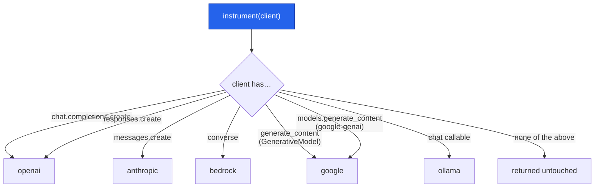

# Providers & Integration

`instrument()` identifies a client by its **shape**, not by model name — so new models from a
provider work the day they ship. It supports five providers directly, an OpenTelemetry ingestion
path for managed runtimes, and a callback handler for **LangChain / LangGraph** (see
[Frameworks](#frameworks-langchain--langgraph)).

## How detection works



An OpenAI client exposes both `chat.completions.create` and `responses.create`; a `google-genai`
`Client` exposes both `models.generate_content` and `aio.models.generate_content`. `instrument()`
wraps **every** entrypoint it finds, so whichever API your code calls is captured.

## Per-provider setup

### OpenAI (Chat Completions + Responses API)
`instrument()` wraps both entrypoints; the Responses API reports usage differently, and it's all
normalized into the same `Usage`.

```python
from openai import OpenAI
from cendor.core import instrument
client = instrument(OpenAI())                       # env: OPENAI_API_KEY
client.chat.completions.create(model="gpt-4o", messages=[...])   # Chat Completions
client.responses.create(model="gpt-4o", input="…")               # Responses API (also captured)
```
The Responses API (default for new OpenAI apps and the Agents SDK) reports `input_tokens`/
`output_tokens`, with cached tokens under `input_tokens_details.cached_tokens` and reasoning under
`output_tokens_details.reasoning_tokens` — all normalized.

### Anthropic
```python
from anthropic import Anthropic
client = instrument(Anthropic())                    # env: ANTHROPIC_API_KEY
client.messages.create(model="claude-sonnet-4-6", max_tokens=256, messages=[...])
```

### Azure AI Foundry (models via the OpenAI SDK)
Detected as `openai` (same SDK shape). For the Foundry **Agent Service** (server-side loop), don't
`instrument()` — ingest its telemetry (see [Managed runtimes](#managed-runtimes-opentelemetry-ingestion)).

```python
from openai import AzureOpenAI
client = instrument(AzureOpenAI(
    azure_endpoint=os.environ["AZURE_OPENAI_ENDPOINT"],
    api_key=os.environ["AZURE_OPENAI_API_KEY"],
    api_version="2024-10-21"))
client.chat.completions.create(model="<your-deployment-name>", messages=[...])  # detected as openai
```

### Google Gemini
Both SDKs are detected — the current `google-genai` (model from the kwarg) and the legacy
`google-generativeai` (model read from the `GenerativeModel` object).

```python
# Current SDK (google-genai) — the recommended shape:
from google import genai
client = instrument(genai.Client())                 # env: GOOGLE_API_KEY / GEMINI_API_KEY
client.models.generate_content(model="gemini-1.5-pro", contents="…")
await client.aio.models.generate_content(model="gemini-1.5-pro", contents="…")  # async also wrapped
```
```python
# Legacy SDK (google-generativeai) — still detected:
import google.generativeai as genai
genai.configure(api_key=os.environ["GOOGLE_API_KEY"])
model = instrument(genai.GenerativeModel("gemini-1.5-pro"))
model.generate_content("…")     # model id read from the GenerativeModel, so the call is priced
```

### AWS Bedrock (Converse API)
```python
import boto3
client = instrument(boto3.client("bedrock-runtime", region_name="us-east-1"))
client.converse(modelId="anthropic.claude-…",
                messages=[{"role": "user", "content": [{"text": "…"}]}])   # AWS credentials
```

### Ollama (local, free)
```python
import ollama
client = instrument(ollama.Client())
client.chat(model="llama3", messages=[...])   # no key
```

## Managed runtimes (OpenTelemetry ingestion)

When a runtime owns the agent loop server-side and only emits `gen_ai.*` spans, feed the span
attributes to `core.otel.ingest(...)` so the call still lands on the bus — and `tokenguard` /
`acttrace` consume it as usual:

```python
from cendor.core import otel
otel.ingest({
    "gen_ai.system": "azure_ai_foundry",
    "gen_ai.request.model": "gpt-4o",
    "gen_ai.usage.input_tokens": 1000,
    "gen_ai.usage.output_tokens": 500,
})   # -> emits a normalized LLMCall
```

`contextkit` / `squeeze` apply only when **you** assemble the prompt; if a managed runtime owns
context internally, those two have nothing to shape while the other three still work.

## Frameworks (LangChain / LangGraph)

For a framework, the SDK-aligned integration point is its **callback system**, not client
wrapping. `langchain_openai` calls `client.with_raw_response.create().parse()` (so an inner-client
`instrument()` sees a usage-less `LegacyAPIResponse`) and consumes streams via a context manager —
so **instrumenting LangChain's inner client is unsupported** (usage is lost; older builds even
crashed on streaming). Use the callback handler instead:

```python
pip install "cendor-core[langchain]"
```

```python
from cendor.core.langchain import CendorCallbackHandler
from langchain_openai import ChatOpenAI

handler = CendorCallbackHandler()
llm = ChatOpenAI(model="gpt-4o", callbacks=[handler])     # every call recorded onto the bus
llm.invoke("hi")

# LangGraph: attach once via config — it propagates to every node + tool, correlated by run:
agent.invoke({"messages": [...]}, config={"callbacks": [handler]})
```

The handler reads LangChain's own `usage_metadata` (which carries **reasoning** and **cached**
tokens), prices each call offline, emits normalized `LLMCall`/`ToolCall`, and stamps a
**root-run `trace_id`** so every model/tool call of one `agent.invoke` shares an id (separate
invocations get distinct ones). `tokenguard` and `acttrace` then consume these like any other bus
event — with no client touch.

**It is recording-only.** The callback path is post-call, so *enforcement* — `tokenguard`'s
`on_exceed="block"`, `acttrace`'s `guard()` redact-before-send — is a **no-op** here (those act on
the `instrument()` seam, which this path never touches). For enforcement, call the **provider SDK
directly** and `instrument()` it.

| Capability | Callback handler (LangChain/LangGraph) | Direct provider SDK + `instrument()` |
|---|---|---|
| Usage + cost | ✅ (from `usage_metadata`) | ✅ |
| Reasoning tokens | ✅ | ✅ |
| Tool calls (`ToolCall`) | ✅ | ✅ (`@instrument_tool`) |
| Multi-node / multi-agent `trace_id` | ✅ (root-run id, automatic) | ✅ via `core.trace("run-id")` |
| Pre-flight **enforcement** (block / downgrade / clamp / redact-before-send) | ❌ recording-only | ✅ |
| Record/replay (`cassette`) | ❌ | ✅ |

## Live pricing

Cost is computed from a price table. Which providers actually let you refresh it live varies. The bundled snapshot works offline; `prices.refresh(source=…)`
pulls live rates. But the **direct model labs publish no pricing API** — their model-list endpoints
return ids only — so "ask the provider for today's price" only works for gateways, cloud catalogs,
and aggregators.

| Source | Live pricing API? | Auth | Built-in adapter |
|---|---|---|---|
| OpenAI / Anthropic (direct) | ❌ — `/v1/models` lists ids, no rates | — | use LiteLLM instead |
| **LiteLLM** `model_prices_and_context_window.json` | ✅ static JSON, ~daily, all providers | none | `refresh(source="litellm")` |
| **OpenRouter** `/api/v1/models` | ✅ per-token JSON | none | `refresh(source="openrouter")` |
| **Azure Retail Prices** | ✅ `retailPrice`/`unitOfMeasure` | none | `refresh(source="azure")` |
| AWS Bedrock / GCP Vertex | ✅ Price List / Billing Catalog | creds/SDK | bring your own `mapper=` |

The three built-in adapters are all **unauthenticated HTTPS GETs** — no credentials, no SDKs, no new
dependencies. AWS/GCP need credentials and SKU/region mapping, so they're intentionally out of core.
All refreshes are offline-safe and fall back to the last-good table silently. See
[core → Prices](core.md#prices).

A gateway that returns the **actual billed cost** on the response (e.g. OpenRouter's `usage.cost`) is
better than any table: `instrument()` uses that figure directly and labels the call `cost_reported`
(vs `cost_estimated` for a table estimate).

## Streaming

Streaming is supported for every provider: pass `stream=True` and the chunk iterator flows through
your code unchanged while usage is accumulated, so the call is still priced and recorded once the
stream completes. How real (vs estimated) the streamed usage is depends on the entrypoint:

- **OpenAI Chat Completions** — `instrument()` auto-requests a final usage chunk
  (`stream_options={"include_usage": True}`, unless you set `stream_options` yourself), so streamed
  usage is the provider's **real billed count**.
- **OpenAI Responses API** — usage rides the `response.completed` event, so nothing is injected.
- **Other providers** — usage is read from the provider's own stream reporting where present, else an
  offline estimate flagged `usage_estimated`.

AWS Bedrock's separate `converse_stream` entrypoint isn't wrapped — use `converse`.

## Notes

- Pricing for a model is looked up in the bundled snapshot; an unpriced model yields `cost = None`
  (the call still works). Add rates with `prices.refresh()`.
- New model ids need no library release — capture is by client shape, and pricing is a data table.
