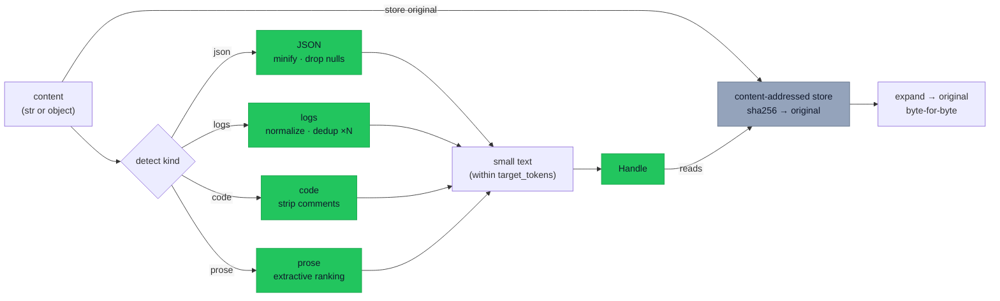

# `cendor-squeeze` — compress

Shrink verbose context — JSON, logs, code, prose — without throwing anything away.
Compression returns a **handle**, and the original is always restorable byte-for-byte. It's
content-aware: each type is routed to a purpose-built, deterministic compressor. No LLM.

<!-- tabs: lang -->
<!-- tab: Python -->

```bash
pip install cendor-squeeze
```

<!-- tab: TypeScript -->

```bash
npm i @cendor/squeeze
```

<!-- /tabs -->

## Quickstart

<!-- tabs: lang -->
<!-- tab: Python -->

```python
from cendor.squeeze import compress

small, handle = compress(huge_json, kind="auto")                  # detect + route
small, handle = compress(source_code, kind="code", fidelity="aggressive")
small, handle = compress(logs, kind="logs", target_tokens=400)    # compress to a budget
original = handle.expand()                                        # restore, byte-for-byte
```

<!-- tab: TypeScript -->

```ts
import { compress } from '@cendor/squeeze';

let [small, handle] = compress(hugeJson, { kind: 'auto' });                      // detect + route
[small, handle] = compress(sourceCode, { kind: 'code', fidelity: 'aggressive' });
[small, handle] = compress(logs, { kind: 'logs', targetTokens: 400 });           // compress to a budget
const original = handle.expand();                                                // restore, byte-for-byte
```

<!-- /tabs -->

> **See it in the stack.** `contextkit` calls `squeeze` for you on any `Block(evict="compress")` —
> the connected example is in the [Cookbook](/cookbook).

## Core concepts

### Four content-aware compressors
`detect()` routes by content (or pass `kind=` to force one). Each is deterministic and needs no
model:

| Content | Technique | Fidelity |
|---|---|---|
| **JSON** | minify whitespace; drop null-valued keys (kept at `lossless`); under a budget, drop keys/elements **structurally** (largest first / trailing) so output stays valid JSON | structural; budget-lossy but parseable |
| **Logs** | normalize volatile fields (timestamps, UUIDs, IPs, long hex runs, standalone integers) → placeholders; dedup repeats into `(×N)` | near-lossless; chronological order preserved |
| **Code** | strip comments (kept at `lossless`); **blank lines and trailing whitespace are always removed**; collapse inner whitespace at `aggressive`. String-aware — a `//`/`#` inside a literal is preserved, and `#` preprocessor + `#!` shebang lines are kept | structural |
| **Prose** | extractive — rank sentences by length-normalized keyword mass, keep the top ones in order; abbreviation-aware splitting (won't break "Dr." / "e.g." / decimals) | lossy; original kept |

### Compress to a budget
`target_tokens` is **never exceeded** for any kind. JSON shrinks to budget by dropping
keys/elements structurally (staying valid JSON); every other kind ends with a hard truncate, so
`target_tokens` is **lossy in the emitted output**. That loss is **fully reversible** — the
original stays in the store, so `handle.expand()` returns it in full no matter how tight the
budget was. `fidelity` (`lossless` / `balanced` / `aggressive`) separately trades structure for
size.

### Reversibility (the content-addressed store)
Every original is kept in a content-addressed store keyed by its `sha256` hash (deduped across
calls), so `handle.expand()` is always exact — no matter how hard you squeeze. The backend is
pluggable via `use_store(...)`.

### Persisting across restarts
The default store is an in-memory one, so to restore after a process restart you persist the
**handle** next to a durable store:

<!-- tabs: lang -->
<!-- tab: Python -->

```python
data = handle.to_dict()                 # {id, kind, original_ref, restore_map} — not the original
# ...next process, with the same SQLiteStore active...
from cendor.squeeze import Handle
original = Handle.from_dict(data).expand()
```

<!-- tab: TypeScript -->

```ts
const data = handle.toDict();           // {id, kind, original_ref, restore_map} — not the original
// ...next process, with the same SQLiteStore active...
import { Handle } from '@cendor/squeeze';
const original = Handle.fromDict(data).expand();
```

<!-- /tabs -->

## Functions & classes

### `compress()`

<!-- tabs: lang -->
<!-- tab: Python -->

```python
compress(content, kind="auto", target_tokens=None, model="gpt-4o", fidelity="balanced")  # -> (small, handle)
```

<!-- tab: TypeScript -->

```ts
compress(content, { kind = 'auto', targetTokens = null,
                    model = 'gpt-4o', fidelity = 'balanced' })   // -> [small, handle]
```

<!-- /tabs -->

| Param | Type | Default | What it does |
|---|---|---|---|
| `content` | `str \| JSON-serializable` | — (required) | The blob to shrink; non-strings are `json.dumps`'d. |
| `kind` | `str` | `"auto"` | `"auto"` (detect) \| `"json"` \| `"logs"` \| `"code"` \| `"prose"`. |
| `target_tokens` | `int \| None` | `None` | Hard ceiling; never exceeded (see [Compress to a budget](#compress-to-a-budget)). |
| `model` | `str` | `"gpt-4o"` | Model whose tokenizer sizes `target_tokens`. |
| `fidelity` | `str` | `"balanced"` | `"lossless"` \| `"balanced"` \| `"aggressive"`. |

### Helpers & classes
| Name | Signature | What it does |
|---|---|---|
| `detect` | `detect(content)` | Returns the routed kind: `"json"`/`"logs"`/`"code"`/`"prose"`. |
| `decompress` / `handle.expand` | `decompress(handle)` | Restore the exact original, byte-for-byte. |
| `handle.to_dict` / `Handle.from_dict` | `handle.to_dict()` | Serialize a handle (not the original) to persist and restore later. |
| `SqueezeCompressor` | `SqueezeCompressor()` | Object form satisfying core's `Compressor` protocol (what `contextkit` uses). |
| `use_store` | `use_store(store)` | Swap the content-addressed store backend. |

### Store backends
<!-- tabs: lang -->
<!-- tab: Python -->

```python
from cendor.squeeze import use_store
from cendor.squeeze.store import MemoryStore, SQLiteStore

use_store(SQLiteStore("ccr.db"))        # originals persist across processes
use_store(MemoryStore(max_items=1000))  # bounded in-memory (LRU eviction)
```

<!-- tab: TypeScript -->

```ts
import { useStore, MemoryStore, SQLiteStore } from '@cendor/squeeze';

useStore(new SQLiteStore('ccr.db'));    // originals persist across processes (better-sqlite3)
useStore(new MemoryStore(1000));        // bounded in-memory (LRU eviction)
```

<!-- /tabs -->
The default is an unbounded `MemoryStore`. `SQLiteStore` opens with `check_same_thread=False`,
so one store can serve a threaded server (writes are idempotent). A bounded store can evict an
original; expanding an evicted handle raises `KeyError` — the documented trade-off of a capped
store.

## How it works



Content is routed by kind to a deterministic compressor; the original is stashed in the
content-addressed store, so `expand()` is always byte-exact regardless of how hard you squeezed.

## Plugs into the stack

**Inbound.** Usually `contextkit` calls `squeeze` for you when a block is marked
`evict="compress"` (`pip install cendor-contextkit[squeeze]`) — it satisfies core's `Compressor`
protocol by shape, so `contextkit` never imports it. Call it directly to shrink a single
known-huge blob (e.g. a 50k-token tool response) before it enters the window. It operates purely
on strings/objects — identical across any SDK, never touching the client.

## Honest limits

- **Structural compressors are deterministic and need no LLM.** Prose is extractive
  (deterministic); an LLM-summarization backend isn't bundled, but the technique is pluggable.
- **Token-reduction *percentage* depends on the tokenizer;** reversibility is exact regardless.
- **The benchmarks are the honest numbers.** Headline ratios (JSON ~49% / code ~53% / prose
  ~49%, and logs anywhere from ~99% on repetition-heavy logs down to ~30% on high-entropy logs)
  come from the harness on realistic corpora — see [Benchmarks](benchmarks.md), the source of
  truth. Eye-popping figures on synthetic, highly-repetitive data are not representative.
