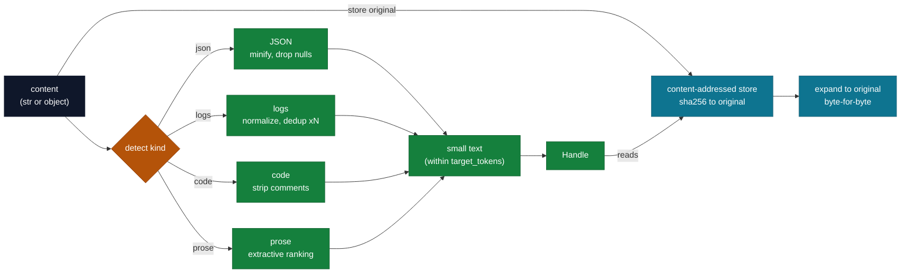

# `cendor-squeeze` — compress

Shrink verbose context — JSON, logs, code, prose — without throwing anything away. Compression
returns a **handle**; the original is always restorable. Content-aware: each type is routed to a
purpose-built, deterministic compressor (no LLM).

```bash
pip install cendor-squeeze
```

## Highlights

- **Four purpose-built compressors** — **JSON** (minify + drop nulls; budget-shrink drops keys/elements structurally so it stays valid JSON), **logs** (normalize timestamps/UUIDs/IPs/hex/integers + dedup repeats into `(×N)`, chronological), **code** (strip comments — *string-aware*, keeps preprocessor & shebang lines), **prose** (extractive sentence ranking, abbreviation-aware splitting). `detect()` auto-routes; `kind=` overrides.
- **Compress to a budget** — `target_tokens` is **never exceeded**; `fidelity="lossless" | "balanced" | "aggressive"` trades structure for size. No LLM, deterministic.
- **100% reversible** — every original is kept in a **content-addressed store** (deduped by hash), so `handle.expand()` restores it byte-for-byte no matter how hard you squeeze.
- **Survives restarts** — persist `handle.to_dict()` next to a durable `SQLiteStore` and `Handle.from_dict(...).expand()` later; or a bounded `MemoryStore(max_items=…)`.
- **Plugs into contextkit** by satisfying core's `Compressor` protocol — by shape, no import.

## Quickstart

```python
from cendor.squeeze import compress

small, handle = compress(huge_json, kind="auto")                  # detect + route
small, handle = compress(source_code, kind="code", fidelity="aggressive")
small, handle = compress(logs, kind="logs", target_tokens=400)    # compress to a budget
original = handle.expand()                                         # restore, byte-for-byte
```

## Functions & classes

- **`compress(content, kind="auto", target_tokens=None, model="gpt-4o", fidelity="balanced")`** →
  `(small, handle)`. `content` is a string or a JSON-serializable object.
- **`detect(content)`** → `"json" | "logs" | "code" | "prose"`.
- **`decompress(handle)`** / **`handle.expand()`** → the exact original.
- **`SqueezeCompressor`** — object form that satisfies `core`'s `Compressor` protocol (what
  `contextkit` uses for `evict="compress"`).
- **`use_store(store)`** — swap the content-addressed (CCR) backend.

## How it works

Content is routed by kind to a deterministic compressor (no LLM); the original is stashed in a
content-addressed store so `expand()` is always byte-exact, no matter how hard you squeeze.



## The compressors

| Content | Technique | Notes |
|---|---|---|
| **JSON** | minify whitespace; drop null-valued keys (kept at `fidelity="lossless"`); under a budget, drop keys/elements **structurally** (largest first / trailing) so the output stays valid JSON | structural; budget-lossy but parseable |
| **Logs** | normalize volatile fields (timestamps, UUIDs, IPs, long hex runs, standalone integers) → placeholders; dedup repeats into `(×N)` | near-lossless; chronological order preserved |
| **Code** | strip comments + blank lines (kept at `lossless`); collapse inner whitespace at `aggressive` | structural; string-aware (literals intact) |
| **Prose** | extractive — rank sentences by length-normalized keyword mass, keep the top ones in order; abbreviation-aware sentence splitting (won't break "Dr." / "e.g." / decimals) | lossy; original kept |

`fidelity` (`lossless` / `balanced` / `aggressive`) trades structure for size; `target_tokens`
compresses *to* a budget and is **never exceeded** for any kind. JSON is shrunk to budget by dropping
keys/elements structurally (staying valid JSON); every other kind ends with a hard truncate. Only in
the extreme case of a single oversized JSON leaf does the JSON path fall back to a raw cut, which may
not re-parse (the original is always restorable via the handle regardless).
Detection: `json.loads` → JSON, then log/code heuristics, else prose; `kind=` overrides.

A `target_tokens` cap is enforced by a final truncate, so it is **lossy in the emitted output** — to
fit the budget it drops content the visible text no longer carries. That loss is **fully
reversible**: the original is still in the content-addressed store byte-exact, so `handle.expand()`
returns it in full no matter how tight the budget was.

Code comment stripping is string-aware: a `//` or `#` *inside* a string literal (a URL, a color, a
path) is preserved, and `#` preprocessor directives (`#include`, …) and `#!` shebang lines are kept.
Under a `target_tokens` budget, logs keep the noisiest patterns but render them in chronological order.

## Reversibility (the CCR store)

Every original is kept in a **content-addressed store** keyed by its hash (deduped across calls), so
`expand()` is always exact — no matter how hard you squeeze. The backend is pluggable:

```python
from cendor.squeeze import use_store
from cendor.squeeze.store import MemoryStore, SQLiteStore

use_store(SQLiteStore("ccr.db"))        # originals persist across processes
use_store(MemoryStore(max_items=1000))  # bounded in-memory (LRU eviction; get/put refresh recency)
```

A bounded store can evict an original; expanding an evicted handle raises `KeyError` (the documented
trade-off of a capped store). The default is an unbounded `MemoryStore`. `SQLiteStore` opens with
`check_same_thread=False`, so one store can serve a threaded server (CCR writes are idempotent).

To restore across a process restart, persist the **handle** next to a durable store:

```python
data = handle.to_dict()                 # {id, kind, original_ref, restore_map} — not the original
# ...next process, with the same SQLiteStore active...
original = Handle.from_dict(data).expand()
```

## Plugs in
**Inbound** — usually `contextkit` calls it for you when a block is marked `evict="compress"`
(`pip install cendor-contextkit[squeeze]`); it satisfies `core`'s `Compressor` by shape, so
contextkit never imports it. Call it directly to shrink a single known-huge blob (e.g. a 50k-token
tool response) before it ever enters the window. It operates purely on strings/objects — identical
across any SDK; it never touches the client.

## Notes
- Structural compressors (JSON folding, log dedup, code stripping) are deterministic and need no
  LLM. Prose is extractive (deterministic); an LLM-summarization backend is not bundled — the
  technique is pluggable if you want one.
- Token-reduction *percentage* depends on the tokenizer; reversibility is exact regardless.
- **The honest numbers are the benchmarks.** The headline ratios — JSON ~49% / code ~53% / prose
  ~49% and logs anywhere from **~99% on repetition-heavy logs down to ~30% on high-entropy logs**
  (the ratio is repetition-driven, so both are reported) — come from the benchmark harness run on
  realistic corpora; see [Benchmarks](benchmarks.md), which is the source of truth. Eye-popping demo figures on synthetic,
  highly-repetitive data (e.g. a notebook showing ~94% on one repeated string) are **not**
  representative of real payloads — cite the benchmarks, not the demo.
