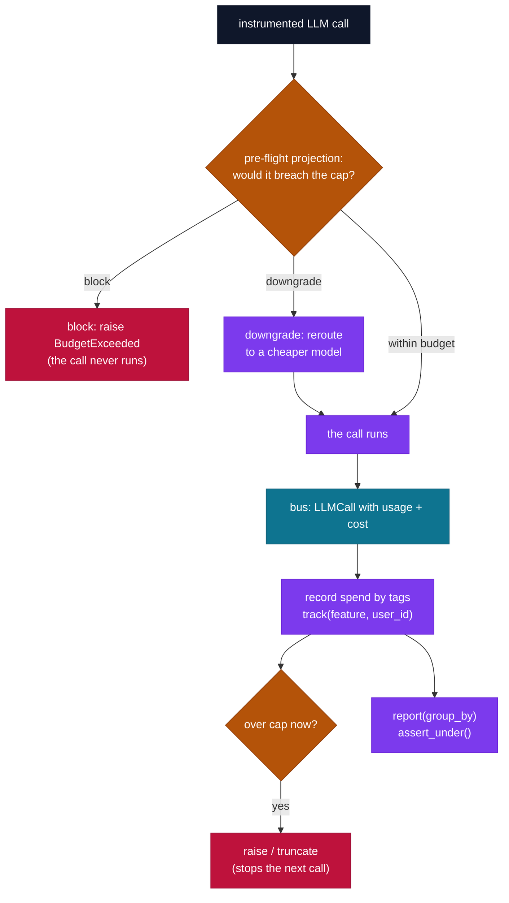

# `cendor-tokenguard` — budget

Stop runaway LLM bills, and get per-feature / per-user cost attribution for free. One decorator,
one context manager. No dashboard, no account, no infra.

```bash
pip install cendor-tokenguard
```

## Highlights

- **Pre-flight circuit breaker** — `on_exceed="block"` raises **before** an over-budget call runs; `"clamp"` injects a provider token ceiling so a reasoning-model call can't exceed the remaining budget; `"downgrade"` reroutes to a cheaper model pre-flight; `"truncate"` degrades gracefully; `"raise"` stops a runaway loop; or pass a **callable**.
- **Decorator *and* context manager** — `@budget(usd=…, tokens=…)`; budgets **nest** and the tightest applicable cap wins (an inner downgrade never masks an outer hard cap).
- **Cost attribution, free** — `track(feature=…, user_id=…)` tags ambient spend via `contextvars` (across nested + async calls); `report(group_by=[…])` aggregates per tag.
- **Cost as a test assertion** — `report().assert_under(usd=0.05, feature="search")`.
- **Pre-flight projection** — `estimate(model, messages)` prices a call *without making it*.
- **Durable + bounded** — `use_sink(SQLiteSink/OTelSink/…)` persists each row; the in-memory buffer is FIFO-bounded (`configure(max_records=…)`, `dropped()`). Config is validated eagerly (no silent no-op budgets).

## What it does

`tokenguard` subscribes to `core`'s event bus — it never patches a client itself. Once your client
is instrumented, `@budget` enforces a cap and `track(...)` attributes spend by tag, with no
per-call wiring. It's the *preventive* primitive: it caps and degrades a unit of work before it
burns real money, and turns "where did my spend go?" into a one-line report.

## Quickstart

```python
from cendor.core import instrument
from cendor.tokenguard import budget, track, report

client = instrument(openai_client)

@budget(usd=0.50, on_exceed="downgrade", downgrade={"gpt-4o": "gpt-4o-mini"})
def answer(q: str) -> str:
    with track(feature="support_bot", user_id="alice"):
        resp = client.chat.completions.create(model="gpt-4o", messages=[{"role": "user", "content": q}])
        return resp.choices[0].message.content

for row in report(group_by=["feature", "user_id"]):
    print(row["tags"], row["usd"], row["tokens"], row["calls"])
```

## Functions & classes

- **`budget(usd=None, tokens=None, on_exceed="raise", scope=None, downgrade=None, output_reserve=256, reasoning_reserve=0)`**
  — a decorator *and* a context manager that caps a unit of work. `on_exceed`:
  - `"raise"` — **post-flight**: raise `BudgetExceeded` once a returning call pushes spend over the
    cap (stops a runaway loop before the *next* call; the breaching call itself completes).
  - `"block"` — **pre-flight**: raise `BudgetExceeded` *before* a call whose projected cost/tokens
    would breach the cap runs, so the over-budget call never executes (a true circuit breaker).
  - `"clamp"` — **pre-flight**: inject the provider's own output ceiling (`max_completion_tokens` /
    `max_tokens`, which include reasoning) so a single call is capped *server-side* to the remaining
    `tokens=` budget instead of being rejected. The only way to bound a reasoning model's runtime
    spend. Requires a `tokens=` cap; supported on OpenAI/Anthropic, else falls back to a block. See
    `clamps()`.
  - `"truncate"` — degrade gracefully (the decorated function returns `None` / the `with` block
    exits cleanly).
  - `"downgrade"` — **pre-flight** reroute to a cheaper model from the `downgrade={model: cheaper}`
    map, before the call runs; never raises.
  - a callable — invoked with a context dict.

  Budgets nest; the tightest applicable cap wins, and an inner `downgrade`/`clamp` never masks an
  outer hard cap. **Config is validated eagerly** — a missing cap, an unknown `on_exceed`,
  `"downgrade"` without a map / `usd` cap, or `"clamp"` without a `tokens=` cap raises `ValueError`
  (no silent no-op budgets). `output_reserve` sets the output tokens assumed in the
  `block`/`downgrade`/`clamp` projection when the request has no `max_tokens` /
  `max_completion_tokens`; `reasoning_reserve` adds extra headroom for a reasoning model's hidden
  thinking, but *only* when no explicit output cap is set (an explicit cap already includes
  reasoning).

  **Hard cap vs runaway guard — pick by intent:**
  - Use `"block"` (or `"downgrade"`) for a cap that must **never** be exceeded. Both are *pre-flight*:
    they project the next call's cost and refuse/reroute it *before* it runs, so spend stays at or
    under the cap.
  - Use `"raise"` to stop a **runaway loop** cheaply. It is *post-flight*: the breaker trips only
    *after* a call returns and pushes spend over the cap, so the call that crosses the line has
    already run and been billed. Spend therefore **overshoots by one call** — e.g. a `usd=0.01` cap
    can end at ~`$0.0106`. `"raise"` stops the *next* iteration, not the breaching one; if you need a
    true ceiling, use `"block"`.

  **Reasoning models.** A reasoning/thinking model's hidden thinking can't be predicted pre-flight —
  it's decided at runtime — so no projection bounds a single call in advance. Two mechanisms cover
  them: the **cumulative gate** (`"raise"`/`"block"`) enforces on the *exact* recorded usage, which
  already includes reasoning (OpenAI folds it into `completion_tokens`, Anthropic into
  `output_tokens`), so a runaway loop still stops; and **`"clamp"`** hands the provider its own
  ceiling so one call is capped server-side. For example, with `budget(tokens=1000, on_exceed="clamp")`
  a call after 950 tokens are spent is issued `max_completion_tokens≈50-input` — the provider stops
  generation (reasoning + visible) within the remaining budget. Reasoning tokens are billed at the
  output rate, so cost is exact either way; `reasoning_reserve` only tunes the pre-flight *guess* for
  uncapped calls.
- **`track(**tags)`** — a context manager that attributes spend to ambient tags
  (feature / user_id / session_id …) via `contextvars`, across nested and async calls.
- **`estimate(model, messages, max_output_tokens=0)`** — project a call's cost without making it
  (budget "linting"), from `core.tokens` × `core.prices`. Returns `Money`.
- **`report(group_by=[...])`** — aggregate recorded spend → rows of
  `{tags, usd, tokens, input_tokens, output_tokens, reasoning_tokens, calls, unpriced_calls}`.
  `reasoning_tokens` is the portion of `output_tokens` spent reasoning (a subset — not added into
  `tokens`); `unpriced_calls` is how many of the group's `calls` had no price (so they contribute
  `$0` — a USD blind spot). `report().assert_under(usd=..., **tags)` turns cost into a test
  assertion.
- **`downgrades()`** — the pre-flight reroutes performed (`{from, to, tags}`).
- **`clamps()`** — the pre-flight token clamps applied (`{model, kwarg, limit, tags}`).
- **`use_sink(sink)`** — also persist each spend row to a sink. Built-ins:
  `tokenguard.sinks.SQLiteSink(path)` and `tokenguard.sinks.OTelSink()` (any object with
  `write(row)` works — it satisfies `core`'s `Sink` protocol).
- **`configure(max_records=100_000, on_unpriced="warn")`** — tune runtime behavior; each argument is
  independent. `max_records` bounds the in-memory spend buffer that `report()` aggregates, so a
  long-running process can't grow it without limit — past the cap the oldest rows are evicted FIFO
  (counted by `dropped()`) and `report()` reflects only the retained window; pass `None` to disable.
  `on_unpriced` governs how a **USD** budget treats a call whose model has no price (cost `None`, so
  it records `$0`): `"warn"` (default) emits an `UnpricedModelWarning` **once per model** and lets
  the call proceed; `"raise"` makes `on_exceed="block"` reject the unpriced call pre-flight with
  `BudgetExceeded`. Token caps are unaffected — they enforce on counted tokens regardless of price.
  For complete, durable history, attach a sink (`use_sink`) and/or `reset()` between units of work.
- **`dropped()`** — count of spend rows evicted by the `configure` cap since the last `reset()`
  (`0` if none) — the cap never drops silently.
- **`unpriced_calls()`** — count of recorded calls whose cost was `None` (unknown/unpriced model)
  in the retained window — a USD blind spot, since they contribute `$0` to USD spend.
- **`reset()`** — clear recorded spend and active context, and restore the default cap (handy
  between tests).

## How it works



- **Post-flight accounting:** the bus subscriber reads actual `Usage`/`Money` off each emitted
  `LLMCall`, records a row keyed by the active tags, and decrements the active budget(s).
- **Enforcement at the call boundary:** when a call pushes a budget over its cap, the breaker trips
  synchronously inside that call — so a runaway loop stops before the *next* call runs. `estimate()`
  is the true pre-flight projection you can check proactively.
- **Pre-flight downgrade:** with `on_exceed="downgrade"`, a `core` interceptor estimates the next
  call and reroutes it to the cheaper model *before* it executes.
- **Bounded memory:** the in-memory spend buffer is FIFO-capped (`configure`, default 100k rows) so
  a long-running worker stays bounded; persist durable history with a sink.
- **Unpriced models are a USD blind spot, but not a silent one:** a call whose model has no price
  records `$0`, so a **USD** cap can't enforce against it. tokenguard warns once per model
  (`UnpricedModelWarning`) and counts these in `unpriced_calls()` / `report()`'s per-row
  `unpriced_calls`; `configure(on_unpriced="raise")` makes `on_exceed="block"` reject them outright.
  A **token** cap is unaffected — tokens are counted from the request/response regardless of price,
  so prefer a `tokens=` cap (or add a rate via `core.prices`) when a model isn't in the table.
- **Budgets and tags ride `ContextVar`s.** `budget(...)` and `track(...)` are stored in
  `contextvars`, so an `asyncio` task **inherits** the active budget/tags automatically, and the
  in-memory spend buffer + `SQLiteSink` are lock-guarded for concurrent emits. But a plain
  `threading.Thread` you start yourself does **not** inherit them — a spawned thread escapes its
  parent's budget and loses its tags. Carry them across a thread with `contextvars.copy_context()`:

  ```python
  import contextvars, threading

  ctx = contextvars.copy_context()   # captures the active budget + tags
  threading.Thread(target=lambda: ctx.run(worker)).start()   # worker runs inside them
  ```

Works around sync, async, **and streaming** calls — a streamed call is accounted once its stream
completes (`core` accumulates the usage), so its cost lands on the budget and in `report()` like any
other. Offline and standalone — bundled prices mean no network, no account.

> **Streaming timing (important).** Post-flight enforcement (`on_exceed="raise"` / `"truncate"`)
> fires when a stream is **consumed** (drained), not when it's launched — the `LLMCall` is emitted
> only once the chunk iterator is exhausted or closed. So a loop that *launches* many streams before
> draining them can overspend: none are accounted until you iterate them. If you fan out streamed
> calls, drain (or close) each stream before starting the next, or gate spend with a **pre-flight**
> mode (`on_exceed="block"` / `"downgrade"` / `"clamp"`), which is evaluated *before* the call runs
> and is unaffected by consumption timing.

## Plugs in
**Wrap-around:** it rides the call you already make; you don't change the call itself. Once the
client is instrumented, `@budget` enforces and records automatically. In a managed-runtime setup,
enforce a coarser budget at your entrypoint and ingest actual spend from the runtime's `gen_ai.*`
OTel spans via `core.otel.ingest`.
