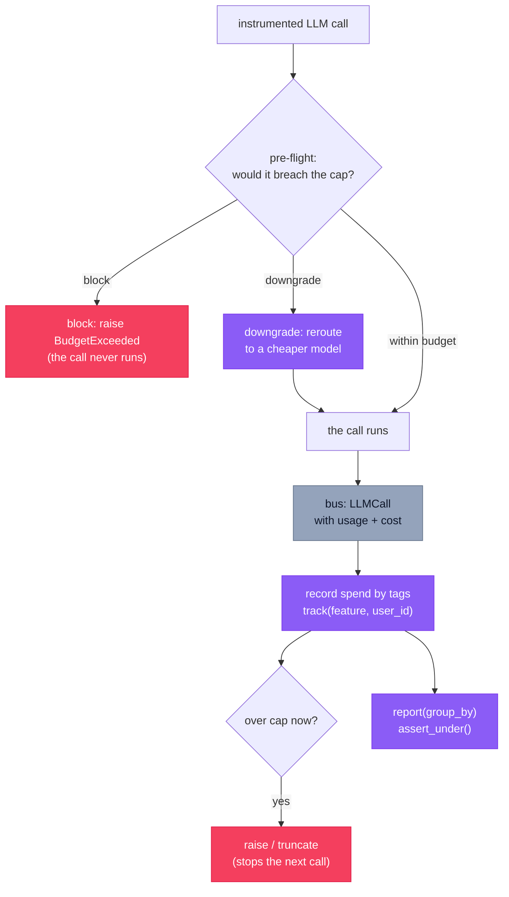

# `cendor-tokenguard` — budget

Stop runaway LLM bills, and get per-feature / per-user cost attribution for free. One
decorator caps a unit of work; one context manager tags its spend. No dashboard, no account,
no infrastructure.

<!-- tabs: lang -->
<!-- tab: Python -->

```bash
pip install cendor-tokenguard
```

<!-- tab: TypeScript -->

```bash
npm i @cendor/tokenguard
```

<!-- /tabs -->

## Quickstart

<!-- tabs: lang -->
<!-- tab: Python -->

```python
from cendor.core import instrument
from cendor.tokenguard import budget, track, report

client = instrument(openai_client)

@budget(usd=0.50, on_exceed="downgrade", downgrade={"gpt-4o": "gpt-4o-mini"})
def answer(q: str) -> str:
    with track(feature="support_bot", user_id="alice"):
        resp = client.chat.completions.create(model="gpt-4o", messages=[{"role": "user", "content": q}])
        return resp.choices[0].message.content

for row in report(group_by=["feature", "user_id"]):
    print(row["tags"], row["usd"], row["tokens"], row["calls"])
```

<!-- tab: TypeScript -->

```ts
import { instrument } from '@cendor/core';
import { budget, track, report } from '@cendor/tokenguard';

const client = instrument(openaiClient);

const answer = budget({ usd: 0.50, onExceed: 'downgrade', downgrade: { 'gpt-4o': 'gpt-4o-mini' } })(
  (q: string) => track({ feature: 'support_bot', userId: 'alice' }, async () => {
    const resp = await client.chat.completions.create({
      model: 'gpt-4o', messages: [{ role: 'user', content: q }] });
    return resp.choices[0].message.content;
  }));

for (const row of report(['feature', 'userId'])) {
  console.log(row.tags, row.usd.toString(), row.tokens, row.calls);
}
```

<!-- /tabs -->

> **See it in the stack.** The connected support-agent recipe (budget + context + audit) is in
> the [Cookbook](https://cendor.ai/cookbook).

## Core concepts

### How it enforces
`tokenguard` **subscribes** to `core`'s event bus — it never patches a client. Once your client
is instrumented, `@budget` enforces a cap and `track(...)` attributes spend by tag, with no
per-call wiring. Enforcement happens at two moments: a **pre-flight** projection (before a call
runs) and **post-flight** accounting (after a call returns, reading the real `Usage`/`Money`
off the emitted `LLMCall`).

### Hard cap vs runaway guard — pick by intent
This is the distinction that trips people up:

- **Hard cap that must *never* be exceeded → `"block"` or `"downgrade"`** (both *pre-flight*):
  they project the next call's cost and refuse or reroute it *before* it runs, so spend stays at
  or under the cap.
- **Cheap runaway-loop stop → `"raise"`** (*post-flight*): the breaker trips only *after* a call
  returns and pushes spend over the cap, so the breaching call has already run and been billed.
  Spend therefore **overshoots by one call**. `"raise"` stops the *next* iteration, not the
  breaching one.

### Reasoning models
A reasoning model's hidden thinking can't be predicted pre-flight, so no projection bounds a
single call in advance. Two mechanisms cover them: the **cumulative gate** (`"raise"`/`"block"`)
enforces on the *recorded* usage, which already includes reasoning (OpenAI folds it into
`completion_tokens`, Anthropic into `output_tokens`); and **`"clamp"`** hands the provider its
own ceiling so one call is capped server-side. Reasoning tokens are billed at the output rate,
so cost is exact either way.

### Cost attribution
`track(**tags)` attributes ambient spend (feature / user_id / session_id …) via `contextvars`,
across nested **and** async calls. `report(group_by=[…])` aggregates per tag, and
`report().assert_under(usd=…, **tags)` turns cost into a test assertion.

> **Threads don't inherit `track`/`budget`.** They ride `contextvars`, so an `asyncio` task
> inherits them but a plain `threading.Thread` you start does not — carry them across with
> `contextvars.copy_context()`:
> ```python
> import contextvars, threading
> ctx = contextvars.copy_context()          # captures the active budget + tags
> threading.Thread(target=lambda: ctx.run(worker)).start()
> ```

### Streaming timing
A streamed call is accounted **once its stream is drained** (consumed), not when it's launched —
the `LLMCall` is emitted only when the chunk iterator is exhausted or closed. So a loop that
*launches* many streams before draining them can overspend under post-flight modes. Drain (or
close) each stream before starting the next, or gate spend with a pre-flight mode
(`"block"`/`"downgrade"`/`"clamp"`), which is evaluated before the call runs.

**Drained after the scope exits (fixed in `cendor-tokenguard 1.4` / `@cendor/tokenguard 0.5`).** A
stream created inside a `budget()` / `track()` scope but drained *after* that scope has exited now
still accrues, enforces, and attributes correctly. The active budget frame and attribution tags are
captured when the stream is **created** — core stamps them at event construction via its ambient
metadata seam — not re-read at drain time. Previously that spend was silently lost: not attributed to
the tags, and, worse, not counted against a cumulative cap, so an `on_exceed="block"` ceiling could be
overrun by streams that finished outside their scope.

### Streaming runaways (`on_exceed="break"`)
`"clamp"` sets **one** server-side ceiling *before* a streamed call; `on_exceed="break"` (needs
`cendor-core ≥ 1.10` / `@cendor/core ≥ 0.11`, which added the stream-observer seam) watches a stream
**as it arrives** and cuts it the instant its running output-token estimate crosses the remaining
`tokens=`/`usd=` budget. It's the belt for a *single* stream that would blow past the cap mid-generation.

```python
with budget(tokens=2000, on_exceed="break"):
    for chunk in client.chat.completions.create(model="gpt-4o", messages=msgs, stream=True):
        render(chunk)   # cut ~when streamed output crosses 2000 tokens; BudgetExceeded raised here
```

The honest contract (accept it before you use it):

- **You keep the partial output already yielded.** The chunk that crossed the cap is withheld from
  your loop, then `BudgetExceeded` is raised out of the iteration.
- **The provider still bills to the cut.** Cutting closes the underlying stream (~one chunk + one RTT
  past the crossing) — it *stops the meter*, it does **not** un-bill the tokens the provider already
  generated. The settled `LLMCall.usage` is an estimate flagged `usage_estimated`.
- **It counts visible thinking.** Anthropic `thinking_delta`, Ollama `message.thinking`, OpenAI-compat
  `reasoning_content`, and Bedrock `reasoningContent` count toward the running estimate. **Hidden**
  reasoning (OpenAI-native, Gemini) never reaches the wire, so a heavy-thinking model cuts *late* —
  raise `reasoning_reserve` to trade that for an *early* cut.
- **Cumulative too.** Each stream's allowance is computed from the budget's *live* remaining balance,
  so a loop of streams still stops; and for a **non-streamed** call under `"break"` it degrades to a
  post-flight `"raise"` (the cumulative gate). For a hard cap that never overspends, use `"block"`.

### Unpriced models — a USD blind spot
A call whose model has no price records `$0`, so a **USD** cap can't enforce against it.
`tokenguard` warns once per model (`UnpricedModelWarning`) and counts these in
`unpriced_calls()`. A **token** cap is unaffected — tokens are counted regardless of price — so
prefer a `tokens=` cap (or add a rate via `core.prices`) for a model that isn't in the table.

## Functions & classes

### `budget()`
A decorator **and** context manager that caps a unit of work. Budgets nest — the tightest
applicable cap wins, and an inner `downgrade`/`clamp` never masks an outer hard cap.

<!-- tabs: lang -->
<!-- tab: Python -->

```python
budget(usd=None, tokens=None, on_exceed="raise", scope=None,
       downgrade=None, output_reserve=256, reasoning_reserve=0,
       name=None, description=None)
```

<!-- tab: TypeScript -->

<!-- ts-check: skip -->

```ts
budget({ usd, tokens, onExceed = 'raise', scope, downgrade,
         outputReserve = 256, reasoningReserve = 0, name, description })(fn)   // decorator form
await withBudget({ usd: 0.25, onExceed: 'block', name: 'per-run cap' }, () => { /* ... */ });
```

<!-- /tabs -->

| Param | Type | Default | What it does |
|---|---|---|---|
| `usd` | `number \| None` | `None` | USD cap for the unit of work. |
| `tokens` | `int \| None` | `None` | Token cap. **Required** for `on_exceed="clamp"`. |
| `on_exceed` | `str \| callable` | `"raise"` | What to do at the cap — see modes below. |
| `scope` | `str \| None` | `None` | Optional label (e.g. `"session"`) for nested budgets. |
| `downgrade` | `dict \| None` | `None` | `{model: cheaper}` map. **Required** for `on_exceed="downgrade"`. |
| `output_reserve` | `int` | `256` | Output tokens assumed in a pre-flight projection when the request sets no `max_tokens`. |
| `reasoning_reserve` | `int` | `0` | Extra headroom for a reasoning model's hidden thinking (only when no explicit output cap). |
| `name` | `str \| None` | `None` | Human identity carried on every `BudgetEvent` (→ `cendor.audit.budget`), so a monitor shows *which* budget acted. Keep it a **bounded** label — it is also a governance-counter attribute. |
| `description` | `str \| None` | `None` | Longer human description of what the budget guards (→ `cendor.audit.description`, truncated). |

**`on_exceed` modes**

| Mode | Timing | Behavior |
|---|---|---|
| `"raise"` | post-flight | Raise `BudgetExceeded` once a returning call crosses the cap — stops the *next* call; spend overshoots by one call. |
| `"block"` | pre-flight | Refuse an over-budget call *before* it runs (a true circuit breaker). |
| `"clamp"` | pre-flight | Inject the provider's output ceiling to cap one call server-side to the remaining `tokens=` budget. Requires `tokens=`. Flat kwarg on OpenAI (`max_completion_tokens`) / Anthropic (`max_tokens`); nested on Bedrock (`inferenceConfig.maxTokens`) and Ollama (`options.num_predict`); Gemini merges only a **dict** `config` (`max_output_tokens`) — a typed `GenerateContentConfig` can't be merged and falls back to `block`. |
| `"break"` | mid-stream | Cut a **streamed** call the instant its running output estimate (visible text + visible thinking) crosses the remaining `tokens=`/`usd=` budget. Also a post-flight cumulative gate (like `"raise"`) for non-streamed calls. Needs core ≥ 1.10 / 0.11 (the stream-observer seam). See [Streaming runaways](#streaming-runaways-on_exceedbreak). |
| `"downgrade"` | pre-flight | Reroute to the cheaper model from `downgrade=`, before the call runs; never raises. |
| `"truncate"` | — | Degrade gracefully (the decorated fn returns `None` / the `with` block exits cleanly). |
| a callable | — | Invoked with a context dict; you decide. |

Config is validated **eagerly**: a missing cap, an unknown `on_exceed`, `"downgrade"` without a
map/`usd` cap, or `"clamp"` without a `tokens=` cap raises `ValueError` — no silent no-op budgets.

### `track()` & `estimate()`

<!-- tabs: lang -->
<!-- tab: Python -->

```python
with track(feature="support", user_id="alice"):   # tag ambient spend (contextvars)
    ...
estimate(model, messages, max_output_tokens=0)     # price a call WITHOUT making it -> Money
```

<!-- tab: TypeScript -->

```ts
await track({ feature: 'support', userId: 'alice' }, async () => {  // tag ambient spend (ALS)
  /* ... */
});
estimate(model, messages, 0);                      // price a call WITHOUT making it -> Money
```

<!-- /tabs -->

### `report()`
Aggregates recorded spend into rows of `{tags, usd, tokens, input_tokens, output_tokens,
reasoning_tokens, calls, unpriced_calls}`. `reasoning_tokens` is the portion of `output_tokens`
spent reasoning (a subset, not added into `tokens`); `unpriced_calls` is how many of the group's
calls had no price. `report().assert_under(usd=…, **tags)` turns cost into a test assertion.

### Introspection & config
| Name | Signature | What it does |
|---|---|---|
| `downgrades()` | `downgrades()` | The pre-flight reroutes performed (`{from, to, tags}`). |
| `clamps()` | `clamps()` | The pre-flight token clamps applied (`{model, kwarg, limit, tags}`). |
| `use_sink(sink)` | `use_sink(sink)` | Also persist each spend row to a sink; built-ins `sinks.SQLiteSink(path)`, `sinks.OTelSink()`, `sinks.QueueSink(inner)` (any `write(row)` object works). |
| `configure(...)` | `configure(max_records=100_000, on_unpriced="warn")` | Tune runtime behavior (defaults shown). `max_records` FIFO-bounds the in-memory buffer (`None` disables); `on_unpriced` `"warn"`/`"raise"`. |
| `dropped()` | `dropped()` | Count of spend rows evicted by the `max_records` cap since the last `reset()`. |
| `unpriced_calls()` | `unpriced_calls()` | Count of recorded calls with no price (a USD blind spot). |
| `reset()` | `reset()` | Clear recorded spend + active context and restore defaults (handy between tests). |

### `OTelSink` — spend as OpenTelemetry metrics

`sinks.OTelSink()` emits each spend row as OpenTelemetry **metrics** (a no-op if OpenTelemetry isn't
installed), so a metrics backend — Azure Monitor, Datadog, Grafana/Prometheus, CloudWatch — tracks
your model spend without any Cendor-specific exporter. It creates three counters on the meter
`cendor.tokenguard`:

| Counter | Unit | What it counts |
|---|---|---|
| `gen_ai.client.token.usage` | tokens | input + output tokens |
| `gen_ai.client.cost.usd` | USD | cost (from the offline price table) |
| `gen_ai.client.reasoning.token.usage` | tokens | reasoning tokens (a subset of output, reported separately) |

Each counter is dimensioned by `model` **and** by the active `track(...)` tags, so you can break
spend down by attribution in your dashboard — the same slice `report(group_by=[…])` gives you locally.

<!-- tabs: lang -->
<!-- tab: Python -->

```python
# pip install "cendor-core[otel]"; configure your OTel metrics pipeline once (app-owned)
from cendor.tokenguard import use_sink
from cendor.tokenguard.sinks import OTelSink

use_sink(OTelSink())                 # spend -> your metrics backend, dimensioned by model + tags
use_sink(OTelSink(tags=False))       # or: model-only counters (bound metric cardinality)
```

<!-- tab: TypeScript -->

```ts
import { useSink } from '@cendor/tokenguard';
import { OTelSink } from '@cendor/tokenguard/sinks';

useSink(new OTelSink());             // spend -> your metrics backend, dimensioned by model + tags
useSink(new OTelSink({ tags: false })); // or: model-only counters (bound metric cardinality)
```

<!-- /tabs -->

> **Cardinality caution.** Tag *values* become metric attributes. Keep them low-cardinality
> (`feature`, `tenant`, `env` — not a raw per-user id) or pass `tags=False`, so your backend's
> time-series count stays bounded. For the full backend-wiring recipes (Azure Monitor, CloudWatch,
> Datadog, OTLP), see [Observability](observability.md).

### The budget-events counter

Separately from spend metrics, every budget action also increments a governance counter
`cendor.tokenguard.budget.events` on the meter `cendor.tokenguard` (a no-op when OpenTelemetry isn't
installed — no setup, no sink to attach). It renders in Prometheus as
`cendor_tokenguard_budget_events_total`, dimensioned by `action`
(`blocked`/`downgraded`/`clamped`/`broken` — the last for a mid-stream `on_exceed="break"` cut),
`model`, and — when set — `scope` and the budget `name`. Because a *blocked* call never reaches the
bus as an `LLMCall`, this is the metric that lets you chart budget-block **rates** (not just see the
one-off `audit.budget_event` span). Keep budget `name`s bounded for the same cardinality reason as
`track()` tags. (Added in `cendor-tokenguard 1.3` / `@cendor/tokenguard 0.4`.)

Every `BudgetEvent` also carries the **run/trace id** of the guarded call (`trace_id` / `traceId`,
from the call's `trace_id`) since `cendor-tokenguard 1.4` / `@cendor/tokenguard 0.5`. It is the only
field linking a block back to its run — again, a *blocked* call never reaches the bus as an `LLMCall`
— so `acttrace` (≥ 1.10 / 0.11) copies it into the `budget_event` audit entry's `run_id`, the
fallback a trace-aware monitor joins on when no OTel span was active for the block. Additive: an older
`acttrace` simply ignores it.

### `QueueSink` — low-latency durable logging

The bus fans out to subscribers **inline**, so a durable sink (SQLite/OTel/file) adds its write
latency to *every* model call. On a long or high-throughput run that's a latency cliff. Wrap the
sink in `sinks.QueueSink` to move that I/O onto a background thread — `write()` enqueues and
returns immediately, and a single worker drains it into the inner sink **in order**:

<!-- tabs: lang -->
<!-- tab: Python -->

```python
from cendor.tokenguard import use_sink
from cendor.tokenguard.sinks import QueueSink, SQLiteSink

sink = QueueSink(SQLiteSink("spend.db"))     # durable logging, off the hot path
use_sink(sink)
# … the run: model calls no longer pay the sink's I/O latency …
sink.flush()     # block until the queue is drained (e.g. at a checkpoint)
sink.close()     # flush + stop the worker + close the inner sink (or use `with QueueSink(...)`)
```

<!-- tab: TypeScript -->

```ts
import { useSink } from '@cendor/tokenguard';
import { QueueSink, SQLiteSink } from '@cendor/tokenguard/sinks';

const sink = new QueueSink(new SQLiteSink('spend.db'));  // durable logging, off the hot path
useSink(sink);
// … the run: model calls no longer pay the sink's I/O latency …
await sink.flush();  // resolve once the queue is drained (e.g. at a checkpoint)
await sink.close();  // flush + stop the drain loop + close the inner sink
```

<!-- /tabs -->

- **Ordering preserved** (single FIFO worker); `max_queue=N` applies back-pressure when full (a row
  is never silently dropped) — `None` (default) is unbounded.
- **Durability is opt-in at shutdown:** the worker is a daemon thread, so call `flush()`/`close()`
  before exit or a hard crash can drop still-queued rows. `flush()`/`close()` are the optional
  [`core.protocols.Sink`](core.md#modules--protocols) lifecycle methods.

## How it works



- **Post-flight accounting:** the bus subscriber reads actual `Usage`/`Money` off each emitted
  `LLMCall`, records a row keyed by the active tags, and decrements the active budget(s).
- **Pre-flight enforcement:** a `core` interceptor estimates the next call and, with
  `"block"`/`"downgrade"`/`"clamp"`, refuses / reroutes / caps it *before* it runs.
- **Bounded memory:** the in-memory spend buffer is FIFO-capped (default 100k rows); attach a
  sink for durable, complete history.

## Plugs into the stack

**Wrap-around.** It rides the call you already make — you don't change the call itself. Once the
client is instrumented, `@budget` enforces and `track` records automatically. In a
managed-runtime setup, enforce a coarser budget at your entrypoint and ingest actual spend from
the runtime's `gen_ai.*` spans via [`core.otel.ingest`](providers.md#managed-runtimes-opentelemetry-ingestion).

**See it live.** The same `BudgetEvent` / `OTelSink` data renders on the tokenguard proof page in
[Cendor Monitor](monitor.md), Cendor's optional self-hosted monitor — *which* budget acted and the
spend it attributed, on your own screen. Your own OTel backend stays the production default.

## Honest limits

- **`"raise"` overshoots by one call** — it's post-flight. For a true ceiling, use `"block"`.
- **Streaming is accounted on drain,** so fanning out many undrained streams can overspend under
  post-flight modes; use a pre-flight mode or drain each stream in turn. (Spend from a stream drained
  *after* its `budget()`/`track()` scope exits is still accrued, enforced, and attributed — captured
  at stream creation — since 1.4 / 0.5.)
- **`on_exceed="break"` stops the meter, it does not un-bill the provider.** It cuts a runaway stream
  ~one chunk + one RTT past the crossing; the provider bills to the cut and the settled usage is an
  estimate. It can't see hidden reasoning (below), so a heavy-thinking model cuts late unless you set
  `reasoning_reserve`. For a cap that *never* runs the call at all, use `"block"`.
- **`"clamp"` bounds output per provider, not equally.** OpenAI `max_completion_tokens` / Anthropic
  `max_tokens` / Bedrock `inferenceConfig.maxTokens` / Ollama `options.num_predict` are enforced
  server-side and include reasoning where the provider bills it. **Gemini is weaker:** clamp merges
  only a **dict** `config` (`max_output_tokens`), which does **not** clearly bound hidden thinking, and
  a typed `GenerateContentConfig` can't be merged at all and falls back to `block`. Other providers
  also fall back to `block`.
- **Mid-stream/pre-flight estimates can't see hidden reasoning.** Visible thinking is counted (both in
  the streamed estimate and the `"break"` breaker); OpenAI-native and Gemini reasoning never reaches
  the wire, so those models are estimated on visible text only — `reasoning_reserve` is the only lever.
- **Unpriced models are a USD blind spot** (they record `$0`) — prefer a `tokens=` cap or add a
  rate. `tokenguard` warns once per model and counts them in `unpriced_calls()`.
- **State is in-process and module-global** — ideal for a single worker. For multi-process, put
  durable spend through a sink rather than the in-memory aggregate.
